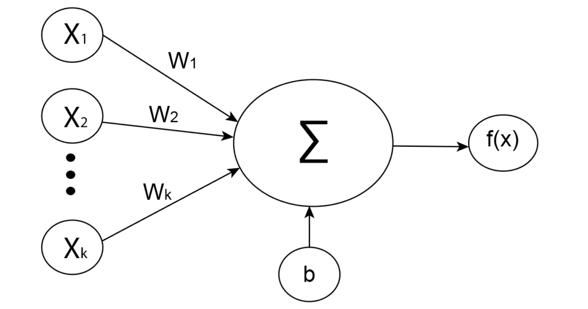
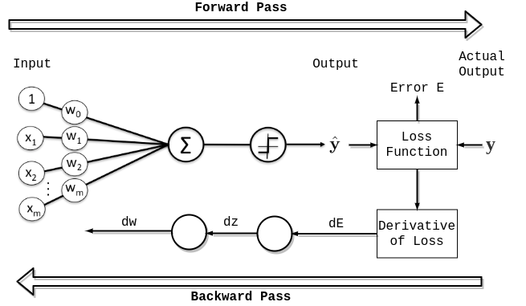

# 神经网络反向传播中的偏差更新

[深度学习](https://www.baeldung.com/cs/category/ai/deep-learning)

[深度学习神经网络](https://www.baeldung.com/cs/tag/neural-networks) [训练](https://www.baeldung.com/cs/tag/training)

1. 简介

    在本教程中，我们将讲解在神经网络的反向传播过程中如何更新权重和偏置。首先，我们将简要介绍神经网络以及前向传播和反向传播过程。然后，我们将用数学方法详细描述权重和偏置更新过程。

    本教程的目的是阐明与权重相比，神经网络中的偏置是如何更新的。

2. 神经网络

    神经网络是一种明确用来模拟生物神经网络的算法。一般来说，其想法是创建一个行为类似于人脑的人工系统。根据网络类型的不同，神经网络以相互连接的神经元为基础。神经网络有很多种类型，但我们可以将其大致分为三类：

    - 全连接神经网络（常规神经网络）
    - 卷积神经网络
    - 递归神经网络

    它们之间的主要区别在于组成它们的神经元类型以及信息在网络中流动的方式。在本文中，我们将使用常规神经网络来解释反向传播。

3. 人工神经元

    人工神经元是所有神经网络的基础。它们是以生物神经元为模型的单元。每个人工神经元接收输入并产生单个输出，我们还将其发送给由其他神经元组成的网络。输入通常是来自外部数据样本的数值，但也可以是其他神经元的输出。神经网络的最终输出神经元代表定义预测的数值。

    要获得神经元的输出，我们需要计算所有输入和连接权重的加权和。然后，我们在总和中加入偏置，并使用激活函数。在数学上，我们将加权和定义为：

    (1) \[\begin{align*} z = w_{1}x_{1} + w_{2}x_{2} + ... + w_{k}x_{k} + b, \end{align*}\]

    其中，$w_{i}$ 为权重，$x_{i}$ 为输入，b 为偏置。然后，将激活函数 f 应用于加权和 z，它代表神经元的最终输出：

    

4. 前向传播和后向传播

    在神经网络训练过程中，主要分为两个阶段：

    - 前向传播
    - 反向传播

    1. 前向传播

        首先是前向传播，即输入数据在网络中的前向馈送。总的来说，这一过程包括从初始输入开始的数据流，经过网络中的每一层，最后计算出预测误差。这是前馈神经网络的典型流程，但对于其他一些网络，如 [RNN](https://www.baeldung.com/cs/networks-in-nlp#recurrent-neural-networks)，前向传播则略有不同。

        总之，前向传播是一个从输入数据开始到计算网络误差结束的过程。

    2. 反向传播

        前向传播之后是反向传播，这当然是训练的重要部分。简而言之，它是一个根据上一个迭代（epoch）的误差或损失对网络权重进行微调的过程。适当的权重调整可确保降低错误率，同时通过增强泛化能力来提高模型的可靠性。

        起初，我们的神经网络并不能给出准确的预测，因为我们还没有调整权重。反向传播的关键在于提高网络的准确性，同时通过优化技术降低历时误差。

        有许多不同的优化技术，它们通常基于梯度下降法，但其中最流行的有以下几种：

        - 随机梯度下降法（[SGD](https://www.baeldung.com/cs/networks-in-nlp#recurrent-neural-networks)）
        - 均方根传播（[RMSProp](https://www.baeldung.com/cs/ml-learning-rate#2-root-mean-square-propagation-rmsprop)）
        - 自适应矩估计法（[Adam](https://www.baeldung.com/cs/ml-learning-rate#3-adam)）

        简而言之，梯度下降法是一种优化算法，我们通过向函数最陡峭的下降方向迭代来最小化神经网络中的损失函数。因此，为了找到最陡下降的方向，我们需要计算损失函数相对于权重和偏置的梯度。之后，我们就能利用负梯度乘以学习率来更新权重和偏置：

        

    3. 权重更新

        首先，我们来看看下面的神经网络片段，其中 l 表示第 l 层，a 是[激活列向量](https://www.baeldung.com/cs/convolutional-vs-regular-nn#2-activation-functions)或神经元向量，W 是权重矩阵：

        

        根据神经网络的定义，第 l 层中一个特定神经元 $a_{k}^{l}$ 的计算公式为：

        (2) \[\begin{align*} a_{k}^{l} &= \sigma(z_{k}^{l})\\ z_{k}^{l} &= w_{k1}^{l}a_{1}^{l-1} + w_{k2}^{l}a_{2}^{l-1} + ... + w_{kn}^{l}a_{n}^{l-1} + b_{k}^{l}, \end{align*}\]

        其中 $\sigma$ 为激活函数，w 为权重，b 为偏置。

        首先，如果我们要更新一个特定权重 $w_{kj}^{l}$，我们需要计算成本函数 C 相对于该特定权重的导数，即

        (3) \[\begin{align*} \frac{\partial C}{\partial w_{kj}^{l}}. \end{align*}\]

        现在，如果我们应用链式法则并扩展导数，就会得到

        (4) \[\begin{align*} \frac{\partial C}{\partial w_{kj}^{l}} = \frac{\partial C}{\partial z_{k}^{l}}\frac{\partial z_{k}^{l}}{\partial w_{kj}^{l}} = \frac{\partial C}{\partial a_{k}^{l}}\frac{\partial a_{k}^{l}}{\partial z_{k}^{l}}\frac{\partial z_{k}^{l}}{\partial w_{kj}^{l}} \end{align*}\]

        或因此以图形呈现：

        

        基本上，利用链式法则，我们可以将一个大问题分解成多个小问题，然后逐一求解。再次使用链式法则，我们还需要将 $\frac{\partial C}{\partial a_{k}^{l}}$ 进一步分解成：

        (5) \[\begin{align*} \frac{\partial C}{\partial w_{kj}^{l}} =& \frac{\partial C}{\partial z_{k}^{l}}\frac{\partial z_{k}^{l}}{\partial w_{kj}^{l}} = \frac{\partial C}{\partial a_{k}^{l}}\frac{\partial a_{k}^{l}}{\partial z_{k}^{l}}\frac{\partial z_{k}^{l}}{\partial w_{kj}^{l}} = \\ =& (\sum_{m}\frac{\partial C}{\partial z_{m}^{l+1}}\frac{\partial z_{m}^{l+1}}{\partial a_{k}^{l}})\frac{\partial a_{k}^{l}}{\partial z_{k}^{l}}\frac{\partial z_{k}^{l}}{\partial w_{kj}^{l}} = \\ \stackrel{(2)}{=}& (\sum_{m}\frac{\partial C}{\partial z_{m}^{l+1}}w_{mk}^{l+1})\sigma^{'}(z_{k}^{l})a_{j}^{l-1} \end{align*}\]

    4. 误差信号

        之后，让我们定义第 l 层神经元 k 的误差信号为

        (6) \[\begin{align*} \delta_{k}^{l} = \frac{\partial C}{\partial z_{k}^{l}} \end{align*}\]

        从方程（5）中，我们还可以提取出循环表达式：

        (7) \[\begin{align*} \frac{\partial C}{\partial z_{k}^{l}} = (\sum_{m}\frac{\partial C}{\partial z_{m}^{l+1}}w_{mk}^{l+1})\sigma^{'}(z_{k}^{l}) \end{align*}\]

        或使用误差信号符号：

        (8) \[\begin{align*} \delta_{k}^{l} = (\sum_{m}\delta_{m}^{l+1}w_{mk}^{l+1})\sigma^{'}(z_{k}^{l}) \end{align*}\]

        这种递归关系会传播到网络的最后一层，最后一层 L 中神经元 k 的误差信号等于：

        (9) \[\begin{align*} \delta_{k}^{L} =\frac{\partial C}{\partial z_{k}^{L}} = \frac{\partial C}{\partial a_{k}^{L}}\frac{\partial a_{k}^{L}}{\partial z_{k}^{L}} = \frac{\partial C}{\partial a_{k}^{L}}\sigma^{'}(z_{k}^{L}) \end{align*}\]

        最后，一切都解释清楚了，我们可以把误差信号 (6) 代入初始导数 (5)：

        (10) \[\begin{align*} \frac{\partial C}{\partial w_{kj}^{l}} = \delta_{k}^{l}a_{j}^{l-1} \end{align*}\]

        最后，我们更新权重 $w_{kj}^{l}$ 为：

        (11) \[\begin{align*} w_{kj}^{l} = w_{kj}^{l} - \alpha \delta_{k}^{l}a_{j}^{l-1} \end{align*}\]

        其中 $\alpha$ 是学习率。

    5. 偏差更新

        一般来说，偏差更新与权重更新非常相似。由于导数规则对于每个 x：

        (12) \[\begin{align*} x^{'} = \frac{\partial x}{\partial x} = 1 \end{align*}\]

        对于任意一个 x：

        (13) \[\begin{align*} \frac{\partial (x + a)}{\partial x} = 1 + 0 = 1 \end{align*}\]

        同样，对于第 l 层的第 k 个偏差，我们可以得出：

        (14) \[\begin{align*} \frac{\partial C}{\partial b_{k}^{l}} = \frac{\partial C}{\partial z_{k}^{l}}\frac{\partial z_{k}^{l}}{\partial b_{k}^{l}} \stackrel{(2)}{=} \frac{\partial C}{\partial z_{k}^{l}} \cdot 1 \stackrel{(6)}{=} \delta_{k}^{l} \end{align*}\]

        现在，与权重更新（11）类似，我们可以更新偏差为：

        (15) \[\begin{align*} b_{k}^{l} = b_{k}^{l} - \alpha \delta_{k}^{l} \end{align*}\]

5. 结论

    在本文中，我们用人工神经元、前向传播和后向传播简要解释了神经网络的术语。随后，我们用数学方法详细解释了神经网络中偏置更新的方式，以及偏置更新与权重更新的主要区别。

    本文既有理论部分，也有数学部分，因此需要一定的导数知识。
