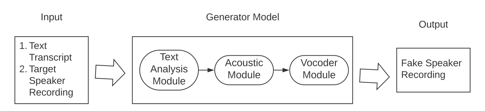

# 深度伪造简介

[深度学习](https://www.baeldung.com/cs/category/ai/deep-learning)

[对抗网络](https://www.baeldung.com/cs/tag/gan)

1. 简介

    近年来，"深度伪造"（deepfake）技术令专家和公众既着迷又震惊。深度伪造是利用复杂的[人工智能](https://www.baeldung.com/cs/cognitive-computing-vs-ai)（AI）和[深度学习](https://www.baeldung.com/cs/end-to-end-deep-learning)算法，对视频或图像进行令人难以置信的逼真处理。它们因其娱乐价值而备受关注，但同时也引发了重大的道德和安全问题。

    在本教程中，我们将详细介绍深度伪造的制作方法和算法、潜在的使用案例以及它们所带来的影响。

2. 基础知识

    深度伪造利用先进的人工智能技术，特别是深度学习算法，来分析和合成视觉和音频内容。

    我们在大量的图像、视频和音频数据集上对其进行训练，以识别个人独有的模式、特征和表情。经过训练后，这些深度伪造模型就能生成高度逼真、令人信服的内容。

    这引发了与隐私、信任和信息完整性相关的伦理问题。以如此精确和逼真的方式操纵和编造媒体内容的能力带来了威胁，包括错误信息的传播、诽谤和欺诈。

    随着深度伪造技术的发展，了解其能力和影响至关重要。这些知识有助于个人、组织和政策制定者制定检测和减轻深度伪造负面影响的策略。

3. 生成

    创建者使用各种技术来创建深度伪造，包括面部重现、唇语合成和声音克隆。

    生成对抗网络（GANs）是深度伪造创建中使用的主要技术之一。

    1. 生成式对抗网络（GANs）

        生成式对抗网络由两个神经网络组成：生成器和鉴别器。前者学会生成假内容，后者学会区分真假内容。因此，在一个竞争过程中，这些网络共同进行训练，生成器不断提高生成更有说服力的深度伪造内容的能力，而鉴别器则不断提高检测伪造内容的能力。

        GANs 的这种对抗性进一步促进了深度伪造技术的发展。GAN 框架为深度伪造生成提供了一种灵活、适应性强的方法。

    2. 数据收集和模型训练

        创建高质量的深度伪造需要大量数据，包括图像、视频和音频录音。这些数据集用于训练我们的 GAN（或其他模型），提高它们生成逼真内容的能力。创作者通常使用公开可用的数据集。然而，他们经常在未经明确同意的情况下从各种来源获取个人图像和视频。

        这种滥用个人数据的行为有可能伤害个人、损害声誉并使错误信息长期存在。在接下来的章节中，我们将深入探讨深度伪造的潜在使用案例，以及它们在不同领域中产生的伦理影响。

4. 深度伪造的类型

    深度伪造可以是图像、视频或音频文件。

    1. 图像

        深度伪造图像是复杂的人工智能（AI）算法和深度学习技术的产物。此外，它们还涉及对图像的处理和合成，以创建高度逼真和令人信服的视觉内容。

        例如，深度伪造图像可以将一个人的脸叠加到另一个人的身体上，改变面部表情，甚至生成现实中不存在的全新面孔。

    2. 视频

        Deepfakes 擅长处理面部表情，并将嘴唇动作与音频同步。此外，通过将目标人物的面部地标映射到源视频上，深度伪造算法可以将目标人物的面部无缝叠加到源视频上。此外，这一过程还能让目标人物看起来好像在说或做他们从未做过的事情。

        因此，通过利用深度神经网络和复杂的算法，deepfakes 可以准确分析和复制人类面部动作的所有小细节。

    3. 声音克隆和音频操纵

        除了视觉操纵，deepfakes 还能篡改音频内容。这些模型可以分析个人的声音模式，并复制它们来生成合成语音。因此，deepfake 创造者可以通过这种方法让一个人的声音说出他从未说过的话。

        语音克隆过程包括几个步骤。首先，deepfake 算法收集并分析目标人物的大量语音录音[数据集](https://www.baeldung.com/cs/computer-vision-popular-datasets)。其次，该算法利用先进的机器学习技术，学习目标人物声音的独特特征和细微差别。它进一步综合这些模式，创建一个能够生成与目标人物声音非常相似的合成语音的模型：

        

        我们将此类模型用于语音合成。通常，我们在输入时提供书面文本。模型随后（或实时）将其转换为自然语音。这种功能通常被称为文本到语音（[Text-To-Speech](https://www.baeldung.com/cs/text-mining)）。

5. 使用案例

    虽然深度伪造技术提供了一系列积极的应用，但它也带来了巨大的风险和被滥用的可能性。

    1. 积极应用

        深度伪造技术因其娱乐价值而备受关注。在电影业中，它们被用来重现标志性表演或让历史人物栩栩如生。例如，在《星球大战》系列电影中，深度伪造技术被用于以数字方式复活已故演员凯莉-费雪。这种应用让电影制作人能够突破创意的界限，提供新的叙事可能性。例如，深层伪造技术可用于替换或修改电影中的人物造型，与传统的化妆或换装相比，可节省时间和资源。

        Deepfakes 还可应用于视觉特效和游戏行业。通过将真人演员无缝融入虚拟环境，deepfakes 可以增强游戏体验的真实感和沉浸感。

        我们可以将其用作教育工具，展示历史事件或科学概念。通过将历史人物叠加到档案片段或模拟逼真的实验，deepfakes 可以提供引人入胜的互动学习体验。

        此外，研究人员还可以利用 Deepfakes 研究人类行为、情感和交流模式。

        Deepfakes 为艺术表达提供了一个平台，使艺术家能够重新想象和混合现有内容。他们可以操纵和组合视觉与音频，创造独特的数字艺术作品，或探索另类叙事，[示例](https://www.wired.com/story/deepfakes-getting-better-theyre-easy-spot/)。

        在数字时代，"深度伪造"有可能挑战传统的作者身份和创造力概念。

        最后，"deepfakes"还可以通过提供实时翻译或手语解释来促进无障碍环境。它们可用于生成多语言内容，使不同受众更容易获取信息。此外，deepfake 技术还可以无缝替换不同语言的对话或配音，从而促进本地化内容的创建。

    2. 负面应用

        Deepfake 技术最令人担忧的一个方面是其传播错误信息和假新闻的潜力。深度伪造技术可以操纵政治演讲、新闻广播或公开声明，制造虚假信息或误导公众。因此，这对信息的可信度构成了严重威胁，并可能对公众舆论和决策产生深远影响。

        此外，深度伪造还可用于身份盗窃和欺诈。通过在视频或音频记录中令人信服地冒充个人，恶意行为者可以欺骗他人，并在未经授权的情况下获取个人或财务信息。攻击者可以利用它们进行网络钓鱼诈骗、绕过基于语音的身份验证或社交工程攻击，从而对个人和组织造成重大伤害。

        最令人担忧的威胁之一是通过将个人置于危险境地或让他们看起来说了或做了他们实际上从未说过或做过的事情来损害他们的声誉。这会给受害者带来严重后果，包括公开羞辱、破坏个人关系和职业影响。

        未经同意创建和传播深度伪造内容会引发严重的隐私问题。深度伪造内容可以利用未经许可获取的个人图像或视频生成，侵犯了个人的隐私权。私密或露骨的 deepfake 可能尤其有害，因为它们侵犯了个人界限，助长了露骨内容未经同意的传播。

        深度伪造技术的出现带来了法律和伦理方面的挑战。正如 [iProov IT](https://www.iproov.com/blog/deepfakes-statistics-solutions-biometric-protection) 所做的研究显示的那样，它提出了关于被操纵内容的所有权、知识产权和隐私权的问题：

        

        因此，深度伪造引起了人们的广泛关注。

    3. 好处与危险

        深度伪造可以给我们带来很多好处，但这项技术也并非没有危险：

        | 优点                                 | 危险                        |
        |------------------------------------|---------------------------|
        | 深度伪造可用于丰富电影、游戏、音乐等的音频和视频内容。        | 深度伪造可以操纵媒体传播错误信息和虚假新闻     |
        | 创作者可以将深度伪造作为教育工具来展示历史事件或科学概念       | 未经同意制作和传播深度伪造内容会引发严重的隐私问题 |
        | 研究人员可以利用深度伪造来研究人类行为、情感和交流模式        | 深度伪造可用于身份盗窃和欺诈            |
        | 深度伪造为艺术表达提供了一个平台，使艺术家能够重新想象和混搭现有内容 | 深度伪造技术的出现带来了法律和道德挑战       |

6. 预测

    深度伪造技术继续飞速发展，对未来产生了重大影响。随着技术的发展，我们可以对其发展轨迹和影响做出一些预测。

    机器学习算法和计算能力的进步将推动深度伪造技术朝着更加逼真的方向发展。因此，深度伪造的视觉和听觉质量将得到改善，使其越来越难以检测和与真实内容区分开来。因此，这将给认证和可信度带来挑战。

    自动内容生成系统将会出现，无需大量人工干预就能制作深度伪造内容。这种自动化可能会导致深度伪造作品激增，引发人们对错误信息传播的担忧，并破坏人们对数字媒体的信任。

    深度伪造技术将促进个性化广告和娱乐体验。通过无缝整合观众喜爱的名人或公众人物，可以为他们量身定制内容。然而，这也引发了有关同意、隐私和负责任地使用个人肖像的伦理问题。

    我们将努力开发强大的检测机制，以识别和减少深度伪造的传播。此外，改进检测算法和取证技术对于应对深度伪造带来的挑战、塑造数字媒体真实性的格局至关重要。

    将建立全面的道德和法律框架，以解决深度伪造内容的创建、传播和使用问题。法规和准则将旨在防止恶意滥用、保护个人权利和维护隐私标准。

    虽然这些预测提供了对深度伪造技术潜在发展轨迹的洞察，但必须谨慎对待。深度伪造技术带来了复杂的挑战，其未来影响取决于研究人员、政策制定者和社会的共同努力。

7. 结论

    在本文中，我们详细阐述了深度伪造技术。我们谈到了它的基本原理、生成方法、使用案例以及对未来的预测。

    随着深度伪造技术的不断进步，未来的预测包括许多好处和技术发展。另一方面，deepfake 也会引发很多问题。因此，我们必须采取负责任的开发、提高认识和积极主动的措施，以避免和减少潜在风险。
