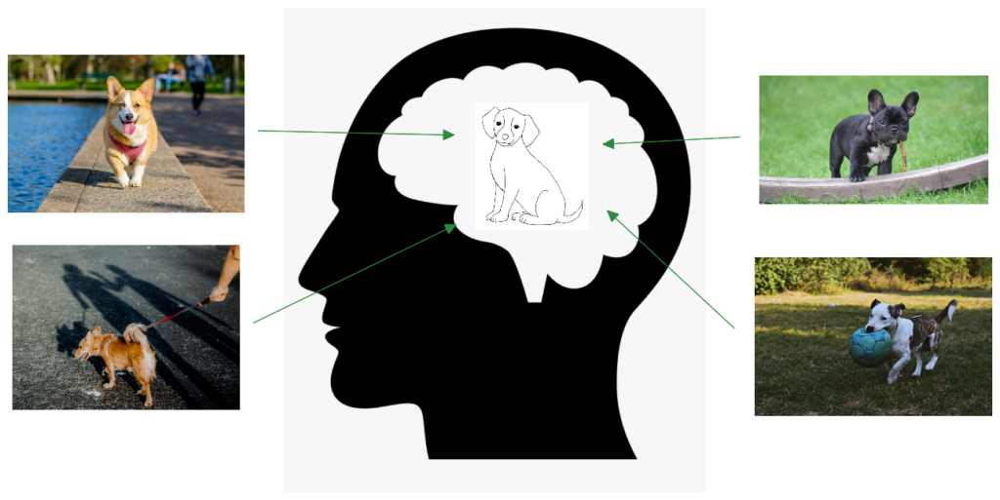
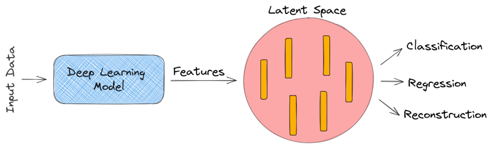
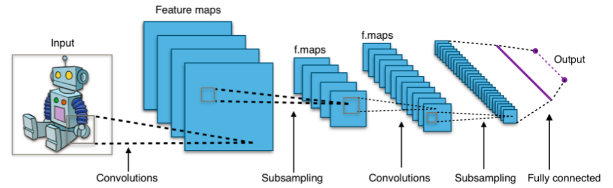
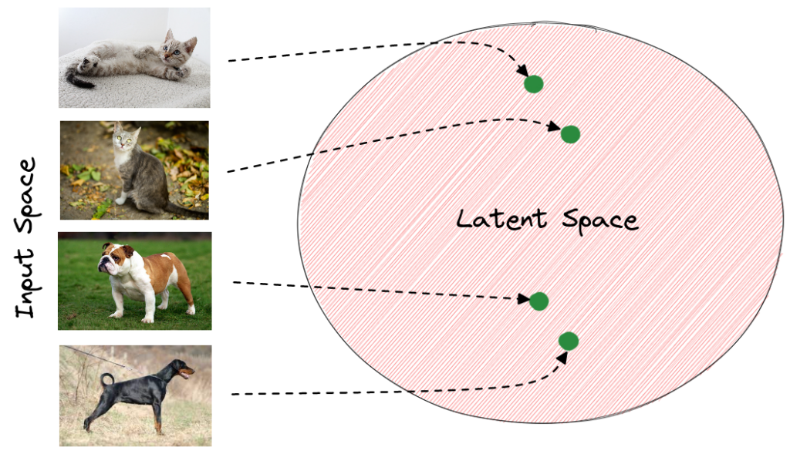
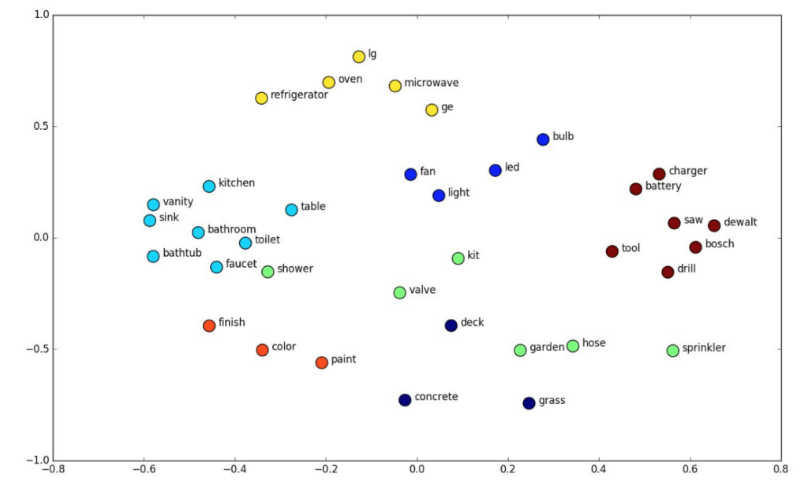

# 深度学习中的潜空间

[深度学习](https://www.baeldung.com/cs/category/ai/deep-learning) [机器学习](https://www.baeldung.com/cs/category/ai/ml)

[神经网络](https://www.baeldung.com/cs/tag/neural-networks)

1. 概述

    在本教程中，我们将讨论深度学习中的潜空间。首先，我们将定义这个术语并讨论它对深度学习的重要性，然后我们将介绍潜空间的一些示例。

2. 定义

    从形式上讲，[潜空间](https://en.wikipedia.org/wiki/Latent_space)被定义为一个抽象的多维空间，它编码了外部观测事件的有意义的内部表示。外部世界中相似的样本在潜空间中的位置彼此接近。

    为了更好地理解这一概念，让我们想想人类是如何感知世界的。通过在大脑中对每一个观察到的事件进行压缩编码，我们能够理解广泛的主题。

    例如，我们不需要记住狗的外表的每一个细节，就能认出街上的一只狗。从下面的插图中我们可以看到，我们在大脑中保留了一只狗的总体外观的内部表征：

    

    与此类似，潜空间试图通过空间表征为计算机提供对世界的压缩理解。

3. 深度学习的重要性

    深度学习已经彻底改变了我们生活的许多方面，其应用范围从自动驾驶汽车到预测严重疾病不等。它的主要目标是将原始数据（如图像的像素值）转化为合适的内部表示或特征向量，学习子系统（通常是分类器）可以从中检测或分类输入中的模式。因此，我们意识到深度学习和潜空间是密切相关的概念，因为前者的内部表示构成了后者。

    如下所示，深度学习模型将原始数据作为输入，并输出位于低维空间（即潜空间）中的判别特征。然后，这些特征被用来解决分类、回归或重构等各种任务：

    

    为了更好地理解潜空间在深度学习中的重要性，我们应该思考以下问题： 为什么在分类、回归或重构之前，我们必须将原始数据编码到低维的潜空间中？

    答案就是数据压缩。具体来说，在输入数据是高维数据的情况下，我们不可能直接从原始数据中学习到重要信息。

    例如，在图像分类任务中，输入维度可能是 512 x 512 x 3，对应于 512*512*3=786,432 个输入像素。系统似乎不可能通过查看如此多的值来学习有用的分类模式。解决方案是使用深度神经网络将高维输入空间编码为低维潜在空间。

4. 实例

    现在，我们来讨论一些深度学习中的例子，在这些例子中，潜空间的存在对于捕捉任务复杂性和实现高性能是必要的。

    1. 图像特征空间

        正如我们前面提到的，潜空间是每个[卷积神经网络](https://en.wikipedia.org/wiki/Convolutional_neural_network)不可或缺的一部分，它将图像的原始像素作为输入，并在最后一层编码一些位于潜空间中的高级特征。

        这种潜空间使模型能够使用低维判别特征而不是高维原始像素来执行任务（例如分类）。在下图中，我们可以看到 CNN 的一般架构：

        

        经过训练后，模型的最后一层捕捉到了图像分类任务所需的重要输入模式。在潜空间中，描述同一对象的图像具有非常接近的表示。一般来说，潜在空间中向量的距离与原始图像的语义相似性相对应。

        下面，我们可以看到一个动物分类模型的潜在空间。绿色的点对应于从模型最后一层提取的每张图像的潜在向量。我们观察到，相同动物的向量更接近潜在空间。因此，模型更容易使用这些特征向量而不是原始像素值对输入图像进行分类：

        

    2. 词嵌入空间

        在自然语言处理中，[单词嵌入](https://www.baeldung.com/cs/word-embeddings-cbow-vs-skip-gram)是单词的数字表示，因此相似的单词具有接近的表示。因此，词嵌入位于一个潜空间中，在这个空间中，每个词都被编码成一个低维的语义向量。

        有很多学习词嵌入的算法，如 [Word2Vec](https://arxiv.org/abs/1301.3781) 或 [GloVe](https://nlp.stanford.edu/projects/glove/) 。在下图中，我们可以看到词嵌入在潜空间中的拓扑图：

        

        不出所料，语义相似的词，如 "厕所"和 "浴室"，在潜空间中的词嵌入很接近。

    3. 广义网络

        在之前的教程中，我们已经详细介绍了 GANs 及其应用。简而言之，GAN 将某个先验分布中的随机向量 z 作为输入，并输出图像 G(z)。该模型的目标是学习生成真实数据集的底层分布。例如，如果我们的数据集包含有椅子的图像，那么 GAN 模型就会学习生成有椅子的合成图像。

        GAN 的输入是一个潜在向量，因为它将输出图像 $\mathbf{G(z)}$ 编码为一个低维向量 $\mathbf{z}$。为了验证这一点，我们可以看看插值在潜空间中是如何工作的，因为我们可以通过线性修改潜向量来处理图像的特定属性。

        在下图中，我们可以看到如何通过改变生成人脸的 GAN 的潜在向量来处理人脸的姿势：

        

5. 结论

    在本教程中，我们介绍了深度学习中的潜空间。首先，我们讨论了该术语的定义及其与深度学习的密切关系，然后介绍了一些示例。
