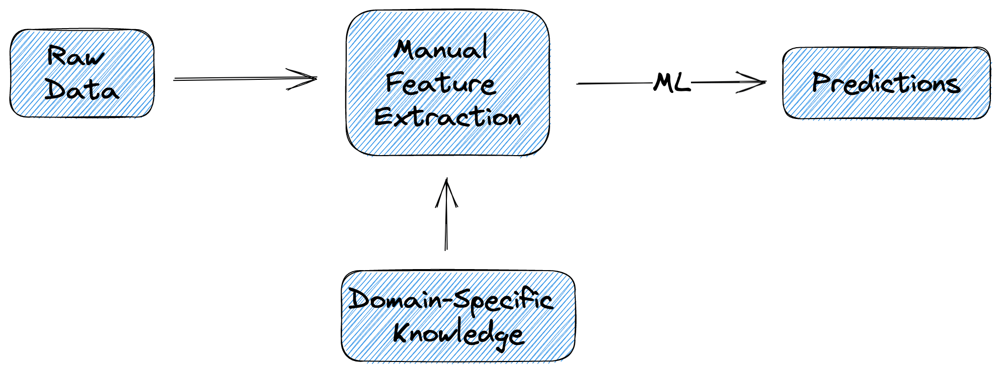
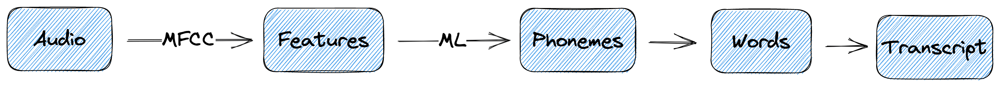
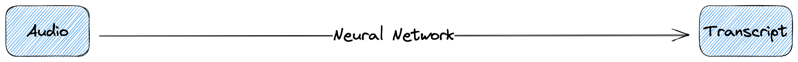
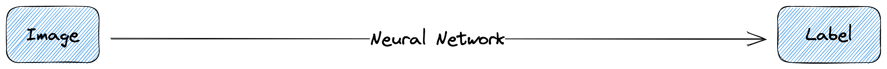

# 什么是端到端深度学习？

[深度学习](https://www.baeldung.com/cs/category/ai/deep-learning)

[训练](https://www.baeldung.com/cs/tag/training)

1. 概述

    在本教程中，我们将介绍端到端深度学习。首先，我们将定义这个术语并描述其背后的直觉。然后，我们将介绍端到端深度学习的一些常见应用和挑战。

2. 定义

    我们将端到端深度学习定义为一种机器学习技术，在这种技术中，我们直接使用原始输入数据作为输入，而不进行任何人工特征提取，只训练一个神经网络来完成复杂的任务。

    由于大规模数据集的产生，端到端深度学习为语音识别、机器翻译、人脸检测等多个领域带来了变革。

3. 直觉

    首先，让我们来关注端到端深度学习背后的直觉。

    在传统的机器学习中，训练管道至少包括两个阶段：

    1. 第一阶段的目标是生成原始输入数据的判别特征。这需要使用特定领域的知识来识别与每个任务最相关的特征。
    2. 下一阶段使用提取的特征，并使用一些传统的机器学习算法生成预测结果。

    尽管上述过程非常成功，但却非常耗时，而且需要大量特定领域的知识。

    在下图中，我们可以看到传统机器学习模型方法的流程：

    

    随着可用数据集规模的不断扩大，端到端深度学习应运而生，其目的是直接从数据中学习输入-输出映射，而无需手动提取手工制作的特征。因此，我们获取输入数据并将其传递给（通常是大型）神经网络。然后，该网络处理输入数据，自动提取相关特征，然后用于生成预测结果。

    整个过程无需人工操作，减少了所需的时间和精力。这项技术的成功之处在于，我们在训练过程中使用了大量数据，而神经网络只需在大量数据上进行训练，就能学习到高级特征。

    在下图中，我们可以看到端到端深度学习方法的流水线：

    

4. 应用

    在很多领域，端到端深度学习的应用都非常成功，超过了很多传统的手工方法。让我们来介绍其中的一些。

    1. 语音识别

        在语音识别领域，得益于最近开发的大规模语音数据集，端到端深度学习取得了惊人的性能。这些成就对医疗保健、金融和电信行业具有重大意义。

        在传统的机器学习中，将音频片段转换成文字记录包含许多中间步骤。首先，我们通常会从音频片段中提取一些 MFCC 特征并将其分类为音素。然后，我们将音素转换为单词，再将单词转换为输出文本。整个过程如下图所示：

        

        然而，使用端到端深度学习，我们只需将音频片段通过神经网络，就能直接预测输出文本，而无需担心所有中间步骤：

        

    2. 图像分类

        事实证明，端到端深度学习对图像分类也非常有益。以前，图像分类包括 3 个必要步骤：

        - 首先，我们检测一些兴趣点，以便关注图像中与分类任务更相关的部分。
        - 然后，我们根据领域知识为每个兴趣点提取手工制作的特征
        - 最后，我们通常会执行一种[特征选择算法](https://www.baeldung.com/cs/feature-selection)，只过滤功能更强的特征。

        然而，卷积神经网络的兴起让我们有机会直接使用原始输入像素，以端到端的方式训练模型。

        下面，我们可以看到没有端到端深度学习和深度学习后的训练管道：

        

        

5. 挑战

    尽管端到端深度学习有很多好处，但它也带来了一些我们应该考虑的关键挑战。

    其中最重要的是需要大量的训练数据。具体来说，端到端深度学习最常见的架构是各种类型的神经网络（如 [RNNs](https://www.baeldung.com/cs/recurrent-neural-networks)、CNNs和 [Transformers]）。这些网络需要大量数据才能从原始输入数据中学习到有用的特征。

    在语音和视觉等领域，这些数据可能很容易获得，而且成本低廉。然而，在癌症诊断等任务中，我们必须处理医疗数据，获取数据可能是一项非常具有挑战性且昂贵的任务。因此，可用数据有限，端到端深度学习就更具挑战性。

    端到端深度学习的另一个挑战是缺乏模型的可解释性。具体来说，很难说清为什么一个大型神经网络会根据输入给出特定的输出。例如，在前面的任务中，医生无法检查为什么模型能预测病人是否患有癌症。因此，在如此重要的任务中，医生只能相信模型，而这是不可接受的，也是有风险的。

6. 结论

    在本文中，我们谈到了端到端深度学习。首先，我们介绍了这个术语及其背后的直觉。然后，我们讨论了它的一些常见应用和挑战。
