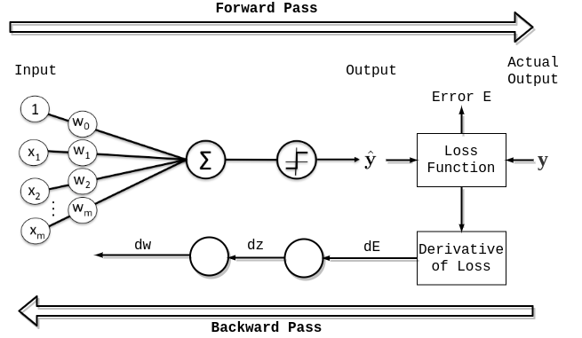
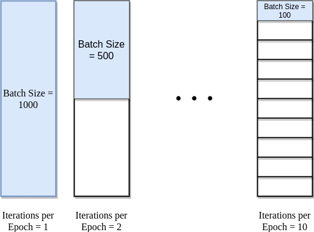
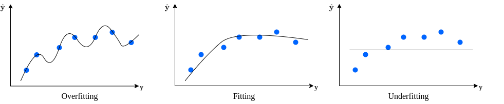
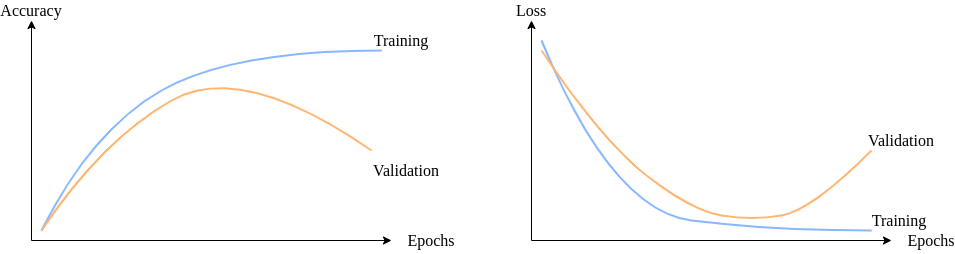

# 神经网络中的纪元

[人工智能](https://www.baeldung.com/cs/category/ai) [深度学习](https://www.baeldung.com/cs/category/ai/deep-learning) [机器学习](https://www.baeldung.com/cs/category/ai/ml)

[神经网络](https://www.baeldung.com/cs/tag/neural-networks) [训练](https://www.baeldung.com/cs/tag/training)

1. 简介

    在本教程中，我们将了解神经网络中 "epoch" 的含义。然后，我们将研究神经网络训练收敛性与 epoch 数量之间的关系。最后，我们将尝试了解如何使用早期停止来获得更好的泛化模型。

2. 神经网络

    神经网络是一种有监督的机器学习算法。我们可以训练神经网络来解决分类或回归问题。然而，利用神经网络解决机器学习问题有利有弊。

    建立神经网络模型需要回答大量面向架构的问题。根据问题的复杂程度和可用数据，我们可以训练不同大小和深度的神经网络。此外，我们还需要预处理输入特征、[初始化权重](https://www.baeldung.com/cs/ml-neural-network-weights)、添加偏置（如需要）以及选择合适的激活函数。

3. 神经网络中的历时

    一个历元意味着用一个周期内的所有训练数据来训练神经网络。在一个历元中，我们会准确地使用所有数据一次。一次前向传递和一次后向传递算作一次传递：

    前向传递和后向传递加在一起算作一次传递：

    

    一个历元由一个或多个批次组成，在这些[批次](https://www.baeldung.com/cs/neural-networks-epoch-vs-iteration#3-batch)中，我们使用部分数据集来训练神经网络。我们将每批训练示例的传递称为一次[迭代](https://www.baeldung.com/cs/neural-networks-epoch-vs-iteration#2-iteration)。

    有时，epoch 与 iteration 混合使用。为了澄清这些概念，让我们考虑一个简单的例子，如下图所示，我们有 1000 个数据点：

    

    如果批量大小为 1000，我们只需一次迭代即可完成一个迭代。同样，如果批量大小为 500，则一次迭代需要两次。因此，如果批量大小为 100，则一个历元需要 10 次迭代才能完成。简单地说，每个历元所需的迭代次数乘以批量大小，就得出了数据点的数量。

    我们可以在训练中使用多个历元。在这种情况下，神经网络会多次获得相同的数据。

4. 神经网络训练收敛

    决定神经网络的架构是建立模型的重要一步。不过，我们还需要对模型进行训练，并在训练过程中调整更多的超参数。

    在训练阶段，我们的目标是将错误率降至最低，并确保模型在新数据上具有良好的泛化能力。与其他监督式机器学习算法一样，[偏差-方差权衡](https://en.wikipedia.org/wiki/Bias–variance_tradeoff)仍然是我们要避免的潜在隐患。

    当模型与训练实例完全拟合，但泛化能力有限时，我们就会面临过拟合（高方差）的问题。另一方面，如果模型没有很好地学习数据，就会被称为拟合不足（高偏差）：

    

    一个好的模型应该能捕捉到数据的基本结构。换句话说，它不会过拟合或欠拟合。

    在建立神经网络模型时，我们会在训练开始前设置历元数参数。然而，一开始我们并不知道多少个 epoch 对模型有好处。根据神经网络架构和数据集，我们需要决定神经网络权重何时收敛。

    对于神经网络模型，通常会通过研究[学习曲线图](https://www.baeldung.com/cs/learning-curve-ml)来决定模型是否收敛。一般来说，我们会绘制损失（或误差）与历时或准确率与历时曲线图。在训练过程中，我们希望随着历时的增加，损失会减少，准确率会提高。不过，我们预计损失和准确率都会在某个时间点后趋于稳定。

    通常，我们建议将数据集分为训练集和验证集。这样，我们就能绘制出不同数据集的学习曲线图。这些曲线图可以帮助我们诊断出模型是否过度学习、学习不足或与学习集不匹配。

    我们希望神经网络在训练若干次后收敛。根据架构和可用数据，我们可以将训练的历元数视为一个超参数。

    神经网络权重是迭代更新的，因为它是一种基于[梯度下降](https://www.baeldung.com/cs/gradient-descent-vs-ascent#gradient-descent)的算法。单个训练历元是不够的，会导致拟合不足。鉴于现实世界问题的复杂性，训练一个神经网络可能需要数百个历元。

    因此，我们希望看到学习曲线图越来越好，直到收敛。然后，如果我们继续训练模型，它就会过拟合，验证误差也会开始增加：

    

    即使在当前的技术条件下，训练神经网络也需要相当长的时间。在模型建立阶段，如果我们设置的epoch次数太少，那么即使在模型收敛之前，训练也会停止。反之，如果我们设置的历元数过高，就会面临过拟合。除此之外，我们还会浪费计算能力和时间。

    针对这一问题，一种被广泛采用的解决方案是使用早期停止。这是正则化的一种形式。

    顾名思义，早期停止的主要思想是在满足特定条件时停止训练。通常，当泛化误差开始增加（模型损失开始增加或准确率开始下降）时，我们就会停止训练模型。为了确定泛化误差的变化，我们会在每个历时后在验证集上对模型进行评估。

    通过利用早期停止，我们可以在初始阶段将历时次数设置为一个较高的数字。这样，我们就能确保生成的模型已经从数据中学习到了知识。训练完成后，我们可以随时检查学习曲线图，以确保模型拟合良好。

5. 结论

    在本文中，我们已经了解了神经网络中的纪元概念。然后，我们讨论了神经网络模型训练，以及如何在训练模型时避免过拟合或欠拟合。
