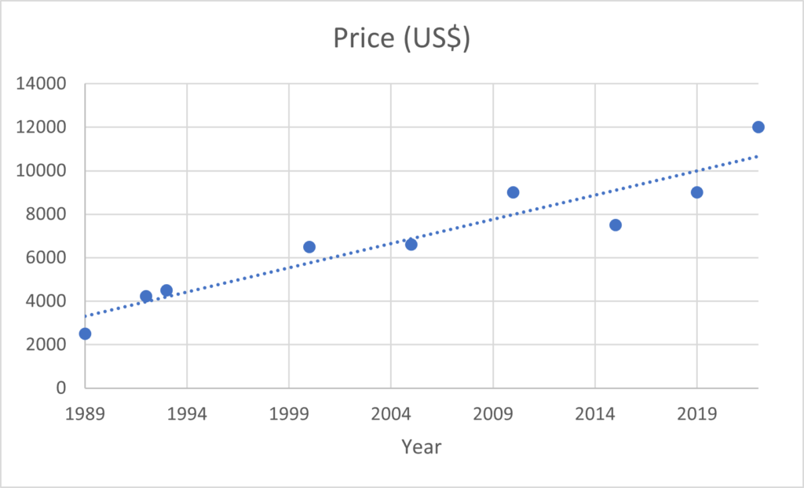

# 监督学习和非监督学习的真实案例

[深度学习](https://www.baeldung.com/cs/category/ai/deep-learning) [机器学习](https://www.baeldung.com/cs/category/ai/ml)

[回归](https://www.baeldung.com/cs/tag/regression)

1. 介绍

    我们使用机器学习（ML）算法来解决传统编程方法和范式无法解决的问题，即难以用数学方法定义的问题，如将电子邮件归类为垃圾邮件与否。

    随着人们对这一领域的兴趣与日俱增，我们应该考虑到不同领域和子领域都在不断进步这一事实。因此，如果我们计划工作或开发一个项目，就应该了解有关 ML 方法的基本分类，更具体地说，就是模型中如何使用数据以及模型如何从这些数据中学习特征。

    在本教程中，我们将讨论一些有监督和无监督学习的实际案例。

2. 定义

    在监督学习中，我们的目标是训练一个模型，使其在学习了一些特征后能够将输入映射到输出，从而获得一种泛化能力，对从未见过的数据样本进行正确分类。

    首先，让我们来看一个简单的例子：我们有不同的狗图像，我们的目标是正确分类出该狗属于哪个品种。在训练和测试阶段，我们的输入 X 将是一张狗的图像，输出 Y 将是一个标签，包含该狗属于哪个品种。

    这样，监督者就会为输出提供正确的值或标签，我们就能对模型进行评估。

    但有时我们并不知道输出是什么，因为我们只有输入数据，无法为每个输入样本定义输出标签。假设我们在一家销售服装的公司工作，我们有以前客户的数据：他们的消费金额、年龄和购买产品的日期。

    我们的任务是找到变量之间的模式或关系，从而为公司提供有用的信息，以便他们制定营销策略，决定应该重点关注哪类客户以实现利润最大化，或者可以加大力度拓展哪个客户群的市场。

    在这种情况下，输出将不会是一个标签，因为我们无法以这种方式模拟我们的需求。相反，我们的程序应该能够根据客户的相似性或独特性对他们进行分组。在这种情况下，我们采用的是无监督学习方法，因为没有监督者为输入提供标签，从而将其映射到输出。

3. 监督学习

    为了进一步解释和举例说明，让我们来看看监督学习的两个主要应用：分类和回归。

    我们需要强调的是，尽管我们讨论的是两种不同的情况，但定义一个模型为有监督学习的关键在于，我们始终为输出提供一个标签，这两种情况都是如此。这样，我们就使用了带有反馈的模型，因为我们有一个参照物来检查模型的表现，我们称这个参照物为 "地面实况"。

    1. 回归

        有时，我们的模型需要提供一个数值作为输出，在这种情况下，我们就遇到了回归问题。

        第一个例子是一个数据集，输入 X 是不同汽车的属性集合，如生产年份、品牌、里程数、发动机功率，输出 Y 是汽车的价格。

        为了简单起见，我们只考虑汽车的生产年份，然后训练模型来学习权重参数 w 和 $w_{0}$，以拟合这些点并建立我们的模型：

        (1) \[\begin{equation*} y = wx+ w_{0} \end{equation*}\]

        由于我们只考虑价格这一个特征，因此我们的问题可以很容易地在二维图中直观地表现出来。

        
        但是，如果使用等式 1 所示的线性模型，我们可能会阻碍模型获得更好的泛化能力，因此，当我们考虑更多输入变量（品牌、里程数）时，我们可以使用更复杂的模型，如高阶多项式甚至非线性函数。

        另一个回归的[例子](https://www.researchgate.net/publication/326121964_The_research_of_regression_model_in_machine_learning_field)是，为了确定温度变化对一家冰品公司冰品销售的影响。这有助于该公司根据任何时间框架（月、周或日）调整生产。

        这是现实生活中的一个回归例子，它可以防止公司生产超过或低于其可能销售量的产品。

        但同样，在这两个例子中，我们都有一对定义明确的已知输入/输出，首先是汽车的功能/汽车的价格，然后是温度/冰镇产品的销量。

    2. 分类

        在某些情况下，我们的输出不是一个数值，而是多个类别，通常情况下，每个输入样本都应正确分配其中一个类别。

        简单来说，我们假设只有两个类别。现在，我们模型的目标是定义判别式，将输入样本分成这两个类别，这是一种监督学习问题，我们称之为分类。

        在本文开头，我们以狗的品种分类器为例，它正好符合我们现在讨论的类别。我们的模型将尝试推断出一条规则，将狗的特定特征与特定品种联系起来。如果我们的模型学习到了强大的特征，它就能预测在训练阶段从未使用过的狗属于哪个品种。

4. 无监督学习

    当我们没有输入的标签时，我们的模型应该能够在输入中找到我们人类未知的模式和规律。我们需要估计哪些关联比其他关联出现得更频繁，以及它们之间的关联方式。

    在本文中，我们将重点讨论两类无监督学习：聚类和关联。

    1. 聚类

        在这类方法中，我们的模型将尝试在未分类的数据中找到自然聚类（组）。如果发现了相似性，我们就会使用不同的聚类对相关的输入样本进行分组。

        聚类有多种类型，如排他性聚类、聚集聚类、概率聚类和重叠聚类。为简单起见，本文将讨论 K-means 聚类，这是一种排他性方法，因为一个输入样本只能属于一个聚类。

        在 [K-means](https://www.baeldung.com/cs/k-means-for-classification) 算法中，我们首先需要定义聚类的数量 K。这可以任意定义，也可以使用成熟的方法。这种方法的主要思路是

        - 随机初始化每个聚类的中心点
        - 然后将每个输入样本分配给最接近的中心点
        - 然后，将所有中心点移动到已分配输入样本的平均值上
        - 最后，再次将每个输入样本分配给最近的中心点
        如此反复进行，直到达到规定的迭代次数，且中心点停止变化为止。

        我们可以用这种算法来解决本文开头举例说明的问题：客户细分。这样，我们就可以根据在商店购物的每个人的购买行为对他们进行分组。

        最后一个例子是，我们可以分析一个想要改进观众建议系统的流媒体服务。

        如果我们从客户那里获得了有用的数据，如观看电影的时间、电影类型以及他们观看了哪些独特的电视节目，我们就可以使用聚类方法对他们进行分组，从而找出哪些人值得在营销活动中受到更多关注。

    2. 关联

        在某些应用中，我们可能希望在考虑大量数据集的情况下，找出某个特征或变量是否与另一个特征或变量密切相关。在 ML 中，我们有关联规则学习：关联规则定义了一个连接 $X \rightarrow Y$，其中 X 是该规则的前件，Y 是后件。

        这种算法最常见的使用场景是篮子分析，我们想找出购买产品 X 的人是否也倾向于购买产品 Y。

        关联规则通常有三种计算方法。第一个是置信度，也就是传统的条件概率 $P(Y|X)$。我们希望该值尽可能接近于 1，并且大于 P(Y)，这样才能断定该规则足够强大。

        考虑规则的支持度也很重要，因为即使支持度较强的规则，我们也必须知道客户数量是否很大：

        (2) \[\begin{equation*} Support(X,Y) \equiv P(X,Y) = \frac{\#\{ customers \: who\:bought \:X\:and \: Y \}}{\#\{customers\}} \end{equation*}\]

        (3) \[\begin{equation*} Confidence(X \rightarrow Y) \equiv P(Y|X) = \frac{P(X,Y)}{P(X)} = \frac{\#\{customers \:who\: bought \:X \:and\: Y\}}{\#\{customers\: who \:bought\:X \}} \end{equation*}\]

        关联规则的其他应用包括：根据观众观看过的电视节目 X 来推荐电影 Y，使用关联规则连接天然蛋白质中的氨基酸来开发和测试人造蛋白质。

5. 结论

    从我们讨论的各种例子中，我们可以看出有监督学习和无监督学习之间的明显区别，因为我们使用的数据集有标签，我们要实现的目标是一个标签或一个组，这就决定了要采用哪种算法和策略。
