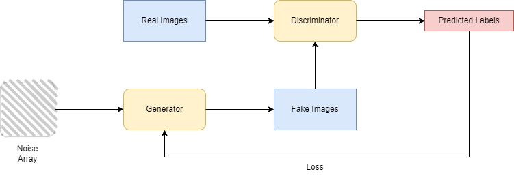

# 生成式对抗网络： 判别器的损失和生成器的损失

[深度学习](https://www.baeldung.com/cs/category/ai/deep-learning)

[对抗网络](https://www.baeldung.com/cs/tag/gan) [神经网络](https://www.baeldung.com/cs/tag/neural-networks)

1. 简介

    在本教程中，我们将讨论生成对抗网络（GAN），这是一种无监督深度学习方法。我们将主要介绍构成 GAN 的两个主要模型（生成器模型和判别器模型）的架构。我们还将通过[损失函数](https://www.baeldung.com/cs/ml-loss-accuracy)分析这两个模型之间的主导行为。

2. 生成对抗网络

    GAN 是一种机器学习框架，由 [Ian J. Goodfellow](https://arxiv.org/pdf/1406.2661.pdf)于 2014 年首次提出。一般来说，GAN 的目的是学习数据的分布和模式，以便能够从原始数据集生成可用于现实场合的合成数据。论文作者提出了一种算法，其中同时训练的两个神经网络--生成器和判别器--相互竞争，形成对抗游戏。GAN 框架的结构如下：

    

    生成器的任务是根据原始数据创建合成（伪造）数据，而判别器的任务是判断其输入数据是原始数据还是生成器创建的数据。两个模型的训练一直持续到生成器能够模仿出原始数据的水平，而鉴别器却很难将数据[归类](https://www.baeldung.com/cs/svm-multiclass-classification)为伪造数据或原始数据为止。

    1. GAN 的损失函数

        生成器（G）和判别器（D）尝试进行双人博弈，前者试图最小化损失函数的值 (V)，后者试图最大化损失函数的值 (V)：

        \[\underset{G}{min} \; \underset{D}{max} \; V(D,G) = \mathbb{E}_{x} [log \; D (x) ] + \mathbb{E}_{z} [log (1 - D (G(z))) ]  \]

        其中，$G(z)、D(x)、D(G(z))$ 分别表示发生器接收到输入噪声 z 时的输出、判别器认为原始数据 x 为真的概率以及判别器认为合成数据样本 $G(z)$ 为真的概率，$E_x$、$E_z$ 分别表示所有原始数据和合成数据的平均似然(likelihood)。

        在上式中，我们注意到鉴别器（D）在训练过程中关注的是$\mathbf {log \; D (x)}$的最大化，即在$\mathbf{x}$的分类过程中获得正确的标签（真实或合成），而生成器（G）关注的是$\mathbf{log (1 - D (G(z)))}$的最小化，不能直接影响$\mathbf {log \; D (x)}$。

3. 生成器

    生成器负责生成新的足够的合成数据，这些数据无法通过研究真实输入的分布与原始数据区分开来。在生成器神经网络的训练过程中，它接收有效数据和噪声，并根据这些合成数据创建新数据，这些新数据直接由判别器接收，判别器对每个样本的有效性做出判断，并将其分为合成样本和真实样本。

    1. 生成器的奖励

        在鉴别器进行分类之后，生成器会收到前者做出的决定并采取相应的行动。如果鉴别器错误地对数据进行了分类，生成器就会在双方的竞争博弈中获胜，获得奖励，从而对损失函数做出更大的贡献。否则，生成器就会失败并受到惩罚。生成器的训练重点在于更新和最小化：

        \[\nabla_{\theta_{g}} \frac{1}{m} \sum_{i=1}^{m} log (1 - D(G(z^{(i)})))\]

        其中，符号与上文相同，$\theta_{g}$ 是多层感知的超参数，表示将输入噪声 z 映射到数据空间的可微分函数 $G(z;\theta_{g})$。

4. 判别器

    判别器负责将数据分为合成和真实两类。在训练判别器神经网络的过程中，它接收生成器生成的数据（真实数据和合成数据），并被要求决定其验证。在早期阶段，鉴别器的工作很轻松，因为生成器无法生成无法区分的样本。因此，鉴别器能够以较高的置信度对样本进行分类。

    1. 判别器的奖励

        如果判定正确，鉴别器将在最小最大博弈中获胜。否则，它就会失败并受到惩罚。判别器的训练重点在于更新和最大化：

        \[\nabla_{\theta_{g}} \frac{1}{m} \sum_{i=1}^{m}[ log \; D(x^{(i)})+ log (1 - D(G(z^{(i)})))]\]

        其中符号与上文相同。

5. 生成式对抗网络的局限性

    生成对抗网络（Generative Adversarial Networks）可以实现重要的性能，是训练半监督分类器的明智之选，但在某些情况下可能会力不从心。首先，在训练过程中，两个神经网络必须保持良好的同步，每个模型都不能在没有其他模型的情况下持续训练。此外，它们还需要各种各样的数据，以便生成器产生广泛的输出，提高整个模型的准确性。此外，GANs 在生成文本或语音的离散数据时也会遇到困难。

6. 应用

    GANs 可广泛应用于需要新的可信数据的领域。特别是，GANs 主要用于创建新的图像和视频，这些图像和视频可能是关于人脸或姿势的生成照片、逼真的照片，甚至是卡通人物和表情符号。

    生成的输出结果可用于市场营销、游戏，或用于科学和研究目的，由于标准化的数据保护，在这些领域很难找到数据集和基准。

7. 结论

    在本文中，我们介绍了 GAN，这是一个用于从真实数据创建合成数据的半监督框架。特别是，我们详细讨论了两个主要的神经网络--生成器和判别器，并讨论了它们是如何通过竞争性的最小最大游戏来复制概率分布的。我们主要关注了每个模型的损失函数是如何受到影响的，以及模型会受到奖励还是惩罚。最后，我们提到了 GAN 的一些局限性和应用。
