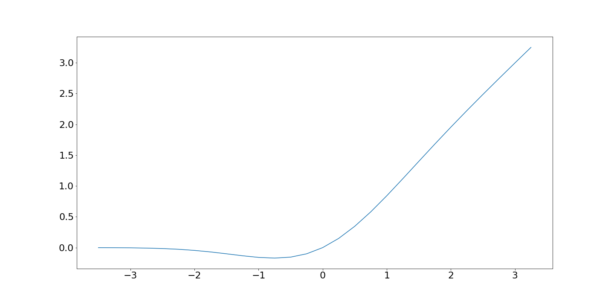
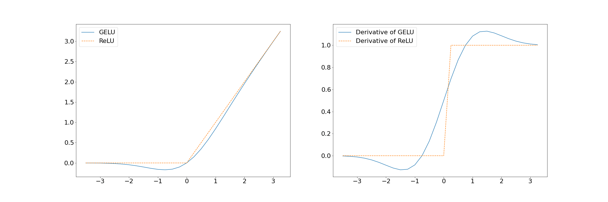

# GELU 解释

[深度学习](https://www.baeldung.com/cs/category/ai/deep-learning) [机器学习](https://www.baeldung.com/cs/category/ai/ml)

[神经网络](https://www.baeldung.com/cs/tag/neural-networks)

1. 引言

    在实施神经网络时，激活函数在决定神经元的输出，进而决定模型的整体性能方面起着重要作用。激活函数还会影响梯度流。这意味着它们会增加或减少网络训练的难度。

    在本教程中，我们将解释 GELU（高斯误差线性单元）激活函数。我们将介绍其使用动机、实现方法，并将其与标准 ReLU 激活函数进行比较。

2. 激活函数： 概述

    激活函数是应用于神经元输入的数学运算。非线性对于网络学习输入和输出之间的复杂映射关系至关重要，使其能够捕捉数据中错综复杂的模式。常见的激活函数包括sigmoid、双曲正切（[tanh](https://www.baeldung.com/cs/sigmoid-vs-tanh-functions)）和整流线性单元（[ReLU](https://www.baeldung.com/cs/ml-relu-dropout-layers)）。

    最近的发展引入了有望提高性能的新型函数。高斯误差线性单元（GELU）激活函数就是其中的佼佼者：

    

3. 高斯误差线性单元

    GELU 由丹-亨德里克斯（Dan Hendrycks）和凯文-金佩尔（Kevin Gimpel）在 2016 年的[论文](https://arxiv.org/abs/1606.08415)《高斯误差线性单元（GELUs）》中提出，因其能够增强神经网络的学习能力而备受瞩目。与前人不同，GELU 是由标准正态分布的累积分布函数 (CDF) 的平滑近似值推导而来。它是我们的输入乘以该点的标准正态 CDF：

    \[GELU(x) = x\times CDF(x) = x\times \frac{1}{2}\left(1 +erf \left(\frac{x}{\sqrt{2}}\right)\right)\]

    erf是高斯误差函数。在许多标准数学和统计学库中，它都是一个支持良好的函数。

    1. 技术细节

        由于 GELU 的函数复杂且计算速度较慢，因此无法在我们的神经网络中使用。

        幸运的是，我们可以对它进行重新表述：

        \[GELU_{\tanh}(x) = 0.5x \left(1 + \tanh\left(\sqrt{\frac{2}{\pi}}\left(x + 0.044715x^3\right)\right)\right)\]

        在这里，我们使用 $\tanh$ 函数来近似高斯误差函数：

        - 0.5x 引入了函数的线性成分
        - $\tanh$将双曲正切函数应用于输入，这有助于保持平稳过渡
        - 缩放因子 $\sqrt{\frac{2}{\pi}}$ 用于归一化，确保输出在合理的范围内

        还有一种更简单的基于 sigmoid 的近似方法：

        \[GELU_{\text{sigmoid}}(x) = x \times \text{sigmoid}(1.702\times x)\]

        尽管 $\tanh$ 和 erf 的尾数不同，但这些近似值通常被认为是准确的。在实践中，\tanh 近似方法运行良好，很少需要进一步完善和更复杂的实现。

        $\tanh$ 近似和 sigmoid 近似的优点是它们及其导数易于计算。

    2. 平滑性和导数

        GELU 的主要优势在于它在整个实线上的平滑性和可微分性。这种平滑性为训练提供了便利，因为基于梯度的优化算法可以轻松浏览函数的全貌。

        平滑性还能缓解[梯度消失的问题](https://en.wikipedia.org/wiki/Vanishing_gradient_problem)。该问题发生在激活函数的饱和点或接近饱和点的地方，此时输入的变化不再对导数产生影响。更平滑、更渐进的梯度过渡能提供更一致的训练信号。

        这种平滑性还能缓解其他激活函数中出现的突然梯度变化，有助于训练过程中的收敛。

    3. GELU 与 ReLU

        ReLU 激活函数对任何负数都有一个硬截止点，即 0，否则会产生线性结果。GELU 遵循类似但更平滑的模式：

        

        GELU 的梯度过渡明显比急剧和突然的 ReLU 平滑得多。

        对 GELU 函数的进一步观察表明，它是非单调的。也就是说，它并不总是递增或递减。这一特点使得 GELU 能够捕捉数据中更复杂的模式。理由是，由于它基于正态累积密度函数，因此可以更好地捕捉类似高斯的数据。

4. 为什么选择 GELU？

    在深度神经网络中偏爱 GELU 有几个原因。这些原因包括平滑度的提高和捕捉非线性关系能力的增强：

    | GELU 优点          | GELU 缺点       |
    |------------------|---------------|
    | 解决了梯度消失问题，没有死神经元 | 增加了计算复杂度      |
    | 在整个输入值范围内都具有平滑性  | 性能可针对特定任务     |
    | 非单调行为可捕捉复杂模式     | 复杂性增加导致可解释性降低 |

    此外，GELU 在transformer架构和标准基准（如 [cifar-10](https://www.hindawi.com/journals/jmath/2023/4229924/)）中已被证明可提高性能，并且易于纳入模型。

    GELU 基于高斯累积密度函数，因此表现出类似特性的数据可能特别适合 GELU 模型。

    然而，GELU 增加了计算的复杂性，而且可解释性较差。因此，重要的是要记住这些都是经验结果，我们应该评估 GELU 是否是我们特定任务的正确选择。

5. 结论

    在本文中，我们解释了 GELU 激活函数，并将其与流行的 ReLU 激活函数进行了比较。此外，我们还介绍了它的优点，并讨论了它在哪些情况下可以提高性能。GELU 为传统激活函数提供了一种平滑、非单调和可微分的替代方法。
