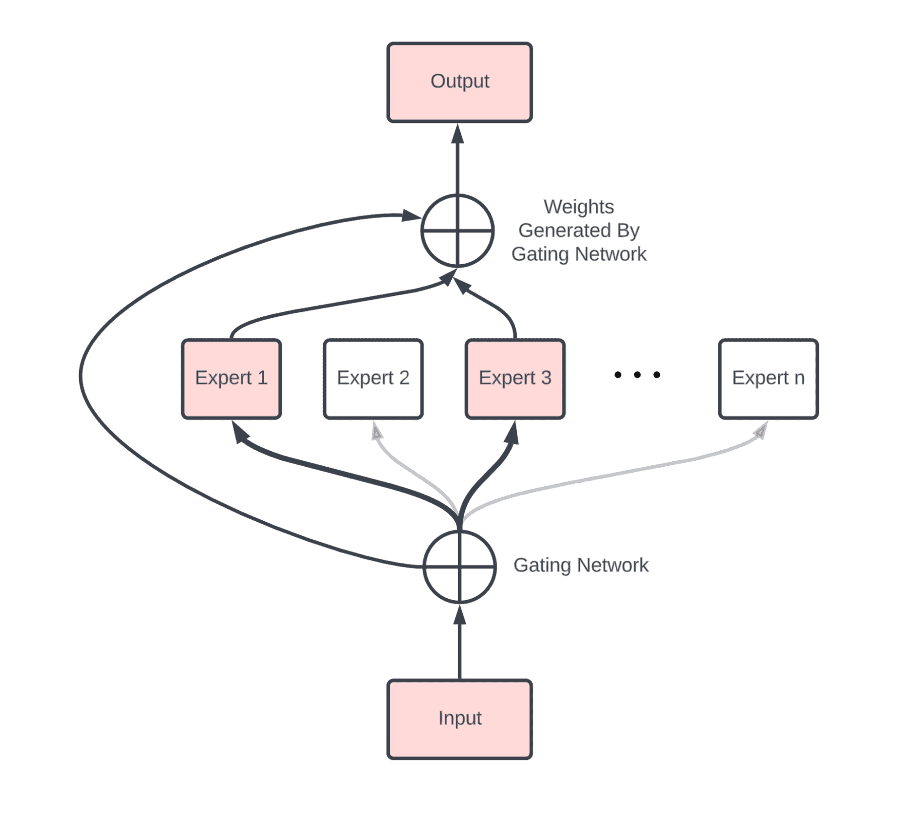

# [谷歌 DeepMind 双子座简介](https://www.baeldung.com/cs/gemini-google-deepmind)

1. 概述

    在本教程中，我们将讨论 Google DeepMind 最近推出的 [Gemini](https://deepmind.google/technologies/gemini/#introduction) 模型。首先，我们将简要介绍该模型、其架构和训练数据集。然后，我们将讨论它的一些应用及其对社会的影响。最后，我们将总结这项技术下一步可能采取的措施。

2. 简介

    如今，大型语言模型（LLM）已经彻底改变了我们生活的方方面面，为我们提供了以前无法想象的惊人能力。这一切都始于 OpenAI 推出的 [ChatGPT](../../chatgpt-model-zh.md)，它利用变换器的力量和其他一些技术，实现了类似人类对话的非凡能力。

    同样，谷歌 DeepMind 推出了 Gemini 1.5 Pro，这是一个基于[专家混合架构](https://huggingface.co/blog/moe)的高能力多模态模型系列。双子座以星座命名，象征着二元性和交流，旨在开启人类与机器无缝协作的新时代。作者发布了一份详尽的[技术报告](https://blog.google/technology/ai/google-gemini-ai/#sundar-note)，展示了该模型在推理和长语境对话方面的高性能。

3. 架构

    首先，让我们深入了解使 Gemini 开发出这一神奇功能的模型架构。

    具体来说，Gemini 1.5 Pro 是基于稀疏专家混合物（MoE）的Transformer模型。虽然我们以前讨论过变换器，但 MoE 是一种新的机器学习范式，它涉及将多个专业模型（称为"专家"）的预测结合起来，以做出最终预测。

    每个专家都在训练数据的一个子集上接受训练，使他们能够有效地学习输入空间的不同区域。然后，这些专业模型的预测结果通过一个门控网络进行组合，得出最终预测结果。门控网络根据输入为每位专家的预测分配权重。在不同的情况下，不同的专家更适合给出最终预测。这样，最终的模型就能处理非常复杂的任务，并能推广到各个领域。

    下图是一个 MoE 的高级示意图，说明了输入如何通过专家和门控机制：

    

    虽然 Gemini 的作者没有公布他们所使用的 MoE 架构的具体形式，但我们知道，MoE 和 Transformers 的结合使 Gemini 能够自适应、从交互中学习，并且表现得非常像人类。

4. 数据集

    在每个深度学习模型中，训练数据集与底层模型架构同等重要。

    为了对上述架构进行预训练，作者加入了一个跨越多个不同领域的庞大数据集，包括来自流媒体平台的网页、代码片段、图像、音频和视频内容。然后，他们以与每个大型语言模型类似的方式，在由提示和适当回应组成的数据上对模型进行了微调。

5. 应用

    我们不难理解，得益于其多模态功能和先进的架构，该技术的应用领域非常广泛。下面我们就来介绍其中的一些应用：

    1. 对话代理

        Gemini 能够与用户进行自然的长语境对话，这使我们有能力将其作为对话代理用于许多交互式应用中。通过这种方式，Gemini 可以让用户非常容易地学习新概念、适应新技术，并获得符合其需求的个性化答案。

    2. 内容创建

        如前所述，Gemini 的一大优势在于其多模态功能。因此，该模型可以生成高质量的文本、代码、图像甚至视频内容。所有这些功能都可用于创建营销、娱乐和新闻等领域的自动化内容。

    3. 可访问性

        同样，双子座模型的多模态功能也提高了残疾用户的可访问性。例如，它使我们能够为视障用户提供高质量的文本到语音或图像识别系统。

6. 下一步工作

    尽管双子座模型已经具备了令人惊叹的能力，但仍有进一步发展和探索的空间。

    1. 伦理考虑

        这项技术的使用需要引起广泛关注，因为它能使个人在恶意行为中使用它。因此，制定强有力的道德框架和监管准则来控制双子座的使用并确保公平、透明和问责至关重要。

    2. 用户教育

        这项技术将变得无处不在，进入全球各地的家庭。为了鼓励负责任地使用 Gemini 并降低生成式人工智能的风险，必须对用户进行教育，让他们不仅了解大型 LLM 的功能，也了解其风险。
