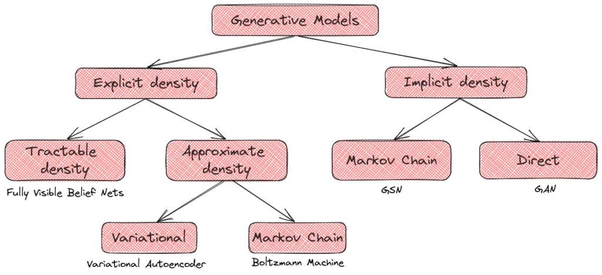
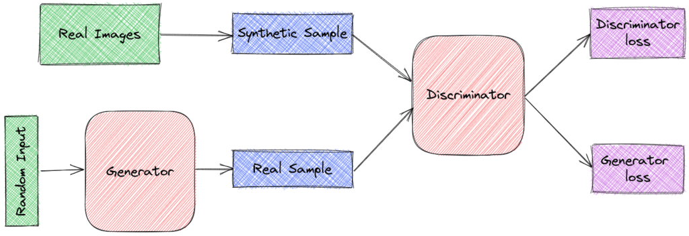
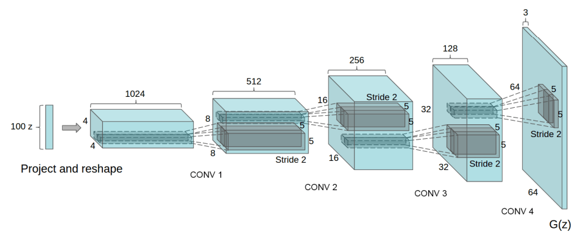
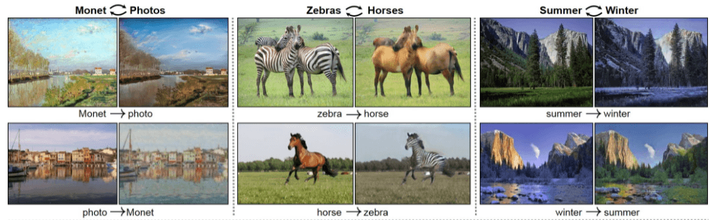

# [生成式对抗网络简介](https://www.baeldung.com/cs/generative-adversarial-networks)

[深度学习](https://www.baeldung.com/cs/category/ai/deep-learning) [机器学习](https://www.baeldung.com/cs/category/ai/ml)

[对抗网络](https://www.baeldung.com/cs/tag/gan) [神经网络](https://www.baeldung.com/cs/tag/neural-networks)

1. 概述

    在本教程中，我们将介绍生成对抗网络（[GAN](https://www.baeldung.com/cs/ml-gan-data-augmentation)）。

    首先，我们将介绍术语生成模型及其分类。然后，我们将介绍生成式逆向网络的架构和训练流程，并附带详细示例。最后，我们将讨论 GANs 所面临的挑战和应用。

2. 生成模型

    在机器学习中，有两种主要的学习类型：

    监督学习（Supervised Learning），即给定自变量 $\mathbf{X}$ 和相应的标签 $\mathbf{Y}$，我们的目标是学习一个映射函数 $\mathbf{f: X \to Y}$，使预定义的损失函数最小化。在这些任务中，我们训练的判别模型旨在学习条件概率 $p(Y|X)$。监督学习任务的例子包括分类、回归等。

    无监督学习（Unsupervised Learning）：我们只给出自变量 $\mathbf{X}$，目标是学习数据的一些基本模式。在这些任务中，我们训练的生成模型旨在捕捉概率 $p(X)$。无监督学习任务的例子包括聚类、降维等。

    一般来说，生成模型试图学习数据的基本分布。然后，模型能够预测给定样本的可能性，并利用学习到的数据分布生成一些新样本。

    生成模型有两种类型：

    一方面，我们有假设数据先验分布的显式密度模型。在这里，我们先定义一个显式密度函数，然后尝试在数据上最大化这个函数的可能性。如果我们能以参数形式定义这个函数，那么我们就可以讨论一个可操作的密度函数。然而，在很多情况下，比如图像，我们不可能设计出一个能捕捉到所有数据分布的参数化函数，因此只能使用密度函数的近似值。

    另一方面，还有隐式密度模型。这些模型定义了直接生成数据的随机过程。GAN 就属于这一类：

    

    以上是 [Ian Goodfellow](https://www.iangoodfellow.com/) 提出的生成模型分类法。

3. 生成对抗网络

    1. 架构

        我们先来看看生成式对抗网络的基本架构，它由两个网络组成。

        首先是生成器(Generator)，它将固定长度的随机向量 z 作为输入，并学习映射 G(z) 以生成模仿原始数据集分布的样本。

        然后是判别器(Discriminator)，它将来自原始数据集或生成器输出分布的样本 x 作为输入。它输出一个标量，表示 x 来自原始数据集的概率

        

        G 和 D 都是神经网络表示的可微分函数。

    2. 损失函数

        我们可以将 $\mathbf{G}$ 视为制造假币的造假团队，而将$\mathbf{D}$视为试图检测假币的警察。G 的目标是欺骗 D，在不被抓到的情况下使用假币。双方都试图改进自己的方法，直到在某个时刻，假币和真币无法区分。

        更正式地说， $\mathbf{D}$ 和 $\mathbf{G}$ 玩的是一个双人最小博弈，目标函数如下：

        \[\mathbf{min_G \ max_D \ log D(x) + log (1 - D(G(z)))}\]

        其中 x 来自原始数据集，z 是随机向量。

        我们注意到，目标函数是用两个模型的参数定义的。G 的目标是最小化 $log (1 - D(G(z))$，以欺骗鉴别器将假样本归类为真样本。

        与此同时，D 的目标是最大化 $log D(x) + log (1 - D(G(z)))$ ，这相当于给真实样本和生成器样本分配正确标签的概率。

        这里需要注意的是，这不是一个普通的优化问题，因为每个模型的目标函数都取决于其他模型的参数，而每个模型只控制自己的参数。这就是为什么我们说的是游戏而不是优化问题。优化问题的解是局部或全局最小值，而这里的解是[纳什均衡](https://en.wikipedia.org/wiki/Nash_equilibrium)。

    3. 训练

        同步 [SGD](https://www.baeldung.com/cs/sgd-vs-backpropagation) 用于训练 GAN。在每一步中，我们从原始数据中抽取两批样本：

        - 原始数据集中的 x 个样本
        - 来自先验随机分布的 z 向量

        然后，如上图所示，我们将它们传递给相应的模型。最后，我们同时应用两个梯度步骤：一个是根据目标函数更新 G 的参数，另一个是更新 D 的参数。

    4. DCGAN

        最著名的图像 GAN 架构之一是深度卷积 GAN（[DCGAN](https://arxiv.org/abs/1511.06434)），它具有以下特点。生成器和判别器的所有层都采用批量归一化处理。当然，它们的输出层没有进行归一化处理，以便学习图像分布的真实平均值和尺度。

        然后，生成器使用卷积结构：

        

        在训练过程中，使用 Adam optimizer 代替 SGD，然后在生成器中使用 ReLU 激活，在判别器中使用 Leaky ReLU 激活。

    5. 示例

        现在我们来描述一下 GAN 如何学习生成数字 "7"的图像。

        首先，生成器从某个简单的先验分布中采样一个向量 z 并输出图像 G(z)。由于模型的参数是随机初始化的，因此输出的图像与数字 "7"并不接近。

        在训练过程中，生成器会学习生成越来越接近原始分布（描述数字 "7"）的图像，以骗过判别器。因此，在某一点上，$\mathbf{G}$ 会输出更接近数字 "7 "的图像。

        最终，生成器输出的图像分布与原始分布非常接近，并生成了描绘数字 "7"的合成图像。

4. 应用

    现在我们来谈谈 GAN 最有用的一些应用。

    1. 数据扩充

        在所提供的数据有限的情况下，GAN 可用于生成合成样本以扩充数据。

    2. 图像绘制

        在很多情况下，我们需要重建图像，去除不需要的对象或恢复旧图像中受损的部分。

    3. 超分辨率

        超分辨率是指从低分辨率图像生成高分辨率图像的过程。这是一项非常有用的任务，在安全领域有很多应用。

    4. 图像到图像的翻译

        在这里，我们要将输入图像转换为输出图像，这是计算机图形学和图像处理中的一项常见任务。有许多 GAN 体系结构可以解决这个问题，比如 [CycleGAN](https://junyanz.github.io/CycleGAN/)：

        

        我们提到的只是这些模型的一些应用。GAN 可以改进许多任务，但其适用性尚未得到充分探索。每年，我们都会发现越来越多的领域可以证明 GANs 是有用的。

5. 挑战

    虽然 GANs 已经在许多领域取得了成功，但在训练无监督学习的 GAN 时，我们仍要面对许多挑战。

    1. 不收敛

        如前所述，训练 GAN 不是一个普通的优化问题，而是一个最小博弈问题。因此，要收敛到一个能同时优化生成器和判别器目标的点是很有挑战性的，因为我们必须学习一个平衡点。从理论上讲，我们知道如果在[函数空间](https://en.wikipedia.org/wiki/Function_space)中进行更新，同步 SGD 就会收敛。在使用神经网络时，这一假设并不适用，理论上也不能保证收敛。此外，我们多次观察到这样的情况，即生成器在没有到达任何有用位置的情况下取消了判别器的进展，反之亦然。

    2. 评估

        每个学习任务的一个重要方面就是评估。通过检查生成器生成的合成样本，我们可以很容易地对 GAN 进行定性评估。但是，我们需要定量指标才能对任何模型进行稳健的评估。遗憾的是，目前还不清楚如何对生成模型进行定量评估。有时，获得良好似然的模型会生成不真实的样本，而生成真实样本的其他模型则会呈现较差的似然。

    3. 离散输出

        要训练一个 GAN，生成器的结构应该是可微分的。但是，如果我们想让生成器生成离散数据，那么相应的函数就不是可微分的。虽然针对这一限制提出了很多解决方案，但并没有最佳的通用解决方案。解决这一问题将有助于我们将 GAN 用于 NLP 等领域。

    4. 使用代码

        因此，向量 z 可被视为样本 x 的特征表示，并可用于其他各种任务。然而，由于我们要从高维空间移动到低维空间，因此很难在给定样本 $\mathbf{x}$ 的情况下获得 $\mathbf{z}$。

6. 结论

    在本教程中，我们介绍了 GAN。首先，我们讨论了生成模型的一般领域，并提出了一个分类建议。然后，我们介绍了 GAN 的基本架构和训练过程。最后，我们简要介绍了 GANs 的应用和挑战。
