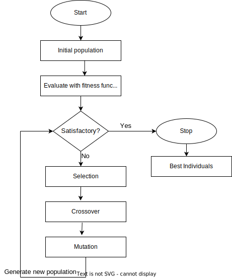

# 遗传算法在现实世界中的应用

[深度学习](https://www.baeldung.com/cs/category/ai/deep-learning) [机器学习](https://www.baeldung.com/cs/category/ai/ml)

[元启发法](https://www.baeldung.com/cs/tag/metaheuristics)

1. 简介

    在本教程中，我们将首先定义遗传算法的一些基本特性。其次，我们将回顾遗传算法的构造。然后，我们将讨论它们是如何工作的。最后，我们将回顾遗传算法在现实生活中的一些应用。

    遗传算法主要适用于优化问题。这是因为遗传算法的设计目的是在搜索空间中寻找解决方案，直到找到最优解。特别是，遗传算法能够对生成的解决方案进行迭代改进，直到生成最优解决方案。

    现在我们来看看遗传算法的正式定义。

2. 定义

    [遗传算法](https://www.baeldung.com/cs/genetic-algorithms-vs-neural-networks#1-fundamentals-of-genetic-algorithm)是受自然[进化](https://en.wikipedia.org/wiki/Evolution)过程启发的启发式算法。这一进化理论由查尔斯-达尔文在 19 世纪中期首次提出。进化论描述了通过自然选择，物种的生物特征在一代代人中发生的变化。

    因此，遗传算法基于自然选择。只有种群中最合适的个体才能被选中繁衍后代。

3. 它们如何工作？

    遗传算法遵循自然进化过程，具体描述如下：

    
    现在我们来看看基本遗传算法的步骤。

    1. 算法

        第一步是初始化种群(population)。在解决问题的情况下，手头问题的一组解决方案就是初始种群。其次，我们使用拟合度(fitness)函数来评估种群的最优性。适应度函数是一个目标函数 f(x)，用于评估解决方案的质量。

        最终目标是找到该函数 f(x) 的最大值或最小值。举例来说，一个拟合函数会给种群中的解决方案打分。那么，我们的目标就是达到函数 f(x) 的全局最大值。

        如果种群中的解令人满意(satisfactory)，我们通常会停止算法，并将其冠以最佳个体的称号。现在，如果解不令人满意，我们就会执行选择过程，挑选最合适的个体进行繁殖，生成新的解。这需要反复进行。

        接下来，经过选择(selection)后，最合适的个体通过交叉(crossover)繁殖，产生后代。这里的"后代"指的是新一代的解决方案。在交叉过程中，数值会被交换，从而产生新的个体。

        然后，产生的某些后代将发生变异(mutation)。这是一个随机改变子代中的值或特征以引入多样性的过程。具体来说，变异操作的迭代应用将使算法在搜索过程中摆脱局部最小值。

        值得注意的是，交叉和突变是遗传算法中生成子代的两种主要方法。最后，如果解决方案或子代令人满意，且没有更好的子代产生，算法就会终止，并将最佳个体作为最优解决方案呈现出来。

4. 应用

    遗传算法是计算机科学中最基本的算法之一。因此，遗传算法在现实世界的不同行业和不同任务中得到了广泛应用。不过，本文只讨论其中的几个。

    1. 机器人学

        机器人学包括自主机器人的设计、制造和操作。在机器人学中，[遗传算法可用于深入了解机器人必须做出的决策](https://www.researchgate.net/publication/3421122_Genetic_algorithms_for_autonomous_robot_navigation)。例如，给定一个环境，假设机器人必须使用最少的资源到达一个特定的位置。遗传算法可用于生成机器人到达所需位置的最佳路线。

    2. 经济学

        经济学是一门研究资源在商品和服务的生产、分配和总体消费中的使用情况的科学。在经济学中，遗传算法被用来[创建一段时间内的供需模型](https://en.wikipedia.org/wiki/Genetic_algorithms_in_economics#:~:text=Genetic%20algorithms%20have%20increasingly%20been,schedule%20optimization%20and%20asset%20pricing.)。此外，遗传模型还可用于推导博弈论和资产定价模型。

    3. 自动化设计

        自动化设计包括汽车等交通工具的设计和生产。特别是，汽车制造公司可能会对汽车的运行方式做出规定。例如，最低耗油量是汽车设计中的一个理想指标。因此，遗传算法被用来[设计满足](https://www.brainz.org/15-real-world-applications-genetic-algorithms/)低油耗等约束条件的汽车。

    4. 调度任务

        假设我们有一个为大学安排时间表的任务。调度任务的目标是[找到满足某些约束条件的最优解](https://towardsdatascience.com/using-genetic-algorithms-to-schedule-timetables-27f132c9e280)。在这方面，我们使用遗传算法，在考虑到大学的课程、学生人数和阶梯教室的情况下，得出最优时间表。

    5. 车辆路由

        在大多数物流公司，一项主要任务就是车辆路线安排。在这里，我们必须找出如何使用车队[将货物运送给不同客户的路线](https://trace.tennessee.edu/cgi/viewcontent.cgi?article=6358&context=utk_gradthes#:~:text=The%20genetic%20algorithm%20was%20developed,routing%20problems%2C%20and%20many%20others.)。因此，遗传算法被用来推导出具有成本效益的路线，以便在正确的时间将这些货物运送给正确的客户。

    6. 市场营销

        在市场营销中，主要的理念是通过推广商品和服务来赢得大量客户。遗传算法在这方面的应用是为了得出能吸引最多客户的产品规格和属性的[最佳组合](https://www.ijstr.org/final-print/jun2020/Maximizing-Profits-Using-Genetic-Algorithm.pdf)。

    7. 医学

        在医学和生物信息学领域，遗传算法被用于识别超声波和乳房 X 光检查中的[良性和恶性肿瘤](https://www.ncbi.nlm.nih.gov/pmc/articles/PMC4678452/)。

5. 结论

    在本文中，我们首先定义了进化，然后定义了遗传算法。我们讨论了基本组件及其工作原理。最后，我们回顾了这些算法在现实生活中的一些应用。
