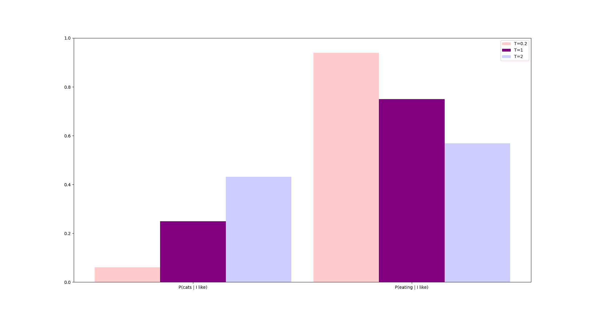

# [如何使用 GPT 的模型温度？](https://www.baeldung.com/cs/gpt-model-temperature)

1. 简介

    现在，大多数人已经熟悉了 ChatGPT：能够进行对话、回答复杂问题和生成代码的人工智能聊天机器人。另一方面，大多数人并不了解 GPT 的底层架构，而这种架构可以以一种看似逼真的方式生成文本。

    在本教程中，我们将讨论温度参数，以及如何使用它来修改 GPT 模型生成的文本。

2. 模型温度有什么作用？

    首先，让我们登录 OpenAI 官方[游乐场](https://platform.openai.com/playground?mode=complete&model=gpt-3.5-turbo-instruct)，选择 gpt-3.5-turbo-instruct 模型。

    然后，我们将修改右上角的温度滑块，并比较 "I enjoy eating" 这样一个简单起始序列的输出。

    我们注意到，当温度值较低，接近 0 时，它将提供更多 "conventional" 的完成语，如 "food" 或 "healthy meals”"。如果我们将温度设置为中间值，比如 1，我们仍然可以得到一些有意义的句子，但会更加多样化，比如 "italian dishes" 或 "salads during the summer"。但是，如果我们将温度设置得过于接近 2，我们就会开始得到一些根本不像单词的胡言乱语，比如 "`how_DIG728 tie_COLL mund196].)`"。

    从本质上讲，温度控制着生成序列的随机性，这可能意味着很多事情：句子有多传统、完成句在某个方向上有多有主见、使用的单词在上下文中是否有意义，甚至它们是否是真正的单词！

3. 为什么叫温度？

    在物理学中，气体的温度决定了其分子运动的程度。温度越高，分子运动就越混乱。因此，就更难预测分子在未来状态下的位置。另一方面，如果气体冷却下来，其运动就变得更容易预测。这种现象在[模拟退火](https://www.baeldung.com/cs/simulated-annealing)中就有应用。

    同样的原理也适用于 GPT 中的 "temperature" 超参数：温度越低，输出越保守，温度越高，变化越大。

4. 文本生成与温度之间的联系

    从一个短句开始生成一大段文本，相当于找到最有可能的下一个词，然后重复进行。语言模型解决的正是这个问题。让我们举个例子来看看它们是如何做到这一点的。

    假设我们的模型训练集中有四个句子。这代表了我们的模型对语言的完整理解。当然，更好的模型会使用比这多得多的文本：

    - “I like cats”
    - “I like eating sushi”
    - “I like eating pizza”
    - “I like eating sushi with my friends”

    假设用户想生成一些文本来完成下面的句子：

    - “I like …”

    在我们的例子中，1/4 的短语后面是 "cats"，3/4 的短语后面是 "eating"。因此，如果我们运行该模型 4 次，它会用 "cats" 完成一次，用 "eating" 完成 3 次（平均）。

    如果模型选择了 "eating"，我们的新句子就变成了 "I like eating …"。再次使用同样的逻辑，我们有 1/3 的机会选择 "pizza"，2/3 的机会选择 "sushi"。

    这个例子对应的是温度等于 1 的情况，在下图中用紫色表示：

    

    在温度接近 0 的情况下，我们的模型会倾向于选择最有可能的序列，而不是其他序列，这导致它每次都重复 "I like sushi"，即使输入只有 "I …"。我们不希望这样，我们也更希望它时不时地说 "I like cats"。图中用浅红色表示。

    相反，如果温度变得很高，模型就会开始忽略这些概率。这意味着它将生成诸如 "I friends cat like my" 这样的无意义句子，即使这些句子根本不会出现在火车上。在图中，这一点用浅蓝色表示。

    最后，下面是在考虑温度参数 $T$ 后计算最终概率的公式：

    $$ p_i(T) = softmax(log(\frac{p_i}{T})) $$

    该公式证实了我们从图形上看到的结果：

    - 如果 $T$ 为 1，最终概率等于初始概率，因为 softmax 和对数相抵消了
    - 如果 $T$ 越大，则所有初始概率都会显著缩小，因此它们最终的结果彼此相似
    - 如果 $T$ 接近 0，则大概率变大，小概率变小，因此差异变得夸张

5. 结论

    在本文中，我们讨论了模型温度如何影响文本生成，较低的温度对应常规输出，较高的温度对应更随机的文本。

    此外，我们还解释了语言模型的机制以及温度如何影响下一个词的概率。
