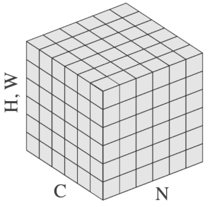
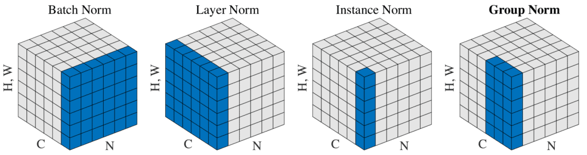

# [什么是组规范化？](https://www.baeldung.com/cs/group-normalization)

1. 简介

    组归一化（GN）是一种主要用于深度神经网络的归一化技术，主要用于卷积神经网络和全连接神经网络等深度学习模型。[吴宇欣和何凯明](https://paperswithcode.com/method/group-normalization)提出了这项技术，作为批量归一化的替代方案。

    [数据归一化](https://www.baeldung.com/cs/normalizing-inputs-artificial-neural-network)对于确保训练期间的稳定性和促进模型收敛至关重要。此外，归一化还有助于降低对超参数的敏感性，并允许处理不同规模的数据。所有这些都有助于建立性能更佳的模型和更均衡的学习。

    在本文中，我们将研究 GN、其一般公式以及它与其他归一化方法的不同之处。

2. 分组归一化

    分组归一化在处理小批量或可变批次时特别有用。它的工作原理是将层中的通道分成若干组，并分别对每组中的资源进行归一化处理。

    在这种情况下，组只是通道的一个独立子集。因此，将通道分成不同的组，并沿坐标轴计算平均值和标准偏差。

    归一化常用公式如下：

    \[ \^{x}_i = \frac{1}{\sigma_i}(x_i - \mu_i) \]

    其中，x 是图层计算出的特征，i 是索引。在二维图像中，用一个向量来表示 i，该向量按以下顺序（N、C、H、W）存储四类信息：

    - N：表示组或批次轴；
    - C：表示通道轴
    - H：空间高度轴
    - W：空间宽度轴。

    下图展示了输入张量中的这些轴：

    

    此外，$\mu$ 和 $\sigma$ 表示平均值和标准偏差：

    \[ \mu_i = \frac{1}{m} \sum_{k \in S_i} x_k \]

    \[ \hspace{1cm} \sigma_i = \sqrt{\frac{1}{m} \sum_{k \in S_i} (x_k - \mu_i)^2 + \epsilon} \]

    等式中，$\epsilon$ 表示一个小常数，以避免除以零，m 表示集合的大小。$S_i$ 表示系统将计算平均值和标准偏差的像素集。

    总之，归一化技术的主要区别在于计算中如何利用坐标轴。在组归一化中，沿着（H，W）轴和一组通道计算 $\mu$ 和 $\sigma$。

    因此，可以如下表示一组 $S_i$：

    \[ S_i = \{k | k_N = i_N, \lfloor \frac{k_C}{C/G} \rfloor = \lfloor \frac{i_C}{C/G} \rfloor \} \]

    在这种情况下，G 是组的总数。C/G 是指每组中有多少个通道。为简化起见，通道沿 C 轴按顺序分组，即 $\lfloor \frac{k_C}{C/G} \rfloor = \lfloor \frac{i_C}{C/G} \rfloor$ 表示索引 i 和 k 属于同一组。

    在训练过程中，GN 会像其他归一化一样，学习每个通道的 scale （$\gamma$）和 shifts （$\beta$）参数。这对于补偿任何可能的表示能力损失都是必要的。

3. 分组归一化与其他方法的区别

    虽然归一化的计算基础是相同的，但每种方法选择归一化数据集的方式不同，这使得它们具有独特性。

    如果我们设置 G = 1，则 GN 转换为[层归一化（LN）](https://paperswithcode.com/method/layer-normalization)。对于 LN，一个层中的所有通道都有相似的贡献。不过，这只适用于完全连接的层，因此是一种受限的方法。

    如果我们考虑到每组通道都具有相同的均值和方差，而不是所有通道都具有相同的统计量，那么 GN 的限制性就会减少。采用这种方法，每组通道都能学习到不同的分布，从而提高了模型的灵活性，其结果也比之前的 LN 技术具有更好的代表性。

    假设我们考虑相反的情况，即定义 G = C（每组一个通道），那么 GN 就变成了实例归一化（IN）。在这种情况下，IN 只在空间维度上计算均值和方差，从而忽略了不同特征之间的关系。在某些情况下，这会限制有效学习。

    批量归一化会沿着批量轴计算平均值和标准差，从而对数据进行归一化处理。然而，当批次规模较小时，可能会导致对批次统计数据的估计不准确。随着批次规模变小，报告误差也会随之增大。

    由于 GN 的计算与批次大小无关，因此在不同的批次大小下，其行为保持稳定。GN 的这一特点使得该模型在计算机视觉任务（包括视频分类和物体分割）中能够提供更好的结果。

    下图摘自[原论文第 3 页](https://paperswithcode.com/method/group-normalization)，说明了归一化类型之间的区别。被选中进行归一化处理的 S_i 集以蓝色标出。从图中我们可以看出，GN 介于 IN 和 LN 之间：

    

    总之，归一化方法的选择取决于具体情况。每种方法都有其优势，在选择最合适的方法时，考虑这些因素至关重要。

4. 结论

    在本文中，我们了解了另一种归一化方法，即分组归一化。

    总之，这种方法具有稳定性和灵活性方面的优势。它与批量大小无关的特性使其在应用于需要在线培训或迷你批量等场景时更加稳健。
