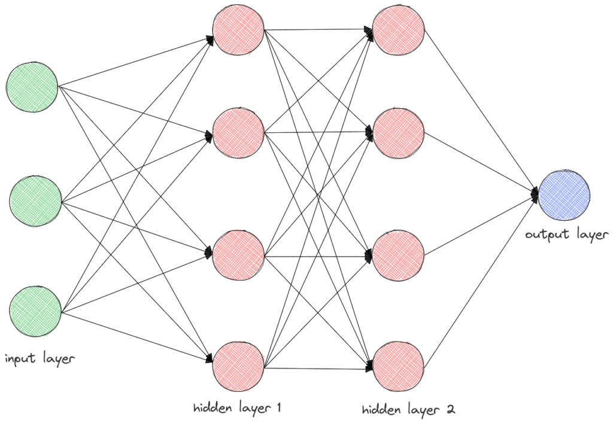
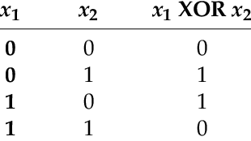
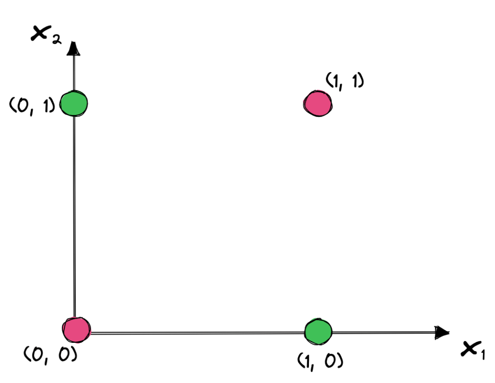
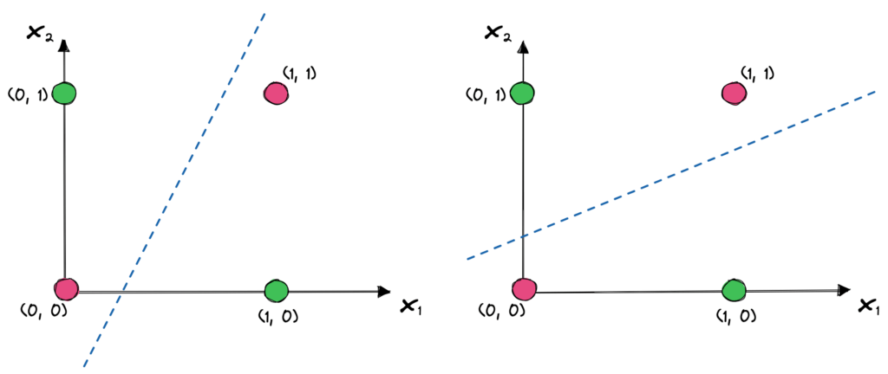
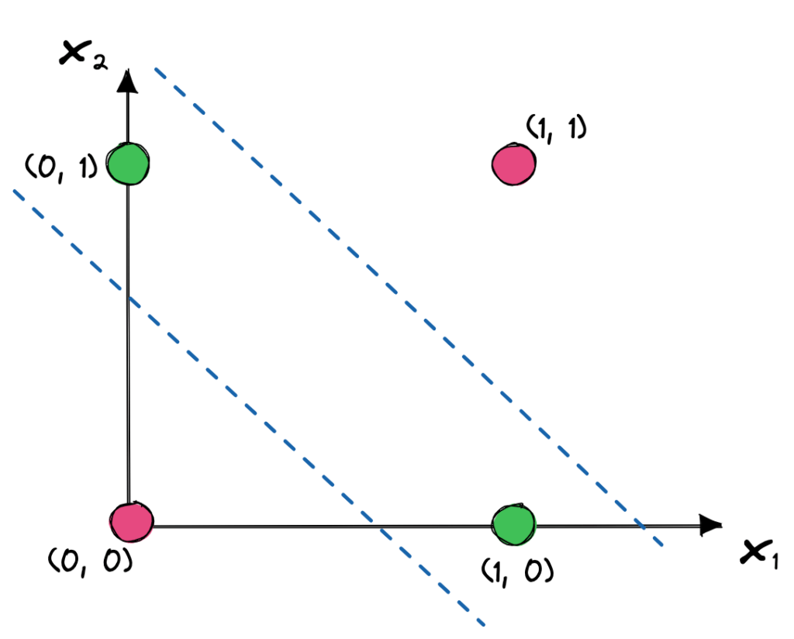

# 神经网络中的隐藏层

[深度学习](https://www.baeldung.com/cs/category/ai/deep-learning) [机器学习](https://www.baeldung.com/cs/category/ai/ml)

[神经网络](https://www.baeldung.com/cs/tag/neural-networks)

1. 概述

    在本教程中，我们将讨论神经网络中的隐藏层。首先，我们将介绍不同类型的层，然后结合两个示例讨论隐藏层的重要性。

2. 层的类型

    在过去几年中，神经网络架构彻底改变了我们生活的许多方面，其应用范围从自动驾驶汽车到预测致命疾病不等。一般来说，每个神经网络都由垂直堆叠的组件组成，这些组件被称为层。层有三种类型：

    - 输入层：将原始数据作为输入，并将其传递给网络的其他部分。
    - 一个或多个隐藏层，是输入层和输出层之间的中间层，通过应用复杂的非线性函数来处理数据。这些层是神经网络学习复杂任务并取得优异性能的关键组成部分。
    - 输出层将处理过的数据作为输入，并产生最终结果。

    下面我们可以看到一个有两个隐藏层的简单[前馈神经网络](https://en.wikipedia.org/wiki/Feedforward_neural_network)：

    

    在上述神经网络中，第一隐藏层的每个神经元将三个输入值作为输入，并按如下方式计算输出：

    \[y = f \left(\sum_{i=1}^3 x_i * w_i + b\right)\]

    其中 $x_i$ 是输入值，$w_i$ 是权值，b 是偏置，f() 是激活函数。然后，第二隐藏层的神经元将把第一隐藏层神经元的输出作为输入，以此类推。

3. 隐藏层的重要性

    现在我们来讨论一下隐藏层在神经网络中的重要性。如前所述，隐藏层是神经网络能够捕捉非常复杂的关系并在许多任务中取得令人兴奋的性能的原因。

    为了更好地理解这一概念，我们首先要研究一个没有任何隐藏层的神经网络，就像一个有 3 个输入特征和 1 个输出的网络。

    根据前面的等式，输出值 y 等于线性组合和非线性。因此，该模型类似于[线性回归模型](https://en.wikipedia.org/wiki/Linear_regression)。我们已经知道，线性回归试图根据观察到的数据拟合一个线性方程。

    在大多数机器学习任务中，线性关系不足以捕捉任务的复杂性，因此线性回归模型失败了。这时，隐藏层的重要性就体现出来了，它能让神经网络学习非常复杂的非线性函数。

4. 实例

    接下来，我们将讨论两个示例，以说明隐藏层在针对特定任务训练神经网络时的重要性。

    1. 逻辑函数

        假设我们想使用神经网络来预测给定两个二进制输入的 [XOR](https://en.wikipedia.org/wiki/Exclusive_or) 逻辑门的输出。根据 $x_1$ XOR $x_2$ 的真值表，只要输入不同，输出就为真：

        

        为了更好地理解我们的分类任务，下面我们绘制了四种可能的输出。绿点对应等于 1 的输出，红点为零输出：

        

        起初，这个问题似乎很简单。第一种方法是使用没有任何隐藏层的神经网络。然而，这种线性结构只能用一条线来分离我们的输入数据点。正如我们在上图中看到的，两条线并不能将两个类别分开，XOR 问题并不是线性可分的。

        在下图中，我们可以看到一些简单的线性模型可以用来解决 XOR 问题。我们注意到，在这两种情况下，都有一个输入被错误分类：

        

        解决这个问题的方法是，通过在神经网络中添加一个包含两个神经元的隐藏层来学习非线性函数。因此，最终的决定是根据这两个神经元的输出做出的，每个神经元都会学习一个线性函数，如下所示：

        

        其中一条线确保输入中至少有一个特征为真，另一条线确保并非所有特征都为真。因此，隐藏层设法将输入特征转化为经过处理的特征，然后在输出层进行正确分类。

    2. 图像

        了解隐藏层重要性的另一种方法是研究计算机视觉领域。由多个隐藏层组成的深度神经网络通过分层学习特征，在人脸识别领域取得了令人瞩目的成果。

        具体来说，神经网络的第一隐藏层学习检测图像中的短片角和边缘。这些特征在原始图像中很容易检测到，但其本身对于识别图像中的人物身份并没有太大作用。然后，中间隐藏层结合前几层检测到的边缘来检测脸部的眼睛、鼻子和耳朵等部位。然后，最后几层将鼻子、眼睛等检测器结合起来，检测出人的整体面部。

        在下图中，我们可以看到每一层是如何帮助我们从原始像素到达最终目标的：

        

5. 总结

    在本教程中，我们讨论了神经网络中的隐藏层。首先，我们讨论了神经网络中的层类型。然后，我们讨论了隐藏层的作用，并举了两个例子来更好地理解隐藏层的重要性。
