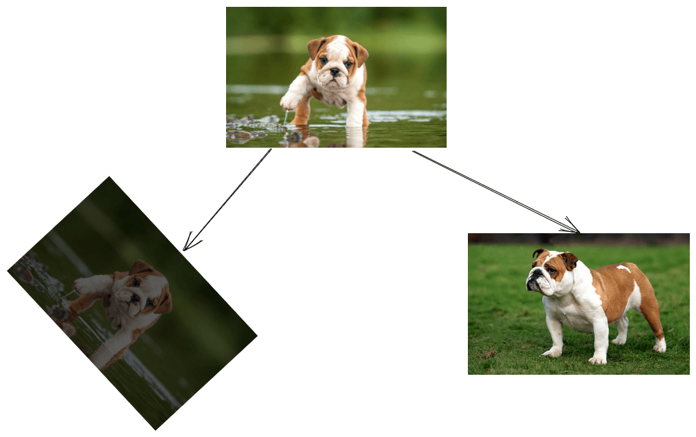
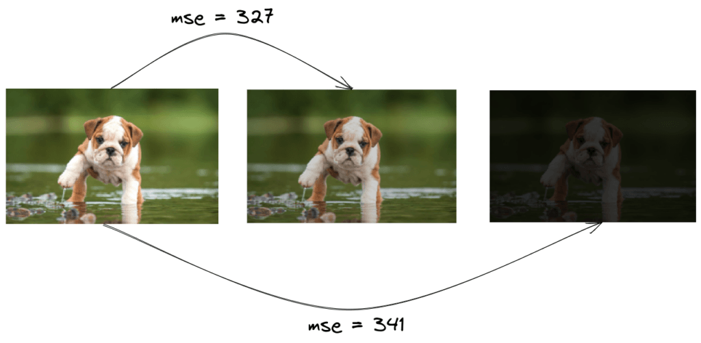
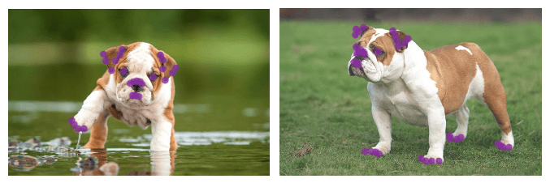
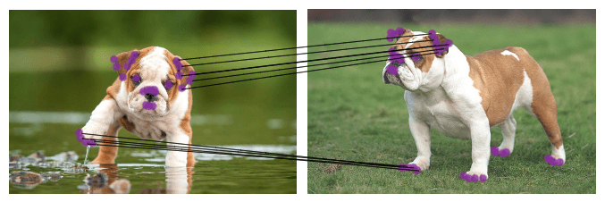
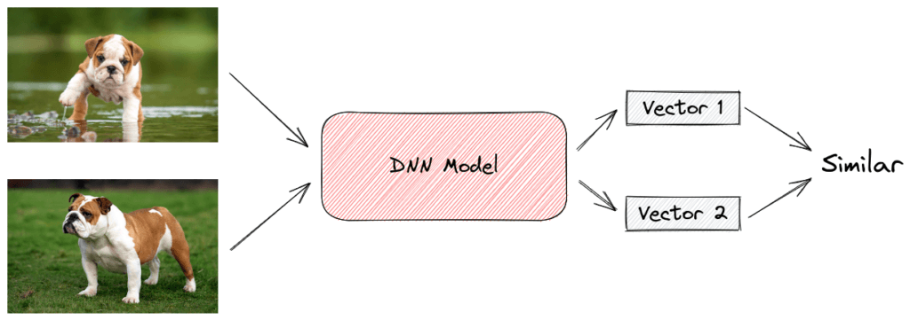
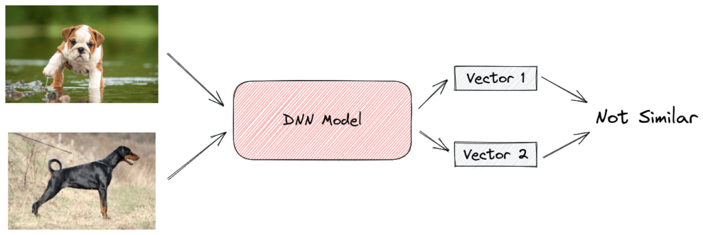

# 图像比较算法

[深度学习](https://www.baeldung.com/cs/category/ai/deep-learning) [机器学习](https://www.baeldung.com/cs/category/ai/ml)

[卷积神经网络](https://www.baeldung.com/cs/tag/cnn)

1. 概述

    在本教程中，我们将介绍一些图像对比算法。首先，我们将对问题进行概述，然后介绍从最简单到最复杂的三种算法。

2. 问题描述

    在图像对比中，我们有两幅输入图像 $\mathbf{I_{A}} 和 \mathbf{I_{B}}$，我们的目标是测量它们的相似度 $\mathbf{S(I_{A}, I_{B})}$。首先，我们必须认识到，相似性的概念并没有严格的定义，可以有多种解释。具体来说，在以下情况下，两幅图像 $I_{A}$ 和 $I_{B}$ 可以被认为是相似的：

    - 它们仅在对比度、亮度和旋转方面不同
    - 它们在语义上是相同的，即它们描述的是相同的对象

    下面，我们可以看到对图像相似性的不同解释。左图是原图的旋转版，对比度明显，而右图描绘的是同一只狗，但背景不同：

    

    我们意识到，由于狗的姿势和背景表面保持不变，因此左图的图像对比系统更容易实现。

    在本教程中，我们将介绍从最简单到最复杂的基于内容的图像比较算法。

3. Naive方法

    最简单的方法是使用一种度量方法，将图像的原始像素作为输入，然后输出它们的相似度。在这种情况下，我们可以使用经典的均方误差来计算两幅图像像素差平方的平均值：

    \[\mathbf{MSE(I_{A}, I_{B}) = \frac{1}{m n} \sum_{i=0}^{m-1} \sum_{j=0}^{n-1} |I_A(i, j) - I_B(i, j)|^2}\]

    我们可以认为，MSE 值越小，相似度越高。尽管这种方法快速、简单，但也存在很多问题。像素强度之间的[欧氏](https://www.baeldung.com/cs/euclidean-distance-vs-cosine-similarity)距离大并不一定意味着图像内容不同。

    如下图所示，如果我们只是改变图像的对比度，虽然没有改变内容，但最终的 MSE 值会增加很多：

    

4. 图像匹配

    当输入图像的拍摄角度或光照条件不同时，MSE 等基于像素的方法就会失效。要处理这些情况，图像匹配是最合适的方法。

    图像匹配的第一步是检测输入图像中包含丰富视觉信息的一些点。这些点通常对应于图像中物体的边缘和角落。最著名的关键点检测器有[哈里斯角检测器](https://en.wikipedia.org/wiki/Harris_corner_detector)、[SIFT](https://en.wikipedia.org/wiki/Scale-invariant_feature_transform) 和 [SURF](https://en.wikipedia.org/wiki/Speeded_up_robust_features)。

    下面，我们可以看到将关键点检测器应用于之前图像的示例。检测到的关键点显示为紫色：

    

    我们观察到，关键点位于狗的眼睛、耳朵、嘴巴和腿部区域。

    下一步是为每个检测到的关键点计算局部描述符。局部描述符由一个描述点视觉外观的一维向量定义。因此，来自物体相同部位的点会有相似的向量。上述 SIFT 和 SURF 方法能够在检测到关键点后计算局部描述符。

    最后一步是匹配两幅图像的描述符。为此，我们反复比较图像的描述符，以发现相似的描述符对。如果相似描述符的数量超过了一定的阈值，那么就意味着这两张图像描绘的是同一个物体，被认为是相似的。

    下面，我们对两张图像中位于狗的左耳和右腿前部的点进行了匹配：

    

    使用关键点检测器和局部描述符进行图像匹配是一种成功的图像对比方法。一个可能的缺点是算法最后一步的运行时间为 $\mathbf{O(k^2)}$，其中 $\mathbf{k}$ 是检测到的关键点的数量。不过，也有其他算法可以使用[四叉树](https://en.wikipedia.org/wiki/Quadtree)或[二进制空间](https://en.wikipedia.org/wiki/Binary_space_partitioning)分割更快地完成关键点之间的匹配步骤。

5. 连体网络

    尽管图像匹配很直观，但在真实世界的图像中并不能很好地通用。其性能取决于关键点检测器和局部特征描述器的质量。现在，我们来看看目前使用连体网络的最佳图像对比算法。

    [连体网络](https://en.wikipedia.org/wiki/Siamese_neural_network)是由两个完全相同的子网络组成的神经网络，这意味着它们包含完全相同的参数和权重。每个子网络可以是任何专为图像设计的神经网络，如[卷积神经网络](https://en.wikipedia.org/wiki/Convolutional_neural_network)。网络的输入是一对相似（正例）或不相似（负例）的图像。

    在训练过程中，我们通过子网络传递图像，然后得到两个特征向量作为输出，每个图像一个。如果输入图像对相似，我们希望这两个向量尽可能接近，反之亦然。为了实现这一目标，我们使用了对比度损失函数，该函数取一对向量$(x_i，x_j)$，当它们来自相似图像时，最小化它们的欧氏距离，反之则最大化距离：

    \[\mathbf{L = (1 - y) *||x_i - x_j||^2 + y* max(0, m - ||x_i - x_j||^2)}\]

    其中，如果图像相似，则 y=0，否则 y=1。此外，m 是一个超参数，定义了不相似图像之间的距离下限。

    在下面的图片中，我们可以看到正例和反例情况下的连体结构：

    

    

    经过训练后，网络已成功学会使用输出向量的欧氏距离（距离小则相似度高）来比较任何一对图像。

    利用暹罗网络，即使在最极端的情况下（低质量图像、模糊、遮挡等），我们也能对图像进行高精度比较。唯一的缺点是，这是一种基于学习的方法，需要标注图像数据集进行训练。

6. 结论

    在本教程中，我们讨论了三种图像对比算法。首先，我们简要介绍了这个问题。然后，我们结合示例介绍了这些算法。
