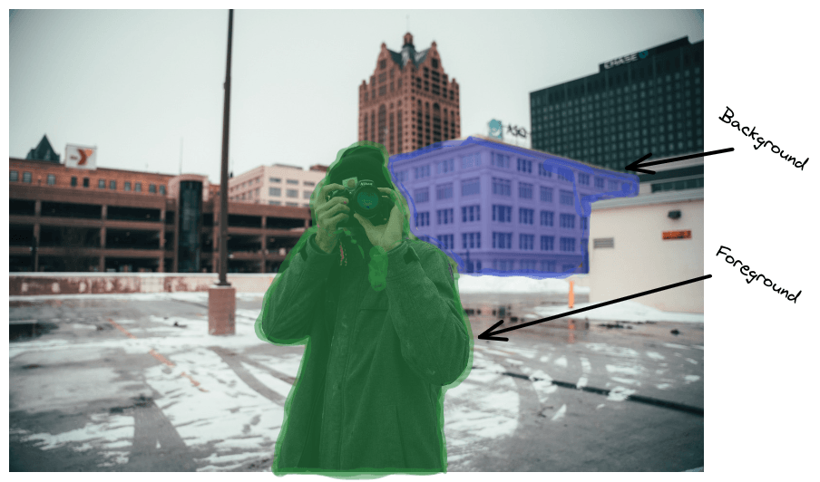
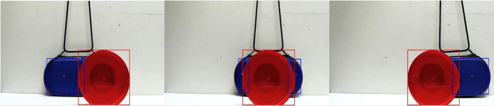

# 图像处理：遮挡

[深度学习](https://www.baeldung.com/cs/category/ai/deep-learning) [机器学习](https://www.baeldung.com/cs/category/ai/ml)

[图像处理](https://www.baeldung.com/cs/tag/image-processing)

1. 概述

    在本教程中，我们将讨论图像处理中的遮挡。首先，我们将定义术语遮挡，然后讨论在图像处理中考虑遮挡情况的重要性，并提供一些示例。

2. 定义

    假设我们身处一个包含某些物体的三维场景中，并对该场景进行拍照。顾名思义，这张照片对应的是该部分场景在二维空间中的投影。在这个空间中，场景的前景物体会遮挡背景表面。

    简单地说，当一个物体遮挡了另一个物体的一部分时，图像中就会出现遮挡现象。遮挡的区域取决于摄像机相对于场景的位置。

    例如，在下图中，摄影师（前景物体）遮挡了建筑物（背景表面）的一部分：

    

3. 重要性

    遮挡被认为是减少可用视觉信息的最常见事件之一。由于大量视觉信息被隐藏起来，无法捕捉，因此遮挡是图像处理和计算机视觉领域中许多任务仍然难以解决的主要原因之一。

    让我们来看看物体跟踪问题，我们的目标是识别和跟踪环境中的单个或多个物体。它的应用非常广泛，包括自动驾驶中的汽车和行人跟踪。然而，如果我们追踪的物体在某一时刻被另一个物体遮挡，系统就可能失去对第一个物体的追踪。在自动驾驶等情况下，这个问题可能会带来灾难性的后果。因此，跟踪算法应始终包含考虑到可能发生的遮挡的步骤或技术。

    在下面的图片中，我们可以看到在使用仅基于物体颜色的跟踪器时，由于遮挡而导致的物体跟踪常见问题：

    

    在左图和右图中，系统正确跟踪了两个物体，但忽略了蓝色物体的遮挡区域。在中间的图像中，系统错误地将蓝色物体视为两个独立的物体。

4. 示例

    现在，我们将介绍一些在设计系统时需要考虑到遮挡问题的重要案例。

    1. 面部识别

        在人脸识别中，我们的目标是通过一个人的脸来识别他的身份。输入是面部图像，输出是该人的姓名。人们经常佩戴饰品、帽子、眼镜和其他物品，遮挡了脸部的重要部位。因此，人脸识别系统要想表现出色，就必须对这类遮挡物具有良好的鲁棒性。

        在疫情中，可以看到戴着面具的女士。由于她的鼻子和嘴巴被遮挡住了，所以面部识别系统可能无法识别她。

    2. 增强现实

        增强现实系统的目标是利用计算机生成的图像来增强用户的视觉效果。主要问题是如何真实地将虚拟图像与现实世界中的物体融合在一起。因此，我们意识到真实物体和虚拟物体之间的遮挡现象非常普遍，而处理这些情况对于一个有效的增强现实系统来说非常重要。

        在下图中，我们可以看到一个用于购物的增强现实系统的界面。虚拟标签遮挡了现实世界物体的某些部分：

        

5. 结论

    在本教程中，我们讨论了遮挡。我们首先介绍了该术语的定义，然后讨论了它在许多计算机视觉和图像处理任务中的重要作用。
