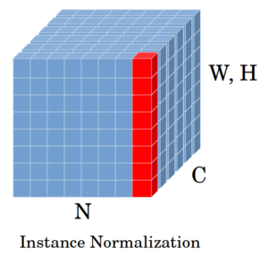

# [实例规范化与批量规范化](https://www.baeldung.com/cs/instance-vs-batch-normalization)

[深度学习](https://www.baeldung.com/cs/category/ai/deep-learning) [机器学习](https://www.baeldung.com/cs/category/ai/ml)

[训练](https://www.baeldung.com/cs/tag/training)

1. 概述

    本教程将介绍深度学习中的两种归一化技术，即实例归一化（IN）和批量归一化（BN）。我们还将强调这两种方法之间的差异。

2. 归一化的动机

    我们先来看看在深度神经网络中执行归一化的原因。归一化或特征缩放是一种确保不同范围的特征将按比例影响网络性能的方法。如果不进行归一化，一些特征或变量可能会被忽略。

    例如，假设我们想使用行驶距离和车龄这两个特征来预测汽车的价格。第一个特征的范围是以千为单位，而第二个特征的范围是以年为单位。使用原始数据预测汽车价格时，行驶距离特征将大大超过车龄特征。因此，我们应该对这两个特征进行归一化处理，以获得更准确的预测结果。

    通常，归一化在输入层进行，以对原始数据进行归一化。然而，对于深度神经网络来说，中间层节点的激活值可能会变得非常大，从而导致与我们的例子相同的问题。这就需要在隐藏层也进行某种类型的归一化。

3. 实例归一化（IN）

    实例归一化是对比归一化的另一个术语，最早出现在 [StyleNet](https://openaccess.thecvf.com/content_cvpr_2017/papers/Ulyanov_Improved_Texture_Networks_CVPR_2017_paper.pdf) 论文中。这两个名称都揭示了这一技术的一些信息。实例归一化告诉我们，它对单个样本进行操作。另一方面，对比度归一化则表示它对样本空间元素之间的对比度进行归一化处理。对于卷积神经网络（CNN），我们也可以说，IN 在单个示例的单个特征图的宽度和高度上执行强度归一化。

    为了说明 IN 的工作原理，让我们考虑一下构成 IN 层输入张量的[样本特征图](https://openaccess.thecvf.com/content_ECCV_2018/papers/Yuxin_Wu_Group_Normalization_ECCV_2018_paper.pdf)。假设 x 是由 N 幅图像组成的张量。因此，$x \in \R^{N\times C\times H\times W}$ 是一个四维张量。在实例规范化中，我们考虑一个训练样本和特征图（图中用红色标出），并取其空间位置（W 和 H）的均值和方差：

    

    要对单个实例 $x_{ni}$ 进行实例归一化，我们需要计算其均值和方差：

    \[ \mu_{ni} = \frac{1}{HW} \sum_{l=1}^{W} \sum_{m=1}^{H} x_{nilm} \]

    \[ \sigma^2_{ni} = \frac{1}{HW} \sum_{l=1}^{W} \sum_{m=1}^{H} (x_{nilm} - \mu_{ni})^2 \]

    然后，利用得到的均值和方差，对每个空间维度进行归一化处理：

    \[ y_{nijk} = \frac{x_{nijk} - \mu_{ni}}{\sqrt{\sigma^2_{ni} + \epsilon}} \]

    其中 $\epsilon$ 是为使训练更稳定而添加的一个小值。最后，我们使用两个缩放和偏置参数对结果进行线性变换。这种变换通过确保归一化层能够生成标识函数来保持网络的容量。网络在训练过程中学习这两个参数。例如，如果需要获得同一函数，网络将学习 $\gamma = \sqrt{\sigma^2_{ni} + \epsilon}$ 和 $\beta = \mu_{ni}$。

4. 批量归一化（BN）

    考虑到与上图相同的特征图，BN 对迷你批次（红色指定）中所有训练样本的一个通道（一个特征图）进行操作：

    

    让 $B = \{x_1, x_2, ..., x_N\}$ 是一个大小为 N 的迷你批次。[BN](http://proceedings.mlr.press/v37/ioffe15.pdf) 使用迷你批次的均值（$\pmb{\mu_i}$）和方差（$\pmb{\sigma^2_i}$）对其激活值进行归一化，并引入两个可学习的参数：$\gamma$ 和 $\beta$。网络可以使用梯度下降算法学习这些参数。

    \[ \mu_{i} = \frac{1}{NHW} \sum_{n=1}^{N} \sum_{l=1}^{W} \sum_{m=1}^{H} x_{nilm} \]

    \[ \sigma^2_{i} = \frac{1}{NHW} \sum_{n=1}^{N} \sum_{l=1}^{W} \sum_{m=1}^{H} (x_{nilm} - \mu_i)^2 \]

    与 IN 类似，在计算 $\hat{x}_{nijk}$ 时，我们将 $\epsilon$ 加入到分母中，以便在小批量方差为零的情况下稳定训练。

    \[ \hat{x}_{nijk} = \frac{x_{nijk} - \mu_i}{\sqrt{\sigma^2_i + \epsilon}} \]

    最后，

    \[ y_{nijk} = \gamma \hat{x}_{nijk} + \beta \]

    $\gamma$ 和 $\beta$ 参数与 IN 的缩放和偏置算子相同，具有相同的功能。

5. 了解 IN 和 BN 的区别

    这两种归一化方法都能加快训练速度，使网络更快收敛。此外，[BN](https://arxiv.org/pdf/1806.02375.pdf) 还能提高训练率，改善神经网络的泛化能力。尽管如此，这两种形式还是有一些不同之处。

    首先，根据它们的定义，它们对输入的作用是不同的。IN 对单个训练样本进行转换，而 BN 则对整个小批量样本进行转换。这就使得 BN 取决于批量大小，因为要获得统计上更精确的均值和方差，批量必须很大。

    然而，这可能很难实现，因为较大的批次规模需要较大的内存。因此，在内存有限的情况下，我们不得不选择较小的批次规模，这在某些情况下可能会造成问题。使用非常小的批次规模可能会给训练带来误差，因为均值和方差会变得更加嘈杂。在这种情况下，IN 比 BN 的[性能](https://ieeexplore.ieee.org/stamp/stamp.jsp?arnumber=9163397&casa_token=Fp4U_lcEuL8AAAAA:9Y1Le8ye8p9cAWm2CD0E114QWV3Tfqrd9NScFaS5mdLP7bPG1svKmvh7So7K1S4n3SsbG3N3&tag=1)更好。

    此外，由于 BN 取决于批量大小，因此它在测试时的应用方式与训练时不同。原因是在测试阶段，我们通常只有一个示例需要处理。因此，无法像训练时那样计算平均值和方差。相反，在测试阶段，BN 利用移动平均值和方差进行推理。相比之下，IN 不依赖于批量大小，因此在训练和测试时，其实现方法都是一样的。

6. 结论

    在本教程中，我们介绍了实例归一化和批量归一化方法的工作原理。我们还指出了这两种归一化方法在实现和用例方面的主要区别。
