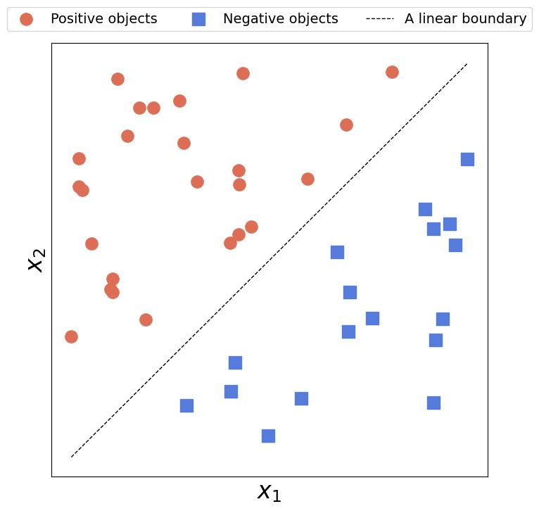
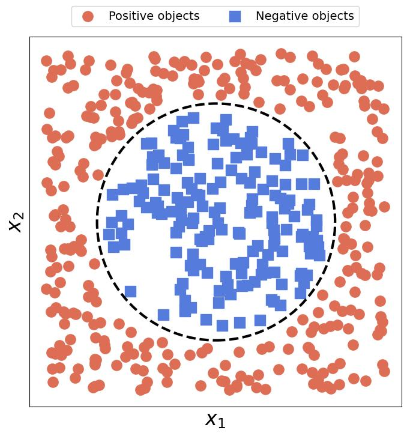
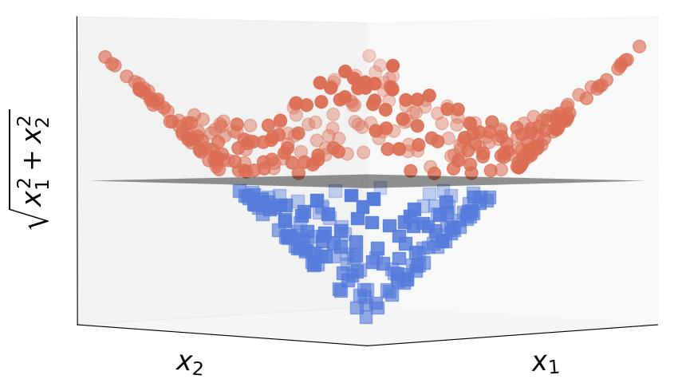

# 机器学习内核背后的直觉

[深度学习](https://www.baeldung.com/cs/category/ai/deep-learning) [机器学习](https://www.baeldung.com/cs/category/ai/ml)

1. 内核简介

    在本教程中，我们将直观地解释核在机器学习中的作用。

    所谓的核技巧能让我们将线性模型应用于非线性数据，这也是它在科学和工业领域广受欢迎的原因。除了我们通常将其与分类联系在一起的任务外，内核还能帮助我们解决该领域的其他问题，如回归、聚类和降维。

2. 当线性模型不足时，Kernels可以提供帮助

    线性模型之所以吸引人有几个原因。首先，我们在训练它们时所解决的优化问题有直接的分析解。其次，许多人都认为线性模型本质上是可解释的，因此用户可以理解它们的工作原理及其组成部分的含义。它们还易于交流和可视化。最后但并非最不重要的一点是，它们允许进行相对简单的数学分析。例如，[支持向量机](https://www.baeldung.com/cs/ml-support-vector-machines)、[线性回归](https://www.baeldung.com/cs/linear-vs-logistic-regression)和[主成分分析](https://www.baeldung.com/cs/principal-component-analysis)等。

    然而，当数据中存在非线性关系时，这些线性模型就会崩溃。让我们举例说明。

    1. 示例

        在合理的线性数据上拟合一条直线，很容易在[线性可分离](https://www.baeldung.com/cs/nn-linearly-separable-data)的类别之间找到线性边界：

        

        遗憾的是，任何直线都无法捕捉到圆形边界：

        

        一般来说，数据中的非线性关系越复杂、越明显，线性模型的性能就越差。尽管如此，我们还是希望有一些模型既能保持线性模型的优点，又能处理任意复杂的数据。

        Kernels正是我们所需要的。我们的想法是将数据从原始空间映射到一个新的空间，在这个空间中，数据将是线性的。例如，应用转换 $\begin{bmatrix} x_1 \\ x_2 \end{bmatrix} \mapsto \begin{bmatrix} x_1 \\ x_2 \\ \sqrt{x_1^2 + x_2^2} \end{bmatrix}$到循环数据集，我们就得到了线性可分离数据：

        

        我们可以看到，原始空间中的圆形边界在变换后的空间中变成了一个平面。

3. Kernels的数学

    Kernels是如何工作的？嗯，我们说过，我们的想法是找到一个映射 $\phi$，它可以将每个对象 x 转换为其在新空间 H 中的图像 $\phi(x)$，而这些图像将是线性的。例如，在分类问题中，我们寻求的空间中，类别之间的决策边界是新特征的线性函数。

    然而，转换数据可能是一项非常昂贵的操作。通常，包含 n 个对象和 d 个特征的训练集是一个 n 次 d 矩阵 $\mathbf{X}$：

    \[\mathbf{X} = \begin{bmatrix} x_{1,1} & x_{1,2} & \ldots & x_{1, d} \\ x_{2,1} & x_{2,2} & \ldots & x_{2, d} \\ \ldots \\ x_{n, 1} & x_{n, 2} & \ldots & x_{n, d} \\ \end{bmatrix} = \begin{bmatrix} \mathbf{x}_1^T \\ \mathbf{x}_2^T \\ \ldots \\ \mathbf{x}_{n}^T \end{bmatrix} \qquad \mathbf{x}_i = \begin{bmatrix} x_{i,1} \\ x_{i,2} \\ \ldots \\ x_{i, d} \end{bmatrix}\]

    根据 $\phi$ 的[复杂](https://www.baeldung.com/cs/time-vs-space-complexity)程度，转换后的数据 $\phi(\mathbf{X})$ 可能会耗费大量的计算时间和存储空间。此外，如果数据线性化的空间 H 是无限维的，那么对单个对象的变换就永远不会结束，这种方法就会失败。

    幸运的是，[内核技巧](https://en.wikipedia.org/wiki/Kernel_method)解决了这个问题。

    1. 核技巧

        基本观察结果是，线性模型优化问题的解包含以下项：

        \[\mathbf{X}\mathbf{X}^T\]

        其结果是一个 n 次 n 矩阵 $\mathbf{G} = [g_{i, j}]$ 其元素 $g_{i, j}$ 是 $\mathbf{x}_i$ 和 $\mathbf{x}_j$ 的点积。当我们把这些对象看作欧几里得空间 $R^d$ 中的向量时，其点积就是这些对象的内角和外角的内积$\langle \mathbf{x}_i, \mathbf{x}_j \rangle$。

        在目标空间 H 中，矩阵 $\mathbf{G}$ 将包含 H 中图像的内积：

        \[g_{i, j} = \langle \phi(\mathbf{x}_i), \phi(\mathbf{x}_j) \rangle_H\]

        这是我们将线性模型拟合到 H 中的转换数据所需要的唯一信息！根据其定义，核 $\boldsymbol{k}$ 是一个作用于原始特征空间中的对象并输出它们在目标空间 $\boldsymbol{H}$ 中图像的内积的函数：

        \[k(\mathbf{x}, \mathbf{z}) = \langle \phi(\mathbf{x}), \phi(\mathbf{z}) \rangle_H\]

        因此，核技巧允许我们在目标空间 $\boldsymbol{H}$ 中拟合一个线性模型，而无需转换数据。因此，要想用线性算法解决非线性问题，我们需要适当的 k 和 H。

4. 如何找到核？

    然而，我们如何找到内核和目标空间 H 呢？最好的建议是观察数据。例如，如果我们发现了二次方模式，我们就应该使用二次方函数：

    \[k(\mathbf{x}, \mathbf{z}) = \left( \mathbf{x}^T \mathbf{z} + c \right)^2 \qquad c \in R\]

    然而，要知道哪个核最合适并非易事。在这种情况下，我们可以尝试一些流行的选择，比如高斯（RBF）核：

    \[k(\mathbf{x}, \mathbf{z}) = e^{- \gamma || \mathbf{x} - \mathbf{z} ||^2} \qquad \gamma > 0\]

    其中 $|| \cdot ||$ 是欧氏规范。

    我们可以通过[交叉验证](https://www.baeldung.com/cs/cross-validation-decision-trees)来确定任何内核参数的值。

5. 核测量相似性

    看待核的另一种方法是将其解释为相似性度量。要了解原因，让我们回忆一下，内核取代了欧氏内积，即 $R^d$ 中向量的点积。如果向量是正交的，那么乘积等于零，我们可以看到正交向量的差异最大：

    正交性越小，即两个向量越相似，它们的内积就越大。由于内核计算的是目标特征空间的内积，因此也具有这一特性。因此，一个好的内核应该反映出我们计算对象的相似性。

    这种解释在数学上是有道理的。所有的内核都是正半有限函数，这与作为一种相似性度量是一致的。零值表示完全不相似的对象，而正值则表示不同程度的相似性。

    1. 通用性

        我们通常将机器学习应用于表格数据，即每个对象都是具有精确定义的特征顺序的向量的数据。然而，并非所有数据都是这样的。例如，集合就没有排序。结构化数据、图和其中的节点也是如此。

        因此，通过构建核来测量这些对象之间的相似性，我们可以将线性模型扩展到非向量数据。例如，intersection over union 可以量化两个[集合](https://www.baeldung.com/java-set-operations)之间的相似性：

        \[k_{ set }( A, B ) = \frac{ | A \cap B | }{ | A \cup B| }\]

        使用 $k_{ set }$ 作为核，我们可以对对象是集合的数据拟合线性模型。

6. 核与特征空间

    核与特征空间之间有什么关系？每个空间 $\boldsymbol{H}$ 都有一个唯一的核$\boldsymbol{k}$，因为内积在每个空间中都是唯一的。然而，反过来就不成立了。让我们来看看非常简单的一维核：

    \[k( x_1, x_2 ) = x_1 x_2 \qquad x_1, x_2 \in R\]

    这是一维欧几里得空间的一个特例。身份映射 $x \mapsto x$ 对应于我们与这个核相关联的映射 $\phi$，所以我们可以说原始空间和目标空间是一样的。但是，其他一些映射和空间也符合这个内核。例如：

    \[\psi: x \mapsto \begin{bmatrix} x / \sqrt{2} \\ x / \sqrt{2} \end{bmatrix}\]

    我们可以验证这一点：

    \[\langle \psi( x_1 ), \psi( x_2 ) \rangle = \begin{bmatrix} x_1 / \sqrt{ 2 } &  x_1 / \sqrt{ 2 } \end{bmatrix} \times \begin{bmatrix} x_2 / \sqrt{ 2 } \\ x_2 \sqrt{ 2 } \end{bmatrix} = \frac{ x_1 x_2 }{ 2 } + \frac{ x_1 x_2 }{ 2 } = x_1 x_2\]

    因此，每个核可以对应多个特征空间。

7. 结论

    在本文中，我们对核技巧做了直观的解释。正如我们所看到的，核允许我们高效地将线性模型拟合到非线性数据中，而无需明确地将它们转换到线性特征空间。因此，核可以节省我们的时间和空间。

    我们可以将核解释为对象之间相似性的度量。通过构建核来量化相似性，我们可以将其应用于任何数据类型，如图或集合，而不仅仅是特征顺序重要且事先固定的向量。
