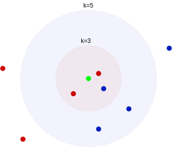
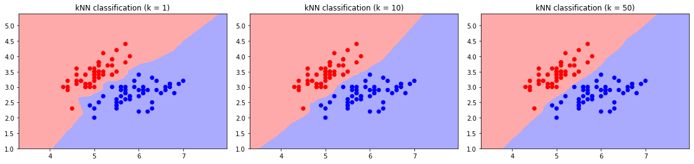
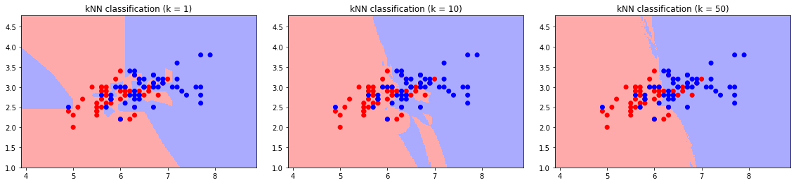
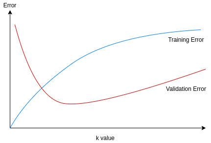
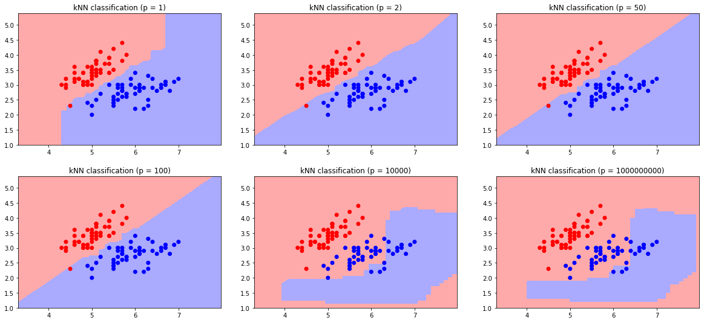

# [k近邻和高维数据](https://www.baeldung.com/cs/k-nearest-neighbors)

[深度学习](https://www.baeldung.com/cs/category/ai/deep-learning) [机器学习](https://www.baeldung.com/cs/category/ai/ml)

1. 简介

    在本教程中，我们将学习 k 近邻算法。它是一种基本的机器学习模型。我们可以将其用于分类和回归任务。然而，将其应用于分类任务更为常见。

    我们将探讨如何选择 k 值和距离度量来提高准确率。然后，我们将分析该算法在高维数据集上的表现。最后，我们将提到解决高维相关问题的潜在方法。

2. k-最近邻算法

    k-Nearest Neighbors（k-NN）算法假定相似项目彼此靠近。因此，我们通过研究数据点的近邻来确定数据点。

    要预测一个新观测点的结果，我们要对过去最近的 k 个观测点进行评估。我们根据这些相邻观测值进行预测。我们可以直接取平均值，也可以使用加权平均值。

    k-NN 算法有几个优点：

    - 主要思想简单，易于实现
    - 基于实例，不需要额外的训练阶段
    - 该算法适用于分类和回归任务
    - 我们可以随时轻松地向数据集添加新的观测值
    - 输出结果易于理解和解释
    - 只需调整一个超参数（k）

    另一方面，它也有一些缺点：

    - 算法依赖于过去的观察结果
    - 对噪声数据、异常值和缺失值非常敏感
    - 需要进行特征缩放等数据预处理，因为它需要同质特征
    - 很难处理分类特征
    - 在大型数据集上计算距离成本高昂
    - 在高维数据上计算距离成本高昂

    1. 选择k值

        通常的做法是将$\boldsymbol{k}$选为奇数，以消除可能的并列关系。偶数 k 值会导致二元分类中的票数相等。

        超参数 $\boldsymbol{k}$ 的选择会改变算法的结果。假设我们有来自蓝色和红色两个类别的观察结果。假设 3 个近邻中有 2 个是红色，但 5 个近邻中有 3 个是蓝色：

        

        在这里，选择不同的 k 值会导致不同的分类结果。因此，在使用 k-NN 算法时，决定 k 值是很重要的一步。

        因此，k 的选择会影响决策边界的形状：

        

        选择较大的 $\boldsymbol{k}$ 值会将所有内容都归入可能性较大的类别，从而导致较高的偏差。因此，我们在类别之间会有一个平滑的决策边界，对单个点的重视程度较低。

        相反，小的$\boldsymbol{k}$值会导致高方差和不稳定的输出。训练集的微小变化会导致分类边界的巨大变化。这种影响在交叉类中更为明显：

        

        因此，我们需要通过观察输出结果，根据测试集和验证集来选择 k 值。训练误差和验证误差可以很好地提示 k-NN 分类器的行为。

        k=1 时，训练误差最小（0）。随着 k 的增大，训练误差也会随之增大。另一方面，当 k 值太小或太大时，验证误差都很大。我们可以选择验证误差最小的 $\boldsymbol{k}$ 值：

        

    2. 距离函数

        用于计算距离的度量不是 k-NN 算法的超参数。然而，距离度量的选择会改变结果并影响模型的成功。

        欧氏距离是计算数据点之间距离最常用的距离度量。但是，我们需要根据手头数据集的大小和维度来选择距离度量。

        让我们来探讨一些众所周知的常用度量。闵科夫斯基距离（Minkowski distance）是测量 n 维空间中两点 x 和 y 之间距离的广义度量：

        \[d\left( x,y\right) = \sqrt[p] {\sum _{i=1}^{n} \left| x_{i}-y_{i}\right|^p }\]

        曼哈顿距离（城市街区距离或 L1 距离）是闵科夫斯基距离的一个特例，我们设定 p=1：

        \[d\left( x,y\right) = {\sum _{i=1}^{n} \left| x_{i}-y_{i}\right| }\]

        换句话说，x 和 y 之间的距离就是它们笛卡尔坐标之间绝对差值的总和。

        欧氏距离是闵科夫斯基距离的另一种特例，其中 p=2：

        \[d\left( x,y\right) = \sqrt {\sum _{i=1}^{n} \left( x_{i}-y_{i}\right)^2 }\]

        它表示欧几里得空间中 x 和 y 两点之间的距离。

        切比雪夫距离是指当我们有 $p \to \infty$ 时的距离：

        \[d\left( x,y\right) = max \left( \left| x_{i}-y_{i}\right| \right)\]

        我们可以在实值向量空间上使用闵科夫斯基差分的所有变化。增加 p 值会改变距离，从而改变决策边界：

        

        对于高维数据集，使用较小的 $\boldsymbol{p}$ 值更为有利。因为 p 值越小，计算距离的速度越快。因此，**曼哈顿距离是超高维数据集的最佳选择?**。

        除了实值向量外，汉明距离也是一种可用于整数值向量空间的距离度量。它通常通过测量非相等字符之间的距离来比较等长字符串。

        \[d\left( x,y\right) = \sum _{i=1}^{k} \left| x_{i}-y_{i}\right|\]

        Jaccard distance（杰卡德距离）是一种适用于查找布尔值向量间距离的度量。它计算整个样本集的重叠特征。

        余弦相似性度量不是一种度量，因为它不符合三角形相等原则。然而，它被用来对文档和基因序列等向量对象进行分类。它测量的是特征中特定实例的频率。

3. 高维度

    随着特征数量的增加，k-NN 算法的性能会越来越差。因此，它受到了维度诅咒的影响。因为，在高维空间中，k-NN 算法面临两个困难：

    - 在高维空间中计算距离和寻找近邻的计算成本变得更高
    - 我们关于相似点位置紧密的假设被打破

    随着特征数量的增加，数据点之间的距离变得越来越不明显。此外，我们为找到 k 个邻居而需要覆盖的总面积也会增加。

    让我们考虑一个简单的情况：数据集有 f 个特征，每个特征的值范围为 [0, 1]。我们将 k 设为 10，n（观测值的数量）设为 1000。我们进一步假设每个特征的值都是均匀分布的。

    在这种情况下，让我们找出包含 k=10 个数据点的立方体的边长。

    例如，如果 f=2，0.1 × 0.1 的正方形占总面积的 1/100，共覆盖 10 个数据点。

    如果我们将 f 递增到 f=3，要覆盖 1/100 的体积，我们需要一个边长=0.63 的立方体。

    随着 f 的不断增大，边长将呈指数增长。我们可以把边长 s 设为：

    \[s = (k/n)^{1/f}\]

    我们看到，当 f=100 个特征时，s=0.955。以类似方式迭代，f=1000 时，s=0.995。

    因此，最初关于相似观测值很接近的假设失败了。由于所有数据点之间的距离越来越小，我们不能说在高维数据集中，相似的观察结果会更接近。

    不过，还是有办法在不丢失基本结构的情况下以较低维度表示数据集。

    1. 减少数据

        我们称在低维空间中表示高维数据为维度缩减。

        我们可以使用特征选择技术来消除数据集中更多的冗余特征。这种方法可以确保我们只保留最相关的特征。

        或者，我们可以使用特征提取技术将数据映射到低维空间中。新的特征集不一定是原始组件的子集。通常情况下，新特征是由现有特征组合而成的。例如，主成分分析（PCA）应用线性映射，通过最少的特征数量获得最大的信息。

        当数据集的真实维度低于实际表示维度时，PCA 和核方法尤其有用。例如，经过映射后，我们可以用 2 个特征来表示三维空间中 2 维平面上的点。

        另一种数据缩减技术是用更少的观测值以更小的形式表示数据。随着计算次数的减少，数值缩减算法有助于提高 k-NN 性能。

    2. 使用近似 k-NN

        在某些情况下，寻找近似解是可以接受的。如果寻找精确解的成本过高，我们可以采用近似算法，但不保证精确结果。高维相似性搜索技术可以在高维环境下快速逼近 k-NN。

        位置敏感散列（LSH）算法将相似项目散列到高概率桶中。顾名思义，我们希望相似的项目最终会被放在同一个桶中。

        哈希表的使用在查询和数据生成方面都非常简单高效。这样，LSH 方法就能快速找到近似近邻。

        随机投影允许我们将高维空间中的 m 个点转换到只有 $\mathcal{O}(log m/\epsilon^2)$ 维度的空间中，只需将任意两点之间的距离改变 ($1\pm \epsilon$)。因此，映射保留了欧氏距离。因此，运行 k-NN 算法能以更低的成本得到相同的结果。

        随机投影森林（rpForests）可以进行快速近似聚类。它们能快速有效地近似近邻。

4. 结论

    在本文中，我们探讨了 k-NN 算法。我们分析了超参数的变化如何影响结果，以及如何调整超参数。

    然后，我们研究了 k-NN 算法在高维数据集上的表现。最后，我们讨论了如何通过使用近似算法来克服性能问题。
