# [大型语言模型介绍](https://www.baeldung.com/cs/large-language-models)

1. 简介

    在本教程中，我们将讨论大型语言模型（ Large Language Models,LLMs），它是最近人工智能领域若干创新背后的力量。这将包括大型语言模型背后的基本概念，大型语言模型的一般架构，以及一些当今流行的大型语言模型。

2. 什么是大型语言模型？

    历史上，人们只期望计算机能够理解一组明确的指令，这些指令通常是用Java这样的编程语言编写的。然而，随着计算机的使用变得广泛，人们期望它能理解自然语言的指令，如英语。

    1. NLP的开始

        自然语言处理（[NLP](https://en.wikipedia.org/wiki/Natural_language_processing)）是语言学、计算机科学和人工智能的一个跨学科子领域。它的目标是让计算机能够理解自然语言中的文本和其他媒体，包括其上下文的细微差别。

        NLP的基本开端可以追溯到20世纪50年代，当时艾伦-图灵发表了他的[论文](https://academic.oup.com/mind/article/LIX/236/433/986238)，提出了图灵测试作为智力的标准。然而，几十年来，NLP被限制在模仿基于规则集合的自然语言理解上。

        从20世纪80年代开始，随着计算能力的增长和语言处理的机器学习算法的引入，统计NLP开始形成。它从使用监督学习算法的机器翻译开始。

        但重点很快转向半监督和无监督的学习算法，以处理互联网上产生的越来越多的原始语言数据。NLP应用的关键工具之一是语言建模。

    2. 语言建模(LM)

        语言建模（[LM](https://en.wikipedia.org/wiki/Language_model)）使用统计和概率技术来确定一个句子中出现的特定单词序列的概率。因此，一个语言模型基本上是一个关于单词序列的概率分布：

        \[P(x^{(t+1)}|x^{(t)},..., x^{(1)})\]

        这里，表达式计算的是条件概率分布，其中$x^{(t+1)}$可以是词汇表中的任何词。

        语言模型通过从一个或多个文本语料库中学习产生概率。文本语料库是一种语言资源，由一种或多种语言的大型结构化文本集组成。文本语料库可以包含一种或多种语言的文本，并且通常有注释。

        最早建立语言模型的方法之一是基于[n-gram](https://en.wikipedia.org/wiki/N-gram)。n-gram是指来自给定文本样本的n个项目的连续序列。在这里，该模型假设序列中下一个词的概率只取决于一个固定大小的前一个词的窗口：

        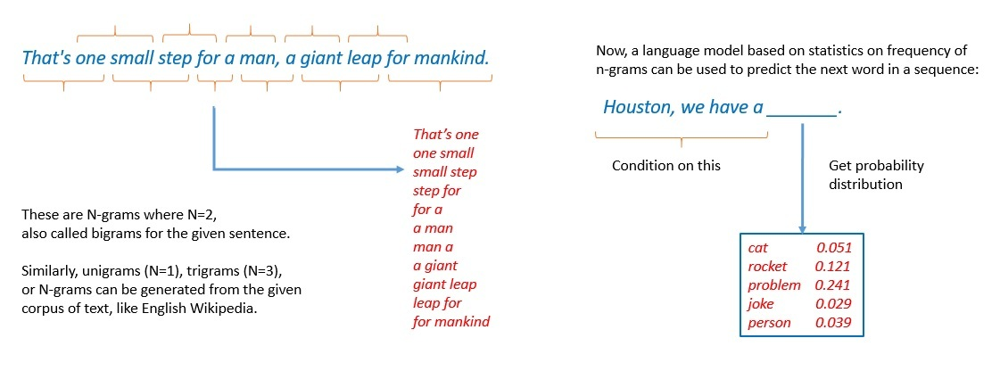

        然而，n-gram语言模型在很大程度上已经被神经语言模型所取代了。它以神经网络为基础，是一种受生物神经网络启发的计算系统。这些模型利用单词的连续表示或嵌入来进行预测：

        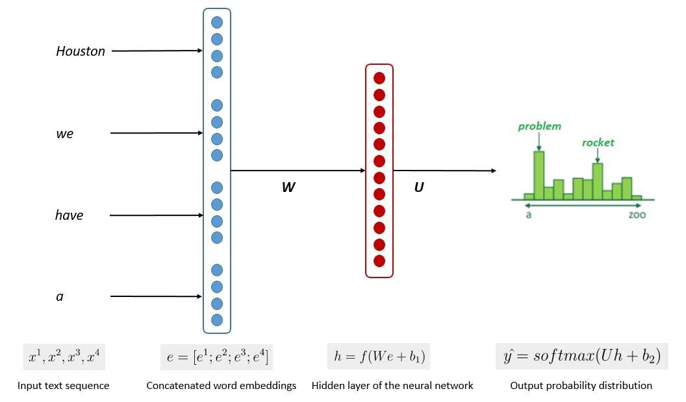

        `输入文本序列->串联的词嵌入->神经网络的隐藏层->输出概率分布`

        基本上，神经网络以权重的非线性组合的方式分布式地表示单词。因此，它可以避免语言建模中的维度诅咒。目前已经有几个神经网络架构被提出来用于语言建模。

    3. 大型语言模型(LLMs)

        大型语言模型（[LLMs](https://en.wikipedia.org/wiki/Large_language_model)）基本上是在更大范围内工作的神经语言模型。一个大型的语言模型由一个可能有数十亿-数千亿参数的神经网络组成。此外，它通常在大量未标记的文本上进行训练，可能达到数千亿个单词。

        大型语言模型也被称为深度学习模型，通常是通用的模型，擅长于各种任务。它们通常在相对简单的任务上进行训练，比如预测一个句子中的下一个词。

        然而，由于在大量的数据集上进行了充分的训练，并且参数数量巨大，这些模型可以捕获人类语言的大部分语法和语义。因此，在计算语言学的广泛任务中，它们变得能够有更精细的技能。

        这与早期NLP应用中的方法大相径庭，当时专门的语言模型被训练来执行特定的任务。相反，研究人员已经观察到LLMs的许多新兴能力，这些能力是它们从未被训练过的。

        例如，LLMs已经被证明可以进行多步算术，解开一个单词的字母，以及识别口语中的攻击性内容。最近，ChatGPT，一个建立在OpenAPI的GPT系列LLM之上的流行聊天机器人，已经通过了[美国医学执照考试](https://www.medrxiv.org/content/10.1101/2022.12.19.22283643v2)等专业考试。

    4. LLMs和基础模型

        [基础模型](https://en.wikipedia.org/wiki/Foundation_models)一般是指任何在广泛的数据上训练的模型，可以适应广泛的下游任务。这些模型通常使用深度神经网络创建，并在许多未标记的数据上使用自我监督学习进行训练。

        这个[术语](https://arxiv.org/abs/2108.07258)是不久前由斯坦福大学以人为本的人工智能研究所(Human-Centered Artificial Intelligence (HAI))创造的。然而，在我们所说的基础模型和有资格成为大型语言模型（LLM）之间没有明确的区别。

        尽管如此，LLM通常是在语言相关的数据上训练的，如文本。但基础模型通常是在多模态数据上训练的，是文本、图像、音频等的混合。更重要的是，基础模型的目的是作为更具体的任务的基础或依据：

        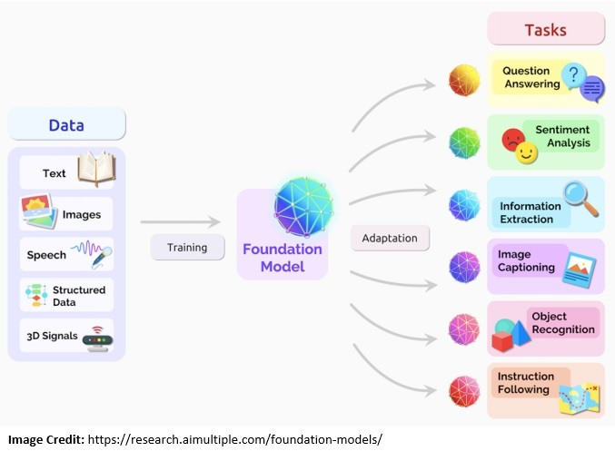

        基础模型通常通过进一步的训练来微调各种下游的认知任务。微调是指将预先训练好的语言模型，用特定的数据对其进行不同但相关的任务训练的过程。这个过程也被称为转移学习。

3. LLMs的一般结构

    大多数早期的 LLM 都是使用 RNN 模型与 LSTM 和 GRU（我们在前面已经讨论过）创建的。然而，它们面临着挑战，主要是在大规模执行 NLP 任务方面。但是，这正是人们期望 LLMs 能够完成的任务。这就促成了 Transformers 的诞生！

    1. 早期的LLMs架构

        在开始的时候，LLMs主要是使用自监督学习算法创建的。自监督学习指的是对未标记的数据进行处理，以获得有用的表征，从而帮助下游的学习任务。

        很多时候，自监督学习算法使用基于人工神经网络（[ANN](https://en.wikipedia.org/wiki/Artificial_neural_network)）的模型。我们可以使用几种架构来创建ANN，但在LLM中使用最广泛的架构是递归神经网络（[RNN](https://en.wikipedia.org/wiki/Recurrent_neural_network)）：

        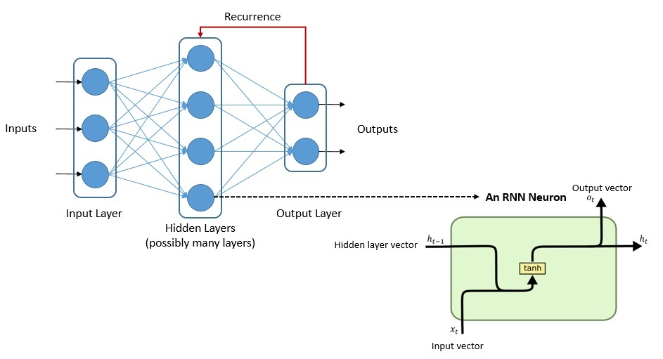

        现在，RNN可以使用其内部状态来处理可变长度的输入序列。一个RNN既有长期记忆又有短期记忆。有一些RNN的变种，如长短时记忆（[LSTM](https://en.wikipedia.org/wiki/Long_short-term_memory)）和门控递归单元（[GRU](https://en.wikipedia.org/wiki/Gated_recurrent_unit)）。

        LSTM架构有助于RNN何时记住和何时忘记重要信息。GRU架构没有那么复杂，需要更少的内存来训练，而且执行速度比LSTM快。但是GRU通常更适合于较小的数据集。

    2. LSTM和GRU的问题

        正如我们前面所看到的，LSTM 的引入是为了将记忆引入 RNN。但使用 LSTM 单元的 RNN 的训练速度非常慢。此外，对于这种架构，我们需要按顺序或串行输入数据。这使得我们无法并行处理和使用可用的处理器内核。

        另外，带有GRU的RNN模型训练速度更快，但在较大的数据集上表现不佳。尽管如此，在很长一段时间里，LSTM和GRU仍然是构建复杂NLP系统的首选。然而，这类模型也存在着[梯度消失](https://en.wikipedia.org/wiki/Vanishing_gradient_problem)的问题：

        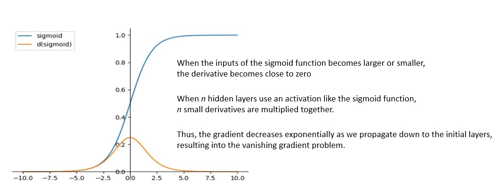

        在使用基于梯度的反向传播学习方法的智能网络中，会遇到梯度消失问题。在这种方法中，在每次迭代训练期间，权重都会收到与当前权重相关误差函数偏导数成比例的更新。

        在某些情况下，比如递归网络，梯度会变得非常小。这实际上阻止了权重值的变化。这甚至会阻碍神经网络的进一步训练。这些问题使得针对 NLP 任务的 RNN 训练实际上效率低下。

    3. 注意机制

        RNNs的一些问题通过在其架构中加入注意力机制得到了部分解决。在像LSTM这样的递归结构中，可以传播的信息量是有限的，而且保留信息的窗口也比较短。

        然而，通过[注意机制](https://en.wikipedia.org/wiki/Attention_(machine_learning))，这个信息窗口可以被大大增加。注意力是一种增强输入数据的某些部分而减弱其他部分的技术。这背后的动机是，网络应该把更多的注意力放在数据的重要部分：

        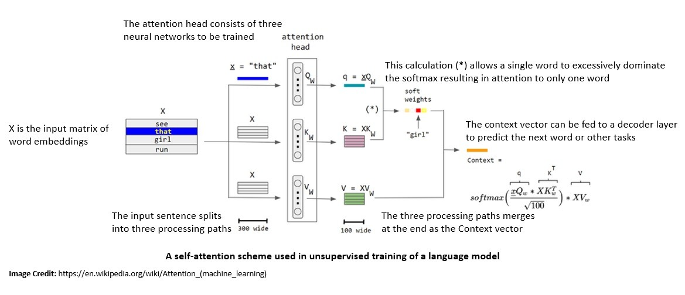

        注意和自我注意之间存在着微妙的区别，但它们的动机是相同的。注意机制指的是关注另一个序列的不同部分的能力，而自我注意指的是关注当前序列的不同部分的能力。

        自我注意允许模型从任何输入序列元素中获取信息。在NLP应用中，这提供了关于远处标记的相关信息。因此，该模型可以捕获整个序列的依赖关系，而不需要固定或滑动窗口。

    4. 词的嵌入

        在 NLP 应用中，如何表示自然语言中出现的单词或标记非常重要。在 LLM 模型中，输入文本被解析为标记，每个标记通过词嵌入转换为实值向量。

        [词的嵌入](https://en.wikipedia.org/wiki/Word_embedding)能够捕捉到词的意义，在向量空间中比较接近的词预计在意义上是相似的。词嵌入的进一步进展还允许他们在不同的向量中捕捉每个词的多种含义：

        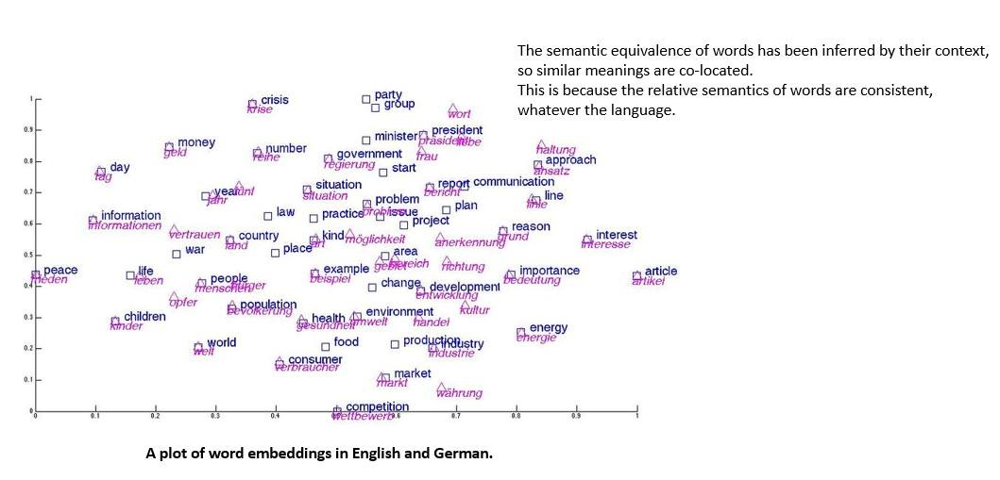

        词嵌入有不同的风格，其中之一是将词表达为该词出现的语言环境的向量。此外，有几种生成词嵌入的方法，其中最流行的方法是依靠神经网络架构。

        2013年，谷歌的一个团队发布了[word2vec](https://en.wikipedia.org/wiki/Word2vec)，这是一个单词嵌入工具包，使用神经网络模型从大型文本语料库中学习单词关联。词和短语嵌入已被证明可以提高NLP任务的性能，如句法解析和情感分析。

    5. 转化器模型的到来

        具有注意机制的RNN模型的性能有了明显的改善。然而，递归模型就其性质而言，很难进行扩展。但是，自我注意机制很快就被证明是相当强大的，以至于它甚至不需要递归的顺序处理!

        谷歌大脑团队在2017年推出的转化器也许是LLM历史上最重要的拐点之一。[变换器](https://en.wikipedia.org/wiki/Transformer_(machine_learning_model))是一种深度学习模型，它采用自我关注机制，一次性处理整个输入：

        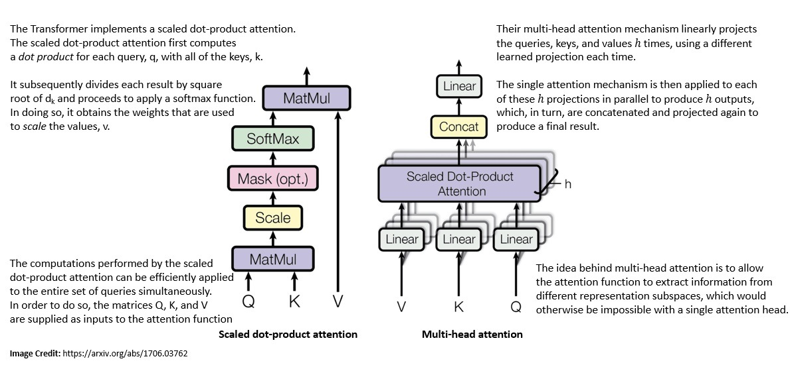

        作为对早期基于RNN模型的重大改变，转化器没有递归(recurrent)结构。在有足够训练数据的情况下，仅转化器架构中的注意力机制就能与带有注意力的RNN模型的性能相匹配。

        使用转化器模型的另一个显著优势是，它们的可并行性更强，需要的训练时间也大大减少。这正是我们利用现有资源在大量基于文本的数据语料库中建立LLM所需要的甜蜜点。

    6. 编码器-解码器结构

        许多基于ANN的自然语言处理模型都是使用编码器-解码器结构建立的。例如，[seq2seq](https://en.wikipedia.org/wiki/Seq2seq)是一个最初由谷歌开发的算法系列。它通过使用RNN与LSTM或GRU将一个序列变成另一个序列。

        最初的转化器模型也使用了编码器-解码器架构。编码器由编码层组成，对输入进行迭代处理，一层接一层。解码器由解码层组成，对编码器的输出做同样的事情：

        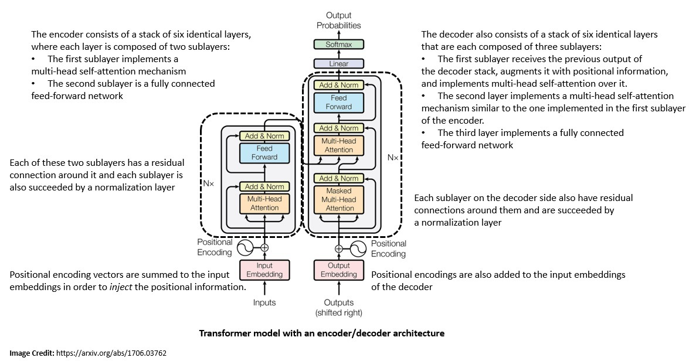

        每个编码器层的功能是生成编码，其中包含关于输入的哪些部分是相互关联的信息。然后，输出的编码被传递给下一个编码器作为其输入。每个编码器由一个自我注意机制和一个前馈神经网络组成。

        此外，每个解码器层采取所有的编码，并使用其纳入的上下文信息来生成一个输出序列。与编码器一样，每个解码器由一个自我注意机制、一个对编码的注意机制和一个前馈神经网络组成。

4. LLMs的应用技术

    正如我们前面所看到的，基础模型或LLMs一般是在一个大的数据语料库上训练的，任务简单而通用。现在，为了将LLM应用于特定的NLP任务，我们必须使用其中一种应用技术，如微调、提示或指导员调整。

    1. 微调

        [微调](https://en.wikipedia.org/wiki/Fine-tuning_(machine_learning))是转移学习的一种方法，即在新的数据上进一步训练预训练模型的权重。[迁移学习](https://en.wikipedia.org/wiki/Transfer_learning)指的是将解决一项任务时获得的知识应用于相关任务的做法。

        微调可以在整个神经网络上进行，也可以只在神经网络层的一个子集上进行。一般来说，它涉及引入一组新的权重，将语言模型的最后一层与下游任务的输出连接起来。语言模型的原始权重则保持不变：

        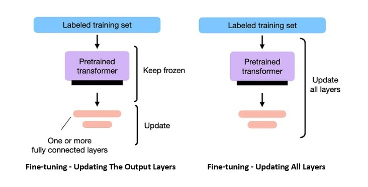

        微调一般是通过监督学习来完成的，而与任务相关的标注数据集则要小得多。微调通常还采用其他方法，如弱监督学习和强化学习。

        微调是 LLM 最流行的应用技术，目的是利用 LLM 完成情感分析、命名实体识别和语音部分标记等下游 NLP 任务。然而，随着 LLM 开始变得越来越大，提示等更简单的技术开始变得越来越流行。

    2. 提示技术

        自从像GPT-3这样的大规模LLM出现后，[提示](https://en.wikipedia.org/wiki/Prompt_engineering)已经成为利用LLM完成特定任务的一种更简单和更流行的方法。在这种方法中，要解决的问题以文本提示的形式呈现给模型，模型必须通过提供一个完成信息(completion)来解决。

        这种利用 LLM 能力的模式也被称为提示工程。它一般通过将一个或多个任务转换为基于提示的数据集，并通过基于提示的学习来训练语言模型：

        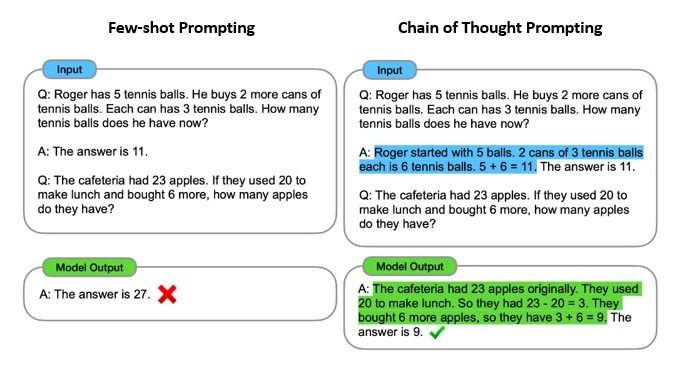

        少镜头提示([Few-shot prompting](https://en.wikipedia.org/wiki/In-context_learning_(natural_language_processing)))是一种提示技术，它允许模型在尝试一项任务之前处理示例。它包括问题和解决方案对的某些示例，称为 "镜头"。这也被称为情境学习，最初是作为微调的替代方案提出的。

        语境中学习的一个常见例子是思维链提示。在这里，在尝试回答一个问题之前，会给模型提供少量的示例来输出一连串的推理。这有助于提高模型在需要逻辑思维和推理的任务中的表现。

    3. 教员调谐

        教员调谐是一种微调形式，有利于更自然和准确的零点提示互动。在这里，语言模型在许多任务的例子中被训练成自然语言指令和适当的反应。

        指导员调整技术有很多种，例如 ChatGPT 和 Sparrow 等流行模型所使用的人类反馈强化学习（[RLHF](https://en.wikipedia.org/wiki/Reinforcement_learning_from_human_feedback)）。它包括在人类生成的提示和回复对数据集上进行监督微调：

        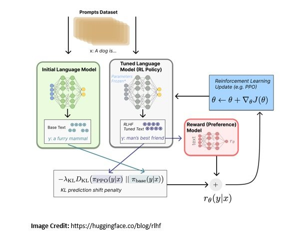

        在RLHF中，奖励函数是基于人类偏好的数据集而学习的。此外，奖励函数被用来通过优化算法使用强化学习来优化代理的政策。人类的反馈是通过要求人类对代理人的行为实例进行排名来收集的。

        RLHF的关键挑战之一是人类反馈的可扩展性和成本。因此，与无监督学习相比，这种方法可能是缓慢和昂贵的。此外，人类的反馈可以根据任务和人类的个人偏好而变化。

5. LLMs的现状

    像许多其他基于人工智能的技术一样，LLMs最近吸引了相当多的公众想象。然而，今天的LLMs是基于多年来对神经网络模型的研究，计算能力的进步，以及前所未有的可用数据规模。虽然我们发现LLM的有趣和实际应用，但它们仍然面临一些限制和挑战。

    1. 目前流行的LLMs

        LLMs仍然是一个活跃的研究和发展领域。但由于开发和培训一个LLM需要大量的资源，它大多是由大型组织追求的。然而，OpenAI推出的ChatGPT标志着一场竞赛!

        谷歌一直处于这项研究的前沿，其LLM如2018年发布的双向编码器表示法（[BERT](https://arxiv.org/abs/1810.04805)）和2021年发布的对话应用的语言模型（[LaMDA](https://blog.google/technology/ai/lamda/)）：

        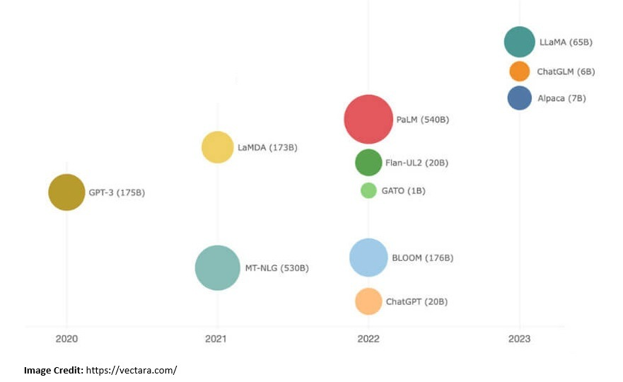

        [OpenAI](https://openai.com/)是另一个引领人工智能研究的组织，其LLMs如2018年发布的生成性预训练变形器（[GPT](https://paperswithcode.com/method/gpt)）。它在2019年进一步发布了GPT-2，2020年发布了GPT-3，2023年发布了GPT-4。2022年，它发布了[ChatGPT](https://openai.com/blog/chatgpt)，这是一个建立在GPT-3.5和GPT-4y之上的AI聊天机器人。

        其他突出的LLM包括HuggingFace在2023年发布的BigScience Large Open-science Open-access Multilingual（[BLOOM](https://huggingface.co/bigscience/bloom)），DeepMind在2022年发布的[Chinchilla AI](https://arxiv.org/abs/2203.15556)，以及Meta AI在2023年发布的Large Language Model Meta AI（[LLaMA](https://arxiv.org/abs/2302.13971)）。

    2. LLMs的潜在应用

        今天我们可以想象的LLMs的应用相当多样化。LLMs的广泛用例之一是生成性的。在这里，主要目标是根据用户的一个或多个提示来生成内容。我们能想到的LLMs的生成性应用有几个。例如，对话式聊天机器人、代码助手，甚至是艺术灵感!

        LLMs的另一个关键用例是在搜索领域。LLMs有能力颠覆基于关键词算法的传统搜索产品。基于LLMs的搜索技术可以更好地理解语言并找到更多相关的结果。此外，搜索引擎正在通过将多个LLM串联起来，扩展到问题的回答。

        LLMs的其他可能用例包括抽象概括、机器翻译、文档的聚类和分类、语音识别和光学字符识别。当然，这还远远不是LLM可能的应用的完整清单。这个清单可能是无穷无尽的，而且随着LLMs变得越来越大、越来越好，这个清单也一定会越来越完善！

    3. LLMs的局限性和挑战

        在过去的几十年里，研究人员在开发LLM方面取得了重大进展，特别是自从引入transformers以来。然而，仍然存在着一些挑战。首先，创建一个LLM的成本仍然相当高。今天，一个典型的LLM有数十亿的参数，并且是在数万亿的令牌上训练的。训练和操作这些模型是非常昂贵的。

        LLM 通常是在广泛的数据集（可能是网络规模的数据集）上进行训练的。这往往过于通用，可能会遗漏特定领域的知识。因此，对于搜索或生成任务而言，用户会发现 LLM 的输出结果缺乏个性。与此同时，如何消除偏见并控制 LLM 的攻击性或无意义输出仍然是一项挑战。

        此外，重要的是要明白，法律硕士不可能做所有的事情，至少现在是这样！法律硕士一般没有时间概念，也没有空间感！LLMs一般没有时间概念，也没有空间意义上的基础。因此，LLMs很难完成那些需要时间或空间推理的任务。此外，LLMs在数学推理方面也不是很好。然而，LLMs每天都在变得更好!

6. 总结

    在本教程中，我们讨论了语言模型和LLMs。我们回顾了创建LLM背后的基本概念和构建模块。此外，我们还讨论了创建LLM的普遍架构以及当今一些流行的LLM。
