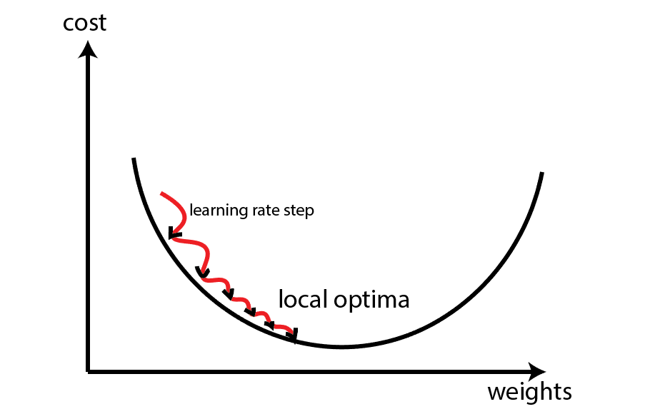
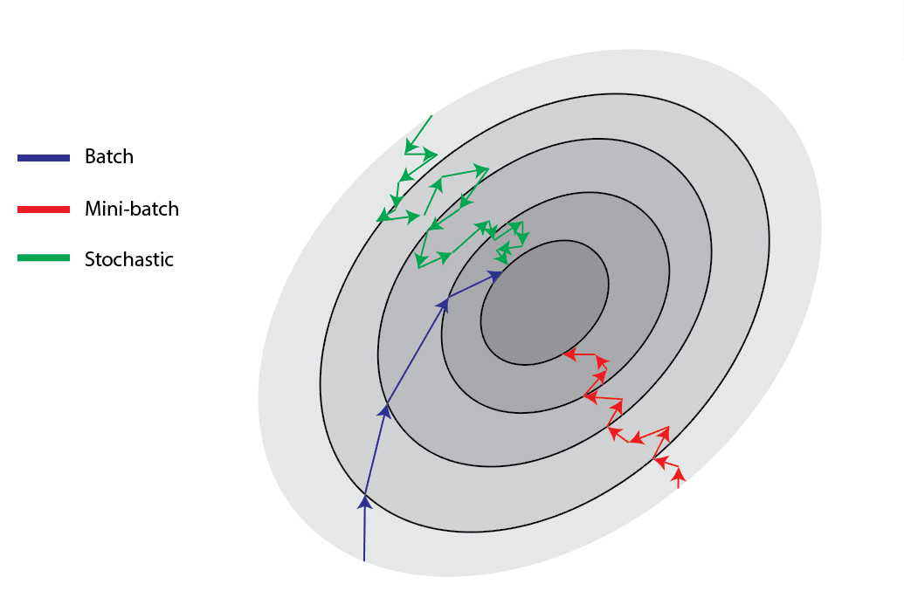
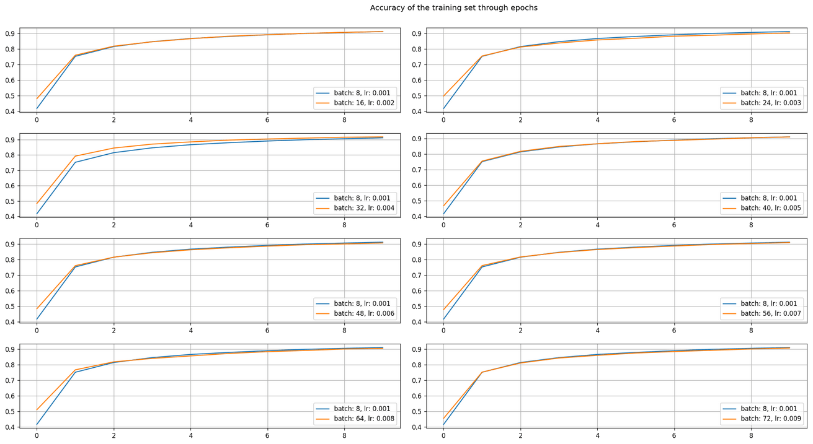

# 学习率与批量大小的关系

[深度学习](https://www.baeldung.com/cs/category/ai/deep-learning) [机器学习](https://www.baeldung.com/cs/category/ai/ml)

[训练](https://www.baeldung.com/cs/tag/training)

1. 简介

    在本教程中，我们将讨论学习率和批量大小这两个在模型训练前需要设置的神经网络超参数。我们将介绍这两个参数，然后分析如何相应地调整它们。

    此外，我们还将了解两者之间的相互影响，以及在此方面的研究成果。

2. 学习率

    学习率是我们在机器学习和统计学中使用的一个术语。简而言之，它指的是算法收敛到解决方案的速度。学习率是训练神经网络最重要的超参数之一。因此，将其值设置得尽可能接近最优值是非常重要的。

    通常，当我们需要训练神经网络模型时，需要使用一些基于梯度下降算法的优化技术。在计算出损失函数相对于权重的梯度后，该梯度的方向就是局部最优值。我们使用学习率超参数来调整权重，使其朝着这个方向发展，从而优化模型。

    学习率表示梯度下降到局部最优值的步长：

    

    因此，如果学习率过低，梯度下降将需要更多时间才能达到最优。相反，如果学习率过大，梯度下降可能会开始发散，永远无法达到最优解。

    此外，学习率不一定要有一个固定值。例如，我们可以定义一条规则，规定学习率会随着训练历时的增加而降低。此外，一些自适应学习率优化方法会在训练过程中修改学习率。关于学习率的选择和梯度下降方法，我们可以在[本文](https://www.baeldung.com/cs/ml-learning-rate)中找到更多细节。

3. 批量大小

    批量大小定义了我们在训练神经网络的一个历元中使用的样本数量。就批次大小而言，梯度下降有三种类型：

    - 批量梯度下降--在一个 epoch 中使用训练集中的所有样本。
    - 随机梯度下降--在一个历时中只使用训练集中的一个随机样本。
    - 小批量梯度下降--在一个 epoch 中使用训练集中的预定数量样本。

    

    小批量梯度下降法是最常见的，根据经验显示效果最好。举例来说，我们假设训练规模为 1000 个样本，批次规模为 100 个。神经网络会在第一个历元取前 100 个样本，并进行前向和后向传播。之后，它将在第二个历元中获取随后的 100 个样本，并重复这一过程。

    总之，网络将在预定义的epoch次数内进行训练，或直到不满足所需的条件为止。

    本文将解释迷你批次梯度下降比单一批次下降更好的原因。

    批次大小会影响一些指标，如整体训练时间、每个历元的训练时间、模型质量等。通常，我们选择的批次大小是 2 的幂次，范围在 16 到 512 之间。但一般来说，32 是一个经验法则，也是一个不错的初始选择。

4. 学习率与批次大小的关系

    问题在于学习率和批次大小之间是否存在任何关系。如果我们增加或减少批量大小，是否需要改变学习率？首先，如果我们使用任何自适应梯度下降优化器，如 Adam、Adagrad 或其他优化器，在改变批量大小后就无需改变学习率。

    正因为如此，我们才会认为我们讨论的是经典的小批量梯度下降法。

    1. 理论观点

        在这个问题上有一些研究。一些作者建议，在将批量大小乘以 k 时，我们也应该将学习率乘以 $\sqrt{k}$，以保持梯度期望的方差不变。此外，更常见的是使用简单的线性缩放规则。这意味着当批量大小乘以 k 时，学习率也应乘以 k，而其他超参数保持不变。

        也就是说，作者尝试了不同的批量大小和学习率。利用线性缩放规则，他们获得了相同的准确率，并匹配了学习曲线。在 ImageNet 实验中，他们使用高达 8k 的批量大小实现了这种一致性。

        此外，他们还采用了渐进式热身，即在训练的前五个历元中以常数递增学习率。这种策略可以避免因学习率过高而造成的早期过拟合。

        在我们的示例中，我们尝试应用线性缩放规则。实验使用的是 MNIST 数据集和带有一个卷积层、剔除层和全连接层的简单 CNN。我们比较了 8 的批量大小和 0.001 的学习率，以及它们的乘法值，其中乘法是使用从 2 到 7 的整数进行的。结果证实，学习曲线非常匹配。

        

    2. 实践观点

        当大部分变量和数据集都近乎完美时，理论方法在理论实验中就能很好地发挥作用。但在实际任务中，情况通常会略有不同。首先，我们的目标并不是使用两组批量大小和学习率来匹配相同的准确率和学习曲线，而是取得尽可能好的结果。

        例如，如果我们增加批量大小，准确率就会提高，那么就没有必要为了达到之前的结果而修改学习率。另外，由于需要调整的超参数较多，我们不知道批量大小和学习率的初始值是否最优。

        通常在实践中，我们会将这两个超参数与其他参数一起调整。除此之外，独立设置这两个参数也很常见。例如，如果神经网络的训练速度太慢，我们可以增加批次大小，并监测结果的变化。此外，如果网络收敛太慢，我们也可以提高学习率。

5. 结论

    在本文中，我们简要介绍了批量大小和学习率这两个术语。我们介绍了这两个术语的一些理论背景。经验法则是将上述两个超参数线性增加。但更重要的是，我们要把重点放在神经网络的结果上，而不是批量大小和学习率之间的比例上。

    毕竟，我们的目标是获得尽可能好的结果。
