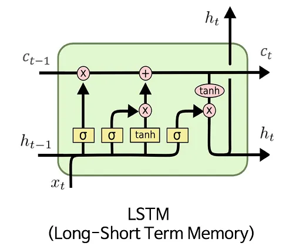

# 用 LSTM 防止梯度消失问题

[深度学习](https://www.baeldung.com/cs/category/ai/deep-learning)

[神经网络](https://www.baeldung.com/cs/tag/neural-networks) [训练](https://www.baeldung.com/cs/tag/training)

1. 引言

    深度学习的出现改变了人工智能的格局，给计算机视觉和自然语言处理等领域带来了革命性的变化。在训练深度神经网络时遇到的核心挑战中，梯度消失问题已成为一个关键挑战。这个问题严重影响了多层模型的收敛性和性能。

    梯度消失问题在递归神经网络（RNN）（一种用于处理连续数据的神经网络）中变得尤为突出。正如 "递归"一词所示，RNN 具有自我循环的连接。这样，它们就能保持一种隐藏状态，捕捉序列中先前时间步骤的洞察力。然而，这种架构设计也会导致梯度消失问题。

    在本教程中，我们将深入探讨梯度消失问题的概念。此外，我们还将探讨作为 RNN 变体的长短期记忆网络 (LSTM) 如何改善这一问题。

2. 回顾：什么是RNN？

    循环神经网络RNN是一种人工神经网络，旨在通过考虑输入数据的顺序和时间依赖性来处理顺序数据。与传统的前馈神经网络（信息从输入到输出的单向流动）相比，RNN 包含一个循环往复的 RNN 单元。这样，它们就能保持一个隐藏状态，以捕捉序列中先前时间步骤的信息。

    与从输入到输出的线性信息流的传统前馈神经网络不同，RNN 具有一个明显的特征：循环 RNN 单元。这种机制使其能够保留一个隐藏状态，有效地吸收序列中先前时刻的信息。

    在给定的时间步长 t 下，隐藏状态 h 的计算公式如下。

    隐藏状态：$h_t = tanh(w^{x}x_t+w^{h}h_{t-1}+b_h)$

    这里，$x_t$ 表示时间步长 t 时的输入，$w_x$ 和 $w_h$ 表示输入权重和隐藏状态权重，$b_h$ 表示偏置，$tanh$ 表示激活函数。

    此外，我们根据隐藏状态计算输出 $y_t$。

    输出：$y_t = w_{y}h_t+b_y$

    在整个训练过程中，权重会随着时间的推移通过反向传播进行更新。这一迭代过程包括梯度计算和随后的权重调整，所有这些都是为在数据序列上训练 RNN 而量身定制的。这种技术使 RNN 能够捕捉时间依赖性。不过，在处理长序列时，它也面临梯度消失和计算效率的挑战。

3. 梯度消失问题

    在深度神经网络中，梯度是权重调整的指标，以尽量缩小预测结果与实际结果之间的差距。然而，梯度往往会随着层数的增加而减弱，从而可能导致初始层的学习速度减慢甚至停止。

    这种现象就是所谓的梯度消失问题。在采用压扁输入值的激活函数的深度架构和网络中，这一难题变得更加突出。

    1. RNN中的梯度消失

        就 RNN 而言，梯度消失问题源于递归连接和梯度在不同时间步长中的传播。让我们考虑一个虚构的 RNN 单元，它在不同的时间步长内处理一系列输入，时间步长分别为 $t=1, t=2, ..., t=T$。

        - 在每一个时间步长 t，RNN 单元都会利用当前输入和上一个时间步长的隐藏状态来计算新的隐藏状态并产生输出。
        - 时间步长 t-1 时的隐藏状态会影响时间步长 t 时的隐藏状态。这种对前一时间步长的依赖性导致梯度传播通过一连串的递归连接进行。
        - 在时间反向传播的过程中，我们通过在各个时间步长之间迭代使用链式规则来计算梯度。这个迭代过程从最后的时间步长 T 开始，并反向进行。

        RNN 中出现梯度消失问题的原因是，随着梯度在时间中的反向传播，由于每个时间步中梯度的重复相乘，梯度可能变得非常小。

        如果初始化的 RNN 单元权重较小，或者序列较长，梯度就会减小到实际上为零的程度。因此，在训练过程中，序列中较早的时间步会接收到非常微弱的梯度信号。此外，它们相应的权重更新也很慢，甚至根本不会更新。这将导致重要信息的丢失和学习的缓慢收敛。

4. LSTM 如何改善梯度消失问题？

    [LSTM](https://www.baeldung.com/cs/nlp-encoder-decoder-models#3-lstm) 由 Sepp Hochreiter 和 Jürgen Schmidhuber 于 1997 年提出，旨在克服梯度消失问题。为此，LSTM 利用门控机制来控制信息流和梯度。这有助于防止梯度消失问题，并允许网络在更长的序列中学习和保留信息。

    下[图](https://commons.wikimedia.org/wiki/File:LSTM.png)显示了 LSTM 单元的结构：

    

    LSTM 包含三个门：输入门、遗忘门和输出门。这些门控制通过 LSTM 单元的信息流，使其能够决定记住什么、遗忘什么以及输出什么。此外，这些门允许 LSTM 通过时间控制梯度流，从而有效解决梯度消失问题。

    1. 遗忘门

        遗忘门决定从上一个隐藏状态和当前输入中遗忘哪些信息。它使用一个 sigmoid 激活函数，产生介于 0 和 1 之间的值，理想情况下表示通过单元状态的数据分数。

        此外，遗忘门还能让 LSTM 保留关键数据，放弃不必要的数据，确保梯度保持相关。

    2. 输入门和输出门

        与遗忘门相反，输入门确定哪些新细节应被添加到单元状态中。它包括两个部分：一个是用于选择更新单元值的 sigmoid 激活函数，另一个是用于为单元状态生成新候选值的 tanh 激活函数。

        同时，输出门定义了哪些数据应作为 LSTM 单元的当前输出。它处理更新的单元状态和当前的隐藏状态，从而产生输出。输出门通过完善单元状态内的数据来产生有意义的结果。这些门对于精确定位给定任务的重要数据、在扩展序列中保留重要信息以及解决梯度消失问题至关重要。

        输入和输出门都会将其结果与其他因素相乘。它们的性质确保，如果输出接近 1，梯度就会畅通无阻地通过，但如果输出接近 0，流量就会停止。这些门有助于选择哪些数据对当前任务至关重要。因此，它们有助于在较长的序列中只保留关键信息，从而缓解梯度消失问题。

    3. 存储单元状态

        结合输入门的结果和之前的单元状态，可以完善当前时间步的单元状态。这种存储单元状态可保存不同时间步长的数据，使网络能够捕捉到更长距离的依赖关系。由于采用了加法更新机制，LSTM 的记忆单元可确保梯度在长时间序列中保持一致。

        有了这些门机制，LSTM 可以更好地处理梯度消失问题。它们在理解长期序列和依赖关系的任务中表现出色。

5. LSTM 的局限性

    虽然长短期记忆（LSTM）网络能有效解决梯度消失问题并识别序列中的长期模式，但它们也面临着一系列挑战。

    1. 梯度爆炸

        尽管 LSTM 比传统的 RNN 更好地解决了梯度消失问题，但在某些情况下，它们仍然会出现梯度爆炸。当梯度在反向传播过程中变得非常大时，尤其是在输入序列很长或初始化网络权重很大的情况下，梯度爆炸就会发生。

    2. 有限的上下文信息

        与简单的 RNN 相比，LSTM 可以捕捉更长序列中的依赖关系，但它们的上下文窗口仍然有限。在处理超长序列时，LSTM 可能难以记住较早的信息，并用较新的输入替换较早的数据。当遗忘门变得过于重要时，就会出现这种情况。

    3. 复杂性和训练时间

        LSTM 具有门控机制和多个组件，比普通 RNN 更加复杂。因此，它们拥有的参数大约是基本 RNN 的四倍。这种复杂性会导致更长的训练时间，并需要更仔细的超参数调整。此外，由于深度架构的梯度消失，训练深度 LSTM 网络仍然具有挑战性。

    4. 门控机制敏感性

        LSTM 的性能取决于其门控机制的精确配置。不恰当的门权重设置或选择不当的超参数可能会降低模型的学习效率，从而引发梯度相关问题。

    5. 适应任务复杂性

        LSTM 能在多大程度上解决梯度消失问题并识别长程依赖关系，受任务复杂度、所选架构设计以及训练数据的大小和质量的影响。

        在实践中，我们经常会尝试使用不同的 LSTM 架构、初始化策略和训练技术，以在特定任务中获得最佳性能，同时缓解梯度消失问题。此外，基于变换器Transformer的新架构模型，如 GPT 系列，因其能够利用自我注意机制捕捉长序列中的依赖关系而广受欢迎。在某些情况下，这些新模型可以替代基于 LSTM 的解决方案。

6. 结论

    梯度消失问题一直是训练深度神经网络的障碍，因为梯度往往会随着层数的增加而减小。

    在本文中，我们解释了长短期记忆（LSTM）网络是如何在 RNN 中解决这一问题的。通过使用专门的门，如遗忘、输入和输出门，LSTM 可以有效调节梯度流。此外，它们还能使网络保留重要信息并识别长期模式。

    然而，LSTM 仍然面临着各种挑战，包括梯度爆炸、昂贵的训练过程以及在处理更复杂任务时受到的限制。
