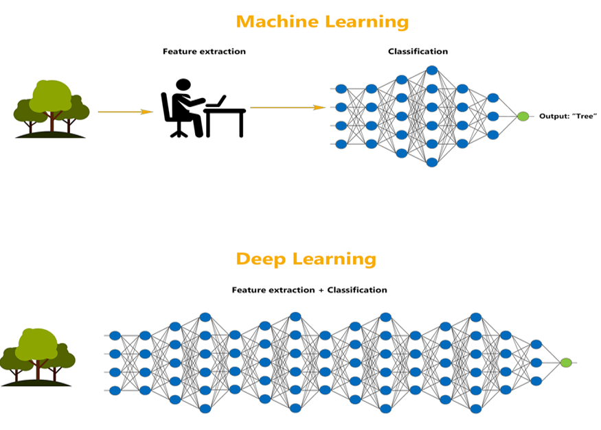

# 机器学习与深度学习

[深度学习](https://www.baeldung.com/cs/category/ai/deep-learning)

[神经网络](https://www.baeldung.com/cs/tag/neural-networks)

1. 简介

    在本教程中，我们将讨论机器学习和深度学习之间的现有区别。

2. 机器学习和深度学习简述

    机器学习是[人工智能](https://www.baeldung.com/cs/cognitive-computing-vs-ai)中的一个领域，其重点是教会计算机从示例（数据）中学习，并根据学习结果做出决策或预测。

    [机器学习](https://www.baeldung.com/cs/ml-fundamentals)使用统计模型和算法从示例（数据）中学习。机器学习应用于语音识别、图像分割和推荐系统等多个领域。

    另一方面，深度学习是机器学习的一个子领域，它使用具有许多隐藏层的[人工神经网络](https://www.baeldung.com/cs/normalizing-inputs-artificial-neural-network)。

3. 机器学习与深度学习的区别

    关于图像和语音识别等复杂任务的性能，深度学习通常优于标准机器学习算法，因为它能够自动从数据中学习特征。

    不过，这样做的代价是需要更长的训练时间和更大的数据集。机器学习算法可以很好地完成更简单的任务，而深度学习对这些任务来说可能是矫枉过正。

    机器学习算法需要人工[特征工程](https://www.baeldung.com/cs/ml-feature-importance)，即从数据中选择和提取相关特征。相比之下，深度学习不需要特征工程，因为它可以自动从数据中学习特征：

    
    在这里，深度学习和机器学习之间的选择取决于具体任务和可用资源，包括数据、时间和计算能力。

    1. 可解释性

        与深度学习算法相比，标准机器学习算法通常更具可解释性。

        这意味着更容易理解模型是如何产生输出的。深度学习模型虽然功能更强大，但却被视为黑盒子，因为很难知道它们是如何得出结论的。

    2. 什么时候是深度神经网络？

        深度网络与标准网络的主要区别在于层数。深度网络在输入层和输出层之间有多个隐藏层。

        非深度网络更简单，更容易训练，而深度网络通过学习输入数据的复杂表征，可以在解决复杂问题时实现更高的准确性。

4. 总表

    以下是深度学习与其他机器学习的主要区别：

    | 视角   | 非深度机器学习                                | 深度学习                      |
    |------|----------------------------------------|---------------------------|
    | 特征工程 | 准备分析数据的重要步骤                            | 深度网络从原始数据中自动学习特征          |
    | 模型   | 标准机器学习可使用各种模型                          | 神经网络                      |
    | 性能   | 如果手头的任务不是太复杂，我们不需要深度网络，那么标准机器学习就会非常准确。 | 通常更准确，尤其是在处理图像和语音识别等复杂任务时 |
    | 硬件要求 | 可在标准硬件（CPU）上运行                         | 需要更强大的硬件（如 GPU）来训练神经网络    |

    总之，机器学习更简单，需要的数据和硬件更少，而深度学习更复杂，但可以实现更高的精度，尤其是在复杂任务中。

5. 结论

    在本文中，我们讨论了机器学习和深度学习的区别。总之，机器学习和深度学习各有优缺点。机器学习是一种更简单的方法，需要的数据和硬件更少，因此更适合小型项目。

    另一方面，深度学习更为复杂，但可以实现更高的准确性，尤其是在复杂任务中。最终，机器学习和深度学习之间的选择取决于项目的具体需求和目标。
