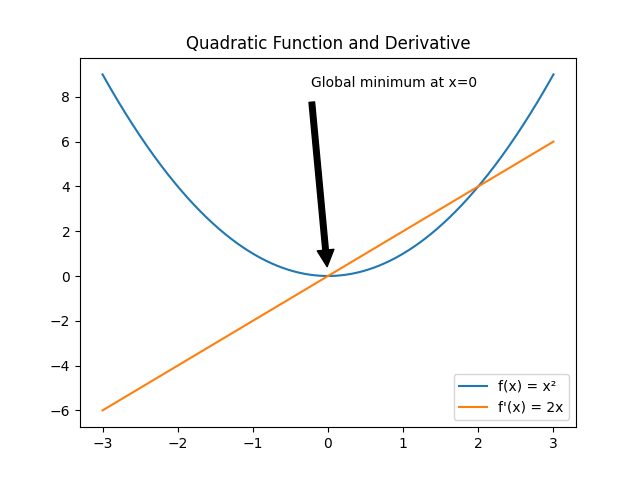
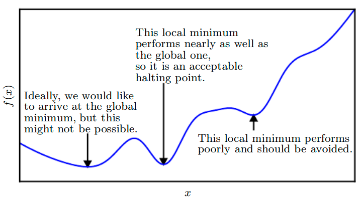
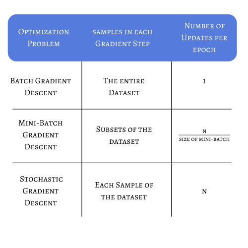
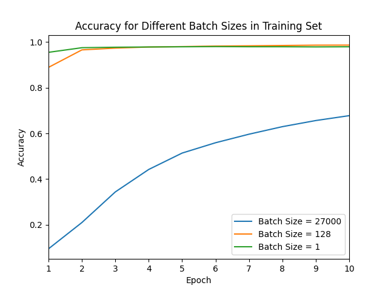
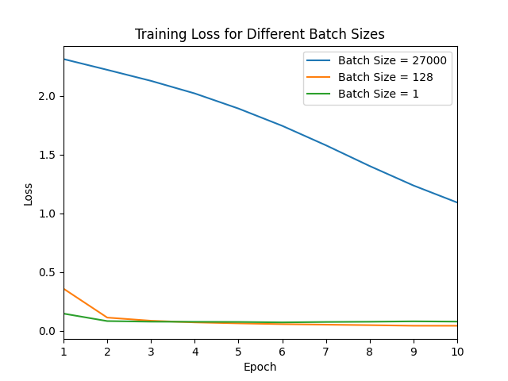

# 为什么迷你批量比包含所有训练数据的单一"批量"更好？

[深度学习](https://www.baeldung.com/cs/category/ai/deep-learning) [机器学习](https://www.baeldung.com/cs/category/ai/ml)

[训练](https://www.baeldung.com/cs/tag/training)

1. 引言

    在训练机器学习（ML）模型时，我们应该定义一组超参数，以便在测试集中获得高准确率。

    这些参数包括学习率、权重衰减、层数和批量大小等。

    在本教程中，我们将讨论使用整个数据集作为批次更新模型与使用迷你批次更新模型之间的主要区别。

    最后，我们将说明如何使用 [TensorFlow](https://www.baeldung.com/cs/ml-open-source-libraries) 实现不同的梯度下降方法。不过，首先让我们了解一下何时、如何以及为何要更新模型的基本知识。

2. 梯度下降计算

    通常，深度学习问题可以看作是一个优化问题。我们的目标是最大化或最小化某些函数。最小化问题在 ML 中更为常见，我们将这个函数称为损失函数。

    如何才能达到损失函数的最小点呢？

    最常见的方法是使用梯度下降法。我们使用函数在某一点上的导数来检查函数值的趋势是增加还是减少。

    我们可以很容易地看到梯度下降法在二次函数中的应用：

    

    假设我们想找到 f(x) 的最小值。

    我们随机从 x=-2 点开始，计算这个值的导数：

    (1) \[\begin{equation*} f'(-2)=2 \times (-2) = -4 \end{equation*}\]

    从这一点出发，我们分析结果的信号。在这种情况下，导数是负的，所以我们应该向正方向迈出相反的一步。

    如果我们迈出等于 3 的一步，就会到达 x=1 点，然后再次计算导数：

    (2) \[\begin{equation*} f'(1)=2 \times (1) = 2 \end{equation*}\]

    现在导数大于零，所以我们向负方向走一步。如果我们迈出的步子足够大，就会达到全局最小值 x=0。

    如果步子迈得太大，可能永远也找不到最小值，因为我们会从一个点跳到另一个点。反之，如果我们迈出的步子太小，这个过程就会耗费大量时间。

    学习率将决定我们用来更新模型值的步长。

3. 批次大小

    我们可以在梯度下降过程中迈出一步，以不同的方式更新参数。所选择的方法将极大地决定模型的性能和收敛性。

    在继续之前，我们有必要强调一下epoch和batch的概念。

    当模型看到整个训练集后，我们就说一个历元结束了。

    在训练过程中，我们可以在模型计算了整个训练集的一个子集后更新权重和梯度。我们称之为子集批处理或迷你批处理。

    在训练神经网络时，我们最常遇到的一个问题是，损失函数可能会出现一些局部极小值，从而误导我们认为模型达到了最佳状态：

    

    我们将讨论不同的批次大小会如何影响训练过程，有时会防止我们的模型陷入局部最小值或平坦区域，即所谓的鞍点。

    1. 批量梯度下降

        批量梯度下降或梯度下降（GD）是最直接的方法。在这种方法中，我们只有在使用整个数据集进行训练后才会计算梯度。

        这种策略的一个主要问题是，如果我们的训练集有成千上万的样本，我们将需要大量的内存。这是因为我们需要累积每个样本的误差，直到对整个数据集进行评估。然后更新参数，并终止梯度下降迭代。

        通过这种优化策略，我们只需更新模型几次。因此，损失函数将更加稳定，噪音更小。不过，这也有一个缺点。对于有多个局部极小值的非凸问题，我们可能会过早地陷入鞍点，并在参数与预期性能相差甚远的情况下完成训练。

    2. 小批量梯度下降

        在迷你批次梯度下降法中，我们使用数据集的一个子集来完成学习过程的另一个步骤。因此，迷你批次的值可以大于 1，也可以小于整个训练集的大小。

        现在，我们无需等待模型计算整个数据集，而是可以更频繁地更新其参数。这就降低了陷入局部最小值的风险，因为每次迭代都会考虑不同的批次，从而实现稳健的收敛。

        虽然我们不需要将整个数据集的误差存储在内存中，但我们仍然需要积累样本误差，以便在评估完所有迷你批次后更新梯度。

    3. 随机梯度下降

        当我们使用随机梯度下降算法（SGD）时，参数会在训练阶段对数据集的每个样本进行评估后更新。SGD 可以看作是一个规模为 1 的迷你批量 GD。

        由于一个样本指示的方向可能与其他样本指示的方向不同，因此这种方法存在很大的噪声。问题是，我们的模型很容易跳来跳去，在所有的历时中都有不同的方差。

        在某些 ML 应用中，我们会遇到非凸问题的复杂神经网络；在这种情况下，我们需要探索损失函数的空间。

        这样，我们就能摆脱局部最优的困境，更有可能找到全局最优。

        SGD 的主要优势之一是，由于参数会不断更新，因此可以及早显示模型的性能。

        然而，复杂度高、训练数据集大的模型需要大量时间才能收敛，这就使 SGD 成为一种非常昂贵的优化策略。

4. TensorFlow 示例

    在本节中，我们将用一个真实世界的例子来说明不同批次大小对神经网络训练的影响。

    在了解示例之前，我们先来总结一下每种策略的主要区别，并考虑一个有 N 个样本的数据集：

    

    在[本例](https://keras.io/examples/vision/mnist_convnet/)中，我们将使用卷积神经网络的 TensorFlow 模型来识别手写数字。我们的训练集包含 54000 个 24×24 图像样本。用于调整参数的验证集有 6000 个样本，用于测试最终准确性的测试集有 10000 个样本。

    我们将使用三种不同的批次规模。在第一种情况下，我们将使用等于 27000 的批次大小。理想情况下，我们应该使用 54000 的批次大小来模拟批次大小，但由于内存限制，我们将限制这一数值。

    对于小批量情况，我们每次迭代使用 128 张图像。最后，对于 SGD，我们将定义一个大小等于 1 的批次。

    要重现这个示例，只需在调用 fit 函数时调整批次大小变量即可：

    `model.fit(x_train, y_train, batch_size=batch_size, epochs=epochs, validation_split=0.1)`

    我们可以很容易地看到，在使用的数据集上，SGD 和迷你批次梯度下降算法的性能优于批次梯度下降算法：

    

    

    当批次规模为 27000 时，我们在 10 个 epoch 之后获得了最大的损失和最小的准确率。这说明了使用半个数据集只计算一次权重更新的效果。

    从准确率曲线上我们可以看到，在两个历时之后，我们的模型已经接近迷你批处理和 SGD 的最高准确率。这是因为用于训练的样本虽然不相等，但却非常相似。

    如果同时考虑到时间限制，这种冗余会使批量 GD 表现不佳。

5. 结论

    我们在训练中应该使用哪种批次大小并没有严格的规定。这是一个我们应该调整的超参数。

    我们可以根据一般准则来调整它，以获得令人满意的模型。

    如果我们事先知道我们的问题涉及到一个凸损失函数，那么批量梯度下降可能是一个很好的选择。这也很有帮助，因为[有时](https://www.deeplearningbook.org/contents/ml.html)它能在合理的时间内找到最小点。

    相反，如果我们的数据集有数百万个样本，而我们的损失函数很可能会有很多局部最小值，那么我们就应该考虑使用迷你批次或 SGD 优化。

    这样，我们就不用等待成千上万的样本进行评估，只需经过几百次迭代，就能知道我们的模型表现如何。
