# SVM中精度与支持向量数量之间的权衡

[深度学习](https://www.baeldung.com/cs/category/ai/deep-learning) [机器学习](https://www.baeldung.com/cs/category/ai/ml)

[SVM](https://www.baeldung.com/cs/tag/svm)

1. 简介

    在本教程中，我们将研究支持向量数量与支持向量分类器性能之间的关系。

    首先，我们将介绍支持向量机及其在分类问题中的决策边界。

    然后，我们将研究分类器准确度水平的变化与正则化参数值和支持向量数量的关系。我们将在一个与机器学习典型数据集相关的具体案例中进行研究。

    在本教程的最后，我们将了解如何在支持向量分类器的准确性和支持向量数量之间进行权衡的启发式方法。

2. 支持向量机和分类问题

    1. 支持向量机和支持向量

        在本网站的其他教程中，我们曾研究过[支持向量机](https://www.baeldung.com/cs/ml-support-vector-machines)的一般理论基础。我们还将支持向量机与神经网络进行了[比较](https://www.baeldung.com/cs/svm-vs-neural-network)，SVM 在某种程度上与神经网络类似。最后，我们还研究了这两种模型在执行某些特定机器学习任务时的[优缺点](https://www.baeldung.com/cs/ml-ann-vs-svm)。

        如果需要复习，我们可以参考这些教程。在这里，我们想把重点放在优化支持向量机的分类任务上。优化支持向量机的问题与确定其超参数的问题相对应，即在理想情况下，同时使分类的准确性最大化和支持向量的数量最小化。

        由于支持向量机是根据两个超参数（内核类型和所谓的正则化参数）来配置的，因此我们需要一种技术，当内核改变和正则化参数 C 变化时，能让我们比较精度和支持向量数量之间的权衡。因此，我们的问题在于确定一种研究四维系统的方法，我们称之为支持向量机：

        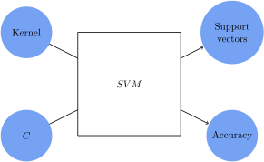

        在这个模型中，我们可以把任务看作是选择一个核和一个正则化参数 C，在给定特定数据集的情况下，使我们获得最高的准确率，同时保持支持向量的数量。

    2. 支持向量有哪些功能？

        我们知道，支持向量机可以保证找到将数据分门别类的决策边界。当然，这需要选择适当的内核。

        之所以会出现这种情况，是因为 SVM 学会了将其特征空间中最接近的观察结果分离出来。那么问题来了：我们如何才能在数据集上获得尽可能高的准确率，同时又将支持向量的数量降到最低？

    3. 判定边界的形状

        看待这个问题的一种方法是将 SVM 选择的支持向量视为模型对判定边界形状所做的某种假设。这些假设被认为比那些与数据的一般分布相对应的假设更具约束力或更具体。

        让我们举例说明这一概念。在考虑一个理论问题时，推理该问题所涉及的最简单或边缘情况总是有益的。我们可以从一个包含两个观测值和两个类别的数据集开始：

        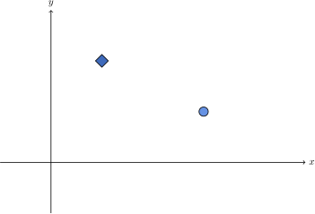

        这个问题是线性可分的。因此，具有线性内核的 SVM 将学习能最大程度分离这些观测值的超平面，在本例中，超平面是一条直线：

        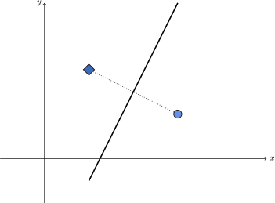

    4. 当观测值数量增加时

        在本例中，SVM 将 100% 的观测值用作支持向量。这样，无论我们使用哪种指标来评估，它都能达到最高准确度。然而，支持向量的数量不能低于 2，因此这个数量似乎没有问题。

        不过，随着观察次数的增加，我们可能会发现，严格区分两个类别的直线可能不再适合我们：

        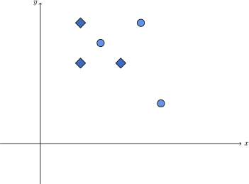

        这是因为，除非问题保持其线性可分性，否则如果观察结果的数量并非微不足道，我们通常需要接受更复杂的决策边界：

        

        如果不这样做，我们就会失去准确性。如果接受，我们就需要依赖更多的支持向量。无论如何，我们都必须在两者之间进行权衡。

3. 一个具体例子

    1. 初步数据分析

        现在，我们可以研究 SVM 的具体实现，以便为机器学习的常用数据集建模。在此过程中，我们将观察并注意到 SVM 所选支持向量的数量是如何影响决策边界的准确性和形状的。

        我们在此讨论的实验基于虹膜数据集，它是机器学习的标准数据集：

        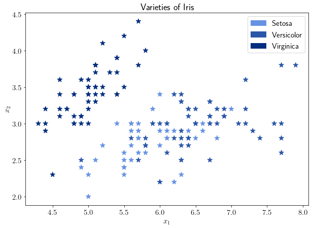

        如果我们从与每个观测值相关的四个特征中选取两个，我们就能直观地发现其中一个类别位于特征空间中自己的区域，而另外两个则不在。这充分说明，除非我们选择软边距和正则化参数，以便选择足够数量的支持向量，否则 SVM 的线性核可能不是最合适的核。

        那么问题来了：对于这个特定的数据集，我们该如何选择正则化参数，才能在支持向量的数量和分类器的准确性之间取得最佳平衡呢？

    2. 线性核

        这类问题可以通过研究分类器的准确性和支持向量的数量在正则化参数稍作修改后的变化方式来解决。首先，让我们考虑正则化参数的标准值；在本例中，C=1：

        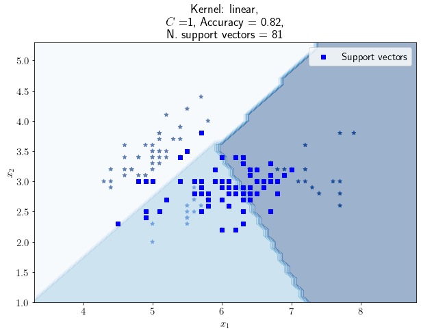

        从这里开始，作为准确度指标，我们将始终使用 [Jaccard 分数](https://scikit-learn.org/stable/modules/generated/sklearn.metrics.jaccard_score.html#sklearn.metrics.jaccard_score)。如果正则化参数为 1，则 SVM 使用 81 个支持向量对鸢尾花数据集的花朵进行分类，准确率为 0.82。

    3. 改变正则化参数

        现在，如果我们将 C 稍微减小，支持向量的数量就会增加。这是因为正则化参数与正则化过程的强度成反比。事实上，如果我们将 C 设为 0.1，就会得到这样的结果：

        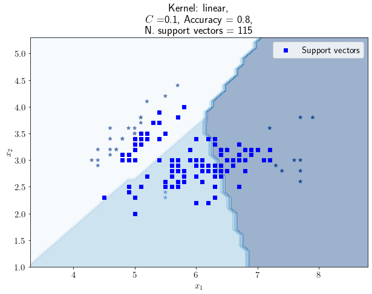

        支持向量的数量增加到了 115 个，但准确率却下降到了 0.80。这是因为，如前所述，有两个类别占据了特征空间的重叠区域。随着支持向量数量的增加，图片右下方的判定边界会稍微向左移动，因此会有更多的观察结果被错误分类。

        如果我们反向推理，也可以预期随着参数 C 的增加，支持向量的数量会减少。例如，当 C 值等于 10 时，我们会得到这样的图形：

        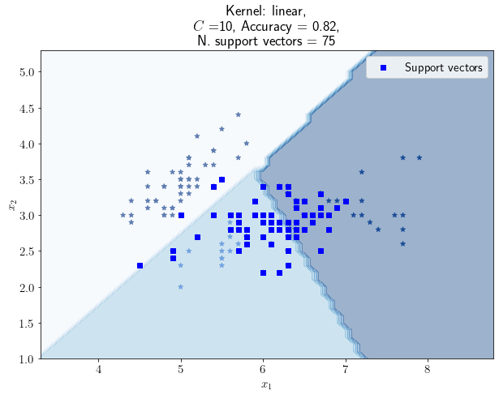

        在这种情况下，支持向量的数量为 75，是我们迄今为止记录到的最少的。不过，准确率为 0.82，并不比 C=1 时的准确率高。我们或许有兴趣看看，通过逐步减少 C 值，我们是否能获得更高的准确率值或更低的支持向量数值，或者两者兼而有之。一般来说，我们会期望随着支持向量数量的增加，准确率也会随之提高，但情况并非总是如此。

    4. 精度与支持向量数量

        在此过程中，我们可以研究 C 值、识别出的支持向量数量和准确率得分之间的关系。

        在这次实验中，我们测试了 C 值在区间 $[0.01, 10)$ 内的所有值，采样分辨率为 0.01。这就是结果图：

        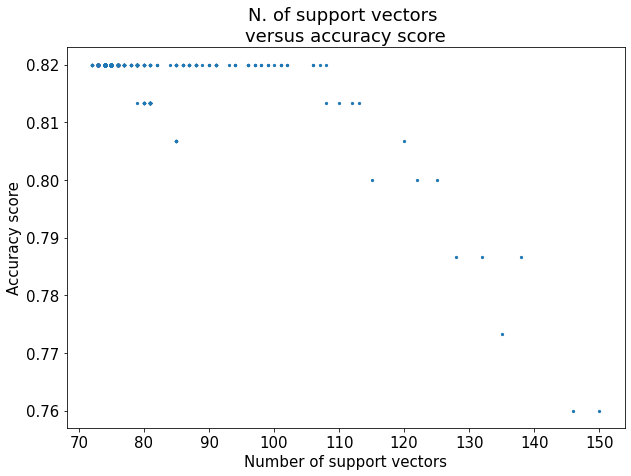

        请注意，准确度得分从未超过某个特定值，在本例中为 0.82。这是因为问题本质上是非线性可分的。因此，我们需要接受这样的观点，即某些观察结果总是会被具有线性核的 SVM 错误分类。

        不过，我们也要注意，增加支持向量的数量并不一定会提高分类器的性能。事实上，我们所认为的支持向量数量与准确率之间的权衡似乎并不一定适用于这种特殊情况。如果支持向量的数量已经超过某个临界值，在本例中大约为 110 个，那么选择额外的支持向量所带来的边际收益就会明显递减。

    5. 非线性核

        我们认为，随着支持向量数量的增加，该问题的准确率会降低，这与问题本身的非线性可分性有关，因此，使用具有非线性核的 SVM 并观察其准确率随着 C 的变化会发生什么变化是有意义的。下面是 C=1 时的图：

        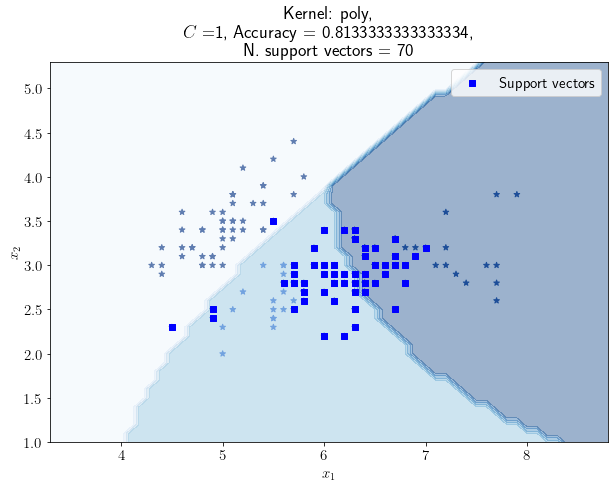

        正如我们之前所做的那样，我们可以上下移动 C 的值，并跟踪相应的准确率得分和支持向量的数量。为了简单起见，我们不会报告任何其他个案。以下是 C 值在 $[0.01, 10)$ 范围内的所有训练结果，分辨率为 0.01：

        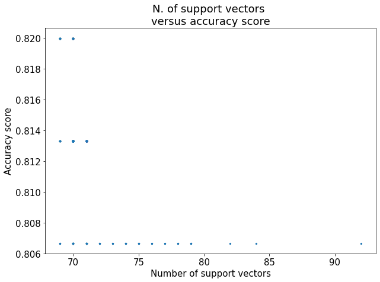

        从图中可以看出，多项式 SVM 的准确率最低值高于线性 SVM 的最低值。这表明，对于这一特定问题，非线性 SVM 的表现略好于我们的预期。

    6. 支持向量数量最少时的准确率

        不过，我们也可以注意到，增加多项式 SVM 的支持向量数会比线性 SVM 更快导致准确率下降。特别是，我们可以看到，如果支持向量的数量超过 70 个，准确率就会明显下降，这比我们在前一种情况下观察到的 110 个低得多。

        由于只有在支持向量数为 69 或 70 时才能观察到最高的准确率分数 0.82，因此我们可以转而研究当支持向量数为 69 或 70 时，正则化参数 C 与相关准确率之间的关系：

        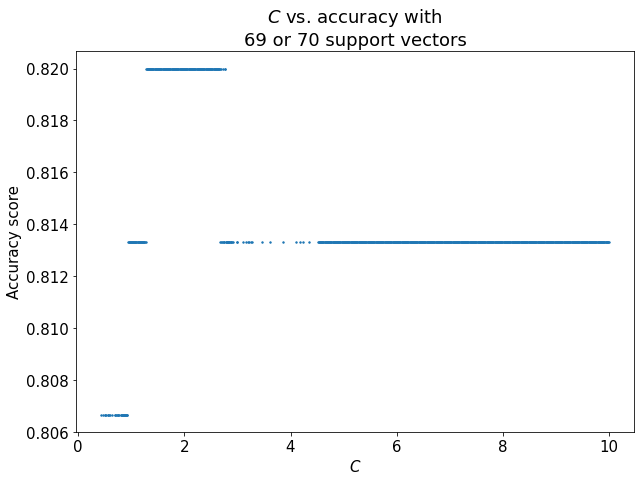

        我们可以看到，尽管支持向量的数量不变，但 $C\cong2$ 存在一个甜蜜点，在这个甜蜜点上，准确率是最大的。 这就是我们需要的所有信息，以便决定分类器的准确性和支持向量数量之间的最佳权衡。

    7. 那么，采用哪种核和哪种正则化？

        从我们在这里所做的考虑来看，使用非线性内核来解决这个特定问题是合理的。这是因为，如果我们比较线性内核和非线性内核的准确率与支持向量数量的分布，非线性内核通常更准确，使用的支持向量也更少：

        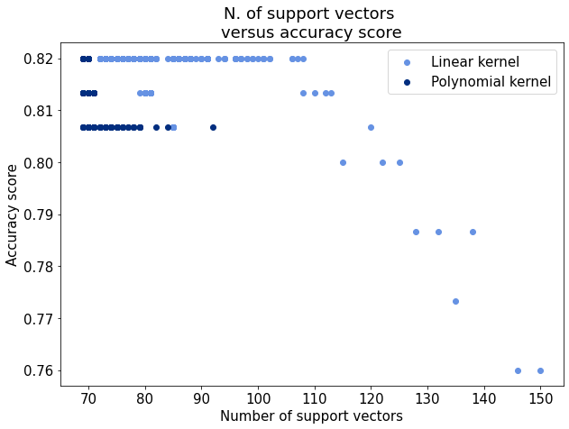

        选择核类型后，我们还可以决定正则化参数的最佳值。在上一节中，我们看到对于多项式核来说，在 C 值约为 2 的情况下，精确度最大，支持向量数最小。

    8. 其他数据集如何？

        我们在此讨论的方法并不是针对这一特定问题的。相反，它属于机器学习启发式方法的一般范畴。当我们面临优化机器学习模型超参数的问题时，了解启发式方法的集合非常重要。

        在这个具体案例中，我们通过手动测试和评估模型参数的可能取值来解决这个问题。不过，在更广泛的情况下，我们可能希望采用自动方法来搜索模型的超参数配置，例如应用网格搜索。

        然后，我们手动评估了准确率得分和模型大小的哪种组合能满足我们的需求。我们很幸运地发现，在某些特定配置下，准确率最大化和大小最小化是可能的。然而，情况并非总是如此，因此建议谨慎行事。

4. 结论

    在本文中，我们研究了支持向量数量与支持向量分类器性能之间的关系。

    我们初步讨论了支持向量在决定决策边界形状方面的作用。我们还引入了一个观点，即准确率的提高和支持向量数量的减少可以相互转换。

    最后，我们将前面的考虑应用于研究 SVM 分类器在一个著名的机器学习数据集上的表现。
