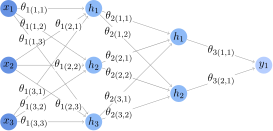
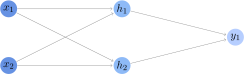
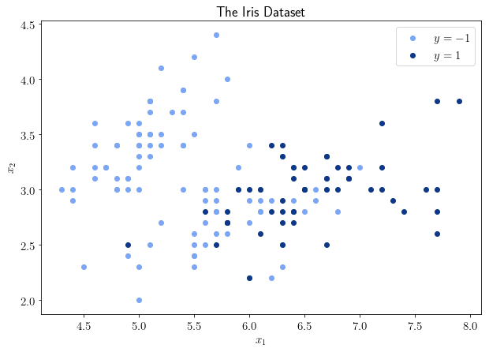
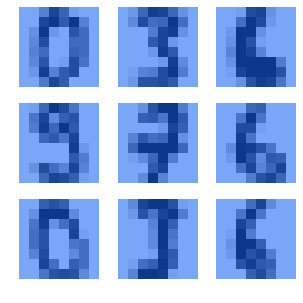

# 神经网络与 SVM 的优劣势对比

[深度学习](https://www.baeldung.com/cs/category/ai/deep-learning) [机器学习](https://www.baeldung.com/cs/category/ai/ml)

[神经网络](https://www.baeldung.com/cs/tag/neural-networks) [SVM](https://www.baeldung.com/cs/tag/svm)

1. 概述

    在本教程中，我们将研究人工神经网络（ANN）与支持向量机（SVM）相比的优缺点。

    首先，我们将快速了解它们的结构。然后，我们将根据理论找出它们的优缺点。

    最后，我们将针对相同的基准数据集测试神经网络模型和支持向量机。

    本教程结束时，我们就会知道为什么要使用神经网络而不是支持向量机，反之亦然。

2. 神经网络和支持向量机

    1. 它们不能完全互换

        在关于[支持向量机和神经网络](https://www.baeldung.com/cs/svm-vs-neural-network)的区别的文章中，我们讨论了这两种机器学习模型的架构是如何构建的。在这里，我们将重点讨论这两种模型在解决具体机器学习任务时的具体优缺点的识别和测试。

        一般来说，在有关机器学习的文献中，[前馈神经网络](https://www.baeldung.com/cs/ml-linear-activation-functions#structure-of-feed-forward-neural-networks)和[支持向量机](https://www.baeldung.com/cs/ml-support-vector-machines)几乎可以互换使用。不过，在更高级的层面上，我们可以说确实存在一些重要的差异。

        这是因为这两种架构只有在有限的情况下才能完全对应，尤其是在我们讨论[线性SVM](https://www.baeldung.com/cs/ml-support-vector-machines#1-linear-svms-for-linearly-separable-problems)时。在其他情况下，对于[非线性SVM](https://www.baeldung.com/cs/ml-support-vector-machines#non-linear-svms)和ANN而言，随着问题复杂性的增加，差异也会变得越来越大。因此，熟练的数据科学家应该知道应该选择哪种模型，以便从机器学习系统中获得额外的性能。

    2. 神经网络的简短定义

        前馈神经网络是一个参数模型，由 n 个权重向量 $\Theta = \{\theta_1, \theta_2, ..., \theta_n\}$、m 个[激活函数](https://www.baeldung.com/cs/ml-linear-activation-functions) $F = \{f_1, f_2, ..., f_m\}$ 和一个输入向量 x 组成：

        \[y = f_m (\theta_n \cdot f_{m-1} ( \theta_{n-1} \cdot ...\cdot\ f_2 (\theta_2 \cdot f_1 (\theta_1 \cdot x)\ ...\ )\]

        输入向量 x 也是神经网络输入层的名称。包含激活函数 $f_m$ 及其相关参数 $\theta_k$ 的对，在 $1 \leq k < m$ 的情况下，取而代之的是[隐藏层](https://www.baeldung.com/cs/neural-networks-hidden-layers-criteria)的名称。最后，最后一对$(f_m, \theta_n)$是该模型的输出层。

        我们可以用有[向加权图](https://www.baeldung.com/cs/graphs-directed-vs-undirected-graph#directed-graphs)来[表示神经网络](https://www.baeldung.com/cs/latex-drawing-graphs#neuralnetwork)的图：

        

    3. SVM 的简短定义

        支持向量机是一种非参数机器学习模型，由[核函数](https://www.baeldung.com/cs/ml-support-vector-machines#2-non-linear-kernels-for-svms)和决策超平面组成。n 维空间中的超平面是由一组参数加上一个偏置项定义的，偏置项与该空间中任何向量的每个分量的系数相对应。

        如果在维数为 $n = |x| + |y|$ 的向量空间（对应于特征加标签空间）中不存在决策超平面，SVM 会将所有观测值投射到一个新的向量空间 $\mathbb{R}^m \leftarrow m > n$，并在那里寻找合适的决策超平面。如果那里也没有超平面，它就会不断增加 $\mathbb{R}^m$ 的维度，直到找到为止。

        从这个意义上说，SVM 保证了最终的收敛性，因此也保证了它能找出问题的某些解决方案。不过，由于无法保证解具有一定的维度，这使得 SVM 成为了一种非参数模型。

3. 人工智能网络的理论优缺点

    1. 理论优势

        我们可以先验地找出一些优缺点，总的来说，与 SVM 相比，ANN 的优缺点应与 SVM 的优缺点相一致，无论它们所执行任务的具体性质如何。

        首先，我们可以先验地限制网络的规模和层数。这意味着，我们可以通过对网络规模任意施加一定的限制，帮助解决机器学习模型的[维度诅咒](https://www.baeldung.com/cs/ml-relu-dropout-layers#the-curse-of-dimensionality-in-cnns)问题。

        具有非线性内核的 SVM 无法做到这一点。相反，它们的参数数量会随着所采用的支持向量数量的增加而线性增加。在某些情况下，尤其是当我们处理文本数据时，SVM 最终可能会使用数千个支持向量。

        第二个优势是神经网络在训练后能够快速进行预测。这是因为神经网络只需计算与层数相当的权重矩阵乘法和激活函数。矩阵乘法是[并行化](https://cse.buffalo.edu/faculty/miller/Courses/CSE633/Ortega-Fall-2012-CSE633.pdf)的典型任务，因此可以快速计算。

    2. 理论缺点

        不过，与 SVM 相比，ANN 也有理论上的缺点。第一个缺点是神经网络的训练时间较长。这是因为 SVM 的第一个决策超平面保证位于属于不同类别的支持向量之间。而神经网络不提供这种保证，而是随机定位初始决策函数。

        第二个缺点是神经网络无法保证收敛。通过选择适当的超参数，神经网络可以接近目标函数，直到达到令人满意的结果；然而，SVM 在理论上具有收敛到问题解决方案的能力。

        第三个缺点在于神经网络的参数化和固定规模。前面我们认为这是神经网络的优点，但是，如果实际问题的复杂程度高于训练时观察到的复杂程度，那么神经网络的固定大小就意味着神经网络将学习到代表训练观察结果的解决方案，但可能无法很好地泛化到以前未见过的数据中。

        最后一个缺点是，与 SVM 相比，神经网络的人类可解释性较差。这是因为 SVM 的判定函数与训练过程中观察到的类别的距离是相等的，而神经网络学习到的判定函数可能会任意地接近两个类别中的一个。

        不过，这些理论上的优势只是抽象地针对这两种模型而言的，并不适用于所有特定的数据集。因此，我们现在通过比较两种机器学习模型与相同的基准问题，来提出并检验这些预期。

4. 基准测试

    现在，我们可以根据一些特定的数据集来实证评估我们所持的理论预期是否得到了验证。在本节中，我们使用了三个数据集作为基准，并比较了两种模型架构的性能：

    - XOR 问题
    - 虹膜数据集
    - MNIST 数字数据集

    我们比较两个模型的指标是：

    - 训练时间
    - 预测时间

    在这两种情况下，时间越短越好。

    在这种情况下，我们没有兴趣像通常那样根据准确率或损失标准来比较它们。这是因为我们需要对这两个模型的超参数进行调整，并考虑它们的多个选项。这反过来又会增加模型之间比较的复杂性，而不会增加我们对其优势的理解。

    相反，我们对它们进行训练，直到在全部数据集上收敛，并测量进行训练和预测所需的时间。

    最后，为了保证实验的可复制性，我们可以说明所有测试都是用 Python 实现的 [ANN](https://scikit-learn.org/stable/modules/generated/sklearn.neural_network.MLPClassifier.html#sklearn.neural_network.MLPClassifier) 和 [SVM](https://scikit-learn.org/stable/modules/generated/sklearn.svm.SVC.html) 进行的。

    1. XOR 数据集

        第一个示例是一个微不足道的数据集，我们将其作为两个模型必须解决的问题复杂度的下限。这是因为我们可以提前预测学习解决方案的神经网络模型的特征，因此我们可以很容易地将其与 SVM 进行对比测试。

        这个问题就是 [XOR](https://www.baeldung.com/cs/boolean-algebra-basic-laws#3-secondary-operations) 分类任务：

        

        在实践中，我们可以通过为输入向量的所有可能分量值创建 1000 份副本来实现这一问题。解决这个问题的神经网络有一个包含两个分量的输入层、一个包含两个节点的隐藏层和一个输出层：

        

        我们对神经网络进行了训练，在训练过程中提前中断，以防出现早期收敛，大约经过 50 次迭代后就达到了早期收敛。而支持向量机则自行决定解决这一问题的正确参数数，并继续训练直至收敛。

        我们获得了这些结果：

        

        这个实验证实了我们的预期：ANN 的训练时间比 SVM 的训练时间长。另一方面，它也表明，ANN 的预测时间比 SVM 短。

    2. 虹膜数据集

        第二个实验是对[鸢尾花数据集](https://scikit-learn.org/stable/auto_examples/datasets/plot_iris_dataset.html)中的花朵进行分类。这个问题一般适用于多类分类，但我们可以将其维度降低到二元分类任务，以限制其复杂性。为此，我们可以将三个类别中的一个类别映射为 y=1，将另外两个类别映射为 y=-1。

        然后，我们就可以训练模型来识别这些二元类别之间的区别：

        

        对于这个问题，由于我们对解决这个任务的神经网络架构没有很好的理论指导，因此我们测试了一个有两个隐藏层、每个隐藏层有两个神经元的神经网络。事实上，观测数据似乎构成了二维平面上稍有分离的区域，因此，正如我们在关于隐藏层的文章中所研究的那样，我们应该尝试使用两个[隐藏层](https://www.baeldung.com/cs/neural-networks-hidden-layers-criteria#5-neural-networks-for-arbitrary-boundaries)。

        我们复制了 100 次数据集，并将其输入分类器。收敛后，我们得到了以下结果：

        

        与神经网络相比，该实验也证实了 SVM 在训练阶段的快速性和预测阶段的缓慢性。

    3. MNIST 数字数据集

        最后，我们可以比较两个模型在 MNIST 数据集的数字多分类问题中的表现：

        

        对于这个数据集，我们使用的神经网络结构包括两个分别有 48 和 36 个神经元的隐藏层。我们使用的特定版本数据集具有 64 个特征和 10 个类别。因此，使用介于输入和输出大小之间的每层隐藏神经元数 h 是合理的，即 $|x| \geq |h| \geq |y|$。

        两个模型都会收敛，当它们收敛时，我们会得到以下结果：

        

        由此看来，对于多类分类任务，神经网络和支持向量机的表现也符合理论预期。

    4. 证实我们的理论预期

        由此，我们可以得出结论，理论预测得到了证实。在所有基准数据集中，在预测时间方面，ANN 的表现都优于 SVM，而在训练时间方面，ANN 的表现则不如 SVM。因此，我们可以制定一个标准来决定何时使用其中一种方法：

        - 如果训练时间有限，我们应该选择 SVM
        - 如果我们有足够的时间进行训练，但需要快速预测，则应选择 ANN。

5. 实际应用

    现在我们可以问问自己，在哪些具体情况下，我们可能需要应用我们刚刚学到的标准。也就是说，在什么情况下，节省训练时间或预测时间会产生如此大的差别，以至于我们必须选择一种模型而不是另一种。这不仅与我们构建机器学习模型时必须满足的开发和运行要求有关，还与我们正在创建的系统的预期用途有关。

    1. 何时可以外包预测时间

        第一个例子所对应的情况是，我们必须自己承担训练模型的费用或计算时间。但在部署之后，我们可以将预测成本外包给第三方。

        举例来说，如果我们是一个正在构建[卫星遥感系统](https://www.researchgate.net/publication/222302561_Support_vector_machines_in_remote_sensing_A_review)的小型实验室，那么我们在训练过程中可用的计算能力将远远小于已部署的机器学习系统：

        

        从这个意义上说，开发过程中可用的计算能力与部署过程中可用的计算能力之间的比例，可能会决定选择一个模型还是另一个模型。特别是在这种情况下，我们可能会选择使用 SVM，以尽量减少自己的开发成本。

    2. 当关键系统需要快速预测时

        另一个需要选择模型的操作要求是关键系统需要进行快速预测。例如，如果我们要建立一个用于检测飞行控制[系统故障的模型](https://www.researchgate.net/publication/261534810_Neural_Network_based_Sensor_Fault_Detection_for_Flight_Control_Systems)，就属于这种情况：

        

        鉴于此类系统关系到人类安全，因此需要以最快的速度计算预测结果。如果我们遵循上面的决策标准，对于这种类型的系统，我们应该使用神经网络，而不是 SVM。

6. 结论

    在本文中，我们研究了神经网络对 SVM 的优势，反之亦然。

    我们以三个数据集为基准测试了这两种模型。在测试过程中，我们发现，神经网络的训练时间明显慢于 SVM 的训练时间，这与理论预期相符。我们还注意到，神经网络的预测时间通常比 SVM 快。
