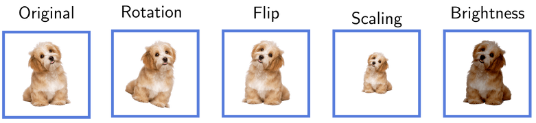

# 数据扩充

[深度学习](https://www.baeldung.com/cs/category/ai/deep-learning) [机器学习](https://www.baeldung.com/cs/category/ai/ml)

[生成对抗网络](https://www.baeldung.com/cs/tag/gan) [神经网络](https://www.baeldung.com/cs/tag/neural-networks) [训练](https://www.baeldung.com/cs/tag/training)

1. 导言

    我们可能会遇到的一个问题是训练数据的可用性。在许多计算机视觉应用中，这个问题已经不存在了，因为我们可以找到大量的数据集。例如，物体分类、人脸识别和手写识别就是这种情况。然而，在医学等某些领域，很难收集新样本或找到足够大的标注数据集。

    在本教程中，我们将回顾数据增强。其目的是在没有成千上万样本的情况下提高数据集的质量。

2. 数据扩增

    根据所选领域的不同，有多种类型的数据增强技术。仅举几例，我们有针对音频、自然语言处理和图像的方法。

    例如，图像数据增强方法包括从基本操作到深度学习方法。

    1. 几何变换

        最简单的图像数据增强技术采用几何变换。这些变换包括翻转、缩放、裁剪、旋转、平移和亮度变换：

        

        当我们没有稳健的样本分布时，就应该考虑应用这种数据增强技术。例如，如果我们想在应用程序中识别其他用户拍摄的照片中的狗。这些用户很可能会在不同的方向和光线条件下拍摄照片。

        如果我们的数据集由在类似场景下采集的样本组成，我们将无法识别这些不同的样本。简而言之，当我们有足够多的独特样本时，我们就应该使用几何变换。

        无论使用哪种变换，我们都应确保应用程序对其不敏感。例如，如果我们垂直翻转数字 9，图像就会变成 6，因此初始标签就会出错。因此，我们通常需要特定领域的函数和方法来增强我们的数据集。

    2. 用于数据增强的深度学习方法

        有时，我们有在不同场景和条件下收集的样本，但却没有足够的唯一样本。

        为了增强此类数据，我们可以使用生成对抗网络（[GAN](https://www.baeldung.com/cs/ml-gan-data-augmentation)）等深度学习方法。它们创建合成数据，试图模仿和扩展训练样本。一个典型的使用案例是人脸检测问题，GAN 会合成不存在的人脸。

        总而言之，当我们需要创建新的独特样本时，我们应该考虑深度学习方法。在难以找到大量数据或难以标注数据的应用中，这可能是必要的。例如，人体姿势或图像到文本的翻译。

3. 测试集、验证集和训练集上的数据扩充

    最常见的做法是只对训练样本进行数据增强。原因是我们希望通过添加更多数据和使训练数据集多样化来提高模型的泛化性能。不过，我们也可以在测试中使用。

    在任何情况下，我们都应该牢记，增强参数和策略必须与应用相匹配。无论我们在哪个阶段扩增数据，情况都是如此。 数据增强策略的选择应针对具体应用，并与现实世界的数据分布相一致。

    1. 我们应该增强测试数据吗？

        不在测试数据上使用数据增强的一个基本原因是要对模型进行真实的评估。为了检查我们的模型在未知数据上的表现，测试样本应与我们在实际应用中预期的样本分布相同。数据增强技术可能会扭曲测试数据的分布，使结果出现偏差。

        不过，我们还是可以从文献中找到一些证据，证明在测试集中使用增强技术是有道理的。事实上，名为测试时间扩增（[TTA](https://arxiv.org/abs/1409.1556)）的方法提高了某些应用的准确性。

        例如，假设我们的任务是开发一个不受图像方向影响的面部识别模型。但是，我们的数据集非常小，只有几百个样本。而且，所有照片都是在一个位置和方向上拍摄的。

        我们只能在训练阶段进行数据扩增。但是，在这种情况下，我们就无法针对我们的目标应用准确评估我们的模型，因为我们的目标应用可能包括旋转图像。

    2. 关于验证？

        验证集在训练过程中使用，但其主要目的不是拟合模型参数。相反，我们用它们来评估各种超参数设置的性能。因此，我们所说的增强测试数据也适用于验证数据集。

4. 结论

    在本文中，我们谈到了数据扩增。大多数情况下，我们使用它来使训练数据集变得更大、更多样化。在某些情况下，可能有必要在测试和验证子集中应用扩增。尤其是当我们没有足够的样本时。
