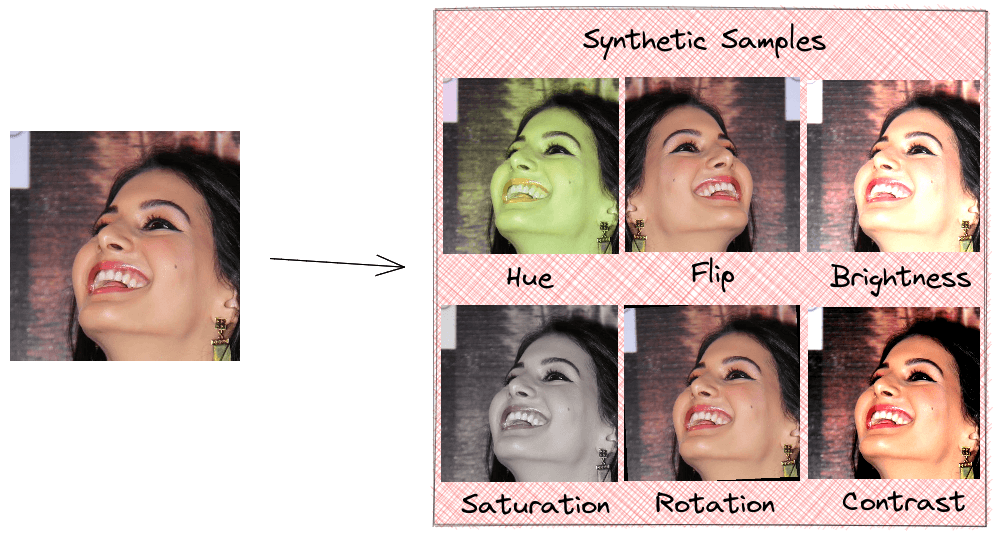
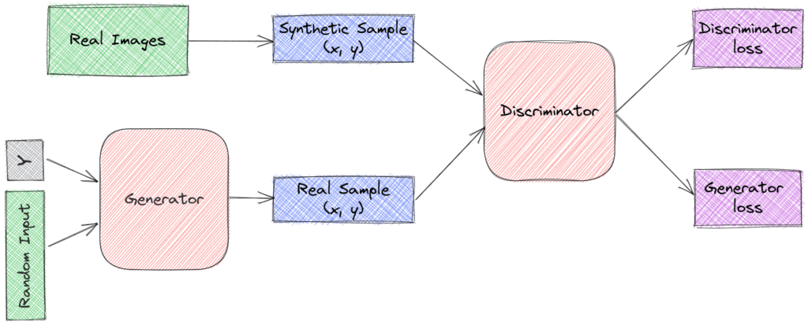
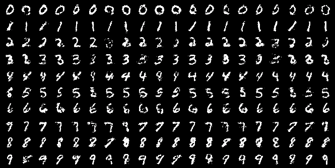

# 使用 GAN 进行数据扩充

[计算机视觉](https://www.baeldung.com/cs/category/ai/computer-vision) [深度学习](https://www.baeldung.com/cs/category/ai/deep-learning)

[对抗网络](https://www.baeldung.com/cs/tag/gan) [神经网络](https://www.baeldung.com/cs/tag/neural-networks)

1. 概述

    在本教程中，我们将讨论如何使用生成对抗网络（GAN）进行数据增强。首先，我们将介绍数据增强和 GAN，然后介绍一种能够生成非常逼真样本的 GAN 架构。

2. 数据扩增

    深度学习为众多领域带来了革命性的变化，并已成为许多复杂任务（如文本翻译、图像分割和自动语音识别）的最先进方法。由于深度学习模型需要大量数据进行训练，因此大型注释数据集在这一成功中发挥了至关重要的作用。然而，注释大量训练数据有时既困难又昂贵。因此，适当的数据扩增有助于提高模型性能。

    为了更好地举例说明这一概念，我们将重点讨论图像数据增强，但无论在哪个领域，方法都是一样的。一般来说，数据扩增的目的是通过改变已有数据的属性或生成全新的合成数据来增加数据集的大小。

    通常，我们采用前一种方法，即翻转、旋转或随机改变图像的色调、饱和度、亮度和对比度。这种方法很简单，可以在训练模型时在线完成。使用这些技术的缺点是，我们并没有为模型引入新的合成数据，而只是在不同的状态下加入相同的样本。因此，模型已经看过这些样本，对泛化能力的影响有限：

    

    生成新的真实合成数据是一项艰巨的任务，其中包括学习模仿数据集的原始分布。我们将看到，GAN 可以生成真实的样本，并提高模型的性能。

3. GANs

    首先让我们简要介绍一下 GANs 的结构，它由两部分组成。

    学习生成可信数据的生成器。它将固定长度的随机向量作为输入，并学习生成模仿原始数据集分布的样本。生成的样本就会成为判别器的负面示例。

    鉴别器能学会将生成器的合成数据与真实数据区分开来。它将样本作为输入，并将其分类为 "真实"（来自原始数据集）或 "虚假"（来自生成器）。如果生成器生成了不可信的样本，鉴别器就会对生成器进行惩罚：

    

    就图像而言，生成器和鉴别器都是 CNN，生成器的目标是生成逼真的图像，让鉴别器认为它们是真实的。然后，使用反向传播法对这些模型的权重和偏差进行长期更新，生成器将慢慢学会创建模仿原始数据集物理和数学分布的样本。

    这些模型玩的是双人最小博弈游戏，即优化判别器的目标函数会对生成器的目标函数产生负面影响，反之亦然。具体来说

    - 生成器希望最小化 $\mathbf{log(1 - D(G(z)))}$ 其中 $\mathbf{z}$ 是生成器的随机输入。通过最小化这个项，生成器可以欺骗鉴别器，把假样本归类为真样本。
    - 判别器希望最大化 $\mathbf{log(D(x_{d})) + log(1 - D(G(z)))}$ 其中 $\mathbf{x_{d}}$ 是原始数据集中的样本。这一项对应的是为真实样本和生成器样本分配正确标签的概率。

4. 条件 GAN

    在少量学习设置中，我们希望根据有限数量的样本来训练预测模型。例如，假设我们想创建一个模型，将一张狗的图像作为输入，并预测其品种。我们有庞大的动物数据集，但标注狗品种的数据量却非常有限。在此，我们的解决方案是使用 GAN 来扩充我们的数据集。

    虽然普通的 GAN 在海量数据的训练下可以生成非常逼真的样本，但它们无法生成带有特定标签的样本。条件 GAN 通过修改原始生成器网络来控制其输出，从而解决了这一问题。具体来说，网络有两个主要变化。

    我们在生成器的输入中添加一个标签 $\mathbf{y}$ 并尝试生成相应的数据点。

    判别器将样本 $\mathbf{x}$ 和相应的标签 $\mathbf{y}$ 作为输入：

    

    在条件 GAN 中，生成器被教导生成特定类别的示例，以欺骗判别器。这样，条件 GAN 就能从给定类型的域中生成样本。在本文中，我们可以看到一些生成数字的例子，每一行都以一个标签为条件：

    

5. 局限性

    GAN 在数据扩增方面的能力令人印象深刻，因为它们可以有效地学习输入数据的基本分布，并生成非常逼真的样本。不过，它也有一些局限性：

    - 我们没有评估生成样本质量的内在指标。已经有人提出了一些实验指标，但还需要朝着这个方向做更多的研究。
    - GAN 的训练通常不稳定，需要大量的计算资源。

6. 结论

    在本文中，我们讨论了如何使用 GANs 进行数据扩增。首先，我们介绍了数据扩增和生成模型的主题，然后介绍了可用于生成非常逼真样本的条件 GAN。最后，我们强调了 GAN 的一些局限性。

[Using GANs for Data Augmentation](https://www.baeldung.com/cs/ml-gan-data-augmentation)
