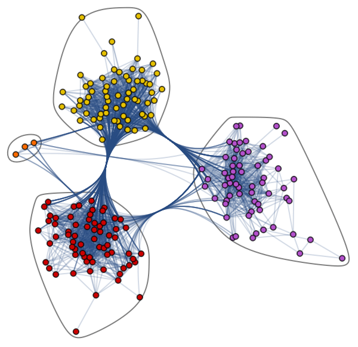

# 图神经网络简介

[深度学习](https://www.baeldung.com/cs/category/ai/deep-learning)

[神经网络](https://www.baeldung.com/cs/tag/neural-networks)

1. 引言

    近年来，人工智能领域的深度学习技术的发展和应用突飞猛进。虽然深度学习给[图像识别](https://www.baeldung.com/cs/image-recognition-one-shot-learning)和[自然语言处理](https://www.baeldung.com/cs/nlp-bleu-score)等许多领域带来了革命性的变化，但它在有效处理结[构化数据](https://www.baeldung.com/cs/text-mining)，特别是[图结构化数据](https://www.baeldung.com/cs/graphs)方面却面临着挑战。为了应对这些挑战，一种名为图神经网络（GNN）的突破性技术应运而生。GNNs 使机器能够更好地理解和处理图结构数据。

    在本教程中，我们将全面介绍 GNN，探索其架构、训练过程和各种应用。

2. 了解图形

    在深入研究 GNN 之前，掌握[图](/graph-theory/graph-theory-intro-zh.md)的基本原理至关重要。图由由[边](https://www.baeldung.com/cs/graphs-incident-edge)（也称为链接或关系）连接的[节点](https://www.baeldung.com/cs/node-degrees)（也称为顶点）组成。节点代表实体，而边代表这些实体之间的关系或互动。图既可以是有向（边有特定方向）的，也可以是无向（边是双向的）的。此外，图形还可以包含与节点和边相关联的各种属性或特征，从而提供更多信息来增强学习效果。

    让我们来了解一下错综复杂的[爵士音乐家网络数据集](https://datarepository.wolframcloud.com/resources/Jazz-Musicians-Network)，该数据集包含 198 个节点和 2742 条边。下面的可视化展示了爵士音乐家的不同社区，这些社区通过不同的节点颜色和连接边来识别。这张连接之网凸显了音乐家社区内部和社区之间的合作：

    

    图形尤其擅长解决涉及关系和互动的复杂难题。网络图可应用于各种领域，如模式识别、社交网络分析、推荐系统和语义分析。以基于图的方法为基础的解决方案的开发代表了一个新兴领域，有望深刻洞察相互关联的数据集的复杂性。

3. 什么是 GNN？

    GNN 是一类[深度学习](https://www.baeldung.com/cs/training-validation-loss-deep-learning)模型，旨在处理和分析图结构数据。GNN 利用图的固有结构信息来学习功能强大的节点和图表示，使其能够捕捉复杂的依赖关系，并在图中有效传播信息。

    GNNs 受图嵌入和[卷积神经网络](https://www.baeldung.com/cs/deep-cnn-design)的影响很大，图嵌入对其影响很大。GNNs 可用于根据图对节点、边和任务进行预测。

4. GNN 架构

    GNN的架构由多个层组成，每个层负责聚合和更新来自相邻节点的信息。GNN背后的核心理念是"[消息传递](https://www.baeldung.com/cs/inter-process-communication)"范式，即在训练过程中节点之间交换信息。在每一层，GNN 执行两个基本步骤：

    - 信息传递： 在这一步骤中，每个节点都会汇总来自其相邻节点的信息，然后将这些信息转化为信息消息。信息通常由节点自身特征及其邻居特征的信息组成
    - 节点更新：节点利用接收到的信息更新其内部表示或嵌入。这一步骤可使节点纳入来自其本地邻域的信息，并完善其表示法。

    通过迭代重复消息传递和节点更新步骤，GNN 可以让信息在整个图中传播，从而让节点集体学习和完善它们的嵌入。

5. GNN、CNN 和 RNN 之间的区别

    下表总结了 GNN、卷积神经网络（[CNN](https://www.baeldung.com/cs/ai-convolutional-neural-networks)）和循环神经网络（[RNN](https://www.baeldung.com/cs/convolutional-vs-regular-nn)）在各个方面的差异：

    | 视角      | GNNs        | CNNs        | RNNs        |
    |---------|-------------|-------------|-------------|
    | 输入类型    | 图（节点、边、特征）  | 网格状数据（如图像）  | 顺序数据（如时间序列） |
    | 信息流     | 跨节点传播信息     | 卷积中的局部感受野   | 信息按顺序传递     |
    | 结构      | 信息传递、节点更新   | 分层卷积        | 连续的神经元层     |
    | 过去数据的记忆 | 纳入全局图结构     | 捕捉网格中的局部模式  | 捕捉时间依赖性     |
    | 应用      | 社会网络、分子结构   | 图像识别、计算机视觉  | 自然语言处理、语音   |
    | 训练复杂性   | 因图形而具有适度复杂性 | 复杂、层数多、数据量大 | 因顺序依赖性而复杂   |
    | 并行处理    | 因图结构而受限     | 由于并行卷积，灵敏度高 | 因顺序性而受限     |
    | 数据大小容差  | 对图形大小和结构敏感  | 灵敏度较低，随数据缩放 | 对序列长度敏感     |

    总之，GNN 适用于图形数据，CNN 适用于网格数据，而 RNN 适用于序列数据。每种架构都有其优缺点，因此更适合特定任务和输入数据类型。

6. GNN 的类型

    GNN有多种形式，每种都是为处理特定类型的图结构数据而量身定制的。一些常见的GNN类型包括

    - 图卷积网络（[GCN](https://www.sciencedirect.com/topics/computer-science/graph-convolutional-network)）： GCN 是最早也是应用最广泛的 GNN 变体之一。它们利用图卷积来聚合和更新基于本地邻域的节点表示。
    - [GraphSAG](https://snap.stanford.edu/graphsage/#:~:text=GraphSAGE%20is%20a%20framework%20for,have%20rich%20node%20attribute%20information.)E： GraphSAGE（图形采样和聚合）是另一种流行的 GNN 架构。它利用采样策略来聚合和更新节点嵌入，从而实现了大型图的可扩展性
    - 图注意力网络（[GATs](https://www.baeldung.com/cs/graph-attention-networks)）： GAT 在 GNN 中引入了关注机制，使节点在进行信息传递和聚合时，能有选择地关注相关的邻居。
    - 图同构网络（[GINs](https://pgl.readthedocs.io/en/latest/examples/gin.html)）： 图同构网络（GINs）通过在信息传递和节点更新步骤中应用包覆不变函数，重点捕捉图的结构信息。

7. 训练 GNN

    GNN的[训练](https://www.baeldung.com/cs/training-validation-loss-deep-learning)涉及一系列数学运算，这些运算有助于通过节点和边传播信息。本节将深入探讨训练 GNN 的数学基础，深入剖析驱动其学习过程的公式和流程。

    在深入研究数学之前，让我们简要回顾一下 GNN 的架构。如上所述，GNN 由多个层组成，包括两个主要步骤：信息传递和节点更新。这些步骤通过迭代执行，使信息在图中流动。关键在于管理这些步骤的数学表达式。

    1. 信息传递

        在 GNN 的每一层，信息传递步骤都涉及汇总相邻节点的信息。在数学上，对于第 k 层的节点 v，聚合信息 $m_{v}^{k}$ 是作为其邻居 N(v) 的嵌入函数来计算的：

        \[m_{v}^{k}=\sum_{u\in N(v)}M^{k}\left(h_{u}^{k-1},h_{v}^{k-1},e_{uv}\right)\]

        其中，$M^{k}$ 代表第 k 层的信息聚合函数，$h_{u}^{k-1} 和 h_{v}^{k-1}$ 是节点 u 和 v 在上一层的嵌入，$e_{uv}$ 代表任何特定于边缘的属性。

    2. 节点更新

        聚合信息后，节点更新步骤包括使用这些信息更新节点的表示。更新是通过函数 $U^{k}$ 来完成的：

        \[h_{v}^{k}=U^{k}\left(h_{v}^{k-1},m_{v}^{k}\right)\]

        其中 $U^{k}$ 是第 k 层的节点更新函数。

    3. 用反向传播训练 GNN

        训练 GNN 的目的是学习最佳参数，使网络能够根据图结构数据做出准确的预测或分类。这通常是通过使用损失函数的监督学习过程来实现的。最常见的方法是采用[反向传播](https://www.baeldung.com/cs/neural-networks-backprop-vs-feedforward)和[梯度下降](https://www.baeldung.com/cs/understanding-gradient-descent)来优化 GNN 的参数。

8. GNN 的能力

    下面，我们将概述 GNN 处理各种机器学习任务的能力：

    - 图分类：这项任务要求将图分为不同类别。这项任务的应用包括社交网络分析和文本分类
    - 节点分类：这项任务使用相邻节点标签来预测图中缺失的节点标签
    - 链接预测：在这项任务中，根据不完整的邻接矩阵预测图中一对节点之间的链接。这项任务通常用于社交网络
    - 群组检测：在这项任务中，根据边结构将图节点划分为不同的群组。学习输入包括边缘权重、距离和类似的图对象
    - [图嵌入](https://www.baeldung.com/cs/neural-nets-embedding-layers)：这项任务将图映射为向量，保留节点、边和结构的相关信息
    - 图生成：将样本图分布作为输入，学习如何生成新的但类似的图结构

9. GNN 的应用

    GNN 的多功能性使其成功应用于多个领域，包括

    - 社会网络分析： GNN 可以为社交网络中的关系建模，从而完成链接预测、社区检测和推荐系统等任务
    - [生物信息学](https://www.baeldung.com/cs/genetic-algorithms-applications)和药物发现： GNN 在预测分子特性、蛋白质与蛋白质之间的相互作用以及帮助发现新药方面取得了可喜的成果
    - [知识图谱](https://www.baeldung.com/cs/ml-knowledge-graphs)： GNN 可以增强知识图谱嵌入，从而在知识图谱中更好地进行表征学习和链接预测
    - [推荐系统](https://www.baeldung.com/cs/amazon-recommendation-system)： GNN 可以捕捉用户与物品之间的交互，并利用图结构化的用户物品数据提高推荐系统的准确性

10. 结论

    本文全面介绍了 GNN，探讨了 GNN 的架构、训练过程以及各种应用。随着该领域研究的不断深入，我们可以预见，GNN 将在发掘图结构数据的潜力方面发挥越来越重要的作用，并为未来的创新应用铺平道路。

    图神经网络已成为处理和分析图结构数据的强大工具。图神经网络通过利用图中固有的丰富结构信息，使机器能够捕捉复杂的依赖关系，并有效地跨节点传播信息。
