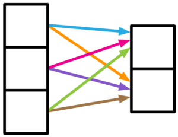
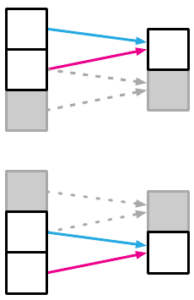
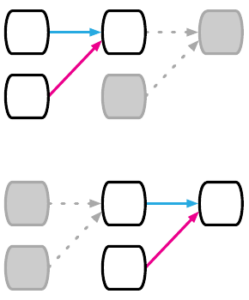
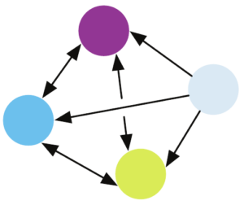

# 什么是机器学习中的归纳偏差？

[深度学习](https://www.baeldung.com/cs/category/ai/deep-learning) [机器学习](https://www.baeldung.com/cs/category/ai/ml)

1. 概述

    在本教程中，我们将讨论归纳偏差的定义，并介绍其在机器学习和深度学习中的不同形式。

2. 定义

    每个机器学习模型都需要某种类型的架构设计，可能还需要对我们要分析的数据做出一些初始假设。一般来说，我们对数据所做的每一个构件和每一个假设都是一种归纳偏差。

    归纳偏差对机器学习模型泛化到未见数据的能力起着重要作用。强归纳偏差会导致我们的模型收敛到全局最优。另一方面，弱归纳偏差会导致模型只能找到局部最优，并受到初始状态随机变化的极大影响。

    我们可以将归纳偏差分为两类，即关系偏差和非关系偏差。前者代表网络中实体之间的关系，后者则是进一步约束学习算法的一组技术。

3. 机器学习中的归纳偏差

    在传统的机器学习中，每种算法都有自己的归纳偏差。在本节中，我们将提到其中的一些算法。

    1. 贝叶斯模型

        [贝叶斯模型](https://www.baeldung.com/cs/bayesian-networks)中的归纳偏差以我们为变量选择的先验分布的形式表现出来。因此，先验分布可以塑造后验分布，使后验分布成为与先验分布相似的分布。此外，我们假定变量是有条件独立的，也就是说，给定网络中节点的父节点，它将独立于它的祖节点。因此，我们可以利用条件概率进行推理。此外，贝叶斯网络的结构也有助于分析实体之间的因果关系。

    2. k-Nearest Neighbors（k-NN）算法

        k-Nearest Neighbors（[k-NN](https://www.baeldung.com/cs/k-nearest-neighbors)）算法假定，属于某一特定类别的实体应该彼此靠近，而属于不同类别的实体应该相距较远。换句话说，我们假定相似的数据点相互靠近，远离不相似的数据点。

    3. 线性回归

        给定（X，Y）数据点，在[线性回归](https://www.baeldung.com/cs/linear-vs-logistic-regression)中，我们假定变量（Y）与解释变量（X）成线性关系。因此，得到的模型与训练数据线性拟合。然而，这一假设可能会限制模型学习非线性函数的能力。

    4. 逻辑回归

        在[逻辑回归](https://www.baeldung.com/cs/gradient-descent-logistic-regression)中，我们假设有一个超平面将两个类别分开。这简化了问题，但可以想象，如果假设不成立，我们就不会有一个好的模型。

4. 深度学习中的关系归纳偏差

    关系归纳偏差定义了模型中不同实体或部分之间的关系结构。[这些关系](https://arxiv.org/pdf/1806.01261.pdf)可以是任意的、顺序的、局部的等等。

    1. 弱关系

        有时，神经单元之间的关系很弱，这意味着它们在某种程度上是相互独立的。选择在网络中包含一个全连接层就可以表示这种关系：

        

    2. 定位

        为了处理图像，我们首先要捕捉局部信息。其中一种方法就是使用卷积层。它可以捕捉图像像素之间的局部关系。然后，随着模型的深入，局部特征提取器会帮助提取全局特征：

        

    3. 顺序关系

        有时，我们的数据具有顺序特征。例如，时间序列和句子由相继出现的顺序元素组成。为了模拟这种模式，我们可以在网络中引入一个递归层：

        

    4. 任意关系

        要解决与一组事物或人员相关的问题，将它们视为一个图可能更有参考价值。图结构在实体之间施加了任意关系，当模型中没有明确的顺序关系或局部关系时，这种结构是最理想的：

        

5. 深度学习中的非关系归纳偏差

    除了关系归纳偏差，还有一些概念对我们的模型施加了额外的限制。在本节中，我们将列出其中一些概念。

    1. 非线性激活函数

        [非线性激活函数](https://www.baeldung.com/cs/ml-nonlinear-activation-functions)允许模型捕捉隐藏在数据中的非线性。没有非线性激活函数，深度神经网络就无法比单层网络更好地工作。因为多个线性层的组合仍然是一个线性层。

    2. 剔除

        [Dropout](https://www.cs.toronto.edu/~rsalakhu/papers/srivastava14a.pdf) 是一种正则化技术，通过强迫网络的随机子集各自学习数据模式，帮助网络避免记忆数据。因此，最终得到的模型能够更好地泛化并避免[过拟合](https://www.baeldung.com/cs/ml-underfitting-overfitting)。

    3. 权重衰减

        [权重衰减](https://d2l.ai/chapter_multilayer-perceptrons/weight-decay.html)是另一种对模型权重施加约束的正则化方法。

        权重衰减有多种版本，但常见的是 L1 和 L2 正则化技术。权重衰减不会让权重增长过大，从而防止模型过度拟合。

    4. 归一化

        归一化技术可以在多个方面帮助我们的模型，如加快训练速度和正则化。

        但最重要的是，它可以减少网络激活分布的变化，这种变化被称为内部[共变量偏移](https://c.d2l.ai/stanford-cs329p/_static/pdfs/cs329p_slides_8_1.pdf)。正则化技术有多种，如[批量正则化](https://www.baeldung.com/cs/instance-vs-batch-normalization)、[实例正则化](https://arxiv.org/pdf/1607.08022.pdf)和[层正则化](https://arxiv.org/pdf/1607.06450.pdf)。

    5. 数据增强

        我们可以将[数据增强](https://www.baeldung.com/cs/ml-gan-data-augmentation)视为另一种正则化方法。

        它对模型的影响取决于其算法。例如，在句子中[添加噪音](https://aclanthology.org/2021.findings-emnlp.234.pdf)或[单词替换](https://aclanthology.org/D19-1670.pdf?ref=https://githubhelp.com)就是两种数据增强方法。

        它们假定，在分类任务中，添加噪音或词语替换不应改变词语序列的类别。

    6. 优化算法

        优化算法对我们想要学习的模型结果起着关键作用。

        例如，不同版本的[梯度下降](https://www.baeldung.com/cs/understanding-gradient-descent)算法会导致不同的最优结果。因此，由此产生的模型将具有其他的泛化特性。

        此外，每种优化算法都有自己的参数，这些参数会极大地影响模型的收敛性和最优性。

6. 结论

    在本教程中，我们了解了传统机器学习和深度学习中的两种归纳偏差。此外，我们还列举了每种类型的示例，并解释了给定示例的影响。
