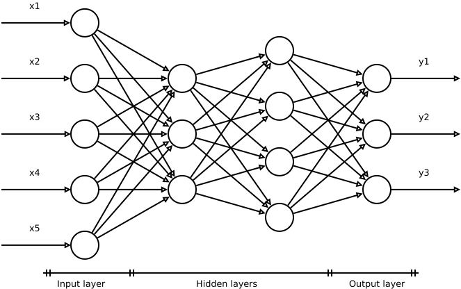
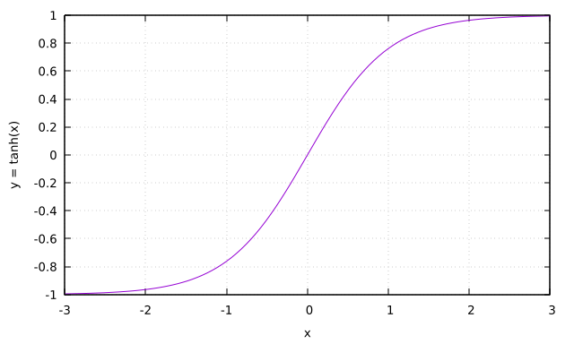

# 神经网络中权重的随机初始化

[深度学习](https://www.baeldung.com/cs/category/ai/deep-learning) [机器学习](https://www.baeldung.com/cs/category/ai/ml)

[神经网络](https://www.baeldung.com/cs/tag/neural-networks) [训练](https://www.baeldung.com/cs/tag/training)

1. 简介

    在本教程中，我们将学习[人工神经网络](https://www.baeldung.com/cs/machine-learning-intro)中的权重初始化技术以及它们的重要性。

    初始化对网络训练过程的优化速度和质量有很大影响。

2. 基本符号

    为说明讨论内容，我们将参考经典的完全互联前馈网络，如下图所示：

    

    网络中的每个单元对上一级单元的输出 $x_{i}$ 执行加权和的非线性变换（激活函数），以生成自己的输出 y：

    \[y=\mathcal{F}\left(w_{0}+\sum_{i}w_{i}x_{i}\right)\]

    偏置被认为是一个额外的单元，其输出等于 1，权重为 $w_{0}$，具有 y 截距的功能，如果没有偏置，网络生成的模型将被迫从问题空间的原点（即点（$\mathbf{x}=0,\mathbf{y}=0)$）经过。偏置增加了灵活性，允许对不满足这一条件的数据集进行建模。

3. 打破对称

    对于神经网络权重的初始化，我们基本上有两种可能的极端选择：为网络中的所有权重选择一个单一值，或者在一定范围内随机生成权重。

    最佳实践建议使用随机集，初始偏差为零。原因在于需要打破对称，即需要让每个神经元执行不同的计算。在对称条件下，训练会受到严重影响，甚至无法进行。

    打破对称有两个不同的方面，这取决于我们考虑问题的尺度：从单个网络连接的角度，还是从不同网络的角度。

    1. 打破网络单位内部的对称性

        如果网络的所有单元都具有相同的初始参数，那么应用于确定性成本和模型的确定性学习算法将以相同的方式不断更新这两个单元。让我们来看看为什么。

        在关于[非线性激活函数的文章](https://www.baeldung.com/cs/ml-nonlinear-activation-functions)中，我们研究了基于德尔塔法则（梯度下降）的经典学习机制，它提供了一种根据示例更新权重的程序。

        为了简单起见，我们假设一个单层网络使用线性激活函数，并使用测量数据集的 P 条记录，将网络输出 y 与目标 t 之间的二次误差作为预测好坏的衡量标准：

        \[E=\sum_{p=1}^{P}E^{p}=\frac{1}{2}\sum_{p=1}^{P}(d^{p}-t^{p})^{2}\]

        德尔塔规则为权重更新提供了如下表达式：

        \[\Delta_{p}w_{j}=-\gamma\frac{\partial E^{p}}{\partial w_{j}}=\frac{\partial E^{p}}{\partial y^{p}}\frac{\partial y^{p}}{\partial w_{j}}=\gamma x_{j}(t^{p}-y^{p})\]

        其中，$gamma$ 是学习率。

        假设我们将网络中的所有权重初始化为相同的值。那么，无论激活函数的函数形式如何，差值 $\mathbf{t ^{p} -y ^{p}}$ 都是相同的。对于所有单元来说都是相同的，新的权重集也将具有相同的数值。

        我们可以将这种 "对称情况" 视为一种约束。实践证明，它是有害的，无法实现最佳训练效果。

    2. 打破不同网络的对称性

        要找出问题的最佳神经网络，需要进行测试，尝试不同的结构和参数化，以找出误差最小的网络。这一过程可以通过遗传算法等方法自动完成，遗传算法会提出不同的解决方案，并让它们进行竞争。

        假设我们使用相同的网络结构、参数和权重进行不同的试验。在这种情况下，所有网络在问题的误差空间中都有相同的起点。

        正如我们在上一节中所看到的，许多训练算法都会研究误差梯度随权重变化而变化的情况。从同一起点出发意味着梯度的方向在不同的试验中将始终相同或非常相似，权重也将以相同的方式更新。

        这是对称情况的另一个方面。选择不同的权重可以以不同的方式探索空间，并增加找到最优解的概率。

4. 随机初始化

    我们从前面的章节中了解到随机初始化权重的必要性，但在什么区间内随机初始化权重呢？答案在很大程度上取决于我们的神经网络所使用的激活函数。

    让我们以 $\tanh$ 为例：

    

    对于参数的极端值，曲线的分辨率很差。过大或过小的 x 值变化都会导致 $\tanh$ 的微小变化（梯度消失问题）。

    这一事实为我们提供了权重初始化范围的标准，即权重应位于中间范围。一些作者推荐[-1: 1]，另一些则小到[-0.1: 0.1]。如果我们使用 logistic 激活函数或 $\tanh$，[-0.5:0.5]的范围足以满足大多数用途。

5. 高级随机初始化技术

    上一节中说明的随机初始化认为，在所选范围内，生成权重的可能性相同。这相当于根据均匀分布随机生成权重。

    也可以使用其他概率法，如高斯分布。在后一种情况下，权重不是在区间内生成的，而是具有一定方差的正态分布。

    下面说明的技术给出了这些变异性极限的估计：均匀分布的区间扩展$\mathcal{U}$和高斯分布的标准偏差$\mathcal{N}$。

    1. 泽维尔-本吉奥初始化

        [Xavier-Bengio初始化](http://proceedings.mlr.press/v9/glorot10a.html)，也称为 Xavier-Joshua 初始化或 Glorot 初始化，可用于逻辑激活函数和双曲正切。它是这些作者考虑到线性激活函数的假设而得出的。

        泽维尔初始化方法的逻辑是为每一层的输入和输出设置相等的方差，以避免梯度消失问题和其他畸变。

        我们将 $2\Delta$ 称为遵循均匀分布的权重的方差区间（区间 $[- \Delta: \Delta]$），$\sigma$ 称为在均值为零的正态分布情况下的标准偏差：

        \[\mathbf{W}\in\mathcal{U}\left[-\Delta,\Delta\right],\,\mathbf{W}\sim\mathcal{N}\left(0,\sigma\right)\]

        对于对数函数，[Young-Man Kwon、Yong-woo Kwon、Dong-Keun Chung](https://www.ijitee.org/wp-content/uploads/papers/v8i4s2/D1S0014028419.pdf) 和 Myung-Jae Lim给出了表达式：

        \[\mathbf{W}\in\mathcal{U}\left[-\sqrt{\frac{6}{n_{i}+n_{o}}},\sqrt{\frac{6}{n_{i}+n_{o}}}\right],\,\mathbf{W}\sim\mathcal{N}\left(0,\sqrt{\frac{6}{n_{i}+n_{o}}}\right)\]

        其中 $\mathbf {W}$ 是权重矩阵，$n_{i}$ 和 $n_{o}$ 是给定网络层的输入和输出权重连接数，在技术文献中也称为 $\mathrm {fan_{in}}$ 和 $\mathrm {fan_ {out}}$。

        对于 $\tanh$ 我们有：

        \[\mathbf{W}\in\mathcal{U}\left[-\sqrt[4]{\frac{6}{n_{i}+n_{o}}},\sqrt[4]{\frac{6}{n_{i}+n_{o}}}\right],\,\mathbf{W}\sim\mathcal{N}\left(0,\sqrt[4]{\frac{6}{n_{i}+n_{o}}}\right)\]

        请注意，$\Delta$ 和 $\sigma$ 参数是应用于特定概率分布的比例参数。

        然而，其他表达式在技术文献中更为常见。特别是对于正态分布

        \[\mathbf{W}\sim\mathcal{N}\left(0,\sqrt{\frac{1}{n_{i}}}\right)\]

        有一个变量：

        \[\mathbf{W}\sim\mathcal{N}\left(0,\sqrt{\frac{2}{n_{i}+n_{o}}}\right)\]

    2. He 初始化

        也叫开明初始化。这种方法因[何开明](https://arxiv.org/abs/1502.01852)等人在 2005 年发表的一篇著名论文而得名。它与泽维尔的初始化几乎相似，只是他们使用了不同的权重缩放因子。

        何开明等人通过对 ReLUs 的非线性进行谨慎建模，得出了一种初始化方法，这种非线性使得深度极高的模型（大于 30 层）难以收敛。然后将其与这些激活函数联系起来。

        Young-Man Kwon、Yong-woo Kwon、Dong-Keun Chung 和 Myung-Jae Lim 给出了表达式：

        \[\mathbf{W}\in\mathcal{U}\left[-\sqrt{2}\sqrt{\frac{6}{n_{i}+n_{o}}},\sqrt{\frac{6}{n_{i}+n_{o}}}\right],\,\mathbf{W}\sim\mathcal{N}\left(0,\sqrt{2}\sqrt{\frac{6}{n_{i}+n_{o}}}\right)\]

        在这里，使用以下适合正态分布的表达式也更为常见：

        \[\mathbf{W}\sim\mathcal{N}\left(0,\sqrt{\frac{2}{n_{i}}}\right)\]

        这种技术有坚实的理论依据。考虑到适当的初始化方法应避免以指数形式减小或放大输入信号的大小（梯度消失问题），He 等人在他们的工作中得出了以下条件来避免这种畸变：

        \[\frac{1}{2}n_{i}\sigma^{2}=1\]

        从而得出文中的表达式。

        我们还可以得到一个更一般的表达式，即：

        \[\mathbf{W}\sim\mathcal{N}\left(0,\sqrt{\frac{2}{(1+a^{2})n_{i}}}\right)\]

        其中，a 是当前层后使用的整流器的负斜率。默认情况下，ReLU 的 a = 0，这就回到了文本表达式。

6. 其他形式的初始化

    人们还提出了许多其他方法。科学软件包提供了许多此类技术。例如，[Keras](https://keras.io/api/layers/initializers/) 有以下几种可能性：

    - Zeros零：初始化为 0
    - 1：初始化为 1
    - Constant常数：初始化为常数
    - RandomNormal：使用正态分布进行初始化
    - RandomUniform：使用均匀分布进行初始化
    - TruncatedNormal截断正态分布：使用截断正态分布进行初始化
    - VarianceScaling：能根据权重形状调整比例的初始化
    - Orthogonal正交：生成随机正交矩阵的初始化
    - Identity同一性：生成同一性矩阵的初始化
    - lecun_uniform： LeCun 均匀初始化
    - glorot_normal: 泽维尔正则初始化器
    - glorot_uniform： 泽维尔统一初始化程序
    - he_normal: He normal 初始化器
    - lecun_normal： 勒村正则初始化器
    - he_uniform： He uniform variance scaling 初始化器

7. 结论

    本文概述了神经网络中的一些权重初始化技术。显然，一个次要的主题实际上会影响结果的质量和训练过程的收敛速度。

    所有这些技术都有坚实的理论依据，旨在缓解或解决研究较多的技术问题，如梯度消失问题。
