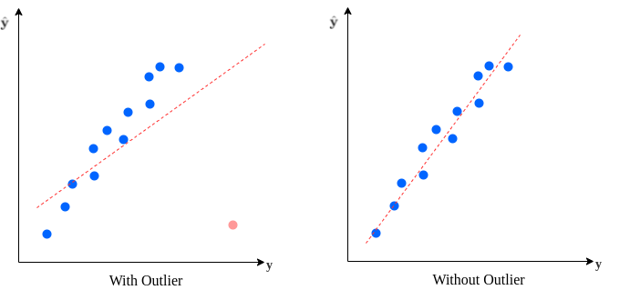
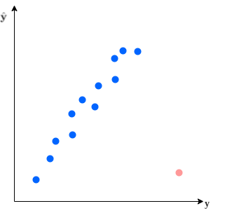
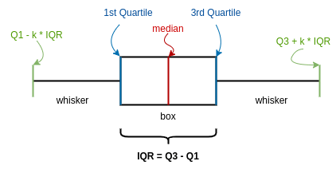
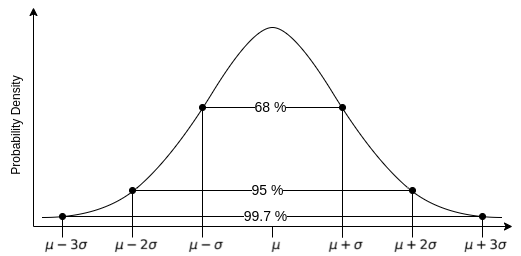
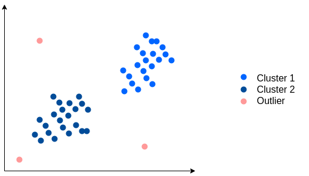
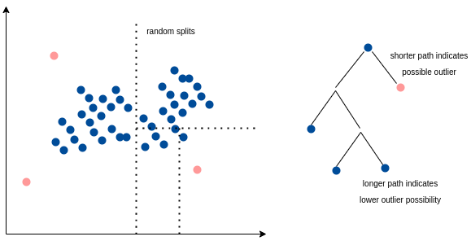

# [离群值的检测和处理](https://www.baeldung.com/cs/ml-outlier-detection-handling)

[深度学习](https://www.baeldung.com/cs/category/ai/deep-learning) [机器学习](https://www.baeldung.com/cs/category/ai/ml)

[概率与统计](https://www.baeldung.com/cs/tag/probability-and-statistics)

1. 引言

    检测和处理数据集中的离群值是机器学习中的一个关键问题。由于监督学习算法学习的是数据集中的模式，因此使用有噪声的数据集进行训练会导致模型的预测能力较低。

    有些算法，如kNN，对异常值更为敏感。另一方面，基于树的方法（如随机森林对异常值更有弹性。

    在本文中，我们将了解什么是异常值。然后，我们将讨论检测异常值的方法。最后，我们将讨论如何处理异常值。

2. 离群值

    在统计学中，我们将与数据集其他部分明显不同的数据点称为离群值。换句话说，离群值包含一个不一致或不符合一般行为的值。

    数据集中出现离群值有多种原因。从这个意义上说，测量误差或输入错误都可能导致离群值的存在。

    例如，我们希望年龄特征只包含正整数。不可能存在年龄值为"-1"或 "abc"的观测值。因此，我们得出结论：这是一个错误。

    另一方面，当年龄值为 112 时，它不一定是一个错误的条目。这个数据是不寻常的，但它仍然可能是有效的。删除该值会导致信息丢失。

    此外，异常值在不平衡数据集的分类问题中发挥着重要作用。例如，欺诈检测数据集中的交易是不平衡的。而且，偏离平均值的交易更有可能是欺诈交易。因此，去除异常值又会造成有价值信息的丢失。

    但反过来说，异常值也会给数据集带来噪音，并无益处。我们需要剔除不符合数据集特征的观测值，尤其是在观测值数量较多时。总而言之，保留异常值会导致模型训练不足。

    假设我们在数据集上拟合了一个线性回归模型。删除或不删除离群值都会对最终模型产生相当大的影响：

    

3. 异常值检测

    异常值的检测不是一个简单的问题。我们要找出不符合数据集一般特征的观测值。

    我们可以根据手头的数据集选择多种方法。让我们来探讨一些著名的离群点检测技术。

    1. 数据可视化

        数据可视化是一种简单有效的异常值检测方法。尤其是当数据集维度较低时，我们可以轻松生成显示离群值的散点图：

        

        然而，随着数据集维度的增加，数据集的可视化表示就变得更加困难。因此，在多维数据集中更难通过可视化方式检测异常值。因此，我们需要依赖其他技术，尤其是针对高维数据集的技术。

    2. 四分位分析

        另外，我们还可以根据特征的统计特性，用数学方法定义离群点候选。首先，让我们定义一下我们将采用的一些术语。

        四分位数将观测值分为四个部分。$Q_1$ 称为第一个四分位数，代表数据集的第 25 个百分位数。同样，$Q_3$ 表示第三个四分位数，代表数据的第 75 个百分位数。

        进一步，我们将四分位数间距定义为

        \[IQR = Q_3 - Q_1\]

        在四分位数分析方法中，我们将超出 $\boldsymbol{k} \boldsymbol{\times} \boldsymbol{IQR}$ 范围的值定义为离群值。

        我们可以借助方框图来直观地进行量化分析。方框图的两端标志着四分位数。此外，图中还标出了中位数。须毛(whiskers)表示 $k \times IQR$数据范围：

        

        乘数 k 的常用值是 1.5。因此，位于 1.5 倍 IQR 范围之外的值就是异常值：

        \[1.5 \times Q_1 < x < 1.5 \times Q_3\]

    3. Z 值

        Z 分数是在假设正态分布的情况下，用标准差来衡量观测值与平均值的方差。

        为了计算 Z 分数，我们将数据转换成正态分布的钟形曲线，均值为 $\mu$，标准偏差为 $\sigma$。然后，我们计算观测值 x 的 z-score：

        \[z-score = \frac{x - \mu}{\sigma}\]

        最后，我们定义一个阈值范围，并将超出范围的观测值标记为异常值。

        让我们回顾一下平均值周围标准偏差的经验法则和覆盖范围：

        - $\mu \pm \sigma$ 覆盖 68.27
        - $\mu \pm 2 \times \sigma$ 覆盖 95.45%
        - $\mu \pm 3 \times \sigma$ 覆盖率为 99. 73%

        通常，我们将数字四舍五入，称覆盖率为 [68 - 95 - 99.7](https://en.wikipedia.org/wiki/68–95–99.7_rule)：

        

        一些常见的 z 分数阈值为 2.5、3.0 和 3.5。根据选定的阈值，我们将 z 分数绝对值较大的观测值标记为离群值：

        \[| z-score | > Threshold\]

    4. DBSCAN 聚类

        我们可以利用一个模型对数据集进行聚类。那么，离聚类中心太远的点就是离群点。

        [DBSCAN](https://www.baeldung.com/cs/clustering-unknown-number#dbscan) 是一种广泛应用于离群点检测的聚类方法。它是一种非参数模型。DBSCAN 假定聚类是密集的。因此，DBSCAN 会对大型数据集中的局部密集区域进行调查，以检测聚类。

        它将数据集中的每个点划分为核心点、边界点或噪声点。通过它的输出结果，我们可以很容易地识别出被标记为噪声的异常值：

        

        在使用基于距离的算法（如 DBSCAN）之前，最好先缩放数据集。此外，我们还需要根据数据集的维度来选择空间度量。

    5. 隔离林

        另一种检测离群值的方法是使用隔离林(Isolation Forest)算法。这一想法最早是为异常检测而提出的。

        隔离林根据特征创建随机分区。树形结构直观地展示了我们如何形成分区。因此，从树根到样本的边的数量就代表了隔离该特定观察结果所需的分割数量。

        这种树的平均路径长度可作为决策函数。我们会给所有观测值分配一个异常分数。异常值的路径长度较小，因为它们更容易被分离出来。相反，非异常值较难从其他观测值中分离出来，从根开始的路径较长。

        因此，当我们将这些随机树组成一个森林时，它们会共同产生一个给定观测值的路径长度。较短的平均值更有可能是离群值：

        

4. 处理异常值

    异常值的检测和处理是数据科学和机器学习中的一个基本问题。解决这个问题并不简单，就像解决缺失值问题一样。

    正如我们已经提到的，让离群值保持原样会降低模型的性能。模型在学习数据集模式的同时，也会学习离群值带来的误差和噪声。因此，我们应该在训练阶段之前去除异常值。

    处理离群值有几种方法。根据原因和密度，我们可以选择适当的方法来处理离群值。不过，在大多数情况下，纠正异常值是不可能的。

    假设我们认为观测值是由数据录入错误或测量误差（年龄字段中的 "abc"）造成的。那么，最好的处理方法就是删除数据点。既然我们知道数据是无效的、不正确的，那么就没有办法纠正它。

    我们将替换数据点称为归因。通常的做法是根据其他特征预测缺失值，或者用特征平均值来替换缺失值，从而实现估算。

    如果数据集足够大，出现极端值（年龄字段中的 "114"）的概率就会更高。在这种情况下，我们可以保留或修剪离群值。例如，在年龄示例中，我们可以用 80 替换所有大于 80 的值。这种方法也称为剪切或胜选。

    另外，我们还可以使用非统计方法来处理异常值。我们可以向利益相关者和领域专家询问特征的可能值。我们可以与他们一起集思广益，确定某些观测值偏离数据集其他观测值的原因。利用领域知识形成的想法可以为手头的问题提供更好的解决方案。

5. 总结

    在本教程中，我们已经了解了异常值及其重要性。我们讨论了数据集中存在异常值的一些可能原因。

    然后，我们学习了一些最常用的检测异常值的方法。我们讨论了数据可视化、四分位分析、z-score、DBSCAN 聚类和隔离林方法。

    最后，我们讨论了一些处理异常值的方法并得出结论。
