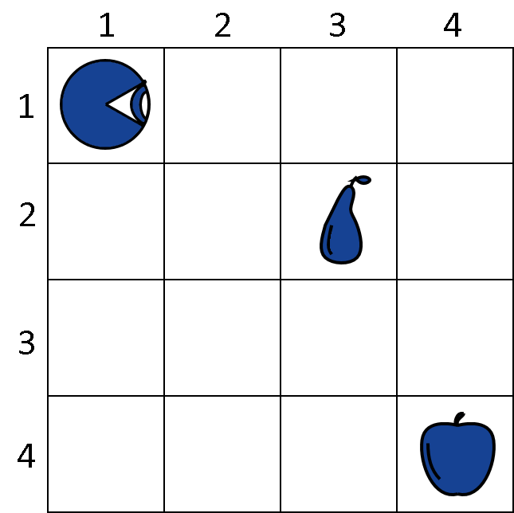
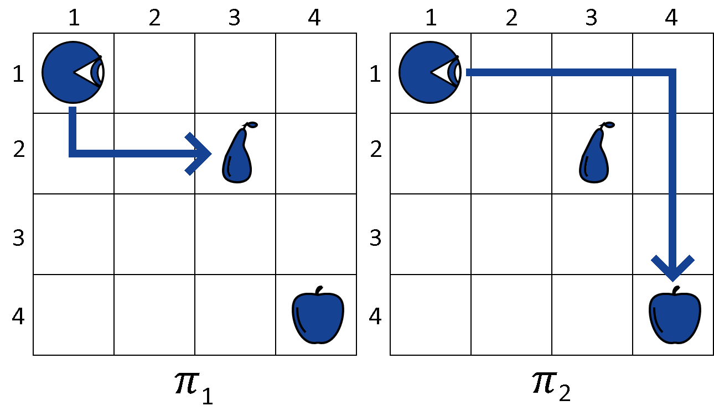
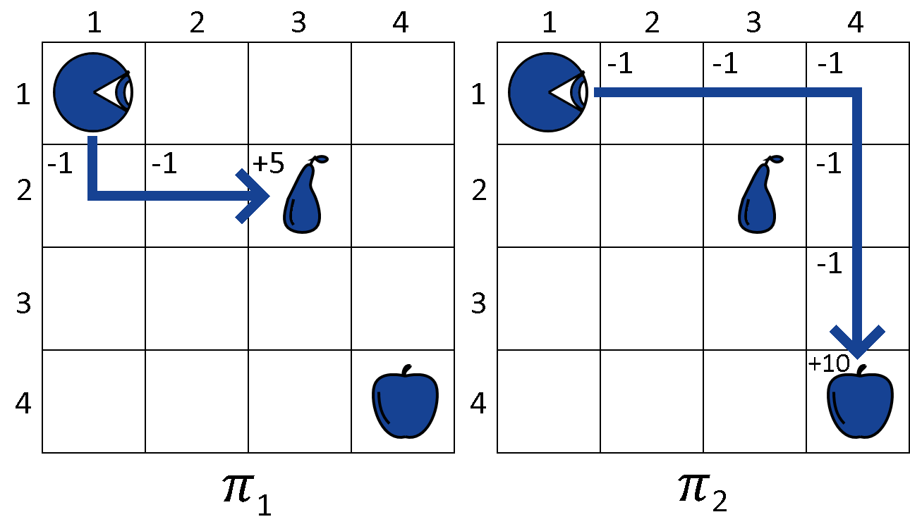

# [什么是强化学习中的策略？](https://www.baeldung.com/cs/ml-policy-reinforcement-learning)

[深度学习](https://www.baeldung.com/cs/category/ai/deep-learning) [机器学习](https://www.baeldung.com/cs/category/ai/ml)

[强化学习](https://www.baeldung.com/cs/tag/reinforcement-learning)

1. 概述

    在本教程中，我们将学习强化学习的策略概念。

    在本文结束时，我们将熟悉强化学习的基本概念及其基于策略的方法。

2. 策略的定义

    强化学习是机器学习的一个分支，专门用来训练代理在环境中的操作，以便在追求某些目标的过程中实现效用最大化。

    [Russel指出](http://aima.cs.berkeley.edu/)，强化学习的基本思想是，智能是代理与其环境互动的一种新兴属性。这种特性通过引导行为主体在执行某些任务时的选择来指导行为主体的行动。

    我们可以类比说，智能是指行为主体根据其目标选择适当策略的能力。策略是所有可能行为中以目的论为导向的子集，在这里与"策略"的概念相关联。

    因此，"策略"是一个代理在追求目标时使用的战略。策略决定了代理所采取的行动，是代理状态和环境的函数。

3. 策略的数学定义

    通过正式术语，我们用马尔可夫决策过程（[Markov Decision Process](https://en.wikipedia.org/wiki/Markov_decision_process)）来定义策略。马尔可夫决策过程是一个形式为 (S, A, P, R) 的元组，结构如下。

    第一个元素是包含代理内部状态的集合 S。 所有可能的状态共同构成了代理的所谓状态空间。在用于[代理模拟的网格世界](https://link.springer.com/article/10.1007/s10586-015-0500-6)中，S 通常包括代理在棋盘上的位置，必要时还包括一些参数。

    第二个元素是包含代理行动的集合 A。行动对应于代理在环境中可能采取的行为。所有行动的集合构成了该代理的行动空间。

    一个行动也可能导致代理状态的改变。这由矩阵 P 表示，矩阵 P 包含从一种状态转换到另一种状态的概率。其元素 $P_a(s,s')$ 包含了 A 中所有可能的行动 a 和状态对 $(s, s')$ 的概率 $Pr(s'|s,a)$。

    第四个元素 R(s) 包含代理的奖励函数。它将代理的状态作为输入，并输出一个与代理奖励相对应的实数。

    现在我们可以正式定义策略了，我们用 $\pi(s)$ 来表示。策略 $\pi(s)$ 包含了代理对 S 中每一个可能状态 s 所应采取的建议行动。

4. 强化学习中的策略示例

    现在我们来看一个实际场景中的策略示例，以便更好地理解它是如何工作的。在这个例子中，一个代理必须从环境中觅食以充饥。然后，它根据吃到的果实获得奖励：

    

    代理的内部状态与它在棋盘上的位置相对应，在本例中，$s_t = (x,y)$ 和 $s_0 = (1,1)$。在本例中，行动空间由四种可能的行为组成： $A = \text{up, down, left, right}$。概率矩阵 P 包含 A 中所有行为的所有成对状态组合 $(s, s')$：

    \[P_{\text{down}}( (1,1), (1,2) ) = 1; P_{\text{down}}( (1,1), (1,3) ) = 0; ... ; P_{\text{up}}( (4,4), (4,3) ) = 1\]

    奖励函数 R 是这样定义的。如果代理处于空单元格中，则会获得-1 的负奖励，以模拟饥饿的效果。反之，如果代理处于有水果的单元格中，在本例中，梨的单元格为（3,2），苹果的单元格为（4,4），那么它将分别获得 +5 和 +10 的奖励。

    因此，奖励函数 R 是这样的：

    - $R(\text{No fruit}) = -1$
    - $R(\text{Pear}) = +5$
    - $R(\text{Apple}) = +10$

    模拟运行的时间步数是有限的，但如果代理吃到任何水果，模拟就会提前结束。

5. 政策评估

    然后，代理会考虑两个策略 $\pi_1$ 和 $\pi_2$。如果我们稍微简化一下符号，我们可以把一个策略表示为从代理的状态 s_0 开始的一系列行动：

    - $\pi_1 = \text{down, right, right} \to \text{Pear}$
    - $\pi_2 = \text{right, right, right, down, down, down} \to \text{Apple}$

    

    代理人必须在这两种政策中做出选择。通过计算它们的效用函数 U，代理人可以得到

    - $U(\pi_1) = -1-1+5 = +3$
    - $U(\pi_2) = -1-1-1-1-1+10 = +5$

    

    对这些策略的评估表明，使用 $\pi_2$ 可以使效用最大化，因此代理选择 $\pi_2$ 作为执行这项任务的策略。

6. 结论

    在本文中，我们研究了强化学习代理的策略概念。我们还研究了它的一个应用实例。
