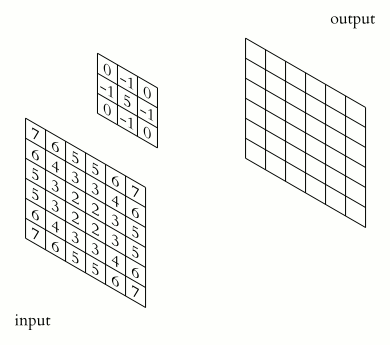

# [了解CNN中的维度](https://www.baeldung.com/cs/ml-understanding-dimensions-cnn)

[深度学习](https://www.baeldung.com/cs/category/ai/deep-learning)

[卷积神经网络](https://www.baeldung.com/cs/tag/cnn)

1. 概述

    在本教程中，我们将学习如何在卷积神经网络中使用不同的维度。

    为了更好地掌握这些概念，我们将用现实生活中的一些案例来说明这些理论。让我们开始吧！

2. 卷积

    1. 定义

        卷积神经网络（CNN）是一种神经网络，其各层通过卷积进行转换。

        卷积需要一个内核，内核是一个矩阵，它在输入数据上移动，并与重叠的输入区域进行点乘，从而为每个区域获取一个激活值。

        内核代表一种模式，激活值代表重叠区域与该模式的匹配程度：

        

    2. 维度

        卷积神经网络中受维度影响的对象包括

        - 输入层：输入层大小的尺寸
        - 内核：内核大小的维度
        - 卷积：核可移动的维度
        - 输出层：输出层大小的维度

3. 一维输入

    1. 使用一维卷积来平滑图形

        对于一维输入层，我们唯一的选择是

        - 输入层： 1D
        - 核 1D
        - 卷积 1D
        - 输出层： 1D 1D

        一维层只是一个值列表，我们可以用图形来表示：

        

        核将沿着列表滑动，产生一个新的 1D 层。

        假设我们在前一个图上使用了内核 [0.33, 0.67, 0.33]。输出结果将是

        

        我们可以看到，它仍然保留了一些原始形状，但现在要平滑得多。

4. 二维输入

    1. 二维卷积计算机视觉

        让我们从尺寸开始：

        - 输入层：二维
        - 内核 2D
        - 卷积：二维
        - 输出层：二维

        这也许是卷积最常见的例子，我们能够捕捉图像中的二维模式，随着网络的深入，复杂度也会越来越高：

        

        上图是人脸检测网络能够捕捉的模式类型： 早期层（左图）能够匹配边缘和基本形状等简单模式。中间层（中图）能找到鼻子、耳朵和眼睛等人脸部位。更深层（右图）能够捕捉人脸的不同模式。

    2. 用一维卷积对 n 个图形进行编码

        在自然语言处理中，我们通常用大小为 m 的数字向量来表示单词，用 $n \times m$ 的核来表示 n-gram 模式。每个激活表示这些词与 n-gram 模式的匹配程度。

        让我们来看看这些维度：

        - 输入层：2D
        - 核 2D
        - 卷积 1D
        - 输出层： 1D 1D

        现在想象一下，我们使用一个核对 "非常富有"的含义进行编码。大多数意思相近的单词将具有更高的激活度：

        

        在本例中，"the richest"（最富有的）等词的激活值较高，因为它们与 "very wealthy"（非常富有）的含义相似，而 "is the"（是）等词的激活值较低。

5. 三维输入

    1. 用三维卷积查找三维模式

        让我们看看当内核深度 < 输入深度时会发生什么。

        我们的维度是

        - 输入层 3D
        - 内核 3D
        - 卷积 3D
        - 输出层 3D

        每个三维内核应用于整个体积，得到一个新的三维层：

        

        这些卷积可用于在大脑三维图像中查找肿瘤，或视频事件检测等。

    2. 利用二维卷积降低图层维度

        现在我们来考虑内核深度 = 输入深度的情况。

        在这种情况下，我们的维度将是

        - 输入层 3D
        - 内核 3D
        - 卷积：二维
        - 输出层： 2D

        我们将三维内核应用于一个仅有两个维度的三维体，因为深度是匹配的。然后就可以了！现在我们有了一个新的图层，高度和宽度相同，但少了一个维度（从三维到二维）：

        

        这个操作可以让我们在不同维度的图层之间进行转换，通常高度和宽度为 1 时使用，以提高效率，我们将在下一个示例中看到。

    3. 使用 1D 内核减少体积深度

        最后，我们将利用在上一案例中学到的知识来制作炫酷的缩放效果。

        尺寸如下

        - 输入层： 3D
        - 内核 1D
        - 卷积： 2D
        - 输出层 3D

        从前面的例子中，我们知道对深度匹配的三维输入应用二维卷积将产生一个二维层。

        现在，如果我们对 m 个核重复这一操作，就可以将输出层堆叠起来，得到一个深度减小了 m 的三维体。

        让我们来看一个将深度从 192 缩减到 32 的例子：

        

        与只减少高度和宽度的典型卷积不同，这种操作可以减少输入通道的数量。在谷歌非常流行的网络 "Inception "中，这种方法被广泛使用。

6. 结论

    在本文中，我们了解了在卷积对象中使用不同维度的效果，以及它们在现实生活中的不同用途。
