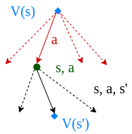

# 强化学习中的价值迭代与策略迭代

[深度学习](https://www.baeldung.com/cs/category/ai/deep-learning) [机器学习](https://www.baeldung.com/cs/category/ai/ml)

[强化学习](https://www.baeldung.com/cs/tag/reinforcement-learning)

1. 引言

    我们可以通过马尔可夫决策过程（Markov Decision Process，MDP）来表述[强化学习](https://www.baeldung.com/cs/reinforcement-learning-neural-network)问题。该问题的基本要素包括环境、状态、奖励、策略和价值。

    [策略](https://www.baeldung.com/cs/ml-policy-reinforcement-learning)是从状态到行动的映射。找到最优策略就能产生最大奖励。给定一个 MDP 环境，我们可以使用动态编程算法来计算最优策略，从而在每个状态下获得尽可能高的未来奖励总和。

    动态编程算法的工作假设是，我们拥有一个完美的 MDP 环境模型。因此，我们可以使用一步前瞻法，计算所有可能行动的奖励。

    在本教程中，我们将讨论如何为给定的 MDP 寻找最优策略。更具体地说，我们将学习两种动态编程算法：值迭代和策略迭代。然后，我们将讨论这两种算法的优缺点。

2. 策略迭代

    在策略迭代中，我们首先选择一个任意策略$\boldsymbol{\pi}$。然后，我们对该策略进行迭代评估和改进，直至收敛：

    

    我们通过计算状态值函数 $V(s)$ 来评估策略 $\pi(s)$：

    \[V(s) = \sum_{s',r'}p(s', r|s,\pi(s))[r+\gamma V(s')]\]

    然后，我们通过一步前瞻来计算改进后的策略，以取代初始策略 $\pi(s)$：

    \[\pi(s) = arg\max_{a} \sum_{s',r'} p[s', r|s,a](r+\gamma V(s'))\]

    这里，r 是采取行动 a 所产生的奖励，$\gamma$ 是未来奖励的[贴现因子](https://www.baeldung.com/cs/epsilon-greedy-q-learning#2-gamma-boldsymbolgamma)，p 是过渡概率。

    一开始，我们并不关心初始策略 $\pi_0$ 是否最优。在执行过程中，我们通过重复策略评估和策略改进步骤，集中精力在每次迭代中改进策略。利用这种算法，我们会产生一连串的策略，其中每一个策略都是对前一个策略的改进：

    \[\pi_0 \xrightarrow[]{\text{E}} v_{\pi_0} \xrightarrow[]{\text{I}} \pi_1 \xrightarrow[]{\text{E}} v_{\pi_1} \xrightarrow[]{\text{I}} \pi_2 \xrightarrow[]{\text{E}} \dotsi \xrightarrow[]{\text{I}} \pi_*\xrightarrow[]{\text{E}} v_{*}\]

    我们进行政策评估和政策改进，直到政策不再改进为止：

    

    由于有限 MDP 的策略数量有限，因此定义的过程也是有限的。最终，最优策略 $\pi_*$ 和最优值函数 $v_*$ 的收敛是有保证的。

3. 价值迭代

    在值迭代中，我们通过迭代更新估计值 $\textbf{v(s)}$ 来计算最优状态值函数：

    

    我们从随机值函数 $V(s)$ 开始。每一步，我们都对其进行更新：

    \[V(s) = \max_{a} \sum_{s',r'}p[s', r|s,a](r+\gamma V(s'))\]

    因此，我们要向前看一步，并在每次迭代时遍历所有可能的行动，以找到最大值：

    

    更新步骤与策略迭代算法中的更新步骤非常相似。唯一不同的是，在值迭代算法中，我们在所有可能的行动中取最大值。

    价值迭代算法不是先评估再改进，而是一步到位更新状态价值函数。这是通过前瞻性计算所有可能的回报实现的。

    价值迭代算法保证收敛到最优值。

4. 策略迭代与价值迭代

    策略迭代和价值迭代都是动态编程算法，它们都能在强化学习环境中找到最优策略 $\boldsymbol{\pi_*}$。它们都采用贝尔曼更新的变体，并利用一步前瞻性：

    | 策略迭代       | 数值迭代       |
    |------------|------------|
    | 从随机策略开始    | 从随机值函数开始   |
    | 算法更复杂      | 算法更简单      |
    | 保证收敛       | 保证收敛       |
    | 计算成本更低     | 计算成本较高     |
    | 只需少量迭代即可收敛 | 需要更多迭代才能收敛 |
    | 速度更快       | 速度较慢       |

    在策略迭代中，我们从固定策略开始。相反，在值迭代中，我们从选择值函数开始。然后，在这两种算法中，我们都会进行迭代改进，直至达到收敛。

    策略迭代算法更新策略。价值迭代算法则是对价值函数进行迭代。不过，这两种算法在每次迭代中都会隐式更新策略和状态值函数。

    在每次迭代中，策略迭代函数都会经历两个阶段。一个阶段是评估策略，另一个阶段是改进策略。价值迭代函数通过对所有可能行动的效用函数取最大值来覆盖这两个阶段。

    值迭代算法简单明了。它将策略迭代的两个阶段合并为一个更新操作。不过，值迭代函数会一次性运行所有可能的操作，以找到最大操作值。因此，价值迭代算法的计算量更大。

    两种算法都能保证最终收敛到最优策略。然而，策略迭代算法收敛的迭代次数更少。因此，据报告，策略迭代算法比值迭代算法更快结束。

5. 结论

    我们使用 MDP 对强化学习环境进行建模。因此，计算 MDP 的最优策略会导致随着时间的推移奖励最大化。我们可以利用动态编程算法来找到最优策略。

    在本文中，我们研究了两种为 MDP 寻找最优策略的算法。策略迭代算法和价值迭代算法的工作原理相同。我们讨论了这两种算法的优缺点。
