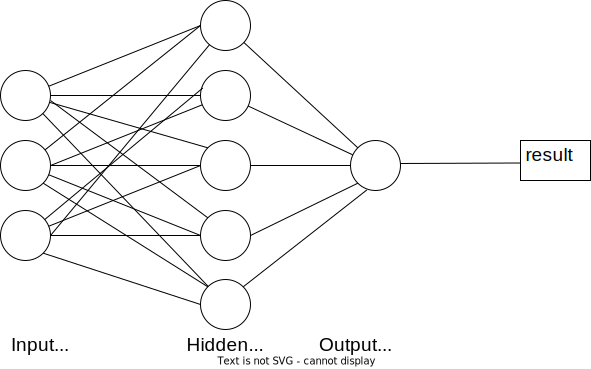
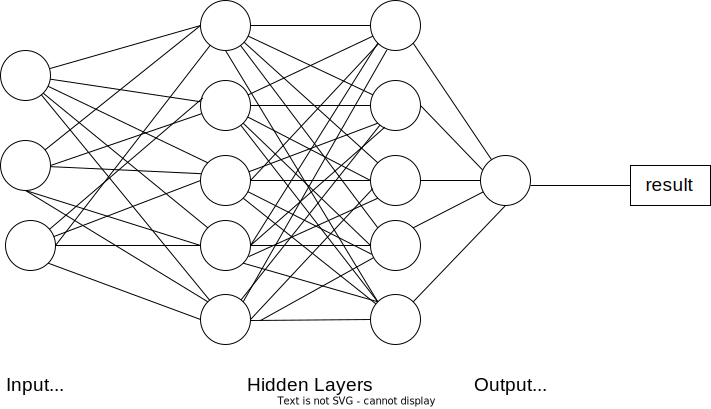

# 多层感知器与深度神经网络

[深度学习](https://www.baeldung.com/cs/category/ai/deep-learning) [机器学习](https://www.baeldung.com/cs/category/ai/ml)

[神经网络](https://www.baeldung.com/cs/tag/neural-networks)

1. 简介

    在本教程中，我们将回顾多层感知器 (MLP) 和深度神经网络 (DNN)：它们是什么、它们的结构如何、它们有哪些用途以及它们在哪些方面有所不同。

2. 多层感知器

    当我们谈论多层感知器或虚无神经网络时，我们指的是最简单、最常见的[神经网络](https://www.baeldung.com/cs/convolutional-vs-regular-nn#neural-networks)类型。MLP 最初的灵感来源于[感知器](https://www.baeldung.com/cs/svm-vs-perceptron#perceptron)，这是一种用于二元分类的监督式机器学习算法。Perceptron 只能处理线性可分离数据，因此引入了多层感知来克服这一局限。

    MLP 是一种既能处理线性可分数据又能处理非线性可分数据的神经网络。它属于一类被称为前馈神经网络的神经网络，一层的神经元以向前的方式连接到下一层，没有任何循环。

    1. 特征

        MLP 是一种人工神经网络，因此由相互连接的神经元组成，通过三层或更多层处理数据。MLP 的基本结构包括一个输入层、一个或多个隐藏层和一个输出层、一个激活函数以及一组权值和偏置：

        

        输入层是网络的初始层，接受数字形式的输入。其次是隐藏层，负责处理从输入层接收到的信息。这种处理以计算的形式进行。对隐藏层的数量没有限制，但 MLP 通常只有少量隐藏层。

        最后一层是输出层，负责产生结果。结果是通过网络对数据进行计算后的输出。

        MLP 的另一个特点是[反向传播](https://www.baeldung.com/cs/deep-learning-bias-backpropagation#2-backpropagation)，这是一种用于训练神经网络的监督学习技术。简而言之，反向传播是一种通过将输出误差传播回网络来微调神经网络权重的方法。这可以提高网络的性能，同时减少输出中的误差。

        最后，由于其简单性，MLP 通常需要很短的训练时间来学习数据中的表征并产生输出。它们通常还需要比普通计算机更强大的计算单元。配备图形处理器（GPU）的设备就是一个例子。

    2. 应用

        MLP 通常用于不可线性分离的数据，如回归分析。另外，由于其简单性，它们最适合用于复杂的分类任务和预测建模。此外，MLP 还被用于机器翻译、天气预报、欺诈检测、股市预测和信用评级预测。

3. 深度神经网络

    深度神经网络（DNN）是一种具有深度层的人工神经网络。这里的 "深层"是指网络有多层堆叠在一起，用于处理和学习数据。DNN 最初受到神经生物学的启发。特别是人类学习感知和识别物理事物的方式。

    值得注意的是，MLP 被认为是 DNN 的一个例子。卷积神经网络（CNN）和递归神经网络（RNN）也是 DNN 的其他例子。

    由于其复杂性，DNN 通常需要长时间对输入数据进行网络训练。此外，它们还需要配备专门处理单元（如张量处理单元（[TPU](https://en.wikipedia.org/wiki/Tensor_Processing_Unit)）和神经处理单元（[NPU](https://en.wikichip.org/wiki/neural_processor)））的强大计算机。

    1. 特征

        与 MLP 的结构类似，DNN 由输入层、隐藏层、输出层、权重、偏置和激活函数组成。或者，就 CNN 而言，神经网络除了上述组件外，还包括[池化层](https://www.baeldung.com/cs/ai-convolutional-neural-networks#2-pooling-layers)和卷积层。

        

    2. 应用

        DNN 因其深度层而成为一种强大的算法。因此，它们通常用于处理复杂的计算任务。计算机视觉就是其中之一。计算机视觉是人工智能的一个分支，它使计算机能够从图像和视频等视觉数据中获取意义。

        [计算机视觉](https://www.ibm.com/topics/computer-vision#:~:text=Computer%20vision%20is%20a%20field,recommendations%20based%20on%20that%20information.)任务通过使用 CNN 来完成。CNN 接收图片和视频形式的输入数据，然后处理这些数据。处理过程中，计算机能够识别类似格式的图像。这一过程类似于人类学习观察和感知周围物理环境的过程。

        DNN 的其他应用实例包括自然语言处理、基因组学、机器翻译、语音识别和自动驾驶汽车。

4. 多层感知器与深度神经网络的区别
    MLP 和 DNN 之间存在着细微的差别，这些差别体现在底层神经网络的结构以及它们用于执行的任务上。下表总结了这些差异。

    | 多层感知器        | 深度神经网络       |
    |--------------|--------------|
    | 隐藏层数少        | 隐藏层数多        |
    | 训练时间短        | 更长的训练时间      |
    | 支持 GPU 的设备即可 | 支持 TPU 的设备即可 |

5. 总结

在本教程中，我们回顾了 MLP 和 DNN。MLP 是至少有三层的神经网络，而 DNN 则是有更多层或更深层的神经网络。与传统的机器学习算法相比，DNN 和 MLP 都能够执行如此复杂的任务。
