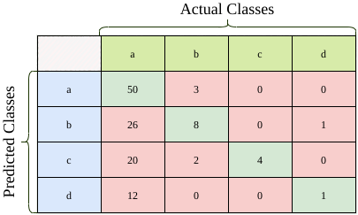

# 多级分类的 F-1 分数

[深度学习](https://www.baeldung.com/cs/category/ai/deep-learning) [机器学习](https://www.baeldung.com/cs/category/ai/ml)

1. 简介

    在本教程中，我们将讨论如何计算多类[分类问题](https://www.baeldung.com/cs/classification-model-evaluation)中的 F-1 分数。与二元分类不同，多类分类会为每个类别分别生成 F-1 分数。

    我们还将介绍如何在 Python 中计算每个分类器的平均 F-1 分数，以备需要单一分数时使用。

2. F-1 分数

    F-1 分数是衡量分类器成功与否的常用指标之一。它是精度和召回率这两个指标的[调和平均值](https://en.wikipedia.org/wiki/Harmonic_mean)。在二元分类问题中，其计算公式为

    \[\textrm{F-1 Score} = \frac{2 \times \textrm{Precision} \times \textrm{Recall}}{\textrm{Precision} + \textrm{Recall}}\]

    在以下情况下，F-1 Score 指标更为可取：

    - 我们的类分布不平衡
    - 我们正在寻找精确度和召回率（第一类错误和第二类错误）之间的平衡指标

    由于 F-1 分数对数据分布更敏感，因此它适合用于不平衡数据集上的分类问题。

3. 多类 F-1 分数计算

    对于多类分类问题，我们不计算总的 F-1 分数。取而代之的是，我们以 "一比一"的方式计算每个类别的 F-1 分数。在这种方法中，我们分别对每个类别的成功率进行评分，就好像每个类别都有不同的分类器一样。

    下面是一个混淆矩阵，共有 127 个样本：

    

    现在我们来计算第一个类别（即类别 a）的 F-1 分数：

    \[\textrm{Precision}(class=a) = \frac{TP(class=a)}{TP(class=a) + FP(class=a)} = \frac{50}{53} = 0.943\]

    \[\textrm{Recall}(class=a) = \frac{TP(class=a)}{TP(class=a) + FN(class=a)} = \frac{50}{108} = 0.463\]

    然后，我们应用 a 类的公式：

    \[\textrm{F-1 Score}(class=a) = \frac{2 \times \textrm{Precision}(class=a) \times \textrm{Recall}(class=a)}{\textrm{Precision}(class=a) + \textrm{Recall}(class=a)} = \frac{2 \times 0.943 \times 0.463}{0.943 + 0.463} = 0.621\]

    同样，我们首先计算其他类别的精确度和召回率：

    

    然后计算出每个类别的 F-1 分数：

    \[\textrm{F-1 Score}(class=b) = \frac{2 \times 0.228 \times 0.615}{0.228 + 0.615} = 0.333\]

    \[\textrm{F-1 Score}(class=c) = \frac{2 \times 0.154 \times 1.000}{0.154 + 1.000} = 0.267\]

    \[\textrm{F-1 Score}(class=d) = \frac{2 \times 0.077 \times 0.500}{0.077 + 0.500} = 0.133\]

4. 实现

    在 Python sci-kit learn 库中，我们可以使用 [F-1 score](https://scikit-learn.org/stable/modules/generated/sklearn.metrics.f1_score.html) 函数来计算多类分类问题的每类得分。

    我们需要将平均参数设置为 "无"，以输出每类得分。

    例如，假设我们有一系列真实 y 值（y_true）和预测 y 值（y_pred）。然后，让我们输出每类的 F-1 分数：

    ```python
    from sklearn.metrics import f1_score
    f1_score(y_true, y_pred, average=None)
    ```

    在我们的例子中，计算出的输出结果是：

    `array([0.62111801, 0.33333333, 0.26666667, 0.13333333])`

    另一方面，如果我们想评估单一的 F-1 分数以便于比较，可以使用其他平均方法。为此，我们需要设置平均参数。

    下面我们将研究三种常见的平均方法。

    第一种方法，micro 全局计算正负值：

    `f1_score(y_true, y_pred, average='micro')`

    在我们的示例中，得到的输出结果是：

    0.49606299212598426

    另一种平均方法是宏法，取每个类的 F-1 分数的平均值：

    f1_score(y_true, y_pred, average='macro')

    得到输出结果：

    0.33861283643892337

    请注意，宏方法对所有类别一视同仁，与样本大小无关。

    不出所料，微观平均值高于宏观平均值，因为多数类（类 a）的 F-1 分数最高。

    本教程要考虑的第三个参数是加权。类的 F-1 分数是通过使用类中实例的数量作为权重来平均的：

    f1_score(y_true, y_pred, average='weighted')

    生成输出：

    0.5728142677817446

    在我们的例子中，加权平均得到了最高的 F-1 分数。

    我们需要根据手头的问题选择是否使用平均值。

5. 结论

    在本教程中，我们介绍了如何在多类分类问题中计算 F-1 分数。

    首先，我们介绍了计算每类 F-1 分数的 "1-vs-rest" 方法。

    此外，我们还介绍了用 Python 计算单个平均分数的三种方法。
