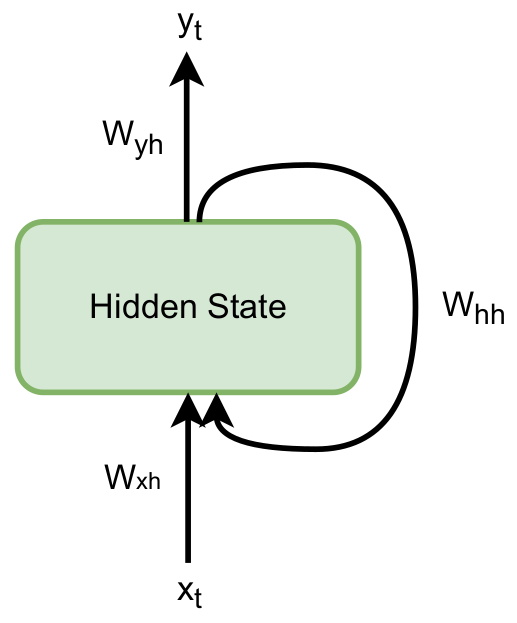
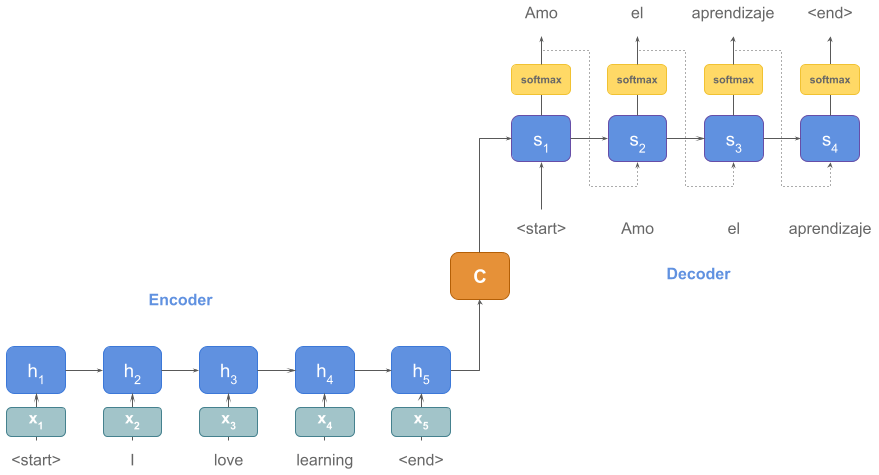
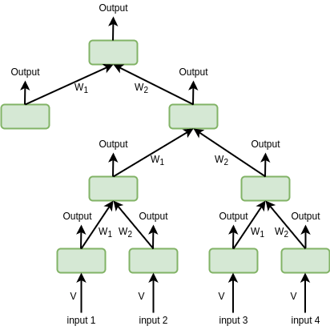
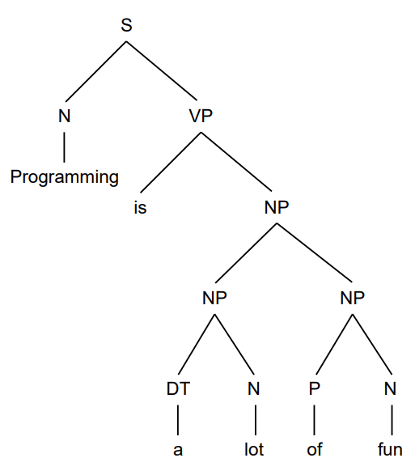
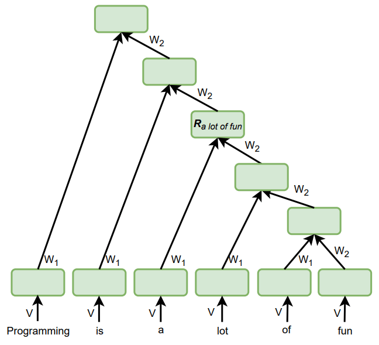

# 自然语言处理中的递归与递归神经网络

[机器学习](https://www.baeldung.com/cs/category/ai/ml) [深度学习](https://www.baeldung.com/cs/category/ai/deep-learning)

[自然语言处理](https://www.baeldung.com/cs/tag/nlp) [神经网络](https://www.baeldung.com/cs/tag/neural-networks)

1. 概述

    递归神经网络（RNN）是众所周知的能够处理连续数据的网络。与之密切相关的是递归神经网络（RvNN），它可以处理分层模式。

    在本教程中，我们将回顾 RNN、RvNN 及其在自然语言处理 (NLP) 中的应用。此外，我们还将介绍这些模型在 NLP 任务中的一些优缺点。

2. 递归神经网络

    RNN 是一类可以表示时间序列的神经网络，这使得它们在 NLP 任务中非常有用，因为语言数据（如句子和段落）具有序列性。

    1. 定义

        让我们想象一个任意长度的序列 $x_1, x_2, \ldots,$。

        一个 RNN 按所谓的时间步长每次处理一个元素。在第 t 步，它产生输出 $y_t$，并具有隐藏状态 $h_t$，作为子序列 $x_1, x_2, \ldots, x_t$ 的表示。

        RNN 通过合并 $h_{t-1}$ 和 $x_{t-1}$ 计算隐藏状态 $h_t$。它将它们与矩阵 $W_{hh}$ 和 $W_{xh}$ 相乘，并将变换 $f_W $应用于总和：

        \[ h_t = f_W(W_{hh}h_{t-1} + W_{xh}x_{t-1}) \]

        然后，输出 $y_t$ 是矩阵 $W_{yh}$ 与 $h_t$ 的乘积：

        \[ y_t = W_{yh}h_t \]

        由于各步的矩阵相同，因此网络的示意图很简单：

        
    2. 训练

        训练网络包括学习变换矩阵。梯度下降算法（[Gradient Descent algorithm](https://www.baeldung.com/cs/understanding-gradient-descent)）是一种广泛使用的学习算法。

        通常，我们会随机初始化权重和第一个隐藏状态。对于函数 $f_W$，有多种选择。例如，我们可以使用 $\tanh$ 函数：

        \[ \tanh (z) = \frac{e^{2z} - 1}{e^{2z} + 1} \]

    3. 示例：机器翻译

        作为一个例子，我们可以看看机器翻译的编码器-解码器模型。在这种情况下，编码器接收原语句子，解码器生成目标语译文。让我们假设原语是英语，目标语是西班牙语：

        
        我们可以将 RNN 用于机器翻译系统的编码器和解码器部分。 虽然每个句子中的单词数量可能会有所不同，但无论序列有多长，RNN 都会处理序列，直到到达结束标记。因此，我们看到了 RNN 在实际应用中的优势。

    4. 自然语言处理的优势

        RNN 的优势主要体现在三个方面。首先，它们可以处理任意长度的输入。而 CNN 等其他网络只能处理固定长度的输入。因此，我们可以在不改变网络结构的情况下，将 RNN 用于处理短序列和长序列。

        第二个好处是，隐藏状态就像某种类型的存储器。当网络逐一处理序列中的元素时，隐藏状态会存储并整合整个序列的信息。

        最后，RNN 的第三个优点是，它们在不同的时间步骤中共享权重。这使得网络在处理不同长度的序列时，可以保持相同的大小（参数数量相同）。

    5. 自然语言处理的缺点

        我们还可以考虑 RNN 的三个缺点。首先，由于 RNNs 的序列特性，其训练速度可能较慢。换句话说，由于网络某一步的输入来自前一步，因此很难并行执行这些步骤来加快训练速度。

        其次，RNN 有一个称为梯度消失或梯度爆炸的问题。前一个问题发生在许多梯度相乘小于 1 的情况下。其结果是一个接近零的值，因此对权重更新没有贡献。后一种情况发生在梯度乘以大于 1 的多个梯度时，因此结果会爆炸。解决方法是使用[非线性激活函数](https://www.baeldung.com/cs/ml-nonlinear-activation-functions)，如 ReLU，它不会产生小导数。此外，RNN 的其他变体，如长短时记忆（LSTM），也能解决这个问题。

        最后一个问题是，普通 RNN 难以处理序列中的长期依赖关系。当我们拥有一个长序列时，可能会出现长期依赖关系。如果序列中的两个互补元素相距甚远，网络就很难意识到它们之间的联系。例如，让我们来看看这个序列：

        Programming is a lot of fun and exciting especially when you’re interested in teaching machines what to do. I’ve seen many people from five-year-olds to ninety-year-olds learn it.

        在这里，句末的 it 指的是编程，也就是第一个单词。在这两个词之间，还有许多其他词，这可能会导致 RNN 错过连接。即使 RNN 具有某种记忆类型，这种情况也会发生。不过，LSTM 可以解决这个问题。

3. 递归神经网络（RvNNs）

    RvNNs 是 RNNs 的泛化。与只能处理顺序数据的 RNNs 相比，RvNNs 因其树状结构而可以学习分层模型。树中每个节点的子节点数是固定的，因此可以执行递归操作，并在各个步骤中使用相同的权重。

    1. 定义

        RvNNs 的树状结构意味着，要将子节点合并并生成父节点，每个子节点-父节点连接都有一个权重矩阵。相似的子节点共享相同的权重。换句话说，考虑到二叉树，所有右边的子节点共享一个权重矩阵，所有左边的子节点共享另一个权重矩阵。此外，我们还需要一个初始权重矩阵（V）来计算每个原始输入的隐藏状态：

        
        因此，权重矩阵的数量等于节点的子节点数量。我们可以通过加权矩阵（$W_i$）和子节点表示（$C_i$）的乘积求和，并应用变换 f 来计算父节点的表示：

        \[h = f \left( \sum_{i=1}^{i=c} W_i C_i \right) \]

        其中 c 是孩子的数量。

    2. 训练

        RvNNs 的训练与 RNNs 相似，采用相同的优化算法。模型需要学习的每个子节点都有一个权重矩阵（$W_1, W_2, \ldots, W_c$）。这些权重矩阵在同一位置的后续子节点的不同递归中共享。

    3. 示例：语法分析

        RvNN 在 NLP 中的主要应用之一是[自然语言句子的句法分析](https://icml.cc/2011/papers/125_icmlpaper.pdf)。

        在解析句子时，我们要识别其较小的组成部分，如名词或动词短语，并将它们组织到句法层次结构中：

        
        由于 RNN 只考虑顺序关系，因此与 RvNN 相比，它们不太适合处理分层数据。比方说，我们要捕捉这个句子中 a lot of fun 这个短语的表示：

        Programming is a lot of fun.

        RNN 会如何表示这个短语呢？由于每个状态都取决于前面单词的表示，因此我们无法表示不是从句子开头开始的子序列。因此，当我们的 RNN 处理单词 fun 时，该时间步的隐藏状态将表示整个句子。

        相比之下，RvNN 的分层架构可以存储精确短语的表示：

        
        它位于节点 $R_{a\ lot\ of\ fun}$ 的隐藏状态中。

    4. 自然语言处理的优势

        RvNNs 在 NLP 任务中的两个主要优势是其结构和降低网络深度。

        正如我们所看到的，RvNNs 的树形结构可以处理分层数据，比如在解析问题中。

        RvNNs 的另一个优势是树的高度可以是对数。更具体地说，当我们有 O(n) 个输入词时，RvNN 可以返回一棵高度为 $O(log\ n)$ 的二叉树。由于这减少了第一个和最后一个输入元素之间的距离，因此长期依赖关系变得更短，更容易捕捉。

    5. 自然语言处理的缺点

        RvNN 的树状结构也可能是一个缺点。使用它们意味着我们要为模型引入一种特殊的[归纳偏差](https://www.baeldung.com/cs/ml-inductive-bias)。这里的归纳偏差是指假设数据遵循树状层次结构。然而，当情况并非如此时，网络可能无法学习到现有的模式。

        RvNNs 的另一个问题是，解析过程可能会很慢，而且模棱两可。特别是，一个句子可能有多个解析树。

        此外，为 RvNNs [标注]训练数据比构建 RNNs 更费时费力。手动将序列解析为更小的组成部分比给序列分配标签要花费更多的时间和精力。

4. RNN与RvNN：总结

    何时使用RNNs

    - 顺序数据
    - 不同长度的输入

    何时使用RvNNs

    - 分层数据
    - 较浅的网络
5. 总结

    在本文中，我们介绍了用于自然语言处理的递归神经网络（RNN）和递归神经网络（RvNN）的优缺点。

    它们的主要区别在于能够捕捉数据中的模式类型。RNN 可以处理顺序数据，而 RvNN 可以发现层次模式。

- [ ] [Recurrent vs. Recursive Neural Networks in Natural Language Processing](https://www.baeldung.com/cs/networks-in-nlp)
