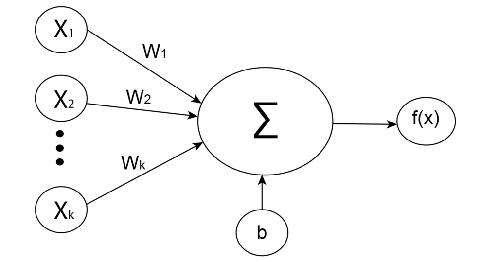
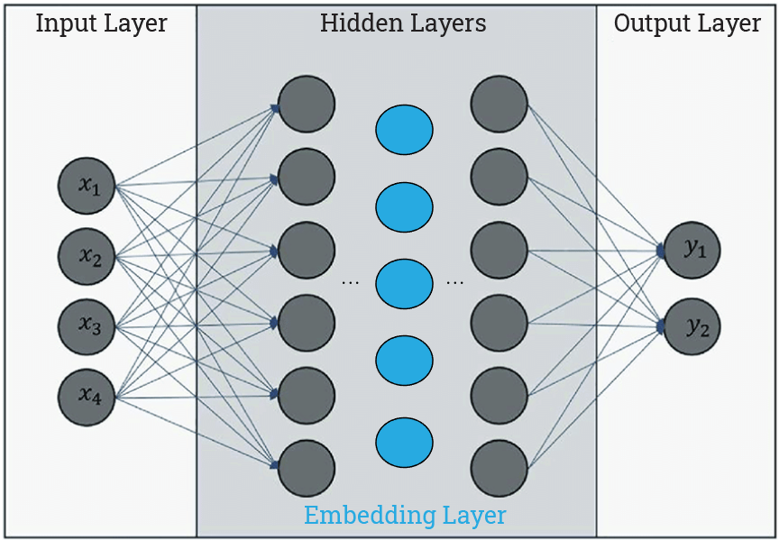

# 什么是神经网络中的嵌入层？

[深度学习](https://www.baeldung.com/cs/category/ai/deep-learning)

[神经网络](https://www.baeldung.com/cs/tag/neural-networks)

1. 介绍

    在本教程中，我们将深入探讨神经网络的结构。更准确地说，我们将解释神经网络中的嵌入层及其应用。

    为了更好地理解它，首先，我们需要简要解释一下什么是神经网络以及神经网络的一些组成部分。

2. 神经网络

    神经网络是一种模仿人脑结构和功能的算法。它们旨在模拟生物神经网络，由相互连接的 "神经元"组成。一般来说，神经网络的目标是创建一个人工系统，以类似人脑的工作方式处理和分析数据。

    神经网络有多种类型，每种类型都有特定的特点和应用。大体上，我们可以将其分为三类：

    - 全连接神经网络（普通神经网络）
    - 卷积神经网络
    - [递归神经网络](https://www.baeldung.com/cs/nlp-encoder-decoder-models#2-basic-rnn-units)

    它们之间的主要区别在于组成它们的神经元类型以及信息如何在网络中流动。

3. 神经网络的组成

    如上所述，神经网络有多种类型，每种类型都有特定的特征和组成部分。尽管如此，神经网络的某些要素对于大多数神经网络来说是共通的。

    1. 人工神经元

        人工神经元是神经网络的基本构件。它们是以生物神经元为模型的单元。每个人工神经元接收输入并产生一个输出，然后将输出发送给由其他神经元组成的网络。

        输入通常是来自外部数据样本的数值，但也可以是其他神经元的输出。基本上，一个神经元接收一个输入值，对其进行简单计算，然后将结果传送给前面的神经元。

        在数学上，使用加权和来描述人工神经元是最简单的方法：

        (1) \[\begin{align*} z = w_{1}x_{1} + w_{2}x_{2} + ... + w_{k}x_{k} + b\end{align*}\]

        其中，$w_{i}$ 为权重，$x_{i}$ 为输入，b 为偏置。然后，对加权和 z 应用激活函数 f，它代表神经元的最终输出：

        

    2. 层

        在神经网络中，层是一组执行特定任务的神经元。神经网络有多层相互连接的神经元，每一层都执行特定的功能。

        根据神经网络中的位置，可分为三类层：

        - 输入层--负责接收输入数据并将其传递给下一层。这是神经网络的第一层
        - [隐藏层](https://www.baeldung.com/cs/hidden-layers-neural-network)--除了[感知器](https://www.baeldung.com/cs/svm-vs-perceptron#perceptron)等一些单层类型外，几乎所有类型的神经网络都有隐藏层。神经网络中可以有多个隐藏层。隐藏层的数量和每层中神经元的数量会因解决问题的复杂程度而有所不同。
        - 输出层--神经网络的最后一层，产生最终输出或预测结果。

4. 嵌入层

    嵌入层是神经网络中隐藏层的一种。用一句话来说，这一层将输入信息从高维空间映射到低维空间，从而让网络了解更多输入之间的关系，并更有效地处理数据。

    例如，在自然语言处理（NLP）中，我们通常将单词和短语表示为[一热向量](https://www.baeldung.com/cs/one-hot-encoding)，其中每个维度对应词汇表中的一个不同单词。这些向量既高维又稀疏，因此很难处理。

    与其使用这些高维向量，嵌入层可以将每个词映射到一个低维向量，其中每个维度代表该词的一个特定特征：

    

    理论上，每个隐藏层都可以代表一个嵌入层。我们可以提取任何隐藏层的输出，并将其视为嵌入向量。不过，问题的关键不仅在于降低输入维度，还在于在它们之间建立有意义的关系。

    这就是为什么特定类型的神经网络只用于生成嵌入。

5. 嵌入层的类型

    嵌入层的类型取决于神经网络和嵌入过程。嵌入有以下几种类型：

    - 文本嵌入
    - 图像嵌入
    - 图形嵌入及其他

    1. 文本嵌入

        文本嵌入可能是最常见的嵌入类型。这要归功于 转换器(transformers) 和语言模型的普及。

        语言模型的一个例子是由 OpenAI 团队制作的 ChatGPT。简而言之，它采用 GPT-3 架构，由两个主要部分组成：编码器和解码器。当然，编码器部分会将输入文本转换为嵌入向量，解码器部分则利用嵌入向量生成答案并将其转换回文本输出。

        GPT-3 是一个同时具有编码器和解码器部分的转换器模型，而对于只有编码器部分的嵌入任务来说，更合适的转换器模型是 BERT。它是一个预先训练好的模型，可以编码字符、单词或句子等语言表征，因此我们可以将嵌入向量用于其他任务。

        值得一提的是，基于转换器的模型会创建上下文嵌入。这意味着同一个词如果出现在不同的语境中，很可能会得到不同的嵌入向量。与此相反，还有一些流行的非上下文架构，如 [word2vec](https://www.baeldung.com/cs/word2vec-word-embeddings#word2vec) 和 GloVe。

    2. 图像嵌入

        图像嵌入是一种将图像表示为密集嵌入向量的技术。这些向量捕捉了图像的一些视觉特征，我们可以用它们来完成图像分类、物体检测等类似任务。

        我们可以使用一些流行的预训练卷积神经网络（CNN）来生成图像嵌入。其中包括 [NFNets](https://www.baeldung.com/cs/deep-cnn-design#4-nfnets)、[EfficientNets](https://www.baeldung.com/cs/deep-cnn-design#5-efficientnets)、[ResNets](https://www.baeldung.com/cs/deep-cnn-design#3-resnets) 等。除了 CNN，视觉转换器模型最近也很流行。

    3. 图嵌入

        与图像类似，我们使用图嵌入将图表示为低维空间中的密集嵌入向量。此外，图嵌入通常与节点嵌入相关，其目标是为每个节点而不是整个图创建一个嵌入向量。

        一些流行的图嵌入算法包括

        - 局部线性嵌入 (LLE)
        - 深度行走
        - Node2vec 及其他

6. 结论

    本文概述了神经网络、人工神经元和神经网络层的基础知识。主要目的是解释神经网络中嵌入层的目的。此外，我们还解释了嵌入层的一些应用。

    总之，我们在神经网络中使用嵌入层将输入信息转换为低维向量空间，其中每个向量分量都是一个特定的输入特征。
