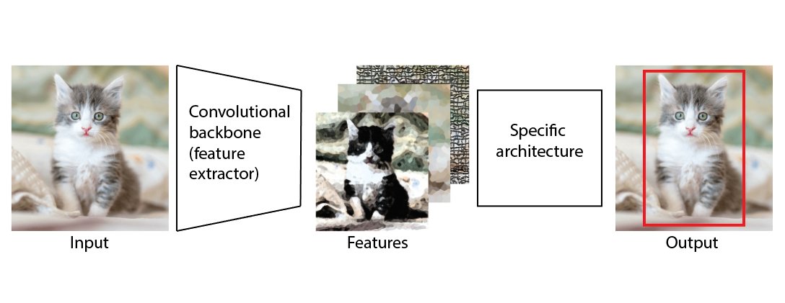

# 神经网络中的主干是什么意思？

[深度学习](https://www.baeldung.com/cs/category/ai/deep-learning) [机器学习](https://www.baeldung.com/cs/category/ai/ml)

[神经网络](https://www.baeldung.com/cs/tag/neural-networks)

1. 简介

    神经网络是一种机器学习算法，主要组成部分是层和节点。

    有些神经网络架构有一百多层和多个逻辑部分，用于解决不同的子问题。神经网络骨干就是其中之一。

    在本教程中，我们将介绍什么是骨干网以及最常用的骨干网类型。

2. 神经网络

    神经网络是明确以生物神经网络为灵感而设计的算法。最初的目标是创建一个与人脑功能类似的人工系统。神经元和神经层是神经网络的主要组成部分。

    根据神经元层和神经元的类型，神经网络可分为三大类：

    - 全连接神经网络（常规神经网络）
    - 卷积神经网络
    - 递归神经网络

    例如，卷积神经网络更适合处理图像，而递归神经网络则更适合处理序列类型的数据。为了解释神经网络中的骨干代表什么，我们将以卷积神经网络中的骨干为例。此外，在大多数文献中，骨干都是在卷积神经网络的背景下出现的。

3. 卷积神经网络

    卷积神经网络（CNN）是一种人工神经网络，我们主要用它来对图像进行分类、定位物体，并从图像中提取边缘或角落等特征。CNN 的成功是因为它们可以处理大量数据，如图像、视频和文本。

    这些网络使用卷积运算来处理输入数据。当输入图像时，CNN 可以学习不同的特征。例如

    - 网络的初始层学习线、点、曲线等低级特征。
    - 网络中间层学习建立在低级特征之上的对象。
    - 顶层可以根据前几层的特征理解高层特征，并完成分配的任务。

    除此之外，还可以使用使用不同数据训练过的预训练网络。这要归功于迁移学习技术。例如，神经网络在一个数据集上学习了一些模式，稍加调整后，就可以在另一个数据集上使用这些模式。当然，数据集越相似，我们所能期待的结果就越好。

4. 神经网络中的骨干网

    除了图像分类，更复杂的 CNN 架构还能解决不同的计算机视觉任务，如物体检测或分割。借助迁移学习，我们可以在另一个最初为图像分类而训练的 CNN 的基础上建立用于物体检测的架构。在这种情况下，我们使用 CNN 作为特征提取器，它实际上是物体检测模型的骨干：

    

    一般来说，骨干指的是将输入数据处理成某种特征表示的特征提取网络。这些特征提取网络通常作为独立网络在较简单的任务中表现良好，因此，我们可以将它们作为较复杂模型中的特征提取部分。

    我们可以将许多[流行的CNN架构](https://www.baeldung.com/cs/deep-cnn-design#popular-cnn-architectures)用作神经网络的骨干。其中包括：

    - VGG - 包括 16 层和 19 层的 VGG-16 和 VGG-19 卷积网络。事实证明，它们在许多任务中都很有效，尤其是在图像分类和物体检测方面。
    - ResNets - 或称残差神经网络，由卷积层和汇集层块之间的跳接或递归单元组成。一些流行的 ResNet-50 和 ResNet 101 版本常用于物体检测和语义分割任务。
    - Inception v1 - GoogleNet 是最常用的卷积神经网络之一，是许多计算机科学应用（包括视频摘要和动作识别）的骨干网络。

5. 结论

    在本文中，我们介绍了神经网络中的骨干网络以及最流行的骨干网络。我们通常在计算机视觉中使用骨干这一术语。它代表了一种流行的 CNN，具有用于更复杂神经网络架构的特征提取功能。
