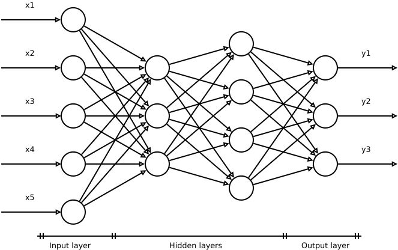

# 什么是神经网络中的 "瓶颈"？

[深度学习](https://www.baeldung.com/cs/category/ai/deep-learning) [机器学习](https://www.baeldung.com/cs/category/ai/ml)

[神经网络](https://www.baeldung.com/cs/tag/neural-networks)

1. 简介
    在本教程中，我们将研究信息瓶颈原理（IB）。通过该原理，我们可以定性地理解多级神经网络 (DNN) 的内部工作原理，并为其提供定量证据。其结果是明确了可用作 DNN 训练指导原则的限制。
    IB 与我们可以考虑的另一个更具定性性质的原则直接相关：最小互信息（MinMI）原则。
2. 最小互信息原则
    任何基于神经网络的预测系统的基本问题都是识别未知函数，以实现数据集输入（X）和输出（Y）之间的最佳映射。训练过程包括确定神经网络的一系列内部参数，以便达到这一最佳值。接下来，我们将把每个中间层或网络的[隐藏层](https://www.baeldung.com/cs/hidden-layers-neural-network)称为神经网络：

    

    在网络的隐藏层中发生了什么，以及为什么这个过程如此有效，目前在很大程度上还不得而知。这就是它们被称为黑盒模型的原因。
    [MinMI原则](https://www.researchgate.net/publication/24011684_The_minimum_information_principle_and_its_application_to_neural_code_analysis)或最小信息原则已被应用于神经编码。它考虑了一个与识别最佳值相关的基本量，即输入和输出之间的[相互信息](https://www.baeldung.com/cs/cs-entropy-definition)，我们可以将离散和连续情况分别定义为：

    \[I(X;Y)=\sum_{y}\sum_{x}p(x,y)\ln\frac{p(x,y)}{p(x)p(y)}\]

    \[I(X;Y)=\int\int p(x,y)\ln\frac{p(x,y)}{p(x)p(y)}\,dxdy\]

    其中，x, y 是随机变量，p (x, y)是联合概率，p (x)、p (y) 是边际概率。相互信息总是正的。
    I (X; Y) 是衡量两个变量之间[相互依赖性](https://en.wikipedia.org/wiki/Mutual_information)的指标。更具体地说，它量化了我们通过观察一个随机变量而获得的关于另一个随机变量的信息量。
    假设有一组 DNN 与观测结果一致，并与问题相匹配。每个 DNN 都有一组内部参数，这些参数是训练过程的主题。MinMI 证明，互信息最小的 DNN 即为最优结构。

    1. MinMI 原则，为什么？
        本节标题中的问题是有道理的。从表面上看，I (X; Y)由于互信息是 X 和 Y 之间的依赖关系的度量，我们可能会期望互信息最大化，而不是最小化。
        然而，事实并非如此。在我们可以构建的与问题相匹配的所有可能的 DNN 中，大多数结构都明确了输入和输出之间的映射，其中包含数据中真实关系的附加上层结构。噪声和[共线性](https://www.baeldung.com/cs/correlation-classification-algorithms)(collinearity)等影响是实现最优的障碍。
        如果我们参考数据集的维度，就能进一步澄清这一事实。通常，输入X的维度较高，而输出Y的维度较低。这意味着，这意味着，一般来说，X 的大部分熵对 Y 的信息量不大。X 的相关特征高度分散，难以提取。

        这些畸变有助于 I (X;Y)，因为它们是将 X 和 Y 联系在一起的信息形式（尽管并不理想），会增加 I (X;Y)的值。因此，互信息的最小化使我们的神经网络更接近于识别只包含相关信息的映射，从而建立一个高效的预测系统，即数据中存在的真实关系。

    2. 压缩
        将这些考虑付诸实践的一种方法，也是 DNN 和其他类似预测系统高效的原因，就是将网络置于必须进行[压缩](https://www.baeldung.com/cs/principal-component-analysis)的条件下。
        使用非形式语言，假设 DNN 的结构在隐藏层中存在某种 "神经元缺陷(neuron deficient)"。在这种情况下，一般不可能将数据中的所有信息从一个隐藏层传输到下一个隐藏层。训练过程导致 DNN 寻求折中，表现为压缩原始信息。

        压缩意味着信息的损失，但这是一种 "可控 "的损失，因为我们的控制参数一般是预测结果与测量数据之间偏差的度量，而测量数据在训练过程中会不断施加压力。最终的结果是 I (X; Y) 的值减小，这个值是由一个结构给出的，这个结构包含的关系比压缩前的结构更接近数据中存在的真实关系，而且许多上层结构都被消除了。在所有隐藏层上重复这一过程可以进一步校准整个过程。

        换句话说，我们知道 I (X; Y)> 0。如果 X 和 Y 是独立的，那么 p (x, y) = p (x) p (y)，我们就得到了：

        \[I(X;Y)=\sum_{y}\sum_{x}p(x)p(y)\ln\frac{p(x)p(y)}{p(x)p(y)}=\sum_{y}\sum_{x}p(x)p(y)\ln1=0\]

        在这种情况下，没有关系可寻，也就不可能建立预测系统。

        I（X；Y）的压缩和最小化概念直接将我们引向 IB 原理。
3. IB 原理
    1. 数据处理不等式和马尔可夫链
        数据处理不等式（Data Processing Inequality，DPI）是一个信息论概念，它指出任何数据处理都不会增加其熵。从数据集和我们所考虑的预测系统的角度来看，它可以被理解为 "数据的后处理不能增加信息"。

        当我们通过一组概率来选择符号时，我们处理的是随机过程。当随机过程的符号选择取决于先前选择的符号或事件时，我们就得到了一个[马尔可夫过程](https://www.baeldung.com/cs/cs-entropy-definition)。

        如果三个随机变量组成一个[马尔可夫链](https://www.baeldung.com/cs/markov-chains-vs-hidden-markov-models)，X \rightarrow Y \rightarrow Z，那么 Z 的条件概率只取决于 Y，而与 X 条件独立：

        \[I (X; Y) \geq I (X; Z)\]

        如果我们用 I (X; Y | Z) 表示 X 和 Y 之间的残余信息，即 Z 没有捕捉到的相关信息，那么前面的表达式在 I (X; Y | Z) = 0 时实现相等，即当验证 Y 和 Z 包含的关于 X 的信息量相同时。

    2. 输入的最小充分统计量
        对输入 X 的压缩可以捕捉到相关的特征，剔除与预测 Y 无关的特征。MinMI 原则指出，这一过程会导致 I（X；Y）的减少。这个量的最小值可以让我们找出 X 的最简单映射，我们称之为 $\hat {X}$，它可以捕捉到互信息 $I (X; Y)$。$\hat {X}$ 是 X 相对于 Y 的最小充分统计量。

        DPI 使我们能够定性地理解 MinMI 原则的原因，因为

        \[I (X; Y) \geq I (\hat {X}; Y)\]

        如果我们用 $\hat {Y}$ 表示输出预测，那么 DPI 还提供了另一个重要的关系：

        \[I (X; Y) \geq I (Y; \hat {Y})\]

        当且仅当$\hat {X}$是充分统计时，预测结果才是相等的。

        我们可以把识别$（\hat {X}）$和预测的过程看作一个马尔科夫链：

        \[X \rightarrow \hat {X} \rightarrow Y\]

        这种方法是有问题的。对于一般分布 p (X, Y) 可能不存在精确的最小充分统计量，从而导致马尔科夫链不正确。然而，我们可以用另一种方法来确定 $\hat {X}$。
    3. 最小充分统计量的最小条件
        让我们考虑一下马尔科夫链

        \[Y \rightarrow X \rightarrow \hat {X}\]

        我们可以把对$\hat {X}$的搜索看作是 $I (X; \hat {X})$的最小化。这个标准本身是不够的，因为我们可以通过消除输入中的相关信息来减少这个量。我们必须有另一个条件。

        另一方面，即使 $\hat {X}$ 的识别一般是由压缩过程和 $I (X; Y)$ 的最小化给出的，但充分统计必须是信息量最大的，即 $I (\hat {X}; Y)$ 必须是最大的。

        通过这两个条件，我们可以构建下面的拉格朗日(Lagrangian)：

        \[\mathcal {L} [p (\hat {x} | x)] = I (X; \hat {X}) - \beta I (\hat {X}; Y )\]

        其中 $\beta> 0$ 是一个取决于问题的参数，它平衡了表示的复杂性 $I (X; \hat {X})$和保留的相关信息量 $I (\hat {X}; Y)$。这个函数有一个最小值，可以通过变分过程找到。如果我们考虑未被$（\hat {X}）$捕获的相关信息，可以写出等价表达式：

        \[\mathcal {L} [p (\hat {x} | x)] = I (X; \hat {X} ) + \beta I (X; Y | \hat {X})\]

        这样，我们就有了一个可以应用于 DNN 优化的最小标准。

    4. DNN 中的 IB
        通过前面的讨论，我们可以进一步了解神经网络训练中一些行之有效的启发式方法，例如寻找尽可能紧凑的架构。事实上，IB 原理告诉我们，DNN 的学习方法是提取信息量最大的特征，逼近 X 的最小充分统计量。

        在 DNN 中，每一级都完全依赖于前一级的输出。因此，我们可以把它当作一个马尔可夫过程来研究：

        \[X \rightarrow h_{j} \rightarrow h_ {i} \rightarrow Y\]

        当 i> j。

        由于根据 DPI，从一个层级到下一个层级不会增加熵，所以我们可以写成：

        \[I (Y; X) \geq I (Y; h_{j}) \geq I (Y; h_ { i}) \geq I (Y; \hat {Y})\]

        如果每个层级都是其输入的充分统计量，我们就能在每个层级实现相等。

        因此，每一级都必须传递尽可能多的相关信息，同时尽量减少表示的复杂性。也就是说，每一级都必须最大化 $I (Y; h_{i})$，同时最小化 $I (h_ {i-1}; h_ {i})$。

        > 再次强调 MinMI 原则。请注意，最后一个量相当于单个网络层中的 $I (X; Y)$）。

4. 结论
    在本教程中，我们将简要介绍 IB 原理的基本问题。它是一种对 DNN 内部运作具有巨大解释潜力的形式主义，同时还能让我们量化训练过程中发生的事情。

    由于该课题的复杂性，我们无法对其进行全面讨论。我们尚未考虑的问题包括与泛化极限有关的方程（我们可以从形式主义中推导出），以及对 BI 扭曲曲线的分析，从中可以确定分叉点，这可以与不同网络拓扑结构之间的相变相联系。

    有兴趣的读者可以从这些方面入手进行进一步研究。
