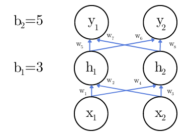
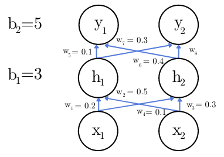
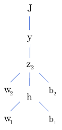
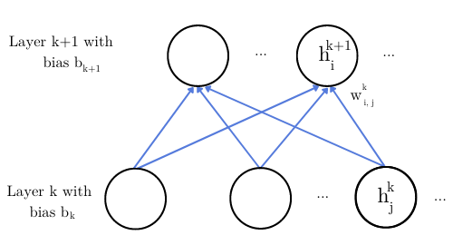

# 反向传播网络与前馈网络的区别

[深度学习](https://www.baeldung.com/cs/category/ai/deep-learning) [机器学习](https://www.baeldung.com/cs/category/ai/ml)

[神经网络](https://www.baeldung.com/cs/tag/neural-networks) [训练](https://www.baeldung.com/cs/tag/training)

1. 简介

    许多深度学习框架都为我们提供了直观的界面来设置层、调整超参数和评估模型。但要正确讨论结果，更重要的是要理解网络是如何工作的，我们需要熟悉基本概念。

    在本教程中，我们将讨论反向传播（或 Backprop）和前馈神经网络。

2. 前馈神经网络

    前馈网络是典型的深度学习模型。它们由按层组织的人工神经元组成。

    1. 人工神经元如何工作？

        神经元是一种规则，它将输入向量 $x_1, x_2, \ldots, x_n$ 转换为输出信号，我们称之为激活值 h：

        (1) \[\begin{equation*} h = \sigma(z) = \sigma \left(b + \sum_{i=1}^{n}w_i\cdot x_{i}\right) \end{equation*}\]

        其中，b 是神经元的偏置，$w_i$ 是神经元的权重，$\sigma$ 是[激活函数](https://www.baeldung.com/cs/ml-nonlinear-activation-functions)，如 ReLU 或 sigmoid。例如，下面是一层中第 j 个神经元在接收到两个输入值后计算输出的过程：

        

    2. 前向传播

        层是一个神经元阵列。一个网络在输入和输出之间可以有任意数量的层。例如

        

        在图像中，$x_1$ 和 $x_2$ 表示输入，$h_1$ 和 $h_2$ 表示隐藏神经元的输出，$y_1$ 和 $y_2$ 是整个网络的输出值。偏置 $b_{1}$ 和 $b_{2}$ 的值将在训练阶段进行调整。

        前馈网络的显著特点是完全没有反馈连接。所有信号都只向前传递，从输入层到输出层。

        如果我们有哪怕一个反馈连接（将信号导向前一层的神经元），我们就会拥有一个循环神经网络。

    3. 示例

        假设我们想要开发一个分类器，用于检测图像中是否有一只狗。为了简单起见，我们假设只需检测两个灰度像素 $x_{1}$ 和 $x_{2}(x_1, x_2 \in [0, 255])$的值即可。

        假设网络只有一个隐藏层，输入为 $x_{1} =150$，$x_{2}=34$。 另外，假设我们使用身份函数 $x \mapsto x$ 作为激活函数：

        

        为了计算激活值 $h_{1}$，我们应用公式 (1)：

        (2) \[\begin{equation*} h_{1}= \sigma(z_1) = \sigma(w_{1}x_{1}+w_{2}x_{2}+b_{1}) = \sigma(0.2 \cdot 150 + 0.5 \cdot 34 + 3) = \sigma(50) \end{equation*}\]

        因为我们使用的是$\sigma$的身份函数

        (3) \[\begin{equation*} h_{1} = 50 \end{equation*}\]

        我们对 $h_{2}$、$y_{1}$ 和 $y_{2}$ 做同样的处理。对于后两者，输入是 $h_1$ 和 $h_2$ 的值。

3. 反向传播

    在训练神经网络时，成本值 J 量化了网络的误差，即其输出与基本事实的偏差。我们将其计算为训练集中所有对象的平均误差，目标是将其最小化。

    1. 成本函数

        例如，假设我们有一个将动物分类为猫或狗的网络。它有两个输出神经元 $y_1$ 和 $y_2$，前者表示动物是猫的概率，后者表示动物是狗的概率。给定一张猫的图像，我们希望 $y_1 = 1, y_2 = 0$。

        但是，如果网络输出 $y_{1}=0.25$ 和 $y_{2}=0.65$，我们就可以用距离的平方来量化对该图像的误差：

        (4) \[\begin{equation*} (0.25-0)^{2} + (0.65-1)^{2} = 0.185 \end{equation*}\]

        我们将整个数据集的成本 J 计算为单个样本的平均误差。因此，如果 $\widehat{\mathbf{y}}_i=[\hat{y}_{i, 1}, \hat{y}_{i, 2}, \ldots, \hat{y}_{i, m}]$是第 i 个训练样本$(i=1,2,\ldots,n)$，和 $\mathbf{y}_i=[y_{i,1}, y_{i,2}, \ldots, y_{i,m}]$ 是我们网络的输出，总成本 J 为：

        (5) \[\begin{equation*} J = \frac{1}{n} \sum_{i=1}^{n} || \mathbf{y}_i - \widehat{\mathbf{y}}_i ||^2 = \frac{1}{n} \sum_{i=1}^{n} \sum_{j=1}^{m} (y_{i,j} - \hat{y}_{i,j})^2 \end{equation*}\]

        我们利用代价来更新权重和偏置，从而使实际输出尽可能接近期望值。为了决定是增加还是减少某个系数，我们使用反向传播来计算其偏导数。下面我们举例说明。

    2. 偏导数

        假设我们在输入层、隐藏层和输出层中只有一个神经元：

        

        其中 $\sigma$ 是标识函数。

        为了更新权重和偏置，我们需要了解 J 对这些参数的微小变化有何反应。我们可以通过计算 J 相对于这些参数的偏导数来做到这一点。但在此之前，我们先来回顾一下问题中的变量之间的关系：

        

        因此，如果我们想了解 $w_2$ 的变化对代价函数的影响，就应该运用微积分的链式法则计算偏导数：

        (6) \[\begin{equation*}  \frac{\partial{J}}{\partial{w_{2}}} = \frac{\partial{z_{2}}}{\partial{w_{2}}} \;\frac{\partial{y}}{\partial{z_{2}}} \;\frac{\partial{J}}{\partial{y}} \end{equation*}\]

    3. 例题：计算偏导数

        在本例中，我们将求解方程 (6)，只关注权重 $w_{2}$ 以展示计算过程，但其他权重和偏置的计算方法是相同的。

        首先，我们计算一下成本函数是如何随输出变化的：

        (7) \[\begin{equation*} \frac{\partial{J}}{\partial{y}}= \frac{\partial{(y-\hat{y}})^{2}}{\partial{y}}=2(y-\hat{y}) \end{equation*}\]

        然后，我们需要计算 $z_{2}$ 的微小变化对输出值的影响。为此，我们需要找到激活函数的导数。由于我们选择了身份函数作为激活函数，因此导数为 1：

        (8) \[\begin{equation*} \frac{\partial{y}}{\partial{z_{2}}} = \frac{\partial{\sigma}}{\partial{z_{2}}} = \frac{\partial z_2}{ \partial z_2} = 1 \end{equation*}\]

        现在，唯一缺少的就是 $z_{2}$ 相对于权重的偏导数。因为 $y = \sigma(z_{2})= \sigma(w_{2} h + b_{2}) = w_2 h + b_2$，所以偏导数将是：

        (9) \[\begin{equation*} \frac{\partial{z_{2}}}{\partial{w_{2}}} = \frac{\partial({w_{2}h+b_{2})}}{\partial{w_{2}}} = h \end{equation*}\]

        现在我们有了所有项，可以计算权重 $w_{2}$ 的变化对成本函数的影响了：

        (10) \[\begin{equation*} \frac{\partial{J}}{\partial{w_{2}}} = h \sigma'(z_{2})2(y-\hat{y}) = h_{1} 2(y-\hat{y}) \end{equation*}\]

    4. 训练过程中的反向传播

        假设在训练过程中的某一时刻，h=0.0125，期望输出 $\hat{y}=1$，当前输出 y=1.2。通过反向传播，我们可以计算 $w_2$ 的偏导数：

        (11) \[\begin{equation*} \frac{\partial{J}}{\partial{w_{2}}} = 0.0125 \cdot 2 \;(1.2 -1) = 0.005 \end{equation*}\]

        现在，最后一步是将计算值乘以学习率 $\eta$ 来更新权重，在本例中我们将学[习率设](https://www.baeldung.com/cs/ml-learning-rate)为 0.01：

        (12) \[\begin{equation*} w_{2} = w_{2} - \eta \frac{\partial{J}}{\partial{w_{2}}} =  0.1 - 0.01 \cdot 0.005 = 0.09995 \end{equation*}\]

        这只是一个样本的部分导数。要得到整个数据集的导数，我们应该求出各个导数的平均值：

        (13) \[\begin{equation*} \frac{1}{n} \sum_{k=0}^{n-1}\frac{\partial{J_{k}}}{w_{2}} \end{equation*}\]

        我们可以想象，要对成千上万的参数和样本进行所有这些计算，然后再更新权重和偏差，计算成本有多高。

    5. 训练变化

        与其先计算每个样本的误差，然后再计算平均值，我们可以计算一个较小群体的误差，比如 1000 个样本，然后仅根据该群体的成本更新权重。这就是[小批量](https://www.baeldung.com/cs/mini-batch-vs-single-batch-training-data)梯度下降法。

        此外，我们还有随机梯度下降法，即在计算训练集中每个样本的误差后更新权重和偏置。

    6. 一般公式

        我们可以定义一个通用公式来计算连接 k 层神经元 j 和 k+1 层神经元 i 的权重 $w_{i,j}^{k}$ 的导数。

        首先，让我们记住第 k+1 层神经元的激活值是

        (14) \[\begin{equation*} h_{i}^{k+1}=\sigma (z_{i}^{k+1})= \sigma \left(b_{k+1} + \sum_{j=1}^{n}w_{i,j}^{k}\cdot h_{j}^{k} \right) \end{equation*}\]

        直观：

        

        对于一般情况，等式 (6) 变为

        (15) \[\begin{equation*} \frac{\partial{J}}{\partial{w_{i,j}^{k}}} = \frac{\partial{z_{i}^{k+1}}}{\partial{w_{i,j}^{k}}} \;\frac{\partial{h_{i}^{k+1}}}{\partial{z_{i}^{k+1}}} \;\frac{\partial{J}}{\partial{h_{i}^{k+1}}} \end{equation*}\]

        按照同样的方法，我们可以推导出偏置单元偏导数的一般公式：

        (16) \[\begin{equation*} \frac{\partial{J}}{\partial{b_{k+1}}} = \frac{\partial{z_{i}^{k+1}}}{\partial{b_{k+1}}} \;\frac{\partial{h_{i}^{k+1}}}{\partial{z_{i}^{k+1}}} \;\frac{\partial{J}}{\partial{h_{i}^{k+1}}} \end{equation*}\]

    7. 反向传播 = 计算导数 $\neq$ 训练

        我们不应该混淆反向传播算法和训练算法。反向传播是一种在神经网络中计算梯度的策略。进行更新的方法就是训练算法。例如，梯度下降算法、[随机梯度下降算法](https://www.baeldung.com/cs/sgd-vs-backpropagation)和[自适应矩估计算法](https://www.baeldung.com/cs/ml-learning-rate#3-adam)。

        最后，由于反向传播是一种计算梯度的通用技术，我们可以将其用于任何函数，而不仅仅是神经网络。此外，反向传播并不局限于前馈网络。我们也可以将其应用于递归神经网络。

4. 结论

    在本文中，我们解释了前馈神经网络和反向传播的区别。前者指的是一种没有形成闭环的反馈连接的网络。后者是一种在训练过程中计算偏导数的方法。

    在训练后使用模型时，输入会 "流"过各层，从输入到输出。但是，在使用反向传播法训练网络时，我们更新参数的方向正好相反：从输出层到输入层。
