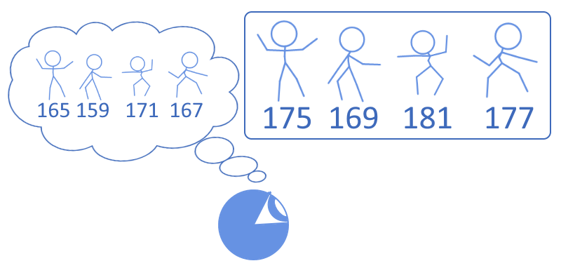
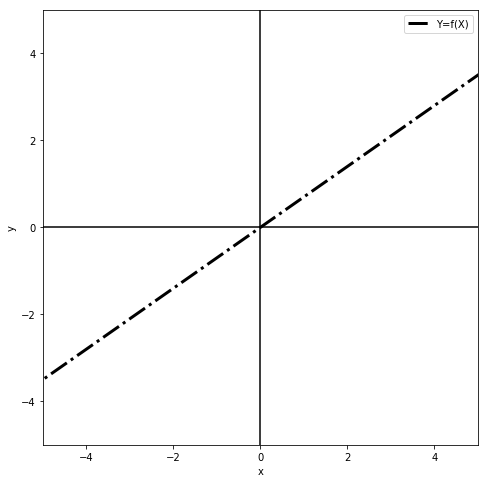
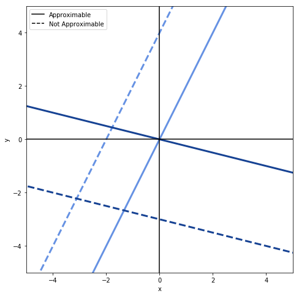
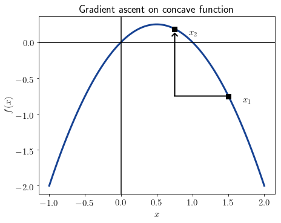
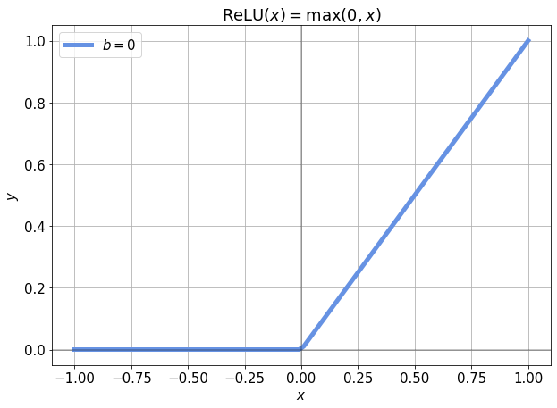
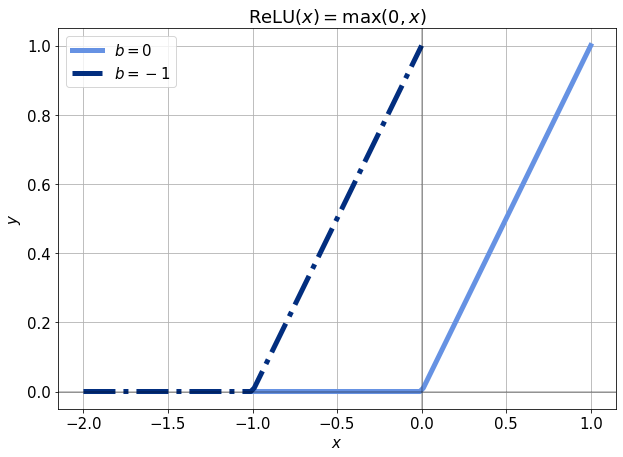
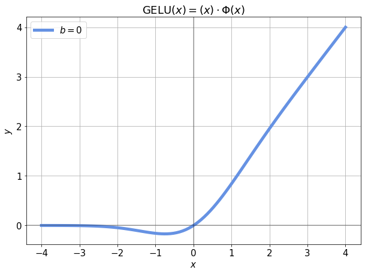
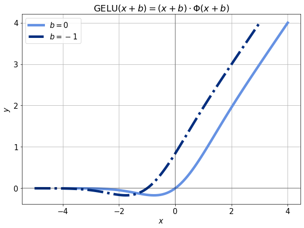
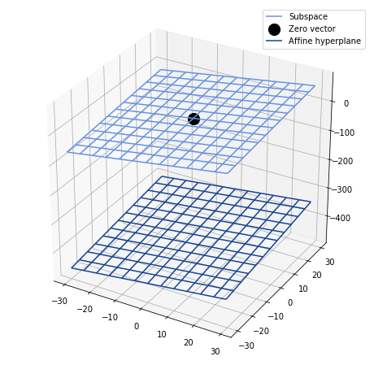

# 神经网络中的偏差

[深度学习](https://www.baeldung.com/cs/category/ai/deep-learning) [机器学习](https://www.baeldung.com/cs/category/ai/ml)

[神经网络](https://www.baeldung.com/cs/tag/neural-networks)

1. 概述

    在本教程中，我们将研究在神经网络架构中包含偏置项的理论原因。

    我们将首先了解一些支持偏置的常见理由。接下来，我们还将研究一些理论上有效但并不常见的将偏置项纳入模型的理由。

    为此，我们将首先了解偏差一词的常识性含义。这将让我们把偏差的概念推广到神经网络的偏差项。

    然后，我们将了解单层和深度神经网络的一般架构。在此过程中，我们将证明，如果存在偏差，那么每个网络的偏差都是唯一的标量或向量。这将最终促使我们用决策曲面和仿射空间来证明偏差的合理性。

    在本文的最后，我们将了解在神经网络中添加偏置项的原因。同时，更重要的是，我们将了解到没有偏置的神经网络在哪些方面可以保证预测误差。

2. 人类和测量中的偏差

    1. 常识意义上的偏差

        在这里，我们首先要了解一般意义上的偏差概念。然后，我们将更具体地结合机器学习来研究它。事实上，偏差的一般含义与我们将其纳入[神经网络](https://www.baeldung.com/cs/neural-net-advantages-disadvantages)[激活函数](https://www.baeldung.com/cs/ml-linear-activation-functions#1-activation-functions)的原因有关，我们很快就会看到。

        事实上，偏差及其与误差和[预测](https://www.baeldung.com/cs/naive-bayes-classification#2-no-predictions-without-prior-knowledge)的关系不仅是机器学习的问题，也是整个[统计分析](https://www.baeldung.com/cs/machine-learning-how-to-start#1-statistics)学科的问题。

        就其通常含义而言，偏差通常是指围绕某种现象进行预测或测量时出现的系统误差。例如，如果一个人不顾任何相反的证据而支持某种观点，我们就会说这个人有偏见。我们还说，如果某些玩家对其他玩家拥有不公平的优势，那么游戏就是有偏见的。

        这直观地告诉我们，无论在什么情况下，偏见都会经常发生。

    2. 计量理论中的偏差

        在[计量理论](https://link.springer.com/book/10.1007/978-88-7642-386-4)中，偏差与所谓的[真值](http://sk.sagepub.com/reference/survey/n592.xml)有关。真值是认识论上的假设，即如果使用精确度完美的仪器，测量结果 "会是什么"。不用说，现实世界中没有任何仪器具有[完美的精确度](https://en.wikipedia.org/wiki/Accuracy_and_precision#Quantification)，但这一概念仍然存在。

        因此，我们可以想象，某些测量值是真实的，而其他合法获得的测量值则不是。如果我们这样做了，我们就可以注意到，一些仪器会系统性地报告与真实值相对应的错误读数。

        如果我们注意到这一点，就可以对仪器进行重新校准，以消除这一误差。这样，我们就能最终获得唯一且始终真实的测量值。

        有趣的是，这种校准过程也发生在神经[突触](https://www.baeldung.com/cs/ml-nonlinear-activation-functions#1-synapsis)中，构成了我们通常所说的学习。

        如果我们遵循这一思路，就会发现：

        - 除非我们先验地将给定值定义为测量的预期结果
        - 除非我们把这个值称为 "真值"

        因此，我们根本不存在任何误差。在这种情况下，我们将只剩下测量结果和测量结果返回的值。

        然而，如果我们确实有真值，那么就有可能某些特定的测量结果会系统性地返回误差。这种系统误差就相当于测量理论中偏差的定义。

    3. 偏差与预测

        看待这一观点的另一种方法是将偏差视为预测中的误差。在这种情况下，真值就是我们通过观察预测得到的测量值。与此相反，偏差则表示我们的预测与实际观测结果的偏差程度。

        偏差是测量或预测中的系统误差，这两个定义是等同的。但后者更适合神经网络。事实上，神经网络会根据接收到的输入来[预测数值](https://www.baeldung.com/cs/genetic-algorithms-vs-neural-networks#2-neural-networks)，我们可以在此框架下研究它们的偏差。

        现在，我们可以通过一些不同情况下的测量和预测实例来熟悉这一概念。在此过程中，我们将重点介绍如何将某些误差定义为系统误差并加以纠正。

    4. 系统误差与标量修正

        例如，我们可以想象一下猜测班上一些学生的身高。我们自己个子特别高，往往会把学生的身高低估 10 厘米左右，因为从我们的角度看，他们看起来都一样矮。在这种情况下，我们就会说，我们对个人比实际身高矮这一想法有偏差：

        

        这种偏见可以量化为 10 厘米。既然我们知道自己持有这种偏见，那么我们就可以在测量某人身高时本能地在任何特定数字上加上 10，从而纠正这种偏见：

        

        在这种情况下，我们可以说，我们用来为学生身高分配本能值的决策函数偏差了 10 厘米。因此，通过在我们本能赋予的任何直觉身高上加上 10，我们就能计算出该身高的真实值。

        更正式地说，如果 f(x) 表示猜测给定学生 x 身高的函数，$\^{y}$ 是该学生的真实身高，那么我们可以说，由于我们的预测系统性地偏差了 10 厘米，那么 $\^{y} = f(x) + 10$。这种表达问题的方式与神经网络中偏差的数学表述特别吻合，我们稍后会看到。

    5. 分类中的系统误差和修正

        我们可以在序数[分类变量](https://www.baeldung.com/cs/feature-vs-label#6-categorical-features)的[分类](https://www.baeldung.com/java-logistic-regression)中举另一个例子。事实上，测量中的系统误差问题不仅涉及数字和标量，也涉及分类值，我们可以对它们进行类似处理。

        在第二个例子中，我们可以设想，和前面一样，同样的学生也拥有学位，而学位可以有四种值：$\text{\{Middle School, High School, College, University\}}$. 由于我们自己没有完成初中学业，所以我们容易高估一个人的总体教育水平。

        因为我们意识到自己有高估这一水平的倾向，所以我们可以通过将所有本能的预测转移到先例的学位水平来纠正我们的错误：

        

        在这种情况下，我们可以说，我们在给一个序数分类变量赋值时出现了偏差。为了纠正这种偏差，我们将学生教育程度的自发赋值以一个固定的步长进行移动，以补偿我们的本能猜测。

    6. 偏差是预测中的系统误差

        然后，我们可以将上述考虑因素加以归纳，从而制定出模型中偏差的定义以及纠正偏差的方法，并将其很好地应用于神经网络。上述例子表明，如果错误是系统性的，我们就可以利用其可预测性对其进行补偿。因此，我们仍然可以进行准确的预测，就好像这种错误、偏差根本不存在一样。

        这与误差的类型无关，尤其与产生误差的变量的性质无关。这里的关键词是误差必须是 "系统性的"。如果这种误差是系统性的，我们就可以称其为 "偏差"，并对其进行校正，以获得真实的测量结果。

        同样的道理也适用于预测。我们可以说，如果我们的预测始终偏离某个稳定的量 b，我们就可以把这个量称为偏差，并在我们的模型中加以考虑。正如我们前面所看到的，无论这些模型与[回归还是分类](https://www.baeldung.com/cs/machine-learning-intro)有关，后者都是有效的，而且对统计分析中的任何任务都普遍有效。

        我们必须熟悉系统误差的概念，因为有一些[已知的方法可以计算](https://arxiv.org/ftp/arxiv/papers/1203/1203.3504.pdf)系统误差。因此，我们现在要看看如何处理神经网络中的偏差，然后再讨论如何从线性代数和数值分析的更广泛原理出发，证明神经网络架构中包含偏差是合理的。

3. 神经网络中的偏差

    1. 神经网络与线性函数

        我们将从单层神经网络开始讨论神经网络及其偏差，然后再推广到[深度神经网络](https://www.baeldung.com/deeplearning4j#what-is-deep-learning)。

        我们知道，任何给定的单层神经网络都会计算某个函数 Y = f(X)，其中 X 和 Y 分别是包含独立分量的输入和输出向量。如果神经网络有一个权重矩阵 W，我们也可以将上述函数重写为 Y = f(X，W)。如果 Y 和 X 的维度都是|Y|=|X|=1，我们可以进一步用二维图表示函数 f：

        

        这样的退化神经网络非常简单，但仍能逼近任何形式为 y = m x +n 的线性函数。函数 f 可以（但不一定）表示 x 与 w 之间的乘积，即 y = f(x) = w x，不包含任何常数项。在这种情况下，神经网络可以逼近经过原点的所有函数，但不能逼近其他函数：

        

        但是，如果函数包含常数项，例如 y = w x + b，那么神经网络就可以逼近平面内的任何线性函数：

        

        我们可以从这种对退化神经网络行为的直观理解出发，将其扩展到更复杂的网络架构。

    2. 为网络添加偏差

        此时，我们可以将上一节中的考虑因素应用到这个玩具神经网络中。如果我们这样做了，就可以推断出，如果网络的预测存在系统误差，我们可以将此误差称为 b，并将其添加到网络的输出中以获得真实值。

        然后，经过校准的网络将计算 y = f(x)+b 形式的函数。这个函数包含了网络的所有直观预测值，用上一节的术语来说，就是被常数 b 简单地移动了一下。这个常数就是偏差，它与系统预测误差相对应。

        现在，让我们为网络增加一个输入，使其现在可以计算函数 $Y = f(x_1, x_2)$。由于这两个输入必须是指[线性独立的分量](https://www.baeldung.com/cs/ml-relu-dropout-layers#the-curse-of-dimensionality-in-cnns)，我们可以想象 $x_1$ 和 $x_2$ 都有自己的自主偏差，我们可以称之为 $b_1$ 和 $b_2$。

        如果这样做，我们就可以想象通过计算 $Y = f(x_1, x_2) + b_1 + b_2$ 来用这两个独立偏差修正网络的预测。现在的问题是：这个神经网络有两个偏差吗？

    3. 每层只有一个偏置

        一般来说，我们有兴趣证明单层神经网络的偏置是否唯一。我们可以这样做。

        首先，我们对所有独立特征 $X = [x_1, x_2, ... , x_n]$ 及其所有相关的系统误差 $(b_1, b_2, ... , b_n)$ 重复上述过程。这样，我们就可以想象一个具有 n 个输入和权重矩阵 W 的单层神经网络实际上在计算一个函数 $Y = f(X, W) + (b_1 + b_2 + ... + b_n)$。

        由于标量的线性组合也是一个标量，我们可以用它们的线性组合 b 代替与每个独立输入相关的所有偏置项，并将公式重写为 $Y = f(x_1, x_2, ... , x_n) + b$。现在我们可以将这一观点推广到层数大于 1 的神经网络。

    4. 偏差向量只有一个

        现在，我们称 $Z_k = \sigma_k(Y)$ 为具有 n 层的神经网络中第 k 层的激活函数，而 $Y_k = W_{k}Z_{k-1} +b_k$ 为第 k 层激活函数的输入。我们可以说，神经网络正在计算函数 $f(X) = \sigma_n(W_n\sigma_{n-1}( ... (W_2 \sigma_{1}( W_1 X +b_1) + b_2) + ...) + b_n)$。

        我们也把 $B = [b_1, b_2, ... , b_n]$ 称为包含神经网络各层所有偏置的向量。B 是唯一的，因为它是由所有唯一的分量组成的。

        现在，如果 $f(0) \neq 0$ 并且激活函数${\sigma_1, \sigma_2, ... , \sigma_n}$都是奇数，就像线性单元、tanh 或双极性 sigmoid 的情况一样，神经网络必须有一个非零偏置向量 B，否则当 X 接近零时，它一定会偏离因变量的真实值。

        如果我们使用均值为 $\mu_X = 0$ 的标准化输入 X，那么这种考虑就显得尤为重要。

        因此，除非网络的激活函数不是奇数，除非被逼近的函数不是特征空间的子空间，否则在神经网络的架构中加入非零偏置向量是非常重要的。

    5. 如果激活函数有偏差怎么办？

        我们上面描述的情况与某些类别的神经网络密切相关，例如我们在[用LaTeX绘制网络](https://www.baeldung.com/cs/latex-drawing-graphs#5-finishing-touches)的教程中介绍的那些神经网络。但是，如果是每个神经元的激活函数有偏差，而不是神经元的输出有偏差呢？

        如果我们使用的激活函数是线性或准线性的，这个问题就尤为突出。事实上，在这种情况下，如果神经元的输入假设为特定值，那么神经元可能会经常处于非激活状态。以 [ReLU 函数](https://www.baeldung.com/cs/ml-relu-dropout-layers#the-rectified-linear-unit)为例，$y = \text{ReLU}(x) = \text{max}(0,x)$：

        

        如果我们处于 x \leq 0 的函数域部分，就会受到所谓[梯度消失问题](https://www.baeldung.com/cs/ml-nonlinear-activation-functions#2-relu)的影响。不过，我们也可以加入一个偏置项 b，作为 ReLU 函数的独立输入。这样，我们只需修改 b，就可以将激活函数向左或向右移动：

        

        这样一来，即使偏置值很小，也足以将误差函数的导数初始化为非零，即 $-1\leq x \leq 0$。 这样一来，即使输入为零，反向传播也会发生。因此，如果我们有理由相信某个神经元即使在输入为零时也应该处于活跃状态，那么引入偏置就是一个很好的方法。

    6. 其他激活函数

        事实证明，无论神经网络的结构和激活函数如何，在激活函数中引入偏置项都有好处。例如，在各种常见的机器学习任务中，引入一个小偏置项已被证明能提高递归神经网络的[性能](https://arxiv.org/abs/1504.00941)。不过，即使激活函数发生变化，这种优势依然存在。

        即使是线性单元的更复杂形式，如最近在 [BERT](https://www.baeldung.com/cs/transformer-text-embeddings#bert) 中出现的 [GeLU](https://arxiv.org/abs/1606.08415)，也能从非零偏置项中获益。例如，如果我们对 x 进行了标准化，使其[映射到正态分布](https://www.baeldung.com/cs/normalize-table-features#3-normalization-by-standard-deviation)，那么我们应该预计大约 0.1% 的观测值会低于-3。如果是这种情况，对于这些值，相应的 $y = \text{GELU}(x)$ 可能会非常接近零：

        

        这反过来又会使模型无法训练这些观测值。当然，在整个数据集中，0.1% 的观测值发生率并不算高；但是，如果我们能提前预测到这些观测值对训练毫无帮助，那么我们就没有理由使用这些观测值。但是，如果我们稍微移动一下激活函数，-3 附近的观测值就会再次对训练做出贡献：

        

        这是因为激活函数的导数再次变为非零。因此，一般来说，在激活函数的输入端添加偏置项是一种很好的做法，这也证明了训练模型所需的计算时间略有增加是合理的。

4. 加入偏置项的理论原因

    1. 偏差的主要论据

        现在，我们可以对上述考虑进行总结。这将让我们列出需要在神经网络中包含非零偏置的条件。我们目前看到的情况表明，如果出现以下情况，神经网络就需要非零偏置向量：

        - 无偏神经网络的预测存在系统误差
        - 网络的空输入意味着同一网络的非空输出
        - 神经网络的决策面不是网络空间的子空间

        现在让我们更详细地讨论最后一点。这将为我们提供在神经网络中添加偏差的进一步理由。

        我们在上一节中简要提到了如果目标函数是网络空间的子空间会发生什么情况。在这种情况下，我们说当激活函数都是奇数时，我们就不需要偏置了。下面让我们从该网络的决策面来看看为什么会出现这种情况。

    2. 偏置的代数理由

        如果神经网络正在计算一个形式为 Y = f(X) 的函数，那么我们可以定义一个维数为 |Y| + |X| 的向量空间 V，网络就在这个[空间](https://www.scaruffi.com/svairi/sin237.pdf)中运行。我们称 V 为神经网络的向量空间。函数 f 可以保证是 V 的子集，但不能保证是线性子空间。

        为了使 f 成为 V 的线性子空间，它必须包含零向量。如果这样，那么$(X = 0 \rightarrow Y = 0) \rightarrow (\exists{B}=0 \rightarrow Y = f(X))$。这并不能保证偏置为零的函数 f 是唯一能逼近 Y=f(X)的函数；但它确实保证了至少有一个这样的函数存在。

        相反，也有可能函数 f 对应的不是 V 的子空间，而是 V 的[仿射超平面](https://arxiv.org/pdf/1605.00329.pdf)。如果是这种情况，我们就需要在 f 中加入一个非零偏置向量。

        另一种方法是想象神经网络的决策面。然后我们可以问自己，它与被逼近的目标函数是什么关系。这个函数可以是一个向量，也可以是该网络向量空间的一个仿射超平面。如果函数由仿射空间而非向量空间组成，那么就需要一个偏置向量：

        

        如果我们不加入偏置向量，那么该决策面中零点附近的所有点都会偏离某个常数。反过来，这也相当于决策中的系统误差，可以通过平移来纠正。

        因此，我们可以将决策面平移一个常数，并将该值称为偏差。这样，我们就能更好地逼近零点附近的目标函数。

5. 结论

    在本文中，我们研究了测量、预测和神经网络中偏差的正式定义。我们还看到了如何定义单层和深度神经网络中的偏差。根据这一定义，我们证明了神经网络偏差向量的唯一性。

    我们还列举了神经网络中包含偏差的最常见理论原因。除此之外，我们还在线性代数的框架下研究了一种更不常见的支持偏置的论据。
