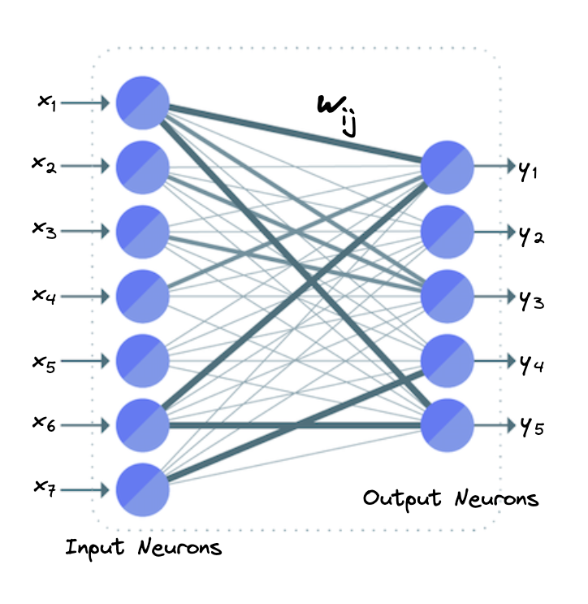
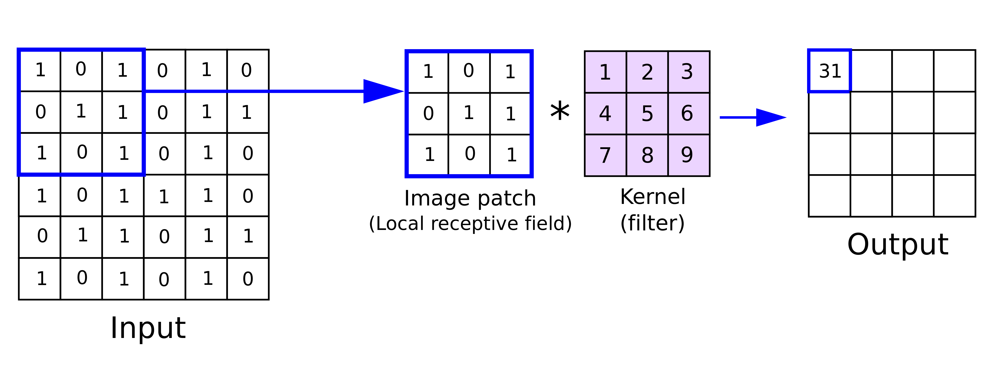

# 神经网络：Conv层和FC层的区别

[深度学习](https://www.baeldung.com/cs/category/ai/deep-learning) [机器学习](https://www.baeldung.com/cs/category/ai/ml)

[神经网络](https://www.baeldung.com/cs/tag/neural-networks)

1. 概述

    在本教程中，我们将讨论神经网络中最常用的两种层(hidden-layers)：卷积层（Conv）和全连接层（FC）。从动作识别和语言翻译到语音识别和癌症检测，它们几乎是所有神经网络的基础。

    首先，我们将介绍这一主题，然后分别定义每种类型的层。最后，我们将比较两种类型的层，说明它们的区别。

2. 全连接层（FC 层）

    在 FC 层中，输入层的所有神经元都与输出层的每个神经元相连。

    具体来说，假设我们有 7 个输入神经元$(x_1, x_2, x_3, x_4, x_5, x_6, x_7)$和 5 个输出神经元$(y_1, y_2, y_3, y_4, y_5)$。在 FC 层中，我们对输入神经元进行加权线性变换，然后通过非线性 激活函数 传递输出。因此，计算 FC 层中输出神经元值的公式是

    \[\mathbf{y_i = f \left(\sum_{j=1}^7 w_{ij} \ x_j \right)} where i \in [1, 5]\]

    在下图中，我们可以看到 FC 层神经元的样子：

    

    在一个有 $\mathbf{n}$ 个输入和 $\mathbf{m}$ 个输出的 FC 层中，我们有 $\mathbf{n \times m}$ 个权重，因为每一对输入和输出神经元都对应一个权重 $\mathbf{w_{ij}}$。

3. 卷积层（Conv 层）

    [卷积层](https://www.baeldung.com/cs/convolutional-layer-size)的基本操作是在图像和一个等于正方形矩阵的核（或滤波器）之间进行卷积。首先，我们在滤波器的像素和图像的相应像素之间进行元素乘法运算。然后，我们将这些乘法相加，得到一个输出值。整个过程对输入图像的每个像素重复进行。

    在下图中，我们可以看到 6 x 6 的图像和 3 x 3 的滤波器之间是如何卷积的。在描述的步骤中，我们计算图像像素（2, 2）的卷积，生成下图的图像补丁：

    

    在卷积层中，我们在输入神经元和一些可学习的滤波器之间进行卷积，生成滤波器的输出激活图。因此，权重的数量不像 FC 层那样取决于输入神经元的数量。在 Conv 层中，权重的数量等于内核的大小。

4. 区别

    这两类层的基本区别在于连接的密度。FC 层是密集连接的，这意味着输出中的每个神经元都与每个输入神经元相连。另一方面，在卷积层中，神经元并不是密集连接的，而是只与卷积核宽度范围内的相邻神经元相连。因此，如果输入是图像且神经元数量较多，则更适合使用 Conv 层。

    它们的第二个主要区别是权重共享。在 FC 层中，每个输出神经元都通过不同的权重 $w_{ij}$ 与每个输入神经元相连。而在 Conv 层中，不同神经元之间共享权重。这也是 Conv 层能够用于大量神经元的另一个特点。

5. 结论

    在本教程中，我们介绍了神经网络的 Conv 层和 FC 层。首先，我们介绍了这两个术语，然后分别讨论了每一层，并说明了它们之间的区别。
