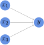
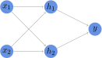
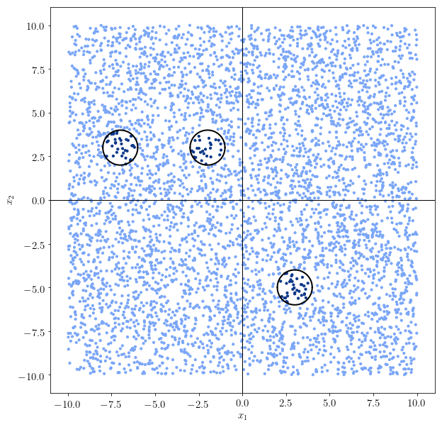
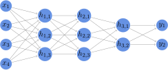

# 神经网络架构：选择隐藏层数量和大小的标准

[深度学习](https://www.baeldung.com/cs/category/ai/deep-learning) [机器学习](https://www.baeldung.com/cs/category/ai/ml)

[神经网络](https://www.baeldung.com/cs/tag/neural-networks)

1. 概述

    在本教程中，我们将学习确定神经网络中隐藏层的数量和大小的方法。

    首先，我们将从复杂性理论的角度来阐述这一主题。这样，我们就可以通过建立网络体系结构来逐步分析这一主题，而随着所处理问题的复杂性增加，网络体系结构也会变得更加复杂。

    然后，我们将区分有理论依据的方法和启发式方法，以确定隐藏层的数量和大小。

    在本教程结束时，我们将知道如何确定我们应该使用什么样的网络架构来解决给定的任务。

2. 神经网络和维度

    1. 问题和网络的复杂性

        在关于神经网络优缺点的[文章](https://www.baeldung.com/cs/neural-net-advantages-disadvantages)中，我们讨论了这样一个观点：解决某个问题的神经网络在某种程度上体现了该问题的复杂性。因此，随着问题复杂度的增加，解决问题的神经网络的最小复杂度也会增加。

        我们可以直观地将这一想法表达如下。首先，我们用 C(p) 表示问题 p 的某种复杂性度量，用 C(N) 表示神经网络 N 的相同复杂性度量：

        \[\forall{(p_1, p_2)}\ \forall{(N_1, N_2)}: C(p_1) < C(p_2) \to C(N_1) < C(N_2)\]

        这句话告诉我们，如果我们有一些标准来比较任意两个问题的复杂性，我们就能把解决这两个问题的神经网络的复杂性排成有序关系。

        这是[复杂性和系统理论](https://www.baeldung.com/cs/machine-learning-how-to-start#2-general-systems-theory-and-cybernetics)中一个[更普遍、更成熟的信念](https://onlinelibrary.wiley.com/doi/10.1111/joms.12206)在计算机科学中的特殊应用。随着环境变得越来越复杂，嵌入其中的认知系统也会变得越来越复杂。

    2. 复杂性与维度诅咒

        衡量机器学习模型复杂性的一个典型指标是其参数 $\Theta$ 的维度 $|\Theta|$。这是因为[反向传播的计算成本](https://www.baeldung.com/cs/ml-nonlinear-activation-functions)，尤其是[非线性激活函数](https://www.baeldung.com/cs/ml-linear-activation-functions)的计算成本，即使$|\theta|$的增幅很小，也会迅速增加。

        这导致了一个问题，我们称之为神经网络的[维度诅咒](https://www.baeldung.com/cs/ml-relu-dropout-layers#the-curse-of-dimensionality-in-cnns)。一些网络架构，如卷积神经网络，通过利用[输入特征的线性依赖性](https://www.baeldung.com/cs/ml-understanding-dimensions-cnn)来专门解决这个问题。而其他一些网络，如用于[回归的神经网络](https://www.baeldung.com/kotlin-supervised-learning#linear-regression)，则无法利用这一优势。

        正是在这种情况下，确定复杂度最低的神经网络尤为重要。只要一种架构能以最小的计算成本解决问题，我们就应该使用这种架构。在接下来的章节中，我们将首先了解我们可以对神经网络架构做出的理论预测。然后，如果理论推断失败，我们将研究一些启发式方法，以进一步推动我们的工作。

3. 神经网络与问题复杂性

    1. 文献中的理论空白

        在本节中，我们将以早先给出的问题复杂性与神经网络之间的关系为基础。为此，我们将确定神经网络的复杂性与其基础问题的递增复杂性之间的关系。更具体地说，我们先问自己神经网络能解决的最简单的问题是什么，然后依次找到更复杂的问题类别和相关架构。

        本节还致力于解决计算机科学中的一个开放性问题。在有关深度神经网络的文献中，有一个[重要的理论空白](https://www.pnas.org/content/early/2020/06/08/1907369117)，它涉及深度神经网络解决大多数问题的一般能力的未知原因。换句话说，人们还不清楚神经网络[为何能发挥如此出色的功能](https://www.pnas.org/content/early/2020/06/08/1907369117)。

        这篇文章也无法解决这个问题，但我们可以用这样一种方式来阐述这个问题，让我们对它有一些新的认识。顺便说一句，我们还将了解如何确定隐藏层的大小和数量。

    2. 退化问题，退化解决方案

        最简单的问题是 y = f(x) = x 形式的退化问题，也称为同值问题。这些问题需要一个相应的退化解，其形式是将输入不加修改地复制到输出的神经网络：

        

        更简单的问题不是问题。此外，神经网络需要输入和输出的存在，这样它们本身也会存在。因此，这意味着我们需要定义至少两个矢量，无论它们多么相同。

    3. 线性分离的神经网络

        一个更复杂的问题是，输出并不完全对应于输入，而是对应于输入的某种线性组合。就线性回归而言，这个问题相当于确定一个函数 $y = f(x, \beta) = \beta \cdot x$。这里，$\beta$ 表示包含[偏置项](https://www.baeldung.com/cs/neural-networks-bias) $\beta_1$ 的参数向量，x 表示特征向量 $x = \{x_1，x_2，...，x_{|x|}\}$，其中 $x_1 = 1$。

        在二元分类的情况下，我们可以说输出向量可以有两个值 $y_1$ 或 $y_2$，其中 $y_1 < y_2$。此，这个问题相当于确定同一个函数$f(x, \beta)$，以解决不等式$y_1 \leq f(x, \beta) \wedge y_2\geq$。

        感知器可以解决以这种方式提出的所有问题：

        

        这意味着，对于线性可分问题，神经网络的正确维度是输入节点|x|和输出节点|y|。如果 |x| 包含非线性独立特征，那么我们可以使用[降维技术](https://www.baeldung.com/cs/principal-component-analysis)将输入转化为包含线性独立分量的新向量。转换后，输入的大小应为 |e|，其中 e 表示 x 的特征向量。

        因此，这意味着如果一个问题是线性可分的，那么正确的隐藏层数量和大小就是 0。

    4. 非线性分离的神经网络

        下一类问题与非线性可分问题相对应。非线性可分离问题是指其解不是维度为 $\mathbb{R}^{|x| \times |y|}$ 的向量空间中的超平面的问题。神经网络能解决而感知器不能解决的最有名的非线性问题是[XOR分类问题](https://www.baeldung.com/cs/neural-net-advantages-disadvantages#no-free-lunch-theorem)。具有一个隐藏层和两个隐藏神经元的神经网络就足以解决这个问题：

        

        [通用近似定理](https://www.baeldung.com/cs/neural-net-advantages-disadvantages#universal-approximation-theorem-and-its-limitation)指出，如果问题是由$\mathbb{R}^{|x| \times|y|}$中的连续可微分函数组成，那么具有单个隐藏层的神经网络可以将其近似到任意精度。

        这也意味着，如果一个问题是连续可微的，那么正确的隐藏层数就是 1。

    5. 任意边界的神经网络

        如果问题的决策边界是任意形状的，那么问题的复杂性就会随之增加，解题神经网络的复杂性也会相应增加。例如，当决策边界由多个不连续区域组成时，就会出现这种情况：

        

        在这种情况下，决策函数的连续可微分性假设遭到了破坏。这意味着我们需要将隐藏层的数量增加 1，以考虑问题的额外复杂性。

        直观上，我们也可以认为，第二隐藏层中的每个神经元都会学习决策边界的一个连续分量。随后，它们与输出层权重矩阵的相互作用构成了将它们合并为单一边界的函数。

        与只有一个隐藏层的浅层神经网络相比，有两个或更多隐藏层的神经网络被称为[深度神经网络](https://www.baeldung.com/deeplearning4j#what-is-deep-learning)。

    6. 用于抽象的神经网络

        问题还可以通过更高层次的抽象来描述。用神经网络的术语来说，这类问题就是需要学习层上的模式，而不是数据上的模式。

        典型的例子是卷积神经网络中对图像特征的抽象。例如，在卷积神经网络中，不同的权重矩阵可能代表图像像素中 "线"或 "圆"的不同概念：

        

        要解决层中节点间的选择问题，而不是输入模式的选择问题，需要更高层次的抽象。这就要求隐藏层的数量高于 2 层：

        

        因此，我们可以说，如果问题的复杂度高于我们在前几节中处理过的问题，就需要两个以上的隐藏层。不过，一般情况下，我们还是应该保持较少的层数，如果给定的结构似乎不够，再逐步增加。

    7. 复杂度更高的问题

        从理论上讲，问题的复杂度是没有上限的。因此，解决问题的神经网络的最低复杂度也没有上限。另一方面，我们仍然可以预测，在实际应用中，神经网络的层数将保持在较低水平。

        这是因为人类处理问题的复杂程度并不高。大多数实际问题并不特别复杂，即使是前沿科学研究中处理的问题，也只需要有限层数的网络。

        例如，一些极其复杂的问题，如[图像中的物体识别](https://en.wikipedia.org/wiki/AlexNet)，只需 8 层就能解决。而生成[人类可理解的文本](https://arxiv.org/abs/2005.14165)则需要 96 层。这意味着，如果我们的模型拥有的层数高于这个数字，那么我们很可能做错了什么。为了避免层数过多，我们将讨论一些启发式方法。

4. 启发式方法

    现在，我们可以讨论一些启发式方法，这些方法可以配合理论推理来确定隐藏层的数量和大小。它们都基于机器学习模型开发的一般原则。

    这些启发式方法就像指南一样，帮助我们确定神经网络的正确维度。从这个意义上说，当理论推理无法指导我们解决任何特定问题时，这些启发式方法可以帮助我们进行有根据的猜测。

    1. 逐步构建更复杂的系统

        第一条原则是，只有在简单模型无法满足要求的情况下，才增量开发更复杂的模型。这意味着，当有多种方法可供选择时，我们应首先尝试最简单的方法。例如，如果我们对函数的形状一无所知，就应该初步假定问题是线性的，并据此进行处理。只有当这种方法失败时，我们才应该转向其他架构。

        这是因为开发神经网络最耗费计算力的部分是训练其参数。如果我们能找到解决特定问题的线性模型，那么这将为我们节省大量的计算时间和财力。如果找不到，我们就应该尝试使用一个或两个隐藏层。只有当后者失败时，我们才能进一步扩展。

    2. 优先增加规模，而不是层数

        第二条原则适用于具有一定隐藏层数的神经网络无法学习决策函数的情况。如果我们有理由怀疑问题的复杂性与我们添加的隐藏层数相匹配，那么即使训练失败，我们也应该避免进一步增加层数。

        相反，我们应该通过增加更多的隐藏神经元来扩展它们。事实上，从计算角度来说，将隐藏层的大小增加一倍比将隐藏层的数量增加一倍的成本更低。这意味着，在增加隐藏层数量之前，我们应该先看看更大的隐藏层是否能代替它完成工作。

        许多程序员都喜欢使用介于输入和输出之间的层数。然而，不同的问题可能需要比这更多或更少的隐藏神经元。

        4.3. 更好地处理数据

        每当我们处理新数据时，第三条原则总是适用的。但是，如果我们尝试训练一个有两个隐藏层的神经网络却失败了，它也同样适用。只要训练失败，就说明我们使用的数据可能需要额外的处理步骤。这反过来又意味着，我们在训练中遇到的问题不是隐藏层的数量本身，而是现有隐藏层参数的优化问题。

        根据问题的具体性质，更好地处理数据可能意味着不同的事情。例如，我们可能需要[进行降维处理](https://www.baeldung.com/cs/ml-understanding-dimensions-cnn#2-layer-dimensionality-reduction-with-2d-convolutions)，以提取独立性较强的特征。或者，我们应该对输入数据进行[标准化或规范化](https://www.baeldung.com/cs/feature-scaling)处理，以降低训练难度。或者，我们可以添加一个[剔除层](https://www.baeldung.com/cs/ml-relu-dropout-layers#the-dropout-layer)，尤其是当模型在第一批数据上过度拟合时。

        每当模型训练失败时，我们都应该问问自己，如何才能更好地进行数据处理。如果我们能做到这一点，那么额外的处理步骤比增加隐藏层的数量更可取。

5. 结论

    在本文中，我们研究了确定神经网络中隐藏层的正确大小和数量的方法。

    首先，我们讨论了问题复杂性与神经网络复杂性之间的关系。

    其次，我们分析了问题复杂度的一些类别。我们从退化问题入手，最后分析了需要抽象推理的问题。

    最后，我们讨论了可以使用的启发式方法。当理论推理失败时，它们可以指导我们决定隐藏层的数量和大小。

    总之，我们可以说，在确定隐藏层的数量和大小时，我们应该首选有理论依据的理由。然而，当这些理由无效时，启发式方法也能满足需要。
