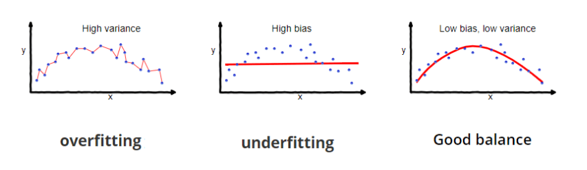

# 神经网络： 什么是重量衰减？

[深度学习](https://www.baeldung.com/cs/category/ai/deep-learning) [机器学习](https://www.baeldung.com/cs/category/ai/ml)

[神经网络](https://www.baeldung.com/cs/tag/neural-networks) [训练](https://www.baeldung.com/cs/tag/training)

1. 概述

    在本教程中，我们将讨论权重衰减损失。首先，我们将介绍过拟合问题以及如何使用正则化来解决这个问题。然后，我们将把权重衰减损失定义为正则化的一个特例，并举例说明。

2. 过拟合问题

    在训练机器学习模型时，一个非常重要的问题是如何避免过拟合。首先，我们将介绍有关过拟合的基本概念，即偏差和方差。

    1. 偏差

        我们将偏差(Bias)定义为训练过程中地面真实值与模型平均预测值之间的差值。随着模型偏差的增加，由于模型对训练数据的关注度降低，其学习的底层函数会变得更加简单。因此，模型在训练集上的表现就会很差。

    2. 方差

        另一方面，方差(Variance)被定义为模型对给定样本预测的变异性。这意味着，高方差模型学习了一个非常复杂的基本函数，可以最大限度地减少给定训练集上的预测误差。然而，高方差会导致对新给定数据的泛化能力较低，因为模型对训练数据给予了很大关注。

    3. 偏差-方差权衡

        上述定义导致了机器学习中众所周知的偏差-方差权衡(bias-variance trade-off)。一方面，你可以训练一个带有大量参数的深度学习模型，它可以学习一个非常复杂的函数，并在训练集上达到很高的预测精度。这种模型将具有高方差和低偏差，无法泛化到新的未见数据。这一概念被定义为过拟合。

        另一方面，您可以训练一个参数少得多的模型，以便学习一个更简单的函数，并能够泛化到新的数据。这种模型方差小、偏差大，会导致拟合不足。

        理想的情况是在方差和偏差之间找到一个平衡点，从而学习一个与学习给定任务所需的函数一样复杂的函数。在下图中，我们可以看到过度拟合问题的示意图：

        

3. 正则化

    正则化(regularization)是避免过度拟合最著名的技术。正则化的主要思想是迫使机器学习模型学习一个更简单的函数，以减少方差和增加偏差。

    但是，我们如何控制函数的复杂性呢？答案就在于其可学习参数的大小。当模型学习一个非常复杂的函数时，其可学习参数的大小就会很大。

    基于这一观察结果，正则化在训练过程中为损失函数增加了一个额外项，目的是降低可学习参数的大小。这样，模型学习的基础函数就会更简单，方差也会减小，从而防止过度拟合。

4. 权重衰减损失

    根据损失函数中正则化项的公式，正则化有不同的类型。权重衰减损失通常通过 L2 正则化达到最佳性能。

    这意味着额外的正则化项对应于网络权重的 L2 准则。更正式地说，如果我们将 L 定义为模型的损失函数，那么新损失的定义如下

    \[L_{new} = L + \frac{\lambda}{2 m} \sum_{j=1}^n \theta_j^2\]

    其中 $\theta_j$ 对应于网络参数，m 对应于样本数，而 $\lambda$ 是平衡损失函数中两个项的系数。当我们增大 $\lambda$ 的值时，我们就会减小权重的大小，从而使底层函数更简单，方差更小。

5. 示例

    现在，我们来看一个简单的例子，说明我们如何用权重衰减损失来训练模型。我们以逻辑回归为例。

    逻辑回归的损失函数定义如下：

    \[L = y \ log(\hat{y}) + (1-y) \ log(1 - \hat{y})\]

    其中，y 和 $\hat{y}$ 分别表示地面实况标签和预测结果。因此，如果我们将 $\hat{y} = w x + b$ 代入上式，就可以得到

    \[L = y \ log(w x + b) + (1-y) \ log(1 - w x -b)\]

    其中 x 对应模型的输入，w 对应模型的可学习权重，b 对应偏置项。为了避免过度拟合，我们将添加权重衰减损失，新的损失函数将如下所示：

    \[L_{new} = L + \lambda ||w||_2^2 = y \ log(w x + b) + (1-y) \ log(1 - w x -b) + \mathbf{\frac{\lambda}{2} ||w||_2^2}\]

6. 结论

    在本教程中，我们介绍了权重衰减损耗。首先，我们介绍了偏差-方差权衡以及如何使用正则化处理过拟合。然后，我们通过一个简单的例子定义了权重衰减损失。
