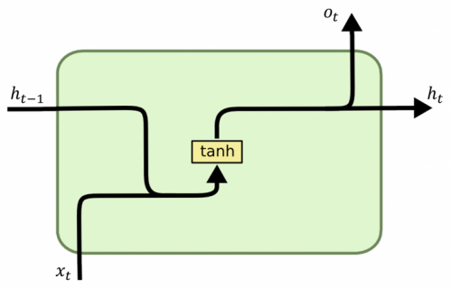

# 自然语言处理的编码器-解码器模型

[深度学习](https://www.baeldung.com/cs/category/ai/deep-learning)

[神经网络](https://www.baeldung.com/cs/tag/neural-networks)

1. 概述

    编码器-解码器模型和递归神经网络可能是表示文本序列最自然的方法。

    在本教程中，我们将了解它们是什么、不同的架构、应用、使用它们可能面临的问题，以及克服这些问题的最有效技术。

    理解它所需的所有背景知识都是关于人工神经网络和反向传播的基础知识。

2. 导言

    1. 递归神经网络编码器

        对于人类来说，理解文本是一个反复的过程： 当我们阅读一个句子时，我们会处理每一个单词，积累信息直到文本结束。

        深度学习领域的递归神经网络（RNN）就是一个由长期重复的相似单元组成的信息积累系统。

        一般来说，文本编码器将文本转化为数字表示。这项任务可以通过多种不同方式实现，但在本教程中，我们所说的编码器就是 RNN 编码器。让我们来看一张图：

        

        根据教科书，我们可以找到它的滚动表示法：

        

        因此，在 ${t}$ 时，每个区块由以下元素组成：

        区块输入：

        - 输入向量 $\vec{x_t}$（[编码单词](https://www.baeldung.com/cs/convert-word-to-vector)）
        - 隐藏状态向量 $\vec{h_{t-1}}$ (包含当前块之前的序列状态）

        块输出：

        - 输出向量 $\vec{_t}$，正如我们稍后将看到的，它并不总是由每个区块产生

        权重：

        - $\vec{x_t}$和$\vec{h_t}$之间的 ${W_x}$ 权重
        - $\vec{h_{t+1}}$ 和 $\vec{h_t}$ 之间的 ${W_h}$ 权重
        - ${W_x}$ 在 $\vec{h_t}$ 和 $\vec{o_t}$ 之间的权重

    2. 解码器

        与编码器不同，解码器展开一个代表序列状态的向量，并返回对我们有意义的内容，如文本、标记或标签。

        解码器与编码器的本质区别在于，解码器同时需要隐藏状态和前一状态的输出。

        当解码器开始处理时，并没有先前的输出，因此我们在这种情况下使用一个特殊的标记 $<start>$。

        下面的示例让我们更清楚地了解机器翻译是如何工作的：

        

        编码器产生了代表源语言（英语）句子的状态 ${C}$： 我热爱学习。

        然后，解码器将状态 ${C}$ 展开为目标语言（西班牙语）： Amo el aprendizaje。

        ${C}$可以被视为整个序列的矢量化表示，或者换句话说，我们可以使用编码器作为一种粗略的手段，从任意长度的文本中获取嵌入，但这并不是正确的方法，我们将在另一个教程中看到。

        2.3. 更多细节

        在上图中，为了简单起见，我们使用了单词作为输入，但我们真正传递的是每个单词的[嵌入向量](https://www.baeldung.com/cs/convert-word-to-vector)（$\vec{x}_1, \vec{x}_2,...$)

        此外，在图中的解码器部分，应该有一个软最大值函数（softmax function），它能从词汇表中找到对该输入和隐藏状态具有最高概率的单词。

        让我们用这些额外的细节来更新我们的图表：

        

3. 架构及其应用

    1. 多对一

        这广泛用于分类，通常是[情感分析](https://www.baeldung.com/cs/sentiment-analysis-practical)或标记。输入是单词序列，输出是类别。输出由序列的最后一个词块产生：

        

    2. 一对多

        该架构的主要应用是文本生成。输入是一个主题，输出是为该主题生成的词序列：

        

    3. 多对多（第一版）

        这是机器翻译中一种非常流行的架构（也称为 seq2seq）。输入是一串词，输出也是一串词。

        网络 "等待" 编码步骤完成，生成内部状态。编码器完成后，网络才开始解码：

        

    4. 多对多（第二版）

        这种架构的常见应用是视频字幕和部分语音标记。在帧传输的同时，字幕/标签也会产生，因此解码前无需等待最终状态：

        

4. 优点和缺点

    递归神经网络的优点在于

    - 可以输入任意长度的输入
    - 模型大小不会随输入大小而增长
    - 它们能自然地模拟随时间变化的事件

    缺点如下

    - 速度慢，因为必须按顺序处理。请记住，我们总是需要先前的状态来计算当前的状态
    - 存在梯度消失和爆炸问题
    - 它们在处理长序列时表现不佳

5. LSTM 和 GRU 单元

    1. 什么是消失梯度/爆炸梯度？

        梯度是我们用来更新网络权重的矢量，这样它就能在未来有更好的表现。

        由于反向传播和链式规则，当梯度更新很小时，它会随着层数的增加而呈指数级下降。因此，在具有大量层的深度架构中，发生在深度层的更新不会对前层产生任何影响（会消失），网络也就无法学习。

        在下图中，我们看到一个 RNN，其初始更新的强度会随着序列的流动呈指数级下降：

        

        我们面临的情况与梯度爆炸正好相反： 如果梯度很大，它就会以指数形式增加，从而使学习过程变得非常不稳定。

        LSTM 和 GRU 单元就是为了解决这类问题而诞生的。

    2. 基本 RNN 单元

        普通的 RNN 单元如下所示：

        

        - 输入：序列中的前一个状态和当前状态的词向量
        - 输出：要传递给下一个单元的当前状态和输出向量

        让我们看看如何在 Python 和 Tensorflow 中使用 vanilla 单元编码 RNN：

        ```python
        import tensorflow as tf

        ...

        model = tf.keras.Sequential([
        tf.keras.layers.Embedding(vocab_size, 64),
        tf.keras.layers.GlobalAveragePooling1D(),
        tf.keras.layers.Dense(64, activation='relu'),
        tf.keras.layers.Dense(1, activation='sigmoid')
        ])
        ```

    3. LSTM

        长短期记忆（LSTM）单元由一个单元、一个输入门、一个输出门和一个遗忘门组成。

        下图是 LSTM 的示意图：

        

        组成该单元的每个元素的功能是

        - 单元状态(Cell State)：这是单元（存储器）的状态
        - 输入门(Input gate)：调节新值流入单元的程度
        - 遗忘门(Forget gate)：控制新值在单元中的保留程度
        - 输出门(Output gate)：调节单元中的值用于计算 LSTM 单元输出激活的程度

        通过使用这些门控制序列中的长期依赖关系，RNN 可以避免丢失一些关键信息。

        使用 LSTM 创建 RNN 的代码如下

        ```python
        import tensorflow as tf

        ...

        model = tf.keras.Sequential([
        tf.keras.layers.Embedding(vocab_size, 64),
        tf.keras.layers.Bidirectional(tf.keras.layers.LSTM(64)),
        tf.keras.layers.Dense(64, activation='relu'),
        tf.keras.layers.Dense(1, activation='sigmoid')
        ])
        ```

    4. 关联递归单元（GRU

        门控递归单元（GRU）是最近才出现的，其设计与 LSTM 类似，但使用的参数较少（缺少输出门）：

        

        让我们来看看代码：

        ```python
        import tensorflow as tf

        ...

        model = tf.keras.Sequential([
        tf.keras.layers.Embedding(vocab_size, 64),
        tf.keras.layers.Bidirectional(tf.keras.layers.GRU(64)),
        tf.keras.layers.Dense(64, activation='relu'),
        tf.keras.layers.Dense(1, activation='sigmoid')
        ])
        ```

    5. 何时分别使用？

        一般来说，不要使用普通的 RNN，一定要使用 LSTM 或 GRU 单元。

        如何选择 LSTM 或 GRU？没有经验法则：这通常取决于任务，因此可以同时尝试这两种单元，然后使用性能最好的单元。

        如果两者的性能相似，则[优先选择GRU](http://proceedings.mlr.press/v37/jozefowicz15.pdf)，而不是 LSTM，因为它们的计算成本较低。

6. 注意机制

    LSTM 和 GRU 可以提高 RNN 在较长序列中的性能，但有些特定任务需要更强的能力才能正常工作。

    一个典型的例子就是神经机器翻译，编码器和解码器中的语法结构是完全不同的。为了翻译下一个单词，我们需要关注输入句子中的特定单词，而且可能顺序大不相同。

    让我们来看一个将句子 "L'accord sure la zone économique européene a été signé en août 1992" 翻译成英语的例子：

    

    在上面的矩阵中，我们可以看到 "zone" 是如何着重于 "Area"（区域）而轻视 "Economic"（经济）的。我们还可以注意到 "européenne" 是如何高度集中于 "European" 的。

    我们在这里看到的是，注意力机制允许解码器将注意力集中在输入序列的特定部分，以正确地生成下一个输出。

    下图说明了这一机制如何与我们已有的架构相匹配：

    

7. 结论

    在本文中，我们研究了采用递归神经网络的编码器-解码器模型的构建模块，以及它们的常见架构和应用。

    我们还讨论了使用这些模型时最常遇到的问题，以及如何通过使用 LSTM 或 GRU 单元和注意力机制来解决这些问题。

    既然我们已经学会了所有这些新技术，再加上所提供的辅助代码片段，我们就可以开始在现实生活中创建自己的模型了。
