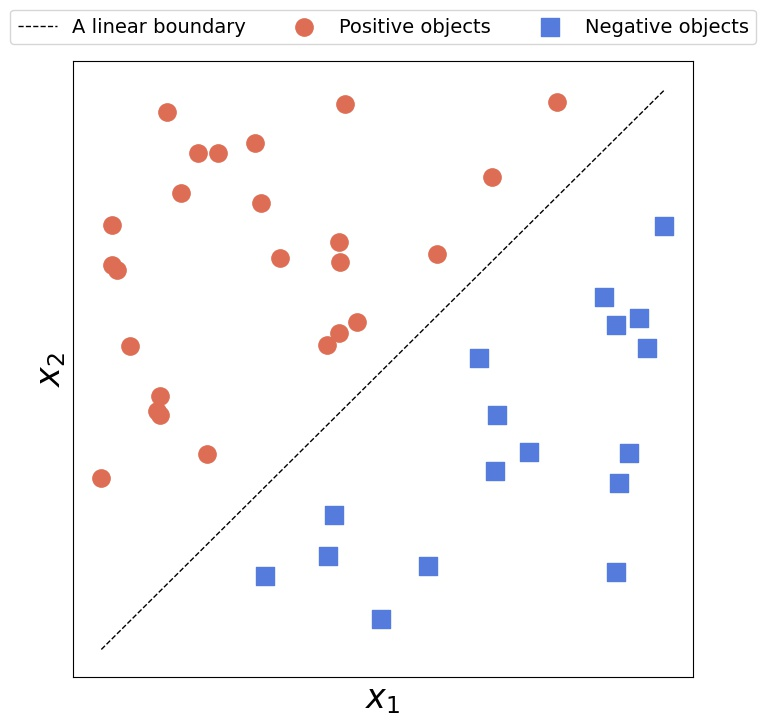
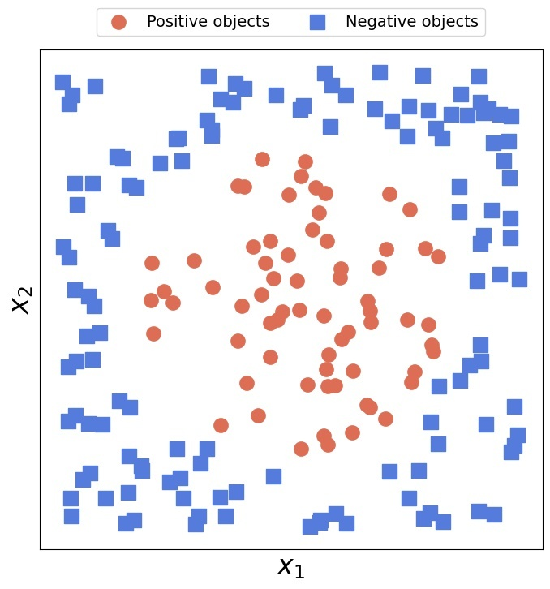

# 神经网络中的线性可分离数据

[深度学习](https://www.baeldung.com/cs/category/ai/deep-learning) [机器学习](https://www.baeldung.com/cs/category/ai/ml)

[神经网络](https://www.baeldung.com/cs/tag/neural-networks)

1. 简介

    在本教程中，我们将解释线性可分数据。我们还将讨论我们用来处理不显示线性可分性的数据集的内核技巧。

2. 线性可分类

    可分性的概念适用于二元分类问题。在二元分类问题中，我们有两个类别：一个是正分类，另一个是负分类。如果有一个分类器，它的决策边界能将正面对象和负面对象分开，我们就说这两个类是可分的。

    如果这种判定边界是[特征]的线性函数，我们就说这两个类是线性可分的。

    由于我们处理的是带标记的数据，如果特征空间中的类也是线性可分的，那么数据集中的对象就是线性可分的。

    1. 可线性分离的二维数据

        如果我们能用一条直线将正负对象分开，我们就可以说一个二维数据集是线性可分的。

        如果存在多条这样的直线也没关系。对于线性可分性来说，只需找到一条就足够了：

        

        相反，没有一条直线能将线性不可分离的二维数据分开：

        

    2. 可线性分离的 n 维数据

        与二维直线等价的是 n 维空间中的超平面。假设特征为实数，超平面的方程为

        (1) \[\begin{equation*}  \sum_{i=1}^{n} w_i x_i + b = \langle \mathbf{w}, \mathbf{x}\rangle + b = 0 \quad \mathbf{w}=[w_1,w_2,\ldots w_n], \mathbf{x}=[x_1, x_2, \ldots, x_n], b \in R \end{equation*}\]

        其中 $\langle \cdot, \cdot \rangle$ 是点积（也称为内积），$\mathbf{w}$ 是与超平面正交的向量。$\mathbf{x}$ 代表特征空间中的一个对象。

    3. 线性模型

        如果数据是线性可分的，我们可以通过拟合数据的线性模型来找到决策边界方程。例如，线性[支持向量机](https://www.baeldung.com/cs/ml-support-vector-machines)分类器可以找到边缘最宽的超平面。

        线性模型有三个优点。首先，它们很简单，而且使用原始特征进行操作。因此，与更复杂的非线性模型相比，线性模型更容易解释。其次，我们可以对模型拟合时出现的[优化](https://www.baeldung.com/cs/grey-wolf-optimization)问题得出分析解决方案。相比之下，我们只能依靠数值方法来训练一般的非线性模型。最后，将数值方法应用于线性优化问题比应用于非线性问题更容易。

        但是，如果数据不是线性可分的，我们就无法享受线性模型的优势。

3. 映射到线性可分离空间

    在这种情况下，有一种方法可以让数据线性可分。这个方法就是将对象从类不可线性分离的原始特征空间映射到类可线性分离的新特征空间。

    1. 示例

        以上面的二维圆形数据为例。任何直线都无法完美地将两个类别分开。然而，虽然在具有 x_1 和 x_2 特征的原始二维空间中这是正确的，但映射到另一个空间可以使对象分离。让我们看看映射是否如此：

        \[\begin{bmatrix} x_1 \\ x_2 \end{bmatrix} \mapsto \begin{bmatrix} x_1 \\ x_2 \\ x_1^2 + x_2^2 \end{bmatrix}\]

        由于所有 $x_3 = x_1^2 + x_2^2 \leq b$ 的数据点在 b 等于正圆半径时都是正的，而其余的都是负的，因此变换后的数据将是线性可分的。因此，我们可以对转换后的数据集进行线性 SVM 拟合，得到符合公式 (1) 的 $x_1$、$x_2$ 和 $x_3$ 的线性模型。

    2. 问题

        这种方法有几个问题。首先，我们必须手动设计映射。有时，正确的变换并不容易找到。当我们处理复杂数据时，通常就是这种情况。此外，使数据线性可分的方法可能有多种，而哪种方法最自然、最易解释或最有效并不总是很清楚。例如，所有这些映射都能使上面的循环数据线性可分：

        \[\begin{bmatrix} x_1 \\ x_2 \end{bmatrix} \mapsto \begin{bmatrix} x_1 \\ x_2 \\ \sqrt{x_1^2 + x_2^2} \end{bmatrix} \qquad \begin{bmatrix} x_1 \\ x_2 \end{bmatrix} \mapsto \begin{bmatrix} \sqrt{x_1^2 + x_2^2} \end{bmatrix} \qquad \begin{bmatrix} x_1 \\ x_2 \end{bmatrix} \mapsto \begin{bmatrix} x_1^2 + x_2^2 \end{bmatrix} \qquad \begin{bmatrix} x_1 \\ x_2 \end{bmatrix} \mapsto \begin{bmatrix} (x_1^2 + x_2)^{\frac{1}{100}} \end{bmatrix}\]

        另一个问题是，在拟合模型之前转换数据可能会过于低效。如果数据集很大，转换又很复杂，那么将整个数据集映射到新的特征空间所耗费的时间和内存可能超出我们的承受能力。

        最后，如果数据只能在无限维空间中线性可分，我们就无法对数据进行变换，因为相应的映射永远不会完成。

        为了解决这些问题，我们采用了[核技巧](https://en.wikipedia.org/wiki/Kernel_method)。

4. 核

    让我们先回到公式（1）。它的关键要素是内积项 $\langle \mathbf{w}, \mathbf{x} \rangle$。事实证明，拟合线性模型的分析解包含了线性模型实例的内积项$\langle \mathbf{x}, \mathbf{z} \rangle$。

    当我们应用转换映射$\Phi$时，我们会将原始空间中的内积项转换为另一个空间中的内积项：$\langle \Phi( \mathbf{x} ), \Phi( \mathbf{z} ) \rangle$。但是，即使不转换数据，我们也可以对它们进行评估。为此，我们使用核。

    核 k 是一个函数，它可以把一对原始对象 $\mathbf{x}$ 和 $\mathbf{z}$ 映射成它们的图像 $\Phi(\mathbf{x})$ 和 $\Phi(\mathbf{z})$ 的内积，而不需要实际计算 $\Phi(\mathbf{x})$ 和 $\Phi(\mathbf{z})$ 。因此，核允许我们跳过转换步骤，通过对原始特征的操作，在另一个空间中找到线性决策边界。

    例如，$k \left( [x_1, x_2], [z_1, z_2] \right) = x_1^2 z_1^2 + 2 x_1 z_1 x_2 z_2 + x_2^2 z_2^2$ 是 $[x_1^2, \sqrt{2 x_1 x_2}, x_2^2]$ 和 $[z_1^2, \sqrt{2 z_1 z_2 }, z_2^2]$ 的内积。因此，如果原始空间中的分离决策边界是一条涉及 $x_1^2$、$x_2^2$ 或 $\sqrt{x_1 x_2}$ 项的曲线，那么它在转换后的空间中将是一个平面。因此，训练一个以 k 为核的线性模型就能找到它。

5. 结论

    在本文中，我们讨论了线性可分性。我们还展示了如何通过映射到另一个特征空间来使数据线性可分。最后，我们介绍了核，它允许我们在不转换数据的情况下将线性模型拟合到非线性数据中，从而为映射到无限维空间提供了可能。
