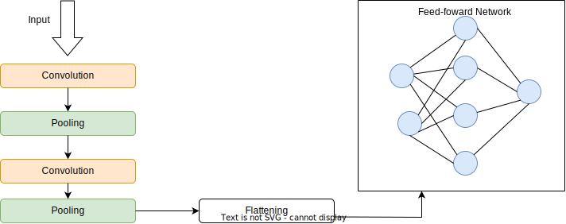

# 什么是不可训练参数？

[深度学习](https://www.baeldung.com/cs/category/ai/deep-learning)

[神经网络](https://www.baeldung.com/cs/tag/neural-networks) [训练](https://www.baeldung.com/cs/tag/training)

1. 简介

    在本教程中，我们将回顾[神经网络](https://www.baeldung.com/cs/neural-networks-neurons)中通常所说的不可训练参数。我们将了解它们是什么、如何起作用，然后考虑使用不可训练参数的好处和缺点。

2. 神经网络中有哪些参数？

    典型的神经网络通常由神经元之间的连接、权重和偏置组成。这些部分共同作用，处理数据并产生一些输出。

    现在，当谈到神经网络中的参数时，我们通常指的是在训练阶段学习到的参数。这些参数可根据数据和手头的任务进行调整，并经常在训练过程中更新。最常见的是模型权重。

    在训练神经网络时，这些权重通常通过反向传播进行更新。反向传播是一种计算神经网络梯度的技术。它用于通过网络回传误差，以将误差最小化。

3. 不可训练参数

    如前所述，参数通常是指神经网络中的权重。这些参数通常分为两种，即可训练参数和不可训练参数。可训练参数是指在训练阶段计算并更新其值的参数。而不可训练参数是指其值在训练过程中不会更新的参数。

    假设我们有一个将 RGB 图像分类为猫或狗的 CNN。该架构由输入层、卷积层和池化层组成，这些层与一个类似 MLP 的简单前馈网络相连。卷积层（即前馈网络之前的各层）的主要任务是从输入数据中学习猫和狗的特征。

    学习到特征后，MLP 的任务就是将图像分类为猫或狗。现在，在训练过程中，经过几次迭代后，我们冻结卷积层或学习特征的部分，专注于微调 MLP 以进行分类。在这种情况下，卷积层是不可训练的，因此不会进一步学习。这是使用不可训练参数的一个典型例子：

    

4. 何时使用？

    不可训练参数最常用于预训练模型和迁移学习。在[预训练](https://www.baeldung.com/cs/neural-network-pre-training)中，神经网络首先在一个任务或数据集上进行模型训练。然后，利用训练得到的参数或模型，在不同的任务或数据集上训练另一个模型。

    一些著名的预训练模型有 [BERT](https://arxiv.org/abs/1810.04805)、[VGG-16](https://arxiv.org/abs/1409.1556)、[ResNet50](https://arxiv.org/abs/1512.03385)、[Inceptionv3](https://arxiv.org/abs/1512.00567) 和 [GPT-4](https://arxiv.org/abs/2303.08774)。

    在[迁移学习](https://www.baeldung.com/cs/neural-network-pre-training#1-transfer-learning)中，模型参数被冻结并保存在预训练模型中，因此在应用于新任务时无法训练。在这种情况下，模型只能根据新任务和新数据进行微调。因此，训练并不是从零开始的。

5. 我们是否应该使用不可训练参数？

    是否使用不可训练参数取决于所使用的模型和手头的任务。例如，一个简单的分类模型很可能不需要使用不可训练参数。而用于图像分割的计算机视觉任务则可能需要使用不可训练参数。

    1. 优点

        使用不可训练参数有几个优点和缺点。我们先从优点说起。首先，使用不可训练参数可以缩短训练模型所需的时间。使用不可训练参数意味着参数更新更少，因此训练时间更短。

    2. 缺点

        使用不可训练参数最明显的缺点是，当模型参数设置为不可训练时，就不能对其进行调整。在这种情况下，模型将无法进一步学习。

6. 结论

    在本文中，我们回顾了不可训练参数。不可训练参数是指在训练过程中不会更新的模型参数。最常见的是神经网络中的权重。

    使用不可训练参数通常取决于使用模型的任务。有些模型和任务可能需要使用不可训练参数，而有些则不需要。

    不可训练参数的好处是可以优化训练并加快训练过程。不过，这也意味着模型中不会有进一步的学习。
