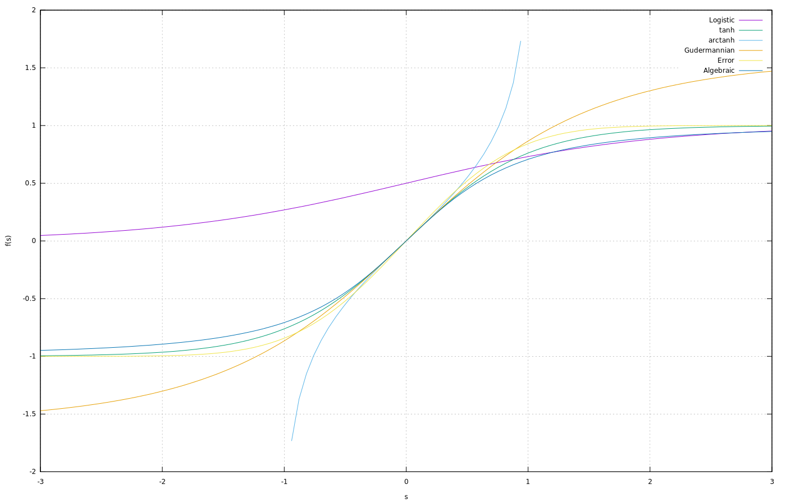
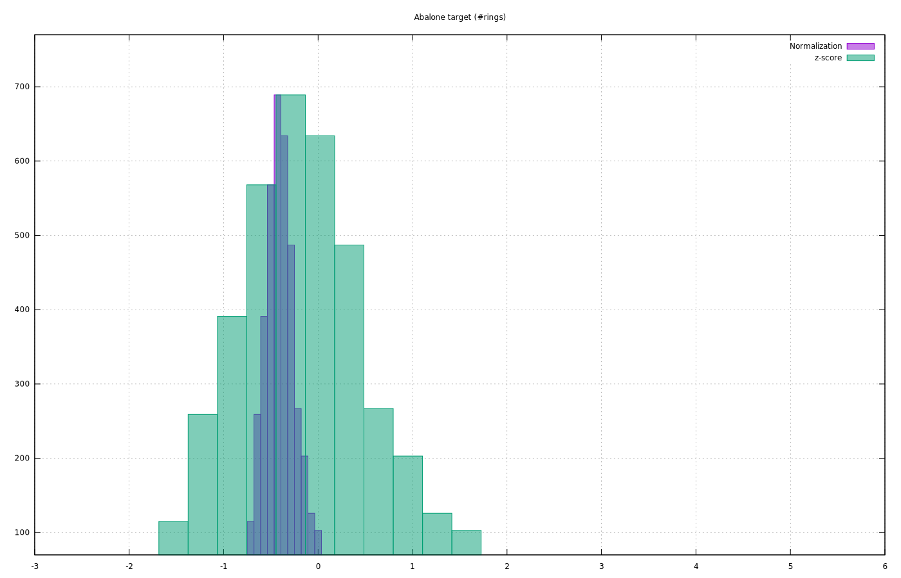
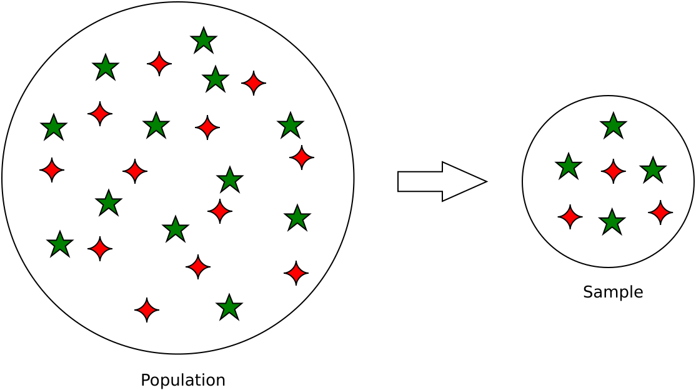
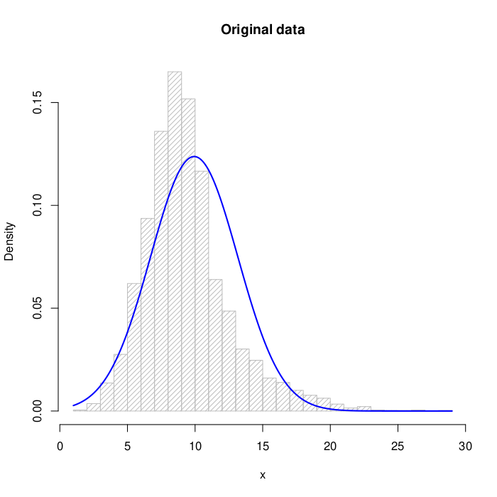
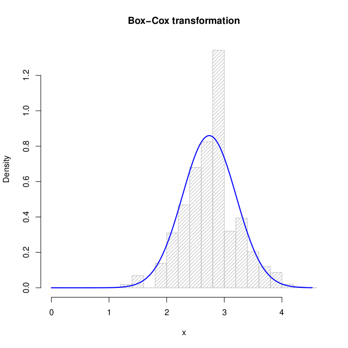
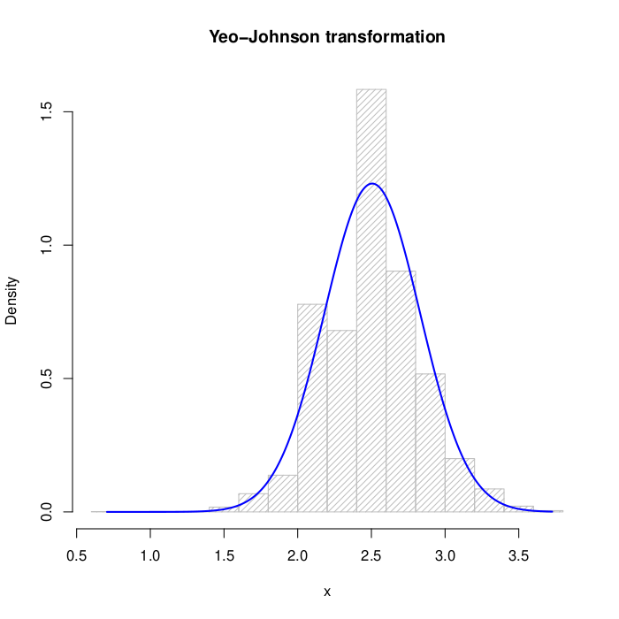

# 人工神经网络输入的规范化

[深度学习](https://www.baeldung.com/cs/category/ai/deep-learning) [机器学习](https://www.baeldung.com/cs/category/ai/ml)

[神经网络](https://www.baeldung.com/cs/tag/neural-networks)

1. 引言

    [人工神经网络](https://www.baeldung.com/cs/neural-net-advantages-disadvantages)是映射数据中未知关系并进行预测的强大方法。其主要应用领域之一是模式识别问题。它既包括一般的分类和函数插值问题，也包括时间序列预测等外推问题。

    神经网络和一般统计方法很少直接应用于数据集的原始数据。通常情况下，我们需要做一些准备工作，以促进网络优化过程，并最大限度地提高获得良好结果的概率。

    在本教程中，我们将介绍其中一些方法。这些方法包括本教程标题中明确提到的归一化技术，以及标准化和重新缩放等其他方法。

    我们将以一种或多或少可以互换的方式使用所有这些概念，并将它们统称为归一化或预处理技术。

2. 定义

    我们在导言中提到的不同形式的预处理具有不同的优势和目的。

    1. 规范化

        对一个向量（例如数据集中的一列）进行归一化处理，就是将数据与向量的标准值相除。通常，我们用它来获得向量的欧氏距离等于某个预定值，通过下面的变换，称为[最小-最大归一化](https://en.wikipedia.org/wiki/Feature_scaling)：

        \[x'=\frac{x-x_{\min}}{x_{\max}-x_{\min}}(u-l)+l\]

        其中

        - x 是原始数据。
        - x' 是归一化数据。
        - $x_{\max}, x_{\min}$ 分别是原始向量的最大值和最小值。
        - u、l 分别是归一化数据新范围的上限值和下限值，$x ' \in [l: u]$。典型值为 $[u = 1, l = 0]$ 或 $[u = 1, l = -1]$ 。

        上式是一种线性变换，在归一化后保持了原始矢量的所有距离比。

        一些学者对归一化和重定标进行了区分。后一种变换与数据单位的变化有关，但我们将其视为归一化的一种形式。

    2. 标准化

        标准化包括减去一个与定位或距离度量相关的量，再除以一个尺度度量。最著名的例子可能就是所谓的[z评分](https://en.wikipedia.org/wiki/Standard_score)或标准分数：

        \[x'=\frac{x-\mu}{\sigma}\]

        其中

        - $\mu$是人口的平均值。
        - $\sigma$是群体的标准差。

        z-score 对原始数据进行转换，得到一个均值为 0、标准差为 1 的新分布。

        由于我们通常不知道这些参数在整个群体中的值，所以我们必须使用它们的样本对应值：

        \[\hat{\mu}=\frac{1}{N}\sum_{i=1}^{N}x_{i}\]

        \[\hat{\sigma}=\sqrt{\frac{1}{N-1}\sum_{i=1}^{N}(x_{i}-\hat{\mu})^{2}}\]

        其中 N 是向量 $\mathbf{x}$ 的大小。

    3. 批量归一化

        深度学习中广泛使用的另一种技术是[批量归一化](https://en.wikipedia.org/wiki/Batch_normalization)。它不是在应用神经网络之前只归一化一次，而是将每一级的输出归一化后作为下一级的输入。这加快了训练过程的收敛速度。

    4. 使用注意事项

        应用最合适的标准化技术需要对问题数据进行深入研究。例如，如果数据集的某些特征不呈正态分布，或多或少呈正态分布，z-score 可能不是最合适的方法。

        根据问题的性质，可能需要应用一种以上的预处理技术。

3. 正态化综述

    在应用神经网络之前，是否总是有必要进行归一化处理或某种形式的数据预处理？对于这个问题，我们可以给出两种回答。

    从理论和形式的角度来看，答案是：视情况而定。根据我们想要使用的网络的数据结构和性质，可能没有必要进行预处理。

    让我们举个例子。假设我们想应用线性重定标，就像上一节中看到的那样，并使用一个具有线性形式激活函数的网络：

    \[y = w_{0} + \sum_ {i = 1} ^ {N} w_{i} x_ {i}\]

    其中，y 是网络的输出，$\mathbf {x}$ 是有 N 个分量 $x_{i}$ 的输入向量，$w_{i}$ 是权重向量的分量，$w_{0}$ 是偏置。在这种情况下，归一化并非绝对必要。

    原因在于，在线性激活函数的情况下，输入向量的比例变化可以通过选择向量 $\mathbf{w}$ 的适当值来消除。如果网络的训练算法足够高效，理论上它应该能找到最优权重，而无需对数据进行归一化处理。

    第一个问题的第二个答案来自实用的观点。在这种情况下，答案是：始终正常化。原因有很多，我们将在接下来的章节中进行分析。

    1. 目标归一化

        神经网络的结构可能千差万别。例如，有些作者建议对隐藏层单元使用非线性激活函数，而对输出单元使用线性函数。在这种情况下，从目标的角度来看，我们可以做出与上一节类似的考虑。

        另一种广泛使用的方法是对网络中的所有单元（包括输出级单元）使用同一类型的非线性激活函数。在这种情况下，每个单元的输出由以下形式的非线性变换给出：

        \[y = \mathcal {F} \left (w_{0} + \sum_ {i = 1} ^ {N} w_{i} x_ {i} \right)\]

        常用的函数是那些属于 sigmoid 系列的函数，例如我们在[非线性函数教程](https://www.baeldung.com/cs/ml-nonlinear-activation-functions)中学习过的下图所示函数：

        

        常用的函数有图像范围为 [-1: 1] 的 $\tanh$ 函数或图像范围为 [0: 1] 的 logistic 函数。

        如果我们将这些非线性激活函数用于网络输出，那么目标值必须位于与函数的图像值相匹配的范围内。通过应用上文提到的线性归一化，我们可以将原始数据置于任意范围内。

        许多训练算法都会探索某种形式的误差梯度，作为参数变化的函数。例如，德尔塔法则（Delta rule）就是梯度下降的一种形式：

        \[\Delta w = - \gamma \frac {\partial E} {\partial w}\]

        由于梯度消失问题，即在激活函数的渐近区梯度消失，这会阻碍有效的训练过程，因此可以进一步限制归一化区间。对于 $\tanh$ 函数，典型的范围是[-0.9: 0.9]；对于 logistic 函数，典型的范围是[0.1: 0.9]。并非所有作者都同意这种方法的理论依据。

    2. 输入标准化

        正如我们所看到的，使用非线性激活函数建议对原始数据进行目标转换。然而，对输入数据进行归一化处理也是有原因的。

        第一个原因非常明显，那就是对于具有多个输入的数据集，我们通常会为每个特征设定不同的比例。对于具有多个目标的数据集，我们也有同样的考虑。这种情况可能会对某些输入的最终结果产生较大影响，不平衡的原因并非数据的内在性质，而仅仅是其原始的测量比例。将所有特征归一化到同一范围可以避免这类问题。

        当然，如果我们有关于不同输入的相对重要性的先验信息，我们可以决定对每个输入使用定制的归一化区间。这种情况有可能发生，但可能性不大。一般来说，除了少数问题，特征的相对重要性是未知的。

        建议输入归一化的另一个原因与我们在上一节提到的梯度问题有关。在小范围内对输入进行重标定，一般会产生较小的权重值，这使得网络单元的输出不太可能接近激活函数的饱和区域。此外，它还允许我们将权值的初始变化范围设定在非常小的区间内，通常为 [-1: 1]。

4. 示例

    我们对 [UCI 数据库](https://archive.ics.uci.edu/)中[abalone](https://archive.ics.uci.edu/ml/datasets/abalone)问题（环数）的目标数据进行了[-1: 1]范围内的线性重缩放和 z 值转换。原始数据和两种变换的特征是

    \[\begin{array}{lcccc} \hline \mathrm{} & \mathrm{Mean} & \mathrm{Std.Dev} & \mathrm{Skewness} & \mathrm{Kurtosis}\\ \hline\hline \mathrm{Original\,data} & 9.934 & 3.2238 & 1.1137 & 5.3265\\ \mathrm{Normalization} & -0.3619 & 0.2303 & 1.1137 & 5.3265\\ \mathrm{z-score} & 1.364e-8 & 0.9999 & 1.1137 & 5.3265 \\\hline \end{array}\]

    应用这两种转换后的数据分布如下所示：

    

    请注意，变换改变了单个点，但数据集的统计本质保持不变，这一点从偏度和峰度的恒定值可以看出。

5. 数据集的标准化和划分

    1. 问题概述

        神经网络性能分析遵循典型的交叉验证过程。数据被分为两部分，通常称为训练集和测试集。大部分数据集都是训练集。典型的比例为 [0.67: 0.33] 或 [0.75: 0.25]。

        具体过程如下。使用我们选择的算法对训练集的数据进行训练。这一过程会产生网络权重和数学参数的最佳值。不过，误差估计是在测试集上进行的，它提供了网络对新数据的泛化能力估计。

        在测试集上提供相同结果的两个网络中，在训练集上误差最大的那个更可取。不熟悉神经网络应用的读者可能会对这一说法感到惊讶。

        原因在于，算法的泛化能力是衡量其在新数据上表现的一个指标。经验证明，网络越是贴近训练集，即在单点插值方面越有效，在新分区的插值方面就越不足。

        一些学者建议将数据集分为三个部分：训练集、验证集和测试集，典型比例为[0.50: 0.25: 0.25]。在训练过程中，我们在验证集上测量网络的质量，但最终结果（即网络的泛化能力）则在测试集上测量。我们可以将其视为双重交叉验证。

    2. 实践中的预处理

        训练集应进行归一化处理，但测试数据也应采用相同的缩放比例。这意味着我们要存储训练数据中使用的比例和偏移量，并再次使用。初学者常犯的错误是分别对训练数据和测试数据进行归一化处理。

        原因显而易见。归一化涉及为问题变量定义新的测量单位。我们必须用相同的单位来表示每条记录，无论是属于训练集还是测试集，这意味着我们必须用相同的法则对两者进行转换。

        最终结果应包括对至少三个不同分区的测试集结果的统计分析。这样，我们就能对特别有利或不利的分区结果进行平均。

    3. 数据集的统计结构

        让我们回到正题。为简单起见，我们只考虑分为两个分区。下面的考虑因素适用于标准化技术，如 z 分数。

        上文已经阐述了预处理的一般规则：在任何归一化或预处理中，都不要在训练集中使用属于测试集的任何信息。这一标准看似合理，但隐含着两个分区的基本统计参数存在差异。

        这种差异是出于经验考虑，而非理论原因。它源于总体和样本之间的区别：

        

        将训练集和测试集视为由相同统计规律产生的单一问题，我们就不会观察到差异。在这种情况下，训练集或整个数据集的归一化必须在本质上无关紧要。

        遗憾的是，这种可能性纯粹是理论上的。从理论上讲，如果我们拥有整个群体，也就是数量非常大、达到无限极限的测量数据，就可能出现类似的情况。

        但在实践中，我们使用的是人口样本，这意味着两个分区之间存在统计差异。从经验的角度来看，这相当于考虑由两个不同的统计规律产生的两个分区。

        在这种情况下，整个数据集的归一化会将测试集的部分信息引入训练集。后一个分区的数据对网络来说并非完全未知，因此会扭曲最终结果。

    4. 与训练集标准化相关的问题

        因此，上述所有考虑因素都证明了上述规则的合理性：在归一化过程中，我们绝不能用来自测试集的信息污染训练集。

        如果我们用 z 分数对数据进行标准化处理，就能直观地看出这条规则的必要性，因为它明确使用了样本平均数和标准差。但是，线性重定标也存在问题。

        假设我们以随机方式将数据集分为训练集和测试集，并且目标出现以下一个或两个条件：

        \[t _{\max} ^ {(train)} <t_ {\max} ^ ( test)\]

        \[t _{\min} ^ {(train)}> t_ {\min} ^ {(test)}\]

        假设我们的神经网络使用 \tanh 作为所有单元的激活函数，图像区间为 [-1: 1]。我们不得不对这个范围内的数据进行归一化处理，以便目标的变化范围与 \tanh 的输出相匹配。但是，如果我们只对训练集进行归一化处理，那么测试集中目标的部分数据就会超出这个范围。

        因此，对于这些数据，我们不可能找到很好的近似值。如果分区特别不利，且超出 [-1: 1] 范围的数据比例很大，我们就会发现整个测试集的误差很高。

    5. 问题的可能解决方案

        我们可以尝试用几种方法来解决这个问题：

        - 缩小训练集的归一化区间，确保整个数据集都在 [-1: 1] 范围内。这种方法并不能完全解决问题：
        - 部分测试集数据可能会落入激活函数的渐近区域。这些记录可能会受到梯度消失问题的影响。
        - 只有在训练集数据所覆盖的图像区域内，训练才会有效。网络将被迫执行外推法，而不是内插法，后者通常是一个更简单的问题。
        - 在线性重定标（保持数据中的距离关系）的情况下，我们可以决定对整个数据集进行归一化处理。这等同于上述观点。
        - 一般来说，无论是归一化还是标准化，最好的方法都是实现足够多的分区。这种方法可以消除前几小节中强调的畸变现象。

6. 功率变换

    神经网络可用于解决多种类型的问题。它们可以直接映射输入和目标，但有时也用于获取模型的最佳参数。

    许多科学模型都使用高斯分布。模型的正态性假设可能无法在经验数据集中得到充分体现。这种情况可能是由于数据在表示问题时不完整或存在高噪声水平。

    在这种情况下，可以通过单调变换或幂变换使原始数据更接近问题的假设。其结果是一个新的更类似于正态分布的数据集，其偏度和峰度值有所改变。我们可以将其视为标准化的一种形式。

    我们将研究 Box-Cox 和 Yeo-Johnson 的变换。

    1. Box-Cox 变换

        Box-Cox 对参数的变换为

        \[x_{i} ^ {(\lambda)} =  \begin {array} {ll} \frac {x_ {i} ^ {\lambda} -1} {\lambda}, & \lambda \neq0 \\ \ln x_ {i}, & \lambda = 0 \end {array}\]

        $\lambda$是使似然函数对数最大化的值

        \[\ln \mathcal {L} = - \frac {N} {2} \ln \sigma ^ {2} + (\lambda-1) \sum_{i = 1} ^ {N} \ln x_ {i}\]

        由于存在对数，因此无法应用于负值数据集。在这种情况下，有必要对正值数据进行重新缩放或使用双参数版本：

        \[x_{i} ^ {(\lambda_ {1}, \lambda_{2})} = \ {\begin {array} {ll} \frac {(x_ {i} + \lambda_{2}) ^ {\lambda_ {1}} - 1} {\lambda}, & \lambda_{1} \neq0 \\ \ln (x_ {i} + \lambda_{2}), & \lambda_ {1} = 0 \end {array}}\]

    2. 杨-约翰逊变换

        杨-约翰逊变换由以下公式给出：

        \[xx_{i} ^ {(\lambda)} = \ {\begin {array} {ll} \frac { (x_ {i} +1) ^ {\lambda} -1} {\lambda}, & \lambda \neq0, x_{i} \geq0 \\ \ln (x_ {i} +1), & \lambda = 0, x_{i} \geq0 \\ - \frac {(- x_ {i} +1) ^ {2- \lambda} -1} {2- \lambda}, & \lambda \neq2, x_{i} <0 \\ - \ln (-x_ {i} +1), & \lambda = 2, x_ {i} <0 \end {array}}\]

        Yeo-Johnson变换解决了Box-Cox变换的一些问题，并且在应用于负数据集时限制较少。

        这两种方法之后都可以进行线性重缩放，从而保留变换并使域适应任意激活函数的输出。

7. 实际案例

    我们对 UCI 数据库中 abalone 问题（环数）的目标数据应用了这两种变换方法。原始数据的分布如下

    

    对于盒式-考克斯变换：

    

    对于杨-约翰逊变换：

    

    变换前后的数值结果如下表所示。正态性参考偏度(skewness) = 0，峰度(kurtosis) = 0：

    \[\begin{array}{lcc} \hline \mathrm{} & \mathrm{Skewness} & \mathrm{Kurtosis}\\ \hline\hline \mathrm{Original\,data} & 1.1137 & 5.3265\\ \mathrm{Box-Cox} & 0.0183 & 0.9733\\ \mathrm{Yeo-Johnson} & 0.0044 & 0.8648 \\\hline \end{array}\]

8. 结论

    在本教程中，我们介绍了一些数据预处理和归一化技术。结果的质量不仅取决于算法的质量，还取决于准备数据时的细心程度。我们已经给出了一些论据，以及如果敷衍了事，可能会出现的问题。

    还有其他形式的预处理，严格来说并不属于 "标准化技术"的范畴，但在某些情况下是不可或缺的。例如，通过主成分分析（[PCA](https://www.baeldung.com/cs/principal-component-analysis)），我们可以保留原始数据集中的大部分信息，或者换句话说，以可控的形式丢失一定量的信息，从而缩小数据集的规模（特征数量）。

    PCA 和其他类似技术允许将神经网络应用于易受 "维度诅咒"影响的问题，即在高维问题中，提供的数据量不足以识别所有决策边界。
